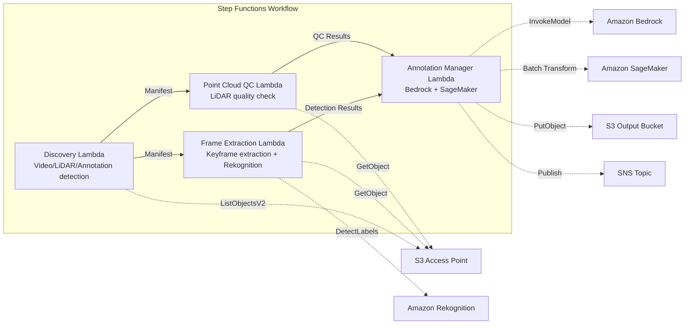

# UC9: Autonomous Driving / ADAS — Image and LiDAR Preprocessing, Quality Check, Annotation

🌐 **Language / 言語**: [日本語](README.md) | English | [한국어](README.ko.md) | [简体中文](README.zh-CN.md) | [繁體中文](README.zh-TW.md) | [Français](README.fr.md) | [Deutsch](README.de.md) | [Español](README.es.md)

📚 **Documentation**: [Architecture Diagram](docs/architecture.en.md) | [Demo Guide](docs/demo-guide.en.md)

## Overview

This is a serverless workflow that leverages S3 Access Points in Amazon FSx for NetApp ONTAP to automate the preprocessing, quality checks, and annotation management of dashcam footage and LiDAR point cloud data.

### When this pattern is suitable

- A large amount of dashcam footage and LiDAR point cloud data is stored on FSx for ONTAP
- You want to automate keyframe extraction from footage and object detection (vehicles, pedestrians, traffic signs)
- You want to regularly run quality checks on LiDAR point clouds (point density, coordinate consistency)
- You want to manage annotation metadata in COCO-compatible format
- You want to incorporate point cloud segmentation inference with SageMaker Batch Transform

### When this pattern is not suitable

- A real-time autonomous driving inference pipeline is required
- Large-scale video transcoding (MediaConvert / EC2 is more appropriate)
- Full LiDAR SLAM processing (an HPC cluster is more appropriate)
- Environments where network reachability to the ONTAP REST API cannot be ensured

### Key Features

- Automatic detection of video (.mp4, .avi, .mkv), LiDAR (.pcd, .las, .laz, .ply), and annotations (.json) via the S3 AP
- Object detection (vehicles, pedestrians, traffic signs, lane markings) using Rekognition DetectLabels
- Quality checks on LiDAR point clouds (point_count, coordinate_bounds, point_density, NaN validation)
- Annotation suggestion generation with Bedrock
- Point cloud segmentation inference with SageMaker Batch Transform
- Annotation output in COCO-compatible JSON format

## Success Metrics

### Outcome
By automating video/LiDAR preprocessing and quality checks, this streamlines the ADAS data pipeline.

### Metrics
| Metric | Target (example) |
|-----------|------------|
| Processed frames / run | > 1,000 frames |
| Quality check pass rate | > 90% |
| Annotation preprocessing time | < 1 minute / frame |
| Processing throughput | > 500 frames/hour |
| Cost / run | < $20 |
| Human Review rate | < 10% (frames that fail quality checks) |

### Measurement Method
Step Functions execution history, Rekognition/SageMaker inference results, CloudWatch Metrics, DynamoDB Task Token.

## Architecture



### Workflow Steps

1. **Discovery**: Detect video, LiDAR, and annotation files from the S3 AP
2. **Frame Extraction**: Extract keyframes from video and perform object detection with Rekognition
3. **Point Cloud QC**: Extract header metadata from LiDAR point clouds and verify quality
4. **Annotation Manager**: Generate annotation suggestions with Bedrock, perform point cloud segmentation with SageMaker

## Prerequisites

- AWS account and appropriate IAM permissions
- FSx for ONTAP file system (ONTAP 9.17.1P4D3 or later)
- Volume with S3 Access Point enabled (storing video and LiDAR data)
- VPC, private subnets
- Amazon Bedrock model access enabled (Claude / Nova)
- SageMaker endpoint (point cloud segmentation model) — optional

## Deployment steps

### 1. SAM Deployment

```bash
# Prerequisite: AWS SAM CLI required. 'sam build' packages the code and shared layer automatically.
sam build

sam deploy \
  --stack-name fsxn-autonomous-driving \
  --parameter-overrides \
    S3AccessPointAlias=<your-volume-ext-s3alias> \
    S3AccessPointName=<your-s3ap-name> \
    VpcId=<your-vpc-id> \
    PrivateSubnetIds=<subnet-1>,<subnet-2> \
    ScheduleExpression="rate(1 hour)" \
    NotificationEmail=<your-email@example.com> \
    EnableVpcEndpoints=false \
    EnableCloudWatchAlarms=false \
  --capabilities CAPABILITY_NAMED_IAM \
  --resolve-s3 \
  --region ap-northeast-1
```

> **Note**: `template.yaml` is designed for use with the SAM CLI (`sam build` + `sam deploy`).
> To deploy directly with the `aws cloudformation deploy` command, use `template-deploy.yaml` instead (this requires pre-packaging the Lambda zip files and uploading them to S3).

## List of Configuration Parameters

| Parameter | Description | Default | Required |
|-----------|------|----------|------|
| `S3AccessPointAlias` | FSx for ONTAP S3 AP Alias (for input) | — | ✅ |
| `S3AccessPointName` | S3 AP name (for ARN-based IAM permission grants; if omitted, only Alias-based) | `""` | ⚠️ Recommended |
| `ScheduleExpression` | EventBridge Scheduler schedule expression | `rate(1 hour)` | |
| `VpcId` | VPC ID | — | ✅ |
| `PrivateSubnetIds` | List of private subnet IDs | — | ✅ |
| `NotificationEmail` | SNS notification email address | — | ✅ |
| `FrameExtractionInterval` | Keyframe extraction interval (seconds) | `5` | |
| `MapConcurrency` | Number of parallel executions in the Map state | `5` | |
| `LambdaMemorySize` | Lambda memory size (MB) | `2048` | |
| `LambdaTimeout` | Lambda timeout (seconds) | `600` | |
| `EnableVpcEndpoints` | Enable Interface VPC Endpoints | `false` | |
| `EnableCloudWatchAlarms` | Enable CloudWatch Alarms | `false` | |

## Cleanup

```bash
aws s3 rm s3://fsxn-autonomous-driving-output-${AWS_ACCOUNT_ID} --recursive

aws cloudformation delete-stack \
  --stack-name fsxn-autonomous-driving \
  --region ap-northeast-1

aws cloudformation wait stack-delete-complete \
  --stack-name fsxn-autonomous-driving \
  --region ap-northeast-1
```

## References

- [FSx for ONTAP S3 Access Points Overview](https://docs.aws.amazon.com/fsx/latest/ONTAPGuide/accessing-data-via-s3-access-points.html)
- [Amazon Rekognition Label Detection](https://docs.aws.amazon.com/rekognition/latest/dg/labels.html)
- [Amazon SageMaker Batch Transform](https://docs.aws.amazon.com/sagemaker/latest/dg/batch-transform.html)
- [COCO Data Format](https://cocodataset.org/#format-data)
- [LAS File Format Specification](https://www.asprs.org/divisions-committees/lidar-division/laser-las-file-format-exchange-activities)

## SageMaker Batch Transform Integration (Phase 3)

In Phase 3, **LiDAR point cloud segmentation inference with SageMaker Batch Transform** is available as an opt-in feature. It uses the Step Functions Callback Pattern (`.waitForTaskToken`) to wait asynchronously for the completion of batch inference jobs.

### Activation

```bash
# Prerequisite: AWS SAM CLI required. 'sam build' packages the code and shared layer automatically.
sam build

sam deploy \
  --stack-name fsxn-autonomous-driving \
  --parameter-overrides \
    EnableSageMakerTransform=true \
    MockMode=true \
    ... # other parameters
  --capabilities CAPABILITY_NAMED_IAM \
  --resolve-s3
```

### Workflow

```
Discovery → Frame Extraction → Point Cloud QC
  → [EnableSageMakerTransform=true] SageMaker Invoke (.waitForTaskToken)
  → SageMaker Batch Transform Job
  → EventBridge (job state change) → SageMaker Callback (SendTaskSuccess/Failure)
  → Annotation Manager (Rekognition + SageMaker result integration)
```

### Mock Mode

In the test environment, using `MockMode=true` (default) lets you verify the Callback Pattern data flow without actually deploying a SageMaker model.

- **MockMode=true**: Generates mock segmentation output (random labels with the same count as the input `point_count`) without calling the SageMaker API, and calls SendTaskSuccess directly
- **MockMode=false**: Executes the actual SageMaker CreateTransformJob. The model must be deployed beforehand

### Configuration Parameters (added in Phase 3)

| Parameter | Description | Default |
|-----------|------|----------|
| `EnableSageMakerTransform` | Enable SageMaker Batch Transform | `false` |
| `MockMode` | Mock mode (for testing) | `true` |
| `SageMakerModelName` | SageMaker model name | — |
| `SageMakerInstanceType` | Batch Transform instance type | `ml.m5.xlarge` |

## Supported Regions

UC9 uses the following services:

| Service | Region Constraint |
|---------|-------------|
| Amazon Rekognition | Available in almost all regions |
| Amazon Bedrock | Check supported regions ([Bedrock supported regions](https://docs.aws.amazon.com/general/latest/gr/bedrock.html)) |
| SageMaker Batch Transform | Available in almost all regions (instance type availability varies by region) |
| AWS X-Ray | Available in almost all regions |
| CloudWatch EMF | Available in almost all regions |

> If you enable SageMaker Batch Transform, verify the instance type availability in the target region using the [AWS Regional Services List](https://aws.amazon.com/about-aws/global-infrastructure/regional-product-services/) before deployment. For details, see the [Region Compatibility Matrix](../docs/region-compatibility.md).

---

## AWS Documentation Links

| Service | Documentation |
|---------|------------|
| FSx for ONTAP | [User Guide](https://docs.aws.amazon.com/fsx/latest/ONTAPGuide/what-is-fsx-ontap.html) |
| S3 Access Points | [S3 AP for FSx for ONTAP](https://docs.aws.amazon.com/fsx/latest/ONTAPGuide/s3-access-points.html) |
| Step Functions | [Developer Guide](https://docs.aws.amazon.com/step-functions/latest/dg/welcome.html) |
| Amazon Rekognition | [Developer Guide](https://docs.aws.amazon.com/rekognition/latest/dg/what-is.html) |
| Amazon SageMaker | [Developer Guide](https://docs.aws.amazon.com/sagemaker/latest/dg/whatis.html) |
| Amazon Bedrock | [User Guide](https://docs.aws.amazon.com/bedrock/latest/userguide/what-is-bedrock.html) |

### Well-Architected Framework Alignment

| Pillar | Alignment |
|----|------|
| Operational Excellence | X-Ray tracing, EMF metrics, SageMaker job monitoring |
| Security | Least-privilege IAM, KMS encryption, video/LiDAR data access control |
| Reliability | Step Functions Retry/Catch, SageMaker callback retries |
| Performance Efficiency | Parallel frame processing, SageMaker Batch Transform |
| Cost Optimization | Serverless, SageMaker Spot Instance support |
| Sustainability | On-demand execution, incremental processing (new frames only) |

---

## Cost Estimate (Monthly Approximation)

> **Note**: The following is an approximation for the ap-northeast-1 region; actual costs vary with usage. Check the latest pricing with the [AWS Pricing Calculator](https://calculator.aws/).

### Serverless Components (pay-as-you-go)

| Service | Unit Price | Assumed Usage | Monthly Approximation |
|---------|------|-----------|---------|
| Lambda | $0.0000166667/GB-sec | 9 functions × 200 frames/day | ~$1-5 |
| S3 API (GetObject/ListObjects) | $0.0047/10K requests | ~10K requests/day | ~$1.5 |
| Step Functions | $0.025/1K state transitions | ~1K transitions/day | ~$0.75 |
| Bedrock (Nova Lite) | $0.00006/1K input tokens | ~100K tokens/run | ~$3-10 |
| Athena | $5/TB scanned | ~100 MB/query | ~$0.5-2 |
| SNS | $0.50/100K notifications | ~100 notifications/day | ~$0.15 |
| CloudWatch Logs | $0.76/GB ingested | ~1 GB/month | ~$0.76 |
| SageMaker Inference | $0.046/hour (ml.m5.large) |

### Fixed Costs (FSx for ONTAP — assumes an existing environment)

| Component | Monthly |
|--------------|------|
| FSx for ONTAP (128 MBps, 1 TB) | ~$230 (shared with existing environment) |
| S3 Access Point | No additional charge (S3 API charges only) |

### Total Approximation

| Configuration | Monthly Approximation |
|------|---------|
| Minimal (once-daily execution) | ~$5-15 |
| Standard (hourly execution) | ~$15-50 |
| Large-scale (high frequency + alarms) | ~$50-150 |

> **Governance Caveat**: Cost estimates are approximations, not guaranteed values. Actual charges vary with usage patterns, data volume, and region.

---

## Local Testing

### Prerequisites Check

```bash
# Verify prerequisites
aws --version          # AWS CLI v2
sam --version          # SAM CLI
python3 --version      # Python 3.9+
docker --version       # Docker (for sam local)
aws sts get-caller-identity  # AWS credentials
```

### sam local invoke

```bash
# Build
# Prerequisite: AWS SAM CLI required. 'sam build' packages the code and shared layer automatically.
sam build

# Run the Discovery Lambda locally
sam local invoke DiscoveryFunction --event events/discovery-event.json

# With environment variable override
sam local invoke DiscoveryFunction \
  --event events/discovery-event.json \
  --env-vars env.json
```

### Unit Tests

```bash
python3 -m pytest tests/ -v
```

For details, see the [Local Testing Quick Start](../docs/local-testing-quick-start.md).

---

## Output Sample

Example output from the autonomous driving data preprocessing pipeline:

```json
{
  "discovery": {
    "status": "completed",
    "object_count": 200,
    "categories": {"video": 50, "lidar": 100, "radar": 50}
  },
  "frame_extraction": {
    "total_frames": 1500,
    "extracted_from": 50,
    "fps": 30
  },
  "object_detection": [
    {
      "frame_id": "frame-0001",
      "objects": [
        {"class": "car", "confidence": 0.96, "bbox": [120, 80, 200, 150]},
        {"class": "pedestrian", "confidence": 0.89, "bbox": [400, 200, 50, 120]}
      ],
      "format": "COCO"
    }
  ],
  "lidar_qc": {
    "point_clouds_processed": 100,
    "avg_point_density": 64000,
    "quality_pass_rate_pct": 98.0
  }
}
```

> **Note**: The above is a sample output; actual values vary with the environment and input data. Benchmark figures are a sizing reference, not a service limit.

---

## Governance Note

> This pattern provides technical architecture guidance. It is not legal, compliance, or regulatory advice. Organizations should consult qualified professionals.

---

## S3AP Compatibility

For compatibility constraints, troubleshooting, and trigger patterns of S3 Access Points for FSx for ONTAP, see the [S3AP Compatibility Notes](../docs/s3ap-compatibility-notes.md).
