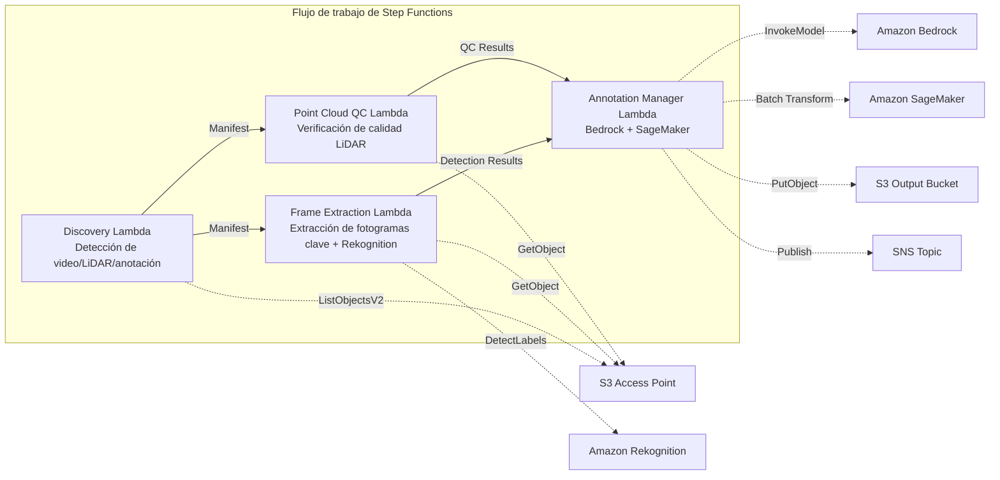

# UC9: Conducción autónoma / ADAS — Preprocesamiento de imágenes y LiDAR, verificación de calidad, anotación

🌐 **Language / 言語**: [日本語](README.md) | [English](README.en.md) | [한국어](README.ko.md) | [简体中文](README.zh-CN.md) | [繁體中文](README.zh-TW.md) | [Français](README.fr.md) | [Deutsch](README.de.md) | Español

📚 **Documentación**: [Diagrama de arquitectura](docs/architecture.es.md) | [Guía de demostración](docs/demo-guide.es.md)

## Descripción general

Este es un flujo de trabajo sin servidor que aprovecha los S3 Access Points de Amazon FSx for NetApp ONTAP para automatizar el preprocesamiento, las verificaciones de calidad y la gestión de anotaciones de imágenes de dashcam y datos de nubes de puntos LiDAR.

### Casos en los que este patrón es adecuado

- Una gran cantidad de imágenes de dashcam y datos de nubes de puntos LiDAR está almacenada en FSx for ONTAP
- Desea automatizar la extracción de fotogramas clave de las imágenes y la detección de objetos (vehículos, peatones, señales de tráfico)
- Desea realizar verificaciones de calidad periódicas de las nubes de puntos LiDAR (densidad de puntos, coherencia de coordenadas)
- Desea gestionar los metadatos de anotación en formato compatible con COCO
- Desea incorporar la inferencia de segmentación de nubes de puntos con SageMaker Batch Transform

### Casos en los que este patrón no es adecuado

- Se necesita un pipeline de inferencia de conducción autónoma en tiempo real
- Transcodificación de video a gran escala (MediaConvert / EC2 es más adecuado)
- Procesamiento completo de LiDAR SLAM (un clúster HPC es más adecuado)
- Entornos donde no se puede garantizar la accesibilidad de red a la API REST de ONTAP

### Principales características

- Detección automática de video (.mp4, .avi, .mkv), LiDAR (.pcd, .las, .laz, .ply) y anotaciones (.json) a través del S3 AP
- Detección de objetos (vehículos, peatones, señales de tráfico, marcas de carril) mediante Rekognition DetectLabels
- Verificación de calidad de nubes de puntos LiDAR (point_count, coordinate_bounds, point_density, validación de NaN)
- Generación de propuestas de anotación con Bedrock
- Inferencia de segmentación de nubes de puntos con SageMaker Batch Transform
- Salida de anotaciones en formato JSON compatible con COCO

## Success Metrics

### Outcome
Al automatizar el preprocesamiento y la verificación de calidad de video/LiDAR, se optimiza el pipeline de datos ADAS.

### Metrics
| Métrica | Objetivo (ejemplo) |
|-----------|------------|
| Fotogramas procesados / ejecución | > 1000 frames |
| Tasa de aprobación de la verificación de calidad | > 90 % |
| Tiempo de preprocesamiento de anotaciones | < 1 minuto / fotograma |
| Rendimiento de procesamiento | > 500 frames/hour |
| Costo / ejecución | < $20 |
| Tasa de Human Review | < 10 % (fotogramas que no aprueban la verificación de calidad) |

### Measurement Method
Historial de ejecución de Step Functions, resultados de inferencia de Rekognition/SageMaker, CloudWatch Metrics, DynamoDB Task Token.

## Arquitectura



### Pasos del flujo de trabajo

1. **Discovery**: Detectar archivos de video, LiDAR y anotación desde el S3 AP
2. **Frame Extraction**: Extraer fotogramas clave del video y realizar la detección de objetos con Rekognition
3. **Point Cloud QC**: Extraer metadatos de encabezado de las nubes de puntos LiDAR y verificar la calidad
4. **Annotation Manager**: Generar propuestas de anotación con Bedrock, realizar la segmentación de nubes de puntos con SageMaker

## Requisitos previos

- Cuenta de AWS y permisos de IAM adecuados
- Sistema de archivos FSx for ONTAP (ONTAP 9.17.1P4D3 o posterior)
- Volumen con S3 Access Point habilitado (para almacenar video y datos LiDAR)
- VPC, subredes privadas
- Acceso a modelos de Amazon Bedrock habilitado (Claude / Nova)
- Punto de enlace de SageMaker (modelo de segmentación de nubes de puntos) — opcional

## Pasos de implementación

### 1. Implementación de SAM

```bash
# Requisito: se necesita AWS SAM CLI. «sam build» empaqueta automáticamente el código y la capa compartida.
sam build

sam deploy \
  --stack-name fsxn-autonomous-driving \
  --parameter-overrides \
    S3AccessPointAlias=<your-volume-ext-s3alias> \
    S3AccessPointName=<your-s3ap-name> \
    VpcId=<your-vpc-id> \
    PrivateSubnetIds=<subnet-1>,<subnet-2> \
    ScheduleExpression="rate(1 hour)" \
    NotificationEmail=<your-email@example.com> \
    EnableVpcEndpoints=false \
    EnableCloudWatchAlarms=false \
  --capabilities CAPABILITY_NAMED_IAM \
  --resolve-s3 \
  --region ap-northeast-1
```

> **Nota**: `template.yaml` está diseñado para usarse con la SAM CLI (`sam build` + `sam deploy`).
> Para implementar directamente con el comando `aws cloudformation deploy`, use `template-deploy.yaml` en su lugar (requiere empaquetar previamente los archivos zip de Lambda y subirlos a S3).

## Lista de parámetros de configuración

| Parámetro | Descripción | Predeterminado | Obligatorio |
|-----------|------|----------|------|
| `S3AccessPointAlias` | FSx for ONTAP S3 AP Alias (para entrada) | — | ✅ |
| `S3AccessPointName` | Nombre del S3 AP (para conceder permisos de IAM basados en ARN; si se omite, solo basado en Alias) | `""` | ⚠️ Recomendado |
| `ScheduleExpression` | Expresión de programación de EventBridge Scheduler | `rate(1 hour)` | |
| `VpcId` | ID de VPC | — | ✅ |
| `PrivateSubnetIds` | Lista de ID de subredes privadas | — | ✅ |
| `NotificationEmail` | Dirección de correo electrónico de notificación de SNS | — | ✅ |
| `FrameExtractionInterval` | Intervalo de extracción de fotogramas clave (segundos) | `5` | |
| `MapConcurrency` | Número de ejecuciones en paralelo del estado Map | `5` | |
| `LambdaMemorySize` | Tamaño de memoria de Lambda (MB) | `2048` | |
| `LambdaTimeout` | Tiempo de espera de Lambda (segundos) | `600` | |
| `EnableVpcEndpoints` | Habilitar Interface VPC Endpoints | `false` | |
| `EnableCloudWatchAlarms` | Habilitar CloudWatch Alarms | `false` | |

## Limpieza

```bash
aws s3 rm s3://fsxn-autonomous-driving-output-${AWS_ACCOUNT_ID} --recursive

aws cloudformation delete-stack \
  --stack-name fsxn-autonomous-driving \
  --region ap-northeast-1

aws cloudformation wait stack-delete-complete \
  --stack-name fsxn-autonomous-driving \
  --region ap-northeast-1
```

## Enlaces de referencia

- [Descripción general de los S3 Access Points de FSx for ONTAP](https://docs.aws.amazon.com/fsx/latest/ONTAPGuide/accessing-data-via-s3-access-points.html)
- [Detección de etiquetas con Amazon Rekognition](https://docs.aws.amazon.com/rekognition/latest/dg/labels.html)
- [Amazon SageMaker Batch Transform](https://docs.aws.amazon.com/sagemaker/latest/dg/batch-transform.html)
- [Formato de datos COCO](https://cocodataset.org/#format-data)
- [Especificación del formato de archivo LAS](https://www.asprs.org/divisions-committees/lidar-division/laser-las-file-format-exchange-activities)

## Integración de SageMaker Batch Transform (Fase 3)

En la Fase 3, la **inferencia de segmentación de nubes de puntos LiDAR con SageMaker Batch Transform** está disponible como opción. Utiliza el Callback Pattern de Step Functions (`.waitForTaskToken`) para esperar de forma asíncrona la finalización de los trabajos de inferencia por lotes.

### Activación

```bash
# Requisito: se necesita AWS SAM CLI. «sam build» empaqueta automáticamente el código y la capa compartida.
sam build

sam deploy \
  --stack-name fsxn-autonomous-driving \
  --parameter-overrides \
    EnableSageMakerTransform=true \
    MockMode=true \
    ... # otros parámetros
  --capabilities CAPABILITY_NAMED_IAM \
  --resolve-s3
```

### Flujo de trabajo

```
Discovery → Frame Extraction → Point Cloud QC
  → [EnableSageMakerTransform=true] SageMaker Invoke (.waitForTaskToken)
  → SageMaker Batch Transform Job
  → EventBridge (job state change) → SageMaker Callback (SendTaskSuccess/Failure)
  → Annotation Manager (Rekognition + integración de resultados de SageMaker)
```

### Modo de simulación

En el entorno de prueba, usar `MockMode=true` (predeterminado) permite validar el flujo de datos del Callback Pattern sin implementar realmente un modelo de SageMaker.

- **MockMode=true**: Genera una salida de segmentación simulada (etiquetas aleatorias en la misma cantidad que el `point_count` de entrada) sin invocar la API de SageMaker, y llama directamente a SendTaskSuccess
- **MockMode=false**: Ejecuta el CreateTransformJob real de SageMaker. El modelo debe implementarse previamente

### Parámetros de configuración (agregados en la Fase 3)

| Parámetro | Descripción | Predeterminado |
|-----------|------|----------|
| `EnableSageMakerTransform` | Habilitar SageMaker Batch Transform | `false` |
| `MockMode` | Modo de simulación (para pruebas) | `true` |
| `SageMakerModelName` | Nombre del modelo de SageMaker | — |
| `SageMakerInstanceType` | Tipo de instancia de Batch Transform | `ml.m5.xlarge` |

## Regiones admitidas

UC9 utiliza los siguientes servicios:

| Servicio | Restricción de región |
|---------|-------------|
| Amazon Rekognition | Disponible en casi todas las regiones |
| Amazon Bedrock | Verifique las regiones admitidas ([Regiones admitidas por Bedrock](https://docs.aws.amazon.com/general/latest/gr/bedrock.html)) |
| SageMaker Batch Transform | Disponible en casi todas las regiones (la disponibilidad del tipo de instancia varía según la región) |
| AWS X-Ray | Disponible en casi todas las regiones |
| CloudWatch EMF | Disponible en casi todas las regiones |

> Si habilita SageMaker Batch Transform, verifique la disponibilidad del tipo de instancia en la región objetivo en la [Lista de servicios regionales de AWS](https://aws.amazon.com/about-aws/global-infrastructure/regional-product-services/) antes de la implementación. Para más detalles, consulte la [Matriz de compatibilidad regional](../docs/region-compatibility.md).

---

## Enlaces a la documentación de AWS

| Servicio | Documentación |
|---------|------------|
| FSx for ONTAP | [Guía del usuario](https://docs.aws.amazon.com/fsx/latest/ONTAPGuide/what-is-fsx-ontap.html) |
| S3 Access Points | [S3 AP for FSx for ONTAP](https://docs.aws.amazon.com/fsx/latest/ONTAPGuide/s3-access-points.html) |
| Step Functions | [Guía para desarrolladores](https://docs.aws.amazon.com/step-functions/latest/dg/welcome.html) |
| Amazon Rekognition | [Guía para desarrolladores](https://docs.aws.amazon.com/rekognition/latest/dg/what-is.html) |
| Amazon SageMaker | [Guía para desarrolladores](https://docs.aws.amazon.com/sagemaker/latest/dg/whatis.html) |
| Amazon Bedrock | [Guía del usuario](https://docs.aws.amazon.com/bedrock/latest/userguide/what-is-bedrock.html) |

### Alineación con el Well-Architected Framework

| Pilar | Alineación |
|----|------|
| Excelencia operativa | Rastreo con X-Ray, métricas EMF, monitoreo de trabajos de SageMaker |
| Seguridad | IAM de privilegio mínimo, cifrado KMS, control de acceso a datos de video/LiDAR |
| Fiabilidad | Step Functions Retry/Catch, reintentos de callback de SageMaker |
| Eficiencia del rendimiento | Procesamiento paralelo de fotogramas, SageMaker Batch Transform |
| Optimización de costos | Sin servidor, compatibilidad con instancias Spot de SageMaker |
| Sostenibilidad | Ejecución bajo demanda, procesamiento incremental (solo fotogramas nuevos) |

---

## Estimación de costos (aproximación mensual)

> **Nota**: Lo siguiente es una aproximación para la región ap-northeast-1; los costos reales varían según el uso. Consulte los precios más recientes con la [AWS Pricing Calculator](https://calculator.aws/).

### Componentes sin servidor (pago por uso)

| Servicio | Precio unitario | Uso estimado | Aproximación mensual |
|---------|------|-----------|---------|
| Lambda | $0.0000166667/GB-sec | 9 funciones × 200 frames/día | ~$1-5 |
| S3 API (GetObject/ListObjects) | $0.0047/10K requests | ~10K requests/día | ~$1.5 |
| Step Functions | $0.025/1K state transitions | ~1K transitions/día | ~$0.75 |
| Bedrock (Nova Lite) | $0.00006/1K input tokens | ~100K tokens/ejecución | ~$3-10 |
| Athena | $5/TB scanned | ~100 MB/consulta | ~$0.5-2 |
| SNS | $0.50/100K notifications | ~100 notifications/día | ~$0.15 |
| CloudWatch Logs | $0.76/GB ingested | ~1 GB/mes | ~$0.76 |
| SageMaker Inference | $0.046/hour (ml.m5.large) |

### Costos fijos (FSx for ONTAP — se supone un entorno existente)

| Componente | Mensual |
|--------------|------|
| FSx for ONTAP (128 MBps, 1 TB) | ~$230 (compartido con el entorno existente) |
| S3 Access Point | Sin cargo adicional (solo cargos de la API de S3) |

### Aproximación total

| Configuración | Aproximación mensual |
|------|---------|
| Mínima (ejecución diaria) | ~$5-15 |
| Estándar (ejecución cada hora) | ~$15-50 |
| Gran escala (alta frecuencia + alarmas) | ~$50-150 |

> **Governance Caveat**: Las estimaciones de costos son aproximaciones, no valores garantizados. Los cargos reales varían según los patrones de uso, el volumen de datos y la región.

---

## Pruebas locales

### Verificación de Prerequisites

```bash
# Verificar los requisitos previos
aws --version          # AWS CLI v2
sam --version          # SAM CLI
python3 --version      # Python 3.9+
docker --version       # Docker (para sam local)
aws sts get-caller-identity  # Credenciales de AWS
```

### sam local invoke

```bash
# Compilación
# Requisito: se necesita AWS SAM CLI. «sam build» empaqueta automáticamente el código y la capa compartida.
sam build

# Ejecutar la Lambda Discovery localmente
sam local invoke DiscoveryFunction --event events/discovery-event.json

# Con anulación de variables de entorno
sam local invoke DiscoveryFunction \
  --event events/discovery-event.json \
  --env-vars env.json
```

### Pruebas unitarias

```bash
python3 -m pytest tests/ -v
```

Para más detalles, consulte el [Inicio rápido de pruebas locales](../docs/local-testing-quick-start.md).

---

## Muestra de salida (Output Sample)

Ejemplo de salida del pipeline de preprocesamiento de datos de conducción autónoma:

```json
{
  "discovery": {
    "status": "completed",
    "object_count": 200,
    "categories": {"video": 50, "lidar": 100, "radar": 50}
  },
  "frame_extraction": {
    "total_frames": 1500,
    "extracted_from": 50,
    "fps": 30
  },
  "object_detection": [
    {
      "frame_id": "frame-0001",
      "objects": [
        {"class": "car", "confidence": 0.96, "bbox": [120, 80, 200, 150]},
        {"class": "pedestrian", "confidence": 0.89, "bbox": [400, 200, 50, 120]}
      ],
      "format": "COCO"
    }
  ],
  "lidar_qc": {
    "point_clouds_processed": 100,
    "avg_point_density": 64000,
    "quality_pass_rate_pct": 98.0
  }
}
```

> **Nota**: Lo anterior es una salida de muestra; los valores reales varían según el entorno y los datos de entrada. Las cifras de referencia son una referencia de dimensionamiento (sizing reference), no un límite de servicio (service limit).

---

## Governance Note

> Este patrón proporciona orientación de arquitectura técnica. No constituye asesoramiento legal, de cumplimiento ni regulatorio. Las organizaciones deben consultar a profesionales cualificados.

---

## S3AP Compatibility

Para conocer las restricciones de compatibilidad, la solución de problemas y los patrones de activación de los S3 Access Points for FSx for ONTAP, consulte las [S3AP Compatibility Notes](../docs/s3ap-compatibility-notes.md).
