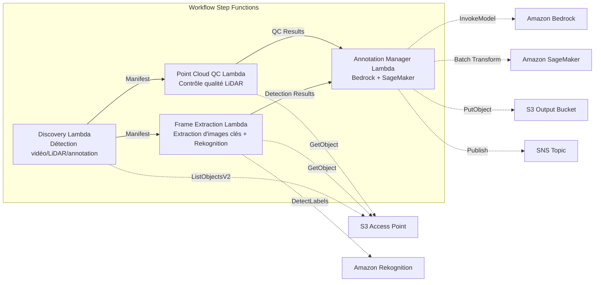

# UC9 : Conduite autonome / ADAS — Prétraitement d'images et LiDAR, contrôle qualité, annotation

🌐 **Language / 言語**: [日本語](README.md) | [English](README.en.md) | [한국어](README.ko.md) | [简体中文](README.zh-CN.md) | [繁體中文](README.zh-TW.md) | Français | [Deutsch](README.de.md) | [Español](README.es.md)

📚 **Documentation** : [Schéma d'architecture](docs/architecture.fr.md) | [Guide de démonstration](docs/demo-guide.fr.md)

## Aperçu

Il s'agit d'un workflow sans serveur qui exploite les S3 Access Points d'Amazon FSx for NetApp ONTAP pour automatiser le prétraitement, les contrôles qualité et la gestion des annotations des vidéos de dashcam et des données de nuages de points LiDAR.

### Cas où ce modèle est approprié

- Une grande quantité de vidéos de dashcam et de données de nuages de points LiDAR est stockée sur FSx for ONTAP
- Vous souhaitez automatiser l'extraction d'images clés à partir des vidéos et la détection d'objets (véhicules, piétons, panneaux de signalisation)
- Vous souhaitez effectuer régulièrement des contrôles qualité des nuages de points LiDAR (densité de points, cohérence des coordonnées)
- Vous souhaitez gérer les métadonnées d'annotation au format compatible COCO
- Vous souhaitez intégrer l'inférence de segmentation de nuages de points avec SageMaker Batch Transform

### Cas où ce modèle ne convient pas

- Un pipeline d'inférence de conduite autonome en temps réel est requis
- Transcodage vidéo à grande échelle (MediaConvert / EC2 est plus approprié)
- Traitement LiDAR SLAM complet (un cluster HPC est plus approprié)
- Environnements où la connectivité réseau à l'API REST ONTAP ne peut être assurée

### Principales fonctionnalités

- Détection automatique des vidéos (.mp4, .avi, .mkv), des données LiDAR (.pcd, .las, .laz, .ply) et des annotations (.json) via le S3 AP
- Détection d'objets (véhicules, piétons, panneaux de signalisation, marquages au sol) avec Rekognition DetectLabels
- Contrôle qualité des nuages de points LiDAR (point_count, coordinate_bounds, point_density, vérification NaN)
- Génération de suggestions d'annotation avec Bedrock
- Inférence de segmentation de nuages de points avec SageMaker Batch Transform
- Sortie des annotations au format JSON compatible COCO

## Success Metrics

### Outcome
En automatisant le prétraitement et le contrôle qualité des vidéos/LiDAR, cela rationalise le pipeline de données ADAS.

### Metrics
| Métrique | Cible (exemple) |
|-----------|------------|
| Images traitées / exécution | > 1 000 frames |
| Taux de réussite du contrôle qualité | > 90 % |
| Temps de prétraitement des annotations | < 1 minute / image |
| Débit de traitement | > 500 frames/hour |
| Coût / exécution | < 20 $ |
| Taux de Human Review | < 10 % (images échouant au contrôle qualité) |

### Measurement Method
Historique d'exécution Step Functions, résultats d'inférence Rekognition/SageMaker, CloudWatch Metrics, DynamoDB Task Token.

## Architecture



### Étapes du workflow

1. **Discovery** : Détecter les fichiers vidéo, LiDAR et d'annotation depuis le S3 AP
2. **Frame Extraction** : Extraire les images clés des vidéos et effectuer la détection d'objets avec Rekognition
3. **Point Cloud QC** : Extraire les métadonnées d'en-tête des nuages de points LiDAR et vérifier la qualité
4. **Annotation Manager** : Générer des suggestions d'annotation avec Bedrock, effectuer la segmentation des nuages de points avec SageMaker

## Conditions préalables

- Compte AWS et permissions IAM appropriées
- Système de fichiers FSx for ONTAP (ONTAP 9.17.1P4D3 ou supérieur)
- Volume avec S3 Access Point activé (stockant les vidéos et les données LiDAR)
- VPC, sous-réseaux privés
- Accès aux modèles Amazon Bedrock activé (Claude / Nova)
- Point de terminaison SageMaker (modèle de segmentation de nuages de points) — facultatif

## Étapes de déploiement

### 1. Déploiement SAM

```bash
# Prérequis : AWS SAM CLI requis. « sam build » empaquette automatiquement le code et la couche partagée.
sam build

sam deploy \
  --stack-name fsxn-autonomous-driving \
  --parameter-overrides \
    S3AccessPointAlias=<your-volume-ext-s3alias> \
    S3AccessPointName=<your-s3ap-name> \
    VpcId=<your-vpc-id> \
    PrivateSubnetIds=<subnet-1>,<subnet-2> \
    ScheduleExpression="rate(1 hour)" \
    NotificationEmail=<your-email@example.com> \
    EnableVpcEndpoints=false \
    EnableCloudWatchAlarms=false \
  --capabilities CAPABILITY_NAMED_IAM \
  --resolve-s3 \
  --region ap-northeast-1
```

> **Remarque** : `template.yaml` est conçu pour être utilisé avec la SAM CLI (`sam build` + `sam deploy`).
> Pour un déploiement direct avec la commande `aws cloudformation deploy`, utilisez plutôt `template-deploy.yaml` (nécessite de packager au préalable les fichiers zip Lambda et de les téléverser sur S3).

## Liste des paramètres de configuration

| Paramètre | Description | Par défaut | Requis |
|-----------|------|----------|------|
| `S3AccessPointAlias` | FSx for ONTAP S3 AP Alias (pour l'entrée) | — | ✅ |
| `S3AccessPointName` | Nom du S3 AP (pour l'octroi de permissions IAM basées sur l'ARN ; si omis, basé uniquement sur l'Alias) | `""` | ⚠️ Recommandé |
| `ScheduleExpression` | Expression de planification EventBridge Scheduler | `rate(1 hour)` | |
| `VpcId` | ID du VPC | — | ✅ |
| `PrivateSubnetIds` | Liste des ID de sous-réseaux privés | — | ✅ |
| `NotificationEmail` | Adresse e-mail de notification SNS | — | ✅ |
| `FrameExtractionInterval` | Intervalle d'extraction des images clés (secondes) | `5` | |
| `MapConcurrency` | Nombre d'exécutions parallèles de l'état Map | `5` | |
| `LambdaMemorySize` | Taille de mémoire Lambda (Mo) | `2048` | |
| `LambdaTimeout` | Délai d'expiration Lambda (secondes) | `600` | |
| `EnableVpcEndpoints` | Activer les Interface VPC Endpoints | `false` | |
| `EnableCloudWatchAlarms` | Activer les CloudWatch Alarms | `false` | |

## Nettoyage

```bash
aws s3 rm s3://fsxn-autonomous-driving-output-${AWS_ACCOUNT_ID} --recursive

aws cloudformation delete-stack \
  --stack-name fsxn-autonomous-driving \
  --region ap-northeast-1

aws cloudformation wait stack-delete-complete \
  --stack-name fsxn-autonomous-driving \
  --region ap-northeast-1
```

## Liens de référence

- [Présentation des S3 Access Points de FSx for ONTAP](https://docs.aws.amazon.com/fsx/latest/ONTAPGuide/accessing-data-via-s3-access-points.html)
- [Détection de labels avec Amazon Rekognition](https://docs.aws.amazon.com/rekognition/latest/dg/labels.html)
- [Amazon SageMaker Batch Transform](https://docs.aws.amazon.com/sagemaker/latest/dg/batch-transform.html)
- [Format de données COCO](https://cocodataset.org/#format-data)
- [Spécification du format de fichier LAS](https://www.asprs.org/divisions-committees/lidar-division/laser-las-file-format-exchange-activities)

## Intégration de SageMaker Batch Transform (Phase 3)

Lors de la Phase 3, l'**inférence de segmentation de nuages de points LiDAR avec SageMaker Batch Transform** est disponible en option. Elle utilise le Callback Pattern de Step Functions (`.waitForTaskToken`) pour attendre de manière asynchrone la fin des travaux d'inférence par lots.

### Activation

```bash
# Prérequis : AWS SAM CLI requis. « sam build » empaquette automatiquement le code et la couche partagée.
sam build

sam deploy \
  --stack-name fsxn-autonomous-driving \
  --parameter-overrides \
    EnableSageMakerTransform=true \
    MockMode=true \
    ... # autres paramètres
  --capabilities CAPABILITY_NAMED_IAM \
  --resolve-s3
```

### Workflow

```
Discovery → Frame Extraction → Point Cloud QC
  → [EnableSageMakerTransform=true] SageMaker Invoke (.waitForTaskToken)
  → SageMaker Batch Transform Job
  → EventBridge (job state change) → SageMaker Callback (SendTaskSuccess/Failure)
  → Annotation Manager (Rekognition + intégration des résultats SageMaker)
```

### Mode simulé

Dans l'environnement de test, l'utilisation de `MockMode=true` (par défaut) permet de valider le flux de données du Callback Pattern sans déployer réellement un modèle SageMaker.

- **MockMode=true** : Génère une sortie de segmentation simulée (étiquettes aléatoires en nombre égal au `point_count` d'entrée) sans appeler l'API SageMaker, et appelle directement SendTaskSuccess
- **MockMode=false** : Exécute le CreateTransformJob SageMaker réel. Le modèle doit être déployé au préalable

### Paramètres de configuration (ajoutés en Phase 3)

| Paramètre | Description | Par défaut |
|-----------|------|----------|
| `EnableSageMakerTransform` | Activer SageMaker Batch Transform | `false` |
| `MockMode` | Mode simulé (pour les tests) | `true` |
| `SageMakerModelName` | Nom du modèle SageMaker | — |
| `SageMakerInstanceType` | Type d'instance Batch Transform | `ml.m5.xlarge` |

## Régions prises en charge

UC9 utilise les services suivants :

| Service | Contrainte régionale |
|---------|-------------|
| Amazon Rekognition | Disponible dans presque toutes les régions |
| Amazon Bedrock | Vérifiez les régions prises en charge ([Régions prises en charge par Bedrock](https://docs.aws.amazon.com/general/latest/gr/bedrock.html)) |
| SageMaker Batch Transform | Disponible dans presque toutes les régions (la disponibilité des types d'instances varie selon la région) |
| AWS X-Ray | Disponible dans presque toutes les régions |
| CloudWatch EMF | Disponible dans presque toutes les régions |

> Si vous activez SageMaker Batch Transform, vérifiez la disponibilité des types d'instances dans la région cible dans la [Liste des services régionaux AWS](https://aws.amazon.com/about-aws/global-infrastructure/regional-product-services/) avant le déploiement. Pour plus de détails, consultez la [Matrice de compatibilité des régions](../docs/region-compatibility.md).

---

## Liens vers la documentation AWS

| Service | Documentation |
|---------|------------|
| FSx for ONTAP | [Guide de l'utilisateur](https://docs.aws.amazon.com/fsx/latest/ONTAPGuide/what-is-fsx-ontap.html) |
| S3 Access Points | [S3 AP for FSx for ONTAP](https://docs.aws.amazon.com/fsx/latest/ONTAPGuide/s3-access-points.html) |
| Step Functions | [Guide du développeur](https://docs.aws.amazon.com/step-functions/latest/dg/welcome.html) |
| Amazon Rekognition | [Guide du développeur](https://docs.aws.amazon.com/rekognition/latest/dg/what-is.html) |
| Amazon SageMaker | [Guide du développeur](https://docs.aws.amazon.com/sagemaker/latest/dg/whatis.html) |
| Amazon Bedrock | [Guide de l'utilisateur](https://docs.aws.amazon.com/bedrock/latest/userguide/what-is-bedrock.html) |

### Alignement avec le Well-Architected Framework

| Pilier | Alignement |
|----|------|
| Excellence opérationnelle | Traçage X-Ray, métriques EMF, surveillance des tâches SageMaker |
| Sécurité | IAM au moindre privilège, chiffrement KMS, contrôle d'accès aux données vidéo/LiDAR |
| Fiabilité | Step Functions Retry/Catch, nouvelles tentatives de callback SageMaker |
| Efficacité des performances | Traitement parallèle des images, SageMaker Batch Transform |
| Optimisation des coûts | Sans serveur, prise en charge des instances Spot SageMaker |
| Durabilité | Exécution à la demande, traitement incrémentiel (nouvelles images uniquement) |

---

## Estimation des coûts (approximation mensuelle)

> **Note** : Ce qui suit est une approximation pour la région ap-northeast-1 ; les coûts réels varient selon l'utilisation. Vérifiez les tarifs les plus récents avec l'[AWS Pricing Calculator](https://calculator.aws/).

### Composants sans serveur (paiement à l'usage)

| Service | Prix unitaire | Utilisation supposée | Approximation mensuelle |
|---------|------|-----------|---------|
| Lambda | $0.0000166667/GB-sec | 9 fonctions × 200 frames/jour | ~$1-5 |
| S3 API (GetObject/ListObjects) | $0.0047/10K requests | ~10K requests/jour | ~$1.5 |
| Step Functions | $0.025/1K state transitions | ~1K transitions/jour | ~$0.75 |
| Bedrock (Nova Lite) | $0.00006/1K input tokens | ~100K tokens/exécution | ~$3-10 |
| Athena | $5/TB scanned | ~100 MB/requête | ~$0.5-2 |
| SNS | $0.50/100K notifications | ~100 notifications/jour | ~$0.15 |
| CloudWatch Logs | $0.76/GB ingested | ~1 GB/mois | ~$0.76 |
| SageMaker Inference | $0.046/hour (ml.m5.large) |

### Coûts fixes (FSx for ONTAP — suppose un environnement existant)

| Composant | Mensuel |
|--------------|------|
| FSx for ONTAP (128 MBps, 1 TB) | ~$230 (partagé avec l'environnement existant) |
| S3 Access Point | Aucun frais supplémentaire (frais d'API S3 uniquement) |

### Approximation totale

| Configuration | Approximation mensuelle |
|------|---------|
| Minimale (exécution quotidienne) | ~$5-15 |
| Standard (exécution horaire) | ~$15-50 |
| Grande échelle (haute fréquence + alarmes) | ~$50-150 |

> **Governance Caveat** : Les estimations de coûts sont des approximations, et non des valeurs garanties. Les frais réels varient selon les modèles d'utilisation, le volume de données et la région.

---

## Tests locaux

### Vérification des Prerequisites

```bash
# Vérifier les conditions préalables
aws --version          # AWS CLI v2
sam --version          # SAM CLI
python3 --version      # Python 3.9+
docker --version       # Docker (pour sam local)
aws sts get-caller-identity  # Identifiants AWS
```

### sam local invoke

```bash
# Build
# Prérequis : AWS SAM CLI requis. « sam build » empaquette automatiquement le code et la couche partagée.
sam build

# Exécuter la Lambda Discovery localement
sam local invoke DiscoveryFunction --event events/discovery-event.json

# Avec remplacement des variables d'environnement
sam local invoke DiscoveryFunction \
  --event events/discovery-event.json \
  --env-vars env.json
```

### Tests unitaires

```bash
python3 -m pytest tests/ -v
```

Pour plus de détails, consultez le [Démarrage rapide des tests locaux](../docs/local-testing-quick-start.md).

---

## Exemple de sortie (Output Sample)

Exemple de sortie du pipeline de prétraitement des données de conduite autonome :

```json
{
  "discovery": {
    "status": "completed",
    "object_count": 200,
    "categories": {"video": 50, "lidar": 100, "radar": 50}
  },
  "frame_extraction": {
    "total_frames": 1500,
    "extracted_from": 50,
    "fps": 30
  },
  "object_detection": [
    {
      "frame_id": "frame-0001",
      "objects": [
        {"class": "car", "confidence": 0.96, "bbox": [120, 80, 200, 150]},
        {"class": "pedestrian", "confidence": 0.89, "bbox": [400, 200, 50, 120]}
      ],
      "format": "COCO"
    }
  ],
  "lidar_qc": {
    "point_clouds_processed": 100,
    "avg_point_density": 64000,
    "quality_pass_rate_pct": 98.0
  }
}
```

> **Note** : Ce qui précède est un exemple de sortie ; les valeurs réelles varient selon l'environnement et les données d'entrée. Les chiffres de référence sont une référence de dimensionnement (sizing reference), et non une limite de service (service limit).

---

## Governance Note

> Ce modèle fournit des conseils d'architecture technique. Il ne constitue pas un avis juridique, de conformité ou réglementaire. Les organisations doivent consulter des professionnels qualifiés.

---

## S3AP Compatibility

Pour les contraintes de compatibilité, le dépannage et les modèles de déclenchement des S3 Access Points for FSx for ONTAP, consultez les [S3AP Compatibility Notes](../docs/s3ap-compatibility-notes.md).
