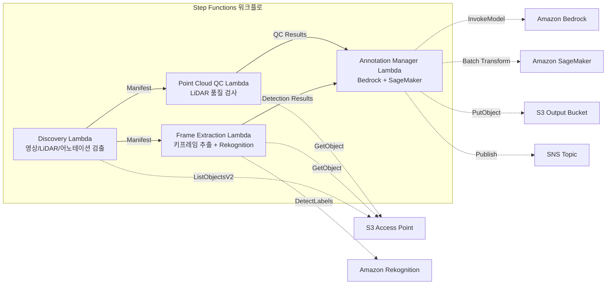

# UC9: 자율 주행 / ADAS — 영상·LiDAR 전처리·품질 검사·어노테이션

🌐 **Language / 言語**: [日本語](README.md) | [English](README.en.md) | 한국어 | [简体中文](README.zh-CN.md) | [繁體中文](README.zh-TW.md) | [Français](README.fr.md) | [Deutsch](README.de.md) | [Español](README.es.md)

📚 **문서**: [아키텍처 다이어그램](docs/architecture.ko.md) | [데모 가이드](docs/demo-guide.ko.md)

## 개요

Amazon FSx for NetApp ONTAP의 S3 Access Points를 활용하여 대시캠 영상과 LiDAR 포인트 클라우드 데이터의 전처리, 품질 검사, 어노테이션 관리를 자동화하는 서버리스 워크플로입니다.

### 이 패턴이 적합한 경우

- 대시캠 영상 및 LiDAR 포인트 클라우드 데이터가 FSx for ONTAP에 대량으로 축적되어 있다
- 영상에서 키프레임 추출과 물체 검출(차량, 보행자, 교통 표지판)을 자동화하고 싶다
- LiDAR 포인트 클라우드의 품질 검사(포인트 밀도, 좌표 일관성)를 정기적으로 실시하고 싶다
- COCO 호환 형식으로 어노테이션 메타데이터를 관리하고 싶다
- SageMaker Batch Transform을 통한 포인트 클라우드 세그멘테이션 추론을 통합하고 싶다

### 이 패턴이 적합하지 않은 경우

- 실시간 자율 주행 추론 파이프라인이 필요하다
- 대규모 영상 트랜스코딩(MediaConvert / EC2가 적합)
- 완전한 LiDAR SLAM 처리(HPC 클러스터가 적합)
- ONTAP REST API에 대한 네트워크 도달성을 확보할 수 없는 환경

### 주요 기능

- S3 AP를 통해 영상(.mp4, .avi, .mkv), LiDAR(.pcd, .las, .laz, .ply), 어노테이션(.json)을 자동 검출
- Rekognition DetectLabels를 통한 물체 검출(차량, 보행자, 교통 표지판, 차선 마킹)
- LiDAR 포인트 클라우드의 품질 검사(point_count, coordinate_bounds, point_density, NaN 검증)
- Bedrock을 통한 어노테이션 제안 생성
- SageMaker Batch Transform을 통한 포인트 클라우드 세그멘테이션 추론
- COCO 호환 JSON 형식의 어노테이션 출력

## Success Metrics

### Outcome
영상/LiDAR 전처리·품질 검사의 자동화를 통해 ADAS 데이터 파이프라인의 효율화를 실현합니다.

### Metrics
| 메트릭 | 목표값(예) |
|-----------|------------|
| 처리된 프레임 수 / 실행 | > 1,000 frames |
| 품질 검사 통과율 | > 90% |
| 어노테이션 전처리 시간 | < 1분 / 프레임 |
| 처리 스루풋 | > 500 frames/hour |
| 비용 / 실행 | < $20 |
| Human Review 대상 비율 | < 10%(품질 불합격 프레임) |

### Measurement Method
Step Functions 실행 이력, Rekognition/SageMaker 추론 결과, CloudWatch Metrics, DynamoDB Task Token.

## 아키텍처



### 워크플로 단계

1. **Discovery**: S3 AP에서 영상, LiDAR, 어노테이션 파일을 검출
2. **Frame Extraction**: 영상에서 키프레임을 추출하고 Rekognition으로 물체 검출
3. **Point Cloud QC**: LiDAR 포인트 클라우드의 헤더 메타데이터 추출 및 품질 검증
4. **Annotation Manager**: Bedrock으로 어노테이션 제안 생성, SageMaker로 포인트 클라우드 세그멘테이션

## 전제 조건

- AWS 계정 및 적절한 IAM 권한
- FSx for ONTAP 파일 시스템(ONTAP 9.17.1P4D3 이상)
- S3 Access Point가 활성화된 볼륨(영상·LiDAR 데이터 저장)
- VPC, 프라이빗 서브넷
- Amazon Bedrock 모델 액세스 활성화(Claude / Nova)
- SageMaker 엔드포인트(포인트 클라우드 세그멘테이션 모델) — 선택 사항

## 배포 절차

### 1. SAM 배포

```bash
# 사전 요구사항: AWS SAM CLI가 필요합니다. 'sam build'가 코드와 공유 레이어를 자동으로 패키징합니다.
sam build

sam deploy \
  --stack-name fsxn-autonomous-driving \
  --parameter-overrides \
    S3AccessPointAlias=<your-volume-ext-s3alias> \
    S3AccessPointName=<your-s3ap-name> \
    VpcId=<your-vpc-id> \
    PrivateSubnetIds=<subnet-1>,<subnet-2> \
    ScheduleExpression="rate(1 hour)" \
    NotificationEmail=<your-email@example.com> \
    EnableVpcEndpoints=false \
    EnableCloudWatchAlarms=false \
  --capabilities CAPABILITY_NAMED_IAM \
  --resolve-s3 \
  --region ap-northeast-1
```

> **참고**: `template.yaml`은 SAM CLI(`sam build` + `sam deploy`)로 사용합니다.
> `aws cloudformation deploy` 명령으로 직접 배포하려면 `template-deploy.yaml`을 사용하세요(Lambda zip 파일의 사전 패키징 및 S3 업로드가 필요합니다).

## 설정 파라미터 목록

| 파라미터 | 설명 | 기본값 | 필수 |
|-----------|------|----------|------|
| `S3AccessPointAlias` | FSx for ONTAP S3 AP Alias(입력용) | — | ✅ |
| `S3AccessPointName` | S3 AP 이름(ARN 기반 IAM 권한 부여용. 생략 시 Alias 기반만) | `""` | ⚠️ 권장 |
| `ScheduleExpression` | EventBridge Scheduler의 스케줄 식 | `rate(1 hour)` | |
| `VpcId` | VPC ID | — | ✅ |
| `PrivateSubnetIds` | 프라이빗 서브넷 ID 목록 | — | ✅ |
| `NotificationEmail` | SNS 알림 대상 이메일 주소 | — | ✅ |
| `FrameExtractionInterval` | 키프레임 추출 간격(초) | `5` | |
| `MapConcurrency` | Map 상태의 병렬 실행 수 | `5` | |
| `LambdaMemorySize` | Lambda 메모리 크기 (MB) | `2048` | |
| `LambdaTimeout` | Lambda 타임아웃 (초) | `600` | |
| `EnableVpcEndpoints` | Interface VPC Endpoints 활성화 | `false` | |
| `EnableCloudWatchAlarms` | CloudWatch Alarms 활성화 | `false` | |

## 정리

```bash
aws s3 rm s3://fsxn-autonomous-driving-output-${AWS_ACCOUNT_ID} --recursive

aws cloudformation delete-stack \
  --stack-name fsxn-autonomous-driving \
  --region ap-northeast-1

aws cloudformation wait stack-delete-complete \
  --stack-name fsxn-autonomous-driving \
  --region ap-northeast-1
```

## 참조 링크

- [FSx for ONTAP S3 Access Points 개요](https://docs.aws.amazon.com/fsx/latest/ONTAPGuide/accessing-data-via-s3-access-points.html)
- [Amazon Rekognition 레이블 검출](https://docs.aws.amazon.com/rekognition/latest/dg/labels.html)
- [Amazon SageMaker Batch Transform](https://docs.aws.amazon.com/sagemaker/latest/dg/batch-transform.html)
- [COCO 데이터 형식](https://cocodataset.org/#format-data)
- [LAS 파일 형식 사양](https://www.asprs.org/divisions-committees/lidar-division/laser-las-file-format-exchange-activities)

## SageMaker Batch Transform 통합(Phase 3)

Phase 3에서는 **SageMaker Batch Transform을 통한 LiDAR 포인트 클라우드 세그멘테이션 추론**을 선택적으로 이용할 수 있습니다. Step Functions의 Callback Pattern(`.waitForTaskToken`)을 사용하여 비동기적으로 배치 추론 작업의 완료를 대기합니다.

### 활성화

```bash
# 사전 요구사항: AWS SAM CLI가 필요합니다. 'sam build'가 코드와 공유 레이어를 자동으로 패키징합니다.
sam build

sam deploy \
  --stack-name fsxn-autonomous-driving \
  --parameter-overrides \
    EnableSageMakerTransform=true \
    MockMode=true \
    ... # 기타 파라미터
  --capabilities CAPABILITY_NAMED_IAM \
  --resolve-s3
```

### 워크플로

```
Discovery → Frame Extraction → Point Cloud QC
  → [EnableSageMakerTransform=true] SageMaker Invoke (.waitForTaskToken)
  → SageMaker Batch Transform Job
  → EventBridge (job state change) → SageMaker Callback (SendTaskSuccess/Failure)
  → Annotation Manager (Rekognition + SageMaker 결과 통합)
```

### 모의 모드

테스트 환경에서는 `MockMode=true`(기본값)를 사용하여 실제 SageMaker 모델 배포 없이 Callback Pattern의 데이터 흐름을 검증할 수 있습니다.

- **MockMode=true**: SageMaker API를 호출하지 않고 모의 세그멘테이션 출력(입력 point_count와 동일한 수의 랜덤 라벨)을 생성하고 직접 SendTaskSuccess를 호출합니다
- **MockMode=false**: 실제 SageMaker CreateTransformJob을 실행합니다. 사전에 모델의 배포가 필요합니다

### 설정 파라미터(Phase 3 추가)

| 파라미터 | 설명 | 기본값 |
|-----------|------|----------|
| `EnableSageMakerTransform` | SageMaker Batch Transform 활성화 | `false` |
| `MockMode` | 모의 모드(테스트용) | `true` |
| `SageMakerModelName` | SageMaker 모델 이름 | — |
| `SageMakerInstanceType` | Batch Transform 인스턴스 타입 | `ml.m5.xlarge` |

## 지원되는 리전

UC9는 다음 서비스를 사용합니다:

| 서비스 | 리전 제약 |
|---------|-------------|
| Amazon Rekognition | 거의 모든 리전에서 이용 가능 |
| Amazon Bedrock | 지원 리전 확인([Bedrock 지원 리전](https://docs.aws.amazon.com/general/latest/gr/bedrock.html)) |
| SageMaker Batch Transform | 거의 모든 리전에서 이용 가능(인스턴스 타입의 가용성은 리전에 따라 다름) |
| AWS X-Ray | 거의 모든 리전에서 이용 가능 |
| CloudWatch EMF | 거의 모든 리전에서 이용 가능 |

> SageMaker Batch Transform을 활성화하는 경우, 배포 전에 [AWS Regional Services List](https://aws.amazon.com/about-aws/global-infrastructure/regional-product-services/)에서 대상 리전의 인스턴스 타입 가용성을 확인하세요. 자세한 내용은 [리전 호환성 매트릭스](../docs/region-compatibility.md)를 참조하세요.

---

## AWS 문서 링크

| 서비스 | 문서 |
|---------|------------|
| FSx for ONTAP | [사용자 가이드](https://docs.aws.amazon.com/fsx/latest/ONTAPGuide/what-is-fsx-ontap.html) |
| S3 Access Points | [S3 AP for FSx for ONTAP](https://docs.aws.amazon.com/fsx/latest/ONTAPGuide/s3-access-points.html) |
| Step Functions | [개발자 가이드](https://docs.aws.amazon.com/step-functions/latest/dg/welcome.html) |
| Amazon Rekognition | [개발자 가이드](https://docs.aws.amazon.com/rekognition/latest/dg/what-is.html) |
| Amazon SageMaker | [개발자 가이드](https://docs.aws.amazon.com/sagemaker/latest/dg/whatis.html) |
| Amazon Bedrock | [사용자 가이드](https://docs.aws.amazon.com/bedrock/latest/userguide/what-is-bedrock.html) |

### Well-Architected Framework 대응

| 기둥 | 대응 |
|----|------|
| 운영 우수성 | X-Ray 트레이싱, EMF 메트릭, SageMaker 작업 모니터링 |
| 보안 | 최소 권한 IAM, KMS 암호화, 영상/LiDAR 데이터 액세스 제어 |
| 안정성 | Step Functions Retry/Catch, SageMaker callback 재시도 |
| 성능 효율성 | 프레임 병렬 처리, SageMaker Batch Transform |
| 비용 최적화 | 서버리스, SageMaker 스팟 인스턴스 지원 |
| 지속 가능성 | 온디맨드 실행, 증분 처리(신규 프레임만) |

---

## 비용 견적(월간 개산)

> **참고**: 아래는 ap-northeast-1 리전의 개산이며, 실제 비용은 사용량에 따라 다릅니다. 최신 요금은 [AWS Pricing Calculator](https://calculator.aws/)에서 확인하세요.

### 서버리스 컴포넌트(종량 과금)

| 서비스 | 단가 | 예상 사용량 | 월간 개산 |
|---------|------|-----------|---------|
| Lambda | $0.0000166667/GB-sec | 9 함수 × 200 frames/일 | ~$1-5 |
| S3 API (GetObject/ListObjects) | $0.0047/10K requests | ~10K requests/일 | ~$1.5 |
| Step Functions | $0.025/1K state transitions | ~1K transitions/일 | ~$0.75 |
| Bedrock (Nova Lite) | $0.00006/1K input tokens | ~100K tokens/실행 | ~$3-10 |
| Athena | $5/TB scanned | ~100 MB/쿼리 | ~$0.5-2 |
| SNS | $0.50/100K notifications | ~100 notifications/일 | ~$0.15 |
| CloudWatch Logs | $0.76/GB ingested | ~1 GB/월 | ~$0.76 |
| SageMaker Inference | $0.046/hour (ml.m5.large) |

### 고정 비용(FSx for ONTAP — 기존 환경 전제)

| 컴포넌트 | 월간 |
|--------------|------|
| FSx for ONTAP (128 MBps, 1 TB) | ~$230 (기존 환경을 공유) |
| S3 Access Point | 추가 요금 없음(S3 API 요금만) |

### 합계 개산

| 구성 | 월간 개산 |
|------|---------|
| 최소 구성(일 1회 실행) | ~$5-15 |
| 표준 구성(시간별 실행) | ~$15-50 |
| 대규모 구성(고빈도 + 알람) | ~$50-150 |

> **Governance Caveat**: 비용 견적은 개산이며 보증값이 아닙니다. 실제 청구액은 사용 패턴, 데이터 양, 리전에 따라 다릅니다.

---

## 로컬 테스트

### Prerequisites 확인

```bash
# 전제 조건 확인
aws --version          # AWS CLI v2
sam --version          # SAM CLI
python3 --version      # Python 3.9+
docker --version       # Docker (sam local 용)
aws sts get-caller-identity  # AWS 자격 증명
```

### sam local invoke

```bash
# 빌드
# 사전 요구사항: AWS SAM CLI가 필요합니다. 'sam build'가 코드와 공유 레이어를 자동으로 패키징합니다.
sam build

# Discovery Lambda의 로컬 실행
sam local invoke DiscoveryFunction --event events/discovery-event.json

# 환경 변수 오버라이드 포함
sam local invoke DiscoveryFunction \
  --event events/discovery-event.json \
  --env-vars env.json
```

### 유닛 테스트

```bash
python3 -m pytest tests/ -v
```

자세한 내용은 [로컬 테스트 퀵 스타트](../docs/local-testing-quick-start.md)를 참조하세요.

---

## 출력 샘플 (Output Sample)

자율 주행 데이터 전처리 파이프라인의 출력 예:

```json
{
  "discovery": {
    "status": "completed",
    "object_count": 200,
    "categories": {"video": 50, "lidar": 100, "radar": 50}
  },
  "frame_extraction": {
    "total_frames": 1500,
    "extracted_from": 50,
    "fps": 30
  },
  "object_detection": [
    {
      "frame_id": "frame-0001",
      "objects": [
        {"class": "car", "confidence": 0.96, "bbox": [120, 80, 200, 150]},
        {"class": "pedestrian", "confidence": 0.89, "bbox": [400, 200, 50, 120]}
      ],
      "format": "COCO"
    }
  ],
  "lidar_qc": {
    "point_clouds_processed": 100,
    "avg_point_density": 64000,
    "quality_pass_rate_pct": 98.0
  }
}
```

> **참고**: 위는 샘플 출력이며, 실제 값은 환경·입력 데이터에 따라 다릅니다. 벤치마크 수치는 sizing reference이며 service limit이 아닙니다.

---

## Governance Note

> 본 패턴은 기술 아키텍처 가이던스를 제공합니다. 법적·컴플라이언스·규제상의 조언이 아닙니다. 조직은 적격한 전문가에게 상담하세요.

---

## S3AP Compatibility

S3 Access Points for FSx for ONTAP의 호환성 제약, 문제 해결, 트리거 패턴에 대해서는 [S3AP Compatibility Notes](../docs/s3ap-compatibility-notes.md)를 참조하세요.
