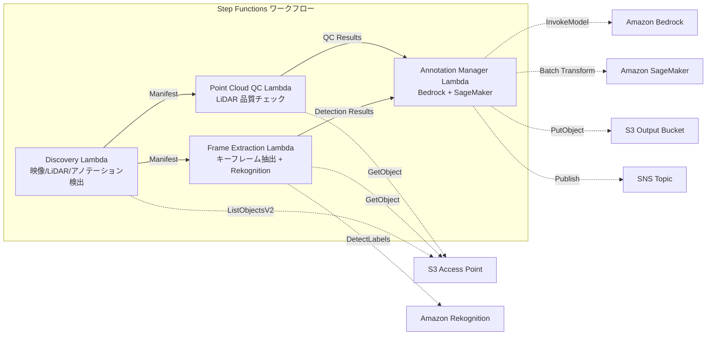

# UC9: 自動運転 / ADAS — 映像・LiDAR 前処理・品質チェック・アノテーション

🌐 **Language / 言語**: 日本語 | [English](README.en.md) | [한국어](README.ko.md) | [简体中文](README.zh-CN.md) | [繁體中文](README.zh-TW.md) | [Français](README.fr.md) | [Deutsch](README.de.md) | [Español](README.es.md)

📚 **ドキュメント**: [アーキテクチャ図](docs/architecture.md) | [デモガイド](docs/demo-guide.md)

## 概要

FSx for ONTAP の S3 Access Points を活用し、ダッシュカム映像と LiDAR 点群データの前処理、品質チェック、アノテーション管理を自動化するサーバーレスワークフローです。

### このパターンが適しているケース

- ダッシュカム映像や LiDAR 点群データが FSx for ONTAP 上に大量に蓄積されている
- 映像からのキーフレーム抽出と物体検出（車両、歩行者、交通標識）を自動化したい
- LiDAR 点群の品質チェック（点密度、座標整合性）を定期的に実施したい
- COCO 互換形式でアノテーションメタデータを管理したい
- SageMaker Batch Transform による点群セグメンテーション推論を組み込みたい

### このパターンが適さないケース

- リアルタイムの自動運転推論パイプラインが必要
- 大規模な映像トランスコーディング（MediaConvert / EC2 が適切）
- 完全な LiDAR SLAM 処理（HPC クラスタが適切）
- ONTAP REST API へのネットワーク到達性が確保できない環境

### 主な機能

- S3 AP 経由で映像（.mp4, .avi, .mkv）、LiDAR（.pcd, .las, .laz, .ply）、アノテーション（.json）を自動検出
- Rekognition DetectLabels による物体検出（車両、歩行者、交通標識、車線マーキング）
- LiDAR 点群の品質チェック（point_count, coordinate_bounds, point_density, NaN 検証）
- Bedrock によるアノテーション提案生成
- SageMaker Batch Transform による点群セグメンテーション推論
- COCO 互換 JSON 形式でのアノテーション出力

## Success Metrics

### Outcome
映像/LiDAR 前処理・品質チェックの自動化により、ADAS データパイプラインの効率化を実現する。

### Metrics
| メトリクス | 目標値（例） |
|-----------|------------|
| 処理済みフレーム数 / 実行 | > 1,000 frames |
| 品質チェック通過率 | > 90% |
| アノテーション前処理時間 | < 1 分 / フレーム |
| 処理スループット | > 500 frames/hour |
| コスト / 実行 | < $20 |
| Human Review 対象率 | < 10%（品質不合格フレーム） |

### Measurement Method
Step Functions 実行履歴、Rekognition/SageMaker 推論結果、CloudWatch Metrics、DynamoDB Task Token。

## アーキテクチャ



### ワークフローステップ

1. **Discovery**: S3 AP から映像、LiDAR、アノテーションファイルを検出
2. **Frame Extraction**: 映像からキーフレームを抽出し、Rekognition で物体検出
3. **Point Cloud QC**: LiDAR 点群のヘッダーメタデータ抽出と品質検証
4. **Annotation Manager**: Bedrock でアノテーション提案生成、SageMaker で点群セグメンテーション

## 前提条件

- AWS アカウントと適切な IAM 権限
- FSx for ONTAP ファイルシステム（ONTAP 9.17.1P4D3 以上）
- S3 Access Point が有効化されたボリューム（映像・LiDAR データを格納）
- VPC、プライベートサブネット
- Amazon Bedrock モデルアクセスが有効（Claude / Nova）
- SageMaker エンドポイント（点群セグメンテーションモデル）— オプショナル

## デプロイ手順

### 1. SAM デプロイ

```bash
# 前提: AWS SAM CLI が必要です。sam build がコードと共有レイヤーを自動でパッケージングします。
sam build

sam deploy \
  --stack-name fsxn-autonomous-driving \
  --parameter-overrides \
    S3AccessPointAlias=<your-volume-ext-s3alias> \
    S3AccessPointName=<your-s3ap-name> \
    VpcId=<your-vpc-id> \
    PrivateSubnetIds=<subnet-1>,<subnet-2> \
    ScheduleExpression="rate(1 hour)" \
    NotificationEmail=<your-email@example.com> \
    EnableVpcEndpoints=false \
    EnableCloudWatchAlarms=false \
  --capabilities CAPABILITY_NAMED_IAM \
  --resolve-s3 \
  --region ap-northeast-1
```

> **注意**: `template.yaml` は SAM CLI（`sam build` + `sam deploy`）で使用します。
> `aws cloudformation deploy` コマンドで直接デプロイする場合は `template-deploy.yaml` を使用してください（Lambda zip ファイルの事前パッケージングと S3 アップロードが必要です）。

## 設定パラメータ一覧

| パラメータ | 説明 | デフォルト | 必須 |
|-----------|------|----------|------|
| `S3AccessPointAlias` | FSx for ONTAP S3 AP Alias（入力用） | — | ✅ |
| `S3AccessPointName` | S3 AP 名（ARN ベースの IAM 権限付与用。省略時は Alias ベースのみ） | `""` | ⚠️ 推奨 |
| `ScheduleExpression` | EventBridge Scheduler のスケジュール式 | `rate(1 hour)` | |
| `VpcId` | VPC ID | — | ✅ |
| `PrivateSubnetIds` | プライベートサブネット ID リスト | — | ✅ |
| `NotificationEmail` | SNS 通知先メールアドレス | — | ✅ |
| `FrameExtractionInterval` | キーフレーム抽出間隔（秒） | `5` | |
| `MapConcurrency` | Map ステートの並列実行数 | `5` | |
| `LambdaMemorySize` | Lambda メモリサイズ (MB) | `2048` | |
| `LambdaTimeout` | Lambda タイムアウト (秒) | `600` | |
| `EnableVpcEndpoints` | Interface VPC Endpoints の有効化 | `false` | |
| `EnableCloudWatchAlarms` | CloudWatch Alarms の有効化 | `false` | |

## クリーンアップ

```bash
aws s3 rm s3://fsxn-autonomous-driving-output-${AWS_ACCOUNT_ID} --recursive

aws cloudformation delete-stack \
  --stack-name fsxn-autonomous-driving \
  --region ap-northeast-1

aws cloudformation wait stack-delete-complete \
  --stack-name fsxn-autonomous-driving \
  --region ap-northeast-1
```

## 参考リンク

- [FSx for ONTAP S3 Access Points 概要](https://docs.aws.amazon.com/fsx/latest/ONTAPGuide/accessing-data-via-s3-access-points.html)
- [Amazon Rekognition ラベル検出](https://docs.aws.amazon.com/rekognition/latest/dg/labels.html)
- [Amazon SageMaker Batch Transform](https://docs.aws.amazon.com/sagemaker/latest/dg/batch-transform.html)
- [COCO データフォーマット](https://cocodataset.org/#format-data)
- [LAS ファイルフォーマット仕様](https://www.asprs.org/divisions-committees/lidar-division/laser-las-file-format-exchange-activities)

## SageMaker Batch Transform 統合（Phase 3）

Phase 3 では、**SageMaker Batch Transform による LiDAR 点群セグメンテーション推論** をオプトインで利用できます。Step Functions の Callback Pattern（`.waitForTaskToken`）を使用し、非同期でバッチ推論ジョブの完了を待機します。

### 有効化

```bash
# 前提: AWS SAM CLI が必要です。sam build がコードと共有レイヤーを自動でパッケージングします。
sam build

sam deploy \
  --stack-name fsxn-autonomous-driving \
  --parameter-overrides \
    EnableSageMakerTransform=true \
    MockMode=true \
    ... # 他のパラメータ
  --capabilities CAPABILITY_NAMED_IAM \
  --resolve-s3
```

### ワークフロー

```
Discovery → Frame Extraction → Point Cloud QC
  → [EnableSageMakerTransform=true] SageMaker Invoke (.waitForTaskToken)
  → SageMaker Batch Transform Job
  → EventBridge (job state change) → SageMaker Callback (SendTaskSuccess/Failure)
  → Annotation Manager (Rekognition + SageMaker 結果統合)
```

### モックモード

テスト環境では `MockMode=true`（デフォルト）を使用することで、実際の SageMaker モデルデプロイなしに Callback Pattern のデータフローを検証できます。

- **MockMode=true**: SageMaker API を呼び出さず、モックセグメンテーション出力（入力 point_count と同数のランダムラベル）を生成し、直接 SendTaskSuccess を呼び出す
- **MockMode=false**: 実際の SageMaker CreateTransformJob を実行。事前にモデルのデプロイが必要

### 設定パラメータ（Phase 3 追加）

| パラメータ | 説明 | デフォルト |
|-----------|------|----------|
| `EnableSageMakerTransform` | SageMaker Batch Transform の有効化 | `false` |
| `MockMode` | モックモード（テスト用） | `true` |
| `SageMakerModelName` | SageMaker モデル名 | — |
| `SageMakerInstanceType` | Batch Transform インスタンスタイプ | `ml.m5.xlarge` |

## Supported Regions

UC9 は以下のサービスを使用します:

| サービス | リージョン制約 |
|---------|-------------|
| Amazon Rekognition | ほぼ全リージョンで利用可能 |
| Amazon Bedrock | 対応リージョンを確認（[Bedrock 対応リージョン](https://docs.aws.amazon.com/general/latest/gr/bedrock.html)） |
| SageMaker Batch Transform | ほぼ全リージョンで利用可能（インスタンスタイプの可用性はリージョンにより異なる） |
| AWS X-Ray | ほぼ全リージョンで利用可能 |
| CloudWatch EMF | ほぼ全リージョンで利用可能 |

> SageMaker Batch Transform を有効化する場合、デプロイ前に [AWS Regional Services List](https://aws.amazon.com/about-aws/global-infrastructure/regional-product-services/) でターゲットリージョンのインスタンスタイプ可用性を確認してください。詳細は [リージョン互換性マトリックス](../docs/region-compatibility.md) を参照。

---

## AWS ドキュメントリンク

| サービス | ドキュメント |
|---------|------------|
| FSx for ONTAP | [ユーザーガイド](https://docs.aws.amazon.com/fsx/latest/ONTAPGuide/what-is-fsx-ontap.html) |
| S3 Access Points | [S3 AP for FSx for ONTAP](https://docs.aws.amazon.com/fsx/latest/ONTAPGuide/s3-access-points.html) |
| Step Functions | [開発者ガイド](https://docs.aws.amazon.com/step-functions/latest/dg/welcome.html) |
| Amazon Rekognition | [開発者ガイド](https://docs.aws.amazon.com/rekognition/latest/dg/what-is.html) |
| Amazon SageMaker | [開発者ガイド](https://docs.aws.amazon.com/sagemaker/latest/dg/whatis.html) |
| Amazon Bedrock | [ユーザーガイド](https://docs.aws.amazon.com/bedrock/latest/userguide/what-is-bedrock.html) |

### Well-Architected Framework 対応

| 柱 | 対応 |
|----|------|
| 運用上の優秀性 | X-Ray トレーシング、EMF メトリクス、SageMaker ジョブ監視 |
| セキュリティ | 最小権限 IAM、KMS 暗号化、映像/LiDAR データアクセス制御 |
| 信頼性 | Step Functions Retry/Catch、SageMaker callback リトライ |
| パフォーマンス効率 | フレーム並列処理、SageMaker Batch Transform |
| コスト最適化 | サーバーレス、SageMaker スポットインスタンス対応 |
| 持続可能性 | オンデマンド実行、差分処理（新規フレームのみ） |

---

## コスト見積もり（月額概算）

> **注記**: 以下は ap-northeast-1 リージョンの概算であり、実際のコストは使用量により異なります。最新の料金は [AWS Pricing Calculator](https://calculator.aws/) で確認してください。

### サーバーレスコンポーネント（従量課金）

| サービス | 単価 | 想定使用量 | 月額概算 |
|---------|------|-----------|---------|
| Lambda | $0.0000166667/GB-sec | 9 関数 × 200 frames/日 | ~$1-5 |
| S3 API (GetObject/ListObjects) | $0.0047/10K requests | ~10K requests/日 | ~$1.5 |
| Step Functions | $0.025/1K state transitions | ~1K transitions/日 | ~$0.75 |
| Bedrock (Nova Lite) | $0.00006/1K input tokens | ~100K tokens/実行 | ~$3-10 |
| Athena | $5/TB scanned | ~100 MB/クエリ | ~$0.5-2 |
| SNS | $0.50/100K notifications | ~100 notifications/日 | ~$0.15 |
| CloudWatch Logs | $0.76/GB ingested | ~1 GB/月 | ~$0.76 |
| SageMaker Inference | $0.046/hour (ml.m5.large) |

### 固定コスト（FSx for ONTAP — 既存環境前提）

| コンポーネント | 月額 |
|--------------|------|
| FSx for ONTAP (128 MBps, 1 TB) | ~$230 (既存環境を共有) |
| S3 Access Point | 追加料金なし（S3 API 料金のみ） |

### 合計概算

| 構成 | 月額概算 |
|------|---------|
| 最小構成（日次 1 回実行） | ~$5-15 |
| 標準構成（時次実行） | ~$15-50 |
| 大規模構成（高頻度 + アラーム） | ~$50-150 |

> **Governance Caveat**: コスト見積もりは概算であり、保証値ではありません。実際の請求額は使用パターン、データ量、リージョンにより異なります。

---

## ローカルテスト

### Prerequisites チェック

```bash
# 前提条件の確認
aws --version          # AWS CLI v2
sam --version          # SAM CLI
python3 --version      # Python 3.9+
docker --version       # Docker (sam local 用)
aws sts get-caller-identity  # AWS 認証情報
```

### sam local invoke

```bash
# ビルド
# 前提: AWS SAM CLI が必要です。sam build がコードと共有レイヤーを自動でパッケージングします。
sam build

# Discovery Lambda のローカル実行
sam local invoke DiscoveryFunction --event events/discovery-event.json

# 環境変数オーバーライド付き
sam local invoke DiscoveryFunction \
  --event events/discovery-event.json \
  --env-vars env.json
```

### ユニットテスト

```bash
python3 -m pytest tests/ -v
```

詳細は [ローカルテスト クイックスタート](../docs/local-testing-quick-start.md) を参照してください。

---

## 出力サンプル (Output Sample)

自動運転データ前処理パイプラインの出力例:

```json
{
  "discovery": {
    "status": "completed",
    "object_count": 200,
    "categories": {"video": 50, "lidar": 100, "radar": 50}
  },
  "frame_extraction": {
    "total_frames": 1500,
    "extracted_from": 50,
    "fps": 30
  },
  "object_detection": [
    {
      "frame_id": "frame-0001",
      "objects": [
        {"class": "car", "confidence": 0.96, "bbox": [120, 80, 200, 150]},
        {"class": "pedestrian", "confidence": 0.89, "bbox": [400, 200, 50, 120]}
      ],
      "format": "COCO"
    }
  ],
  "lidar_qc": {
    "point_clouds_processed": 100,
    "avg_point_density": 64000,
    "quality_pass_rate_pct": 98.0
  }
}
```

> **注記**: 上記はサンプル出力であり、実際の値は環境・入力データにより異なります。ベンチマーク数値は sizing reference であり、service limit ではありません。

---

## Governance Note

> 本パターンは技術アーキテクチャガイダンスを提供します。法的・コンプライアンス・規制上の助言ではありません。組織は適格な専門家に相談してください。

---

## S3AP Compatibility

S3 Access Points for FSx for ONTAP の互換性制約、トラブルシューティング、トリガーパターンについては [S3AP Compatibility Notes](../docs/s3ap-compatibility-notes.md) を参照してください。