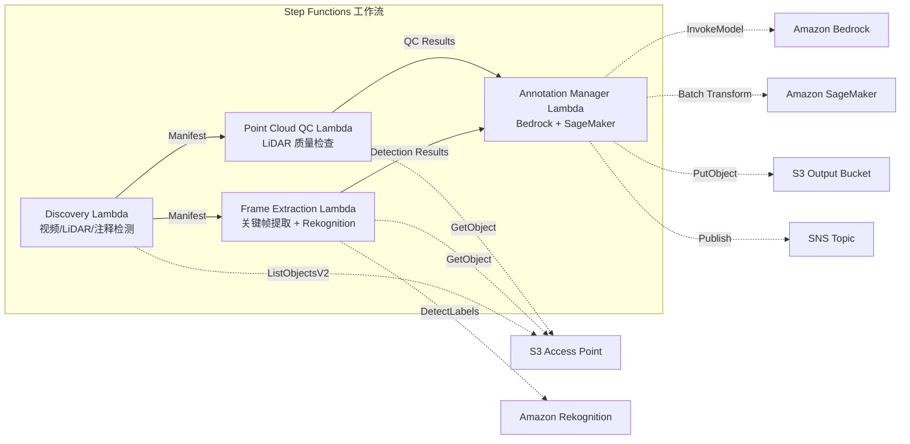

# UC9：自动驾驶 / ADAS — 图像·LiDAR 预处理·质量检查·注释

🌐 **Language / 言語**: [日本語](README.md) | [English](README.en.md) | [한국어](README.ko.md) | 简体中文 | [繁體中文](README.zh-TW.md) | [Français](README.fr.md) | [Deutsch](README.de.md) | [Español](README.es.md)

📚 **文档**: [架构图](docs/architecture.zh-CN.md) | [演示指南](docs/demo-guide.zh-CN.md)

## 概述

这是一个利用 Amazon FSx for NetApp ONTAP 的 S3 Access Points，自动化处理行车记录仪视频和 LiDAR 点云数据的预处理、质量检查和注释管理的无服务器工作流。

### 适用场景

- 行车记录仪视频和 LiDAR 点云数据大量积累在 FSx for ONTAP 上
- 希望自动从视频中提取关键帧并检测物体（车辆、行人、交通标志）
- 希望定期对 LiDAR 点云进行质量检查（点密度、坐标一致性）
- 希望以 COCO 兼容格式管理注释元数据
- 希望集成 SageMaker Batch Transform 进行点云分割推理

### 不适用的情况

- 需要实时自动驾驶推理管道
- 大规模视频转码（MediaConvert / EC2 适用）
- 完整的 LiDAR SLAM 处理（HPC 集群适用）
- 无法确保到 ONTAP REST API 的网络连通性的环境

### 主要功能

- 通过 S3 AP 自动检测视频（.mp4、.avi、.mkv）、LiDAR（.pcd、.las、.laz、.ply）和注释（.json）
- 使用 Rekognition DetectLabels 进行物体检测（车辆、行人、交通标志、车道标记）
- 对 LiDAR 点云进行质量检查（point_count、coordinate_bounds、point_density、NaN 验证）
- 使用 Bedrock 生成注释建议
- 使用 SageMaker Batch Transform 进行点云分割推理
- 输出 COCO 兼容的 JSON 格式注释

## Success Metrics

### Outcome
通过自动化视频/LiDAR 预处理和质量检查，实现 ADAS 数据管道的效率化。

### Metrics
| 指标 | 目标值（示例） |
|-----------|------------|
| 已处理帧数 / 每次执行 | > 1,000 frames |
| 质量检查通过率 | > 90% |
| 注释预处理时间 | < 1 分钟 / 帧 |
| 处理吞吐量 | > 500 frames/hour |
| 成本 / 每次执行 | < $20 |
| Human Review 对象比例 | < 10%（质量不合格帧） |

### Measurement Method
Step Functions 执行历史、Rekognition/SageMaker 推理结果、CloudWatch Metrics、DynamoDB Task Token。

## 架构



### 工作流程步骤

1. **Discovery**：从 S3 AP 检测视频、LiDAR 和注释文件
2. **Frame Extraction**：从视频中提取关键帧，并使用 Rekognition 进行物体检测
3. **Point Cloud QC**：提取 LiDAR 点云的头部元数据并进行质量验证
4. **Annotation Manager**：使用 Bedrock 生成注释建议，使用 SageMaker 进行点云分割

## 前提条件

- AWS 账户和适当的 IAM 权限
- FSx for ONTAP 文件系统（ONTAP 9.17.1P4D3 及以上）
- 已启用 S3 Access Point 的卷（存储视频和 LiDAR 数据）
- VPC、私有子网
- 已启用 Amazon Bedrock 模型访问（Claude / Nova）
- SageMaker 端点（点云分割模型）—— 可选

## 部署步骤

### 1. SAM 部署

```bash
# 前提条件：需要 AWS SAM CLI。'sam build' 会自动打包代码和共享层。
sam build

sam deploy \
  --stack-name fsxn-autonomous-driving \
  --parameter-overrides \
    S3AccessPointAlias=<your-volume-ext-s3alias> \
    S3AccessPointName=<your-s3ap-name> \
    VpcId=<your-vpc-id> \
    PrivateSubnetIds=<subnet-1>,<subnet-2> \
    ScheduleExpression="rate(1 hour)" \
    NotificationEmail=<your-email@example.com> \
    EnableVpcEndpoints=false \
    EnableCloudWatchAlarms=false \
  --capabilities CAPABILITY_NAMED_IAM \
  --resolve-s3 \
  --region ap-northeast-1
```

> **注意**: `template.yaml` 用于 SAM CLI（`sam build` + `sam deploy`）。
> 如需使用原生 `aws cloudformation deploy` 命令直接部署，请改用 `template-deploy.yaml`（需要预先打包 Lambda zip 文件并上传到 S3）。

## 配置参数列表

| 参数 | 说明 | 默认值 | 必需 |
|-----------|------|----------|------|
| `S3AccessPointAlias` | FSx for ONTAP S3 AP Alias（输入用） | — | ✅ |
| `S3AccessPointName` | S3 AP 名称（用于基于 ARN 的 IAM 权限授予。省略时仅基于 Alias） | `""` | ⚠️ 推荐 |
| `ScheduleExpression` | EventBridge Scheduler 的调度表达式 | `rate(1 hour)` | |
| `VpcId` | VPC ID | — | ✅ |
| `PrivateSubnetIds` | 私有子网 ID 列表 | — | ✅ |
| `NotificationEmail` | SNS 通知目标电子邮件地址 | — | ✅ |
| `FrameExtractionInterval` | 关键帧提取间隔（秒） | `5` | |
| `MapConcurrency` | Map 状态的并行执行数 | `5` | |
| `LambdaMemorySize` | Lambda 内存大小 (MB) | `2048` | |
| `LambdaTimeout` | Lambda 超时 (秒) | `600` | |
| `EnableVpcEndpoints` | 启用 Interface VPC Endpoints | `false` | |
| `EnableCloudWatchAlarms` | 启用 CloudWatch Alarms | `false` | |

## 清理

```bash
aws s3 rm s3://fsxn-autonomous-driving-output-${AWS_ACCOUNT_ID} --recursive

aws cloudformation delete-stack \
  --stack-name fsxn-autonomous-driving \
  --region ap-northeast-1

aws cloudformation wait stack-delete-complete \
  --stack-name fsxn-autonomous-driving \
  --region ap-northeast-1
```

## 参考链接

- [FSx for ONTAP S3 Access Points 概述](https://docs.aws.amazon.com/fsx/latest/ONTAPGuide/accessing-data-via-s3-access-points.html)
- [Amazon Rekognition 标签检测](https://docs.aws.amazon.com/rekognition/latest/dg/labels.html)
- [Amazon SageMaker Batch Transform](https://docs.aws.amazon.com/sagemaker/latest/dg/batch-transform.html)
- [COCO 数据格式](https://cocodataset.org/#format-data)
- [LAS 文件格式规范](https://www.asprs.org/divisions-committees/lidar-division/laser-las-file-format-exchange-activities)

## SageMaker Batch Transform 集成（Phase 3）

在 Phase 3 中，可选择使用 **通过 SageMaker Batch Transform 进行 LiDAR 点云分割推理**。使用 Step Functions 的 Callback Pattern（`.waitForTaskToken`）异步等待批量推理任务完成。

### 启用

```bash
# 前提条件：需要 AWS SAM CLI。'sam build' 会自动打包代码和共享层。
sam build

sam deploy \
  --stack-name fsxn-autonomous-driving \
  --parameter-overrides \
    EnableSageMakerTransform=true \
    MockMode=true \
    ... # 其他参数
  --capabilities CAPABILITY_NAMED_IAM \
  --resolve-s3
```

### 工作流程

```
Discovery → Frame Extraction → Point Cloud QC
  → [EnableSageMakerTransform=true] SageMaker Invoke (.waitForTaskToken)
  → SageMaker Batch Transform Job
  → EventBridge (job state change) → SageMaker Callback (SendTaskSuccess/Failure)
  → Annotation Manager (Rekognition + SageMaker 结果整合)
```

### 模拟模式

在测试环境中，使用 `MockMode=true`（默认）可以在不实际部署 SageMaker 模型的情况下验证 Callback Pattern 的数据流。

- **MockMode=true**：不调用 SageMaker API，生成模拟分割输出（与输入 point_count 数量相同的随机标签），然后直接调用 SendTaskSuccess
- **MockMode=false**：执行实际的 SageMaker CreateTransformJob。需要预先部署模型

### 配置参数（Phase 3 添加）

| 参数 | 说明 | 默认值 |
|-----------|------|----------|
| `EnableSageMakerTransform` | 启用 SageMaker Batch Transform | `false` |
| `MockMode` | 模拟模式（测试用） | `true` |
| `SageMakerModelName` | SageMaker 模型名称 | — |
| `SageMakerInstanceType` | Batch Transform 实例类型 | `ml.m5.xlarge` |

## 支持的区域

UC9 使用以下服务：

| 服务 | 区域约束 |
|---------|-------------|
| Amazon Rekognition | 几乎所有区域均可用 |
| Amazon Bedrock | 确认支持的区域（[Bedrock 支持的区域](https://docs.aws.amazon.com/general/latest/gr/bedrock.html)） |
| SageMaker Batch Transform | 几乎所有区域均可用（实例类型的可用性因区域而异） |
| AWS X-Ray | 几乎所有区域均可用 |
| CloudWatch EMF | 几乎所有区域均可用 |

> 如果启用 SageMaker Batch Transform，请在部署前于 [AWS Regional Services List](https://aws.amazon.com/about-aws/global-infrastructure/regional-product-services/) 确认目标区域的实例类型可用性。详情请参见 [区域兼容性矩阵](../docs/region-compatibility.md)。

---

## AWS 文档链接

| 服务 | 文档 |
|---------|------------|
| FSx for ONTAP | [用户指南](https://docs.aws.amazon.com/fsx/latest/ONTAPGuide/what-is-fsx-ontap.html) |
| S3 Access Points | [S3 AP for FSx for ONTAP](https://docs.aws.amazon.com/fsx/latest/ONTAPGuide/s3-access-points.html) |
| Step Functions | [开发者指南](https://docs.aws.amazon.com/step-functions/latest/dg/welcome.html) |
| Amazon Rekognition | [开发者指南](https://docs.aws.amazon.com/rekognition/latest/dg/what-is.html) |
| Amazon SageMaker | [开发者指南](https://docs.aws.amazon.com/sagemaker/latest/dg/whatis.html) |
| Amazon Bedrock | [用户指南](https://docs.aws.amazon.com/bedrock/latest/userguide/what-is-bedrock.html) |

### Well-Architected Framework 对应

| 支柱 | 对应 |
|----|------|
| 卓越运营 | X-Ray 跟踪、EMF 指标、SageMaker 作业监控 |
| 安全性 | 最小权限 IAM、KMS 加密、视频/LiDAR 数据访问控制 |
| 可靠性 | Step Functions Retry/Catch、SageMaker callback 重试 |
| 性能效率 | 帧并行处理、SageMaker Batch Transform |
| 成本优化 | 无服务器、SageMaker Spot 实例支持 |
| 可持续性 | 按需执行、增量处理（仅新增帧） |

---

## 成本估算（每月概算）

> **备注**: 以下为 ap-northeast-1 区域的概算，实际成本因使用量而异。最新价格请在 [AWS Pricing Calculator](https://calculator.aws/) 确认。

### 无服务器组件（按量计费）

| 服务 | 单价 | 假设使用量 | 每月概算 |
|---------|------|-----------|---------|
| Lambda | $0.0000166667/GB-sec | 9 个函数 × 200 frames/天 | ~$1-5 |
| S3 API (GetObject/ListObjects) | $0.0047/10K requests | ~10K requests/天 | ~$1.5 |
| Step Functions | $0.025/1K state transitions | ~1K transitions/天 | ~$0.75 |
| Bedrock (Nova Lite) | $0.00006/1K input tokens | ~100K tokens/次执行 | ~$3-10 |
| Athena | $5/TB scanned | ~100 MB/查询 | ~$0.5-2 |
| SNS | $0.50/100K notifications | ~100 notifications/天 | ~$0.15 |
| CloudWatch Logs | $0.76/GB ingested | ~1 GB/月 | ~$0.76 |
| SageMaker Inference | $0.046/hour (ml.m5.large) |

### 固定成本（FSx for ONTAP —— 以现有环境为前提）

| 组件 | 每月 |
|--------------|------|
| FSx for ONTAP (128 MBps, 1 TB) | ~$230 (共享现有环境) |
| S3 Access Point | 无额外费用（仅 S3 API 费用） |

### 合计概算

| 配置 | 每月概算 |
|------|---------|
| 最小配置（每日执行 1 次） | ~$5-15 |
| 标准配置（每小时执行） | ~$15-50 |
| 大规模配置（高频 + 警报） | ~$50-150 |

> **Governance Caveat**: 成本估算为概算，非保证值。实际账单金额因使用模式、数据量和区域而异。

---

## 本地测试

### Prerequisites 检查

```bash
# 确认前提条件
aws --version          # AWS CLI v2
sam --version          # SAM CLI
python3 --version      # Python 3.9+
docker --version       # Docker (用于 sam local)
aws sts get-caller-identity  # AWS 凭证
```

### sam local invoke

```bash
# 构建
# 前提条件：需要 AWS SAM CLI。'sam build' 会自动打包代码和共享层。
sam build

# 本地执行 Discovery Lambda
sam local invoke DiscoveryFunction --event events/discovery-event.json

# 带环境变量覆盖
sam local invoke DiscoveryFunction \
  --event events/discovery-event.json \
  --env-vars env.json
```

### 单元测试

```bash
python3 -m pytest tests/ -v
```

详情请参见 [本地测试快速入门](../docs/local-testing-quick-start.md)。

---

## 输出示例 (Output Sample)

自动驾驶数据预处理管道的输出示例：

```json
{
  "discovery": {
    "status": "completed",
    "object_count": 200,
    "categories": {"video": 50, "lidar": 100, "radar": 50}
  },
  "frame_extraction": {
    "total_frames": 1500,
    "extracted_from": 50,
    "fps": 30
  },
  "object_detection": [
    {
      "frame_id": "frame-0001",
      "objects": [
        {"class": "car", "confidence": 0.96, "bbox": [120, 80, 200, 150]},
        {"class": "pedestrian", "confidence": 0.89, "bbox": [400, 200, 50, 120]}
      ],
      "format": "COCO"
    }
  ],
  "lidar_qc": {
    "point_clouds_processed": 100,
    "avg_point_density": 64000,
    "quality_pass_rate_pct": 98.0
  }
}
```

> **备注**: 以上为示例输出，实际值因环境·输入数据而异。基准数值为 sizing reference，非 service limit。

---

## Governance Note

> 本模式提供技术架构指导，并非法律、合规或监管建议。组织应咨询具备资质的专业人士。

---

## S3AP Compatibility

关于 S3 Access Points for FSx for ONTAP 的兼容性约束、故障排除和触发模式，请参见 [S3AP Compatibility Notes](../docs/s3ap-compatibility-notes.md)。
