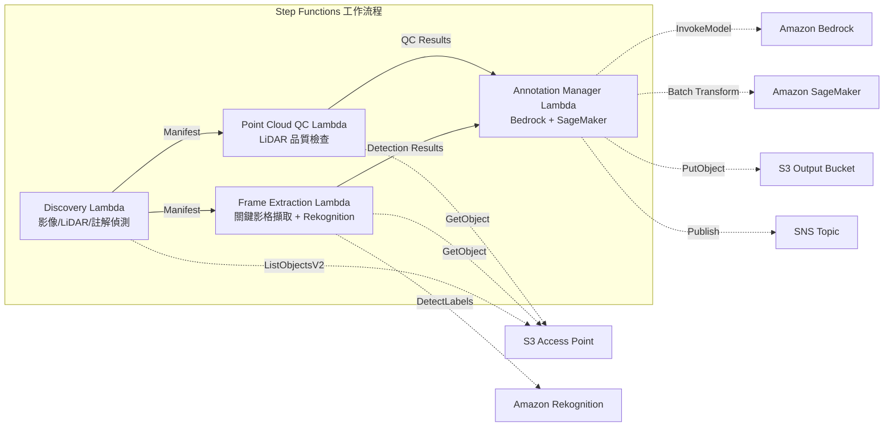

# UC9: 自動駕駛 / ADAS — 影像·LiDAR 前處理·品質檢查·註解

🌐 **Language / 言語**: [日本語](README.md) | [English](README.en.md) | [한국어](README.ko.md) | [简体中文](README.zh-CN.md) | 繁體中文 | [Français](README.fr.md) | [Deutsch](README.de.md) | [Español](README.es.md)

📚 **文件**: [架構圖](docs/architecture.zh-TW.md) | [示範指南](docs/demo-guide.zh-TW.md)

## 概述

這是一個利用 Amazon FSx for NetApp ONTAP 的 S3 Access Points，自動化行車記錄儀影像和 LiDAR 點雲資料的前處理、品質檢查和註解管理的無伺服器工作流程。

### 此模式適用的情況

- 行車記錄儀影像和 LiDAR 點雲資料大量儲存在 FSx for ONTAP 上
- 希望自動化影像中的關鍵影格擷取和物體偵測（車輛、行人、交通標誌）
- 希望定期進行 LiDAR 點雲的品質檢查（點密度、座標一致性）
- 希望以 COCO 相容格式管理註解中繼資料
- 希望加入 SageMaker Batch Transform 的點雲分割推論

### 不適合的情況

- 需要即時自動駕駛推論管線
- 大規模影像轉碼（MediaConvert / EC2 適合）
- 完整的 LiDAR SLAM 處理（HPC 叢集適合）
- 無法確保到 ONTAP REST API 網路連通性的環境

### 主要功能

- 透過 S3 AP 自動偵測影像（.mp4、.avi、.mkv）、LiDAR（.pcd、.las、.laz、.ply）、註解（.json）
- 使用 Rekognition DetectLabels 進行物體偵測（車輛、行人、交通標誌、車道標記）
- LiDAR 點雲品質檢查（point_count、coordinate_bounds、point_density、NaN 驗證）
- 使用 Bedrock 生成註解建議
- 使用 SageMaker Batch Transform 進行點雲分割推論
- 輸出 COCO 相容 JSON 格式的註解

## Success Metrics

### Outcome
透過影像/LiDAR 前處理·品質檢查的自動化，實現 ADAS 資料管線的效率化。

### Metrics
| 指標 | 目標值（範例） |
|-----------|------------|
| 已處理影格數 / 每次執行 | > 1,000 frames |
| 品質檢查通過率 | > 90% |
| 註解前處理時間 | < 1 分鐘 / 影格 |
| 處理吞吐量 | > 500 frames/hour |
| 成本 / 每次執行 | < $20 |
| Human Review 對象比例 | < 10%（品質不合格影格） |

### Measurement Method
Step Functions 執行歷史、Rekognition/SageMaker 推論結果、CloudWatch Metrics、DynamoDB Task Token。

## 架構



### 工作流程步驟

1. **Discovery**：從 S3 AP 偵測影像、LiDAR 和註解檔案
2. **Frame Extraction**：從影像中擷取關鍵影格，並使用 Rekognition 進行物體偵測
3. **Point Cloud QC**：擷取 LiDAR 點雲的標頭中繼資料並進行品質驗證
4. **Annotation Manager**：使用 Bedrock 生成註解建議，使用 SageMaker 進行點雲分割

## 前提條件

- AWS 帳戶和適當的 IAM 權限
- FSx for ONTAP 檔案系統（ONTAP 9.17.1P4D3 以上）
- 已啟用 S3 Access Point 的磁碟區（用於儲存影像和 LiDAR 資料）
- VPC、私有子網路
- 已啟用 Amazon Bedrock 模型存取（Claude / Nova）
- SageMaker 端點（點雲分割模型）— 選用

## 部署步驟

### 1. SAM 部署

```bash
# 前提條件：需要 AWS SAM CLI。'sam build' 會自動打包程式碼與共用層。
sam build

sam deploy \
  --stack-name fsxn-autonomous-driving \
  --parameter-overrides \
    S3AccessPointAlias=<your-volume-ext-s3alias> \
    S3AccessPointName=<your-s3ap-name> \
    VpcId=<your-vpc-id> \
    PrivateSubnetIds=<subnet-1>,<subnet-2> \
    ScheduleExpression="rate(1 hour)" \
    NotificationEmail=<your-email@example.com> \
    EnableVpcEndpoints=false \
    EnableCloudWatchAlarms=false \
  --capabilities CAPABILITY_NAMED_IAM \
  --resolve-s3 \
  --region ap-northeast-1
```

> **注意**: `template.yaml` 用於 SAM CLI（`sam build` + `sam deploy`）。
> 如需使用原生 `aws cloudformation deploy` 命令直接部署，請改用 `template-deploy.yaml`（需要預先封裝 Lambda zip 檔案並上傳至 S3）。

## 設定參數列表

| 參數 | 說明 | 預設值 | 必要 |
|-----------|------|----------|------|
| `S3AccessPointAlias` | FSx for ONTAP S3 AP Alias（輸入用） | — | ✅ |
| `S3AccessPointName` | S3 AP 名稱（用於基於 ARN 的 IAM 權限授予。省略時僅基於 Alias） | `""` | ⚠️ 建議 |
| `ScheduleExpression` | EventBridge Scheduler 的排程運算式 | `rate(1 hour)` | |
| `VpcId` | VPC ID | — | ✅ |
| `PrivateSubnetIds` | 私有子網路 ID 清單 | — | ✅ |
| `NotificationEmail` | SNS 通知目標電子郵件地址 | — | ✅ |
| `FrameExtractionInterval` | 關鍵影格擷取間隔（秒） | `5` | |
| `MapConcurrency` | Map 狀態的平行執行數 | `5` | |
| `LambdaMemorySize` | Lambda 記憶體大小 (MB) | `2048` | |
| `LambdaTimeout` | Lambda 逾時 (秒) | `600` | |
| `EnableVpcEndpoints` | 啟用 Interface VPC Endpoints | `false` | |
| `EnableCloudWatchAlarms` | 啟用 CloudWatch Alarms | `false` | |

## 清理

```bash
aws s3 rm s3://fsxn-autonomous-driving-output-${AWS_ACCOUNT_ID} --recursive

aws cloudformation delete-stack \
  --stack-name fsxn-autonomous-driving \
  --region ap-northeast-1

aws cloudformation wait stack-delete-complete \
  --stack-name fsxn-autonomous-driving \
  --region ap-northeast-1
```

## 參考連結

- [FSx for ONTAP S3 Access Points 概覽](https://docs.aws.amazon.com/fsx/latest/ONTAPGuide/accessing-data-via-s3-access-points.html)
- [Amazon Rekognition 標籤偵測](https://docs.aws.amazon.com/rekognition/latest/dg/labels.html)
- [Amazon SageMaker Batch Transform](https://docs.aws.amazon.com/sagemaker/latest/dg/batch-transform.html)
- [COCO 資料格式](https://cocodataset.org/#format-data)
- [LAS 檔案格式規範](https://www.asprs.org/divisions-committees/lidar-division/laser-las-file-format-exchange-activities)

## SageMaker Batch Transform 整合（Phase 3）

在 Phase 3 中，可選擇使用 **透過 SageMaker Batch Transform 進行 LiDAR 點雲分割推論**。使用 Step Functions 的 Callback Pattern（`.waitForTaskToken`），以非同步方式等待批次推論作業完成。

### 啟用

```bash
# 前提條件：需要 AWS SAM CLI。'sam build' 會自動打包程式碼與共用層。
sam build

sam deploy \
  --stack-name fsxn-autonomous-driving \
  --parameter-overrides \
    EnableSageMakerTransform=true \
    MockMode=true \
    ... # 其他參數
  --capabilities CAPABILITY_NAMED_IAM \
  --resolve-s3
```

### 工作流程

```
Discovery → Frame Extraction → Point Cloud QC
  → [EnableSageMakerTransform=true] SageMaker Invoke (.waitForTaskToken)
  → SageMaker Batch Transform Job
  → EventBridge (job state change) → SageMaker Callback (SendTaskSuccess/Failure)
  → Annotation Manager (Rekognition + SageMaker 結果整合)
```

### 模擬模式

在測試環境中，使用 `MockMode=true`（預設值）可以在不進行實際 SageMaker 模型部署的情況下驗證 Callback Pattern 的資料流程。

- **MockMode=true**：不呼叫 SageMaker API，生成模擬分割輸出（隨機標籤數與輸入的 point_count 相同），並直接呼叫 SendTaskSuccess
- **MockMode=false**：執行實際的 SageMaker CreateTransformJob。需要事先部署模型

### 設定參數（Phase 3 新增）

| 參數 | 說明 | 預設值 |
|-----------|------|----------|
| `EnableSageMakerTransform` | 啟用 SageMaker Batch Transform | `false` |
| `MockMode` | 模擬模式（測試用） | `true` |
| `SageMakerModelName` | SageMaker 模型名稱 | — |
| `SageMakerInstanceType` | Batch Transform 執行個體類型 | `ml.m5.xlarge` |

## 支援的區域

UC9 使用以下服務：

| 服務 | 區域限制 |
|---------|-------------|
| Amazon Rekognition | 幾乎所有區域皆可使用 |
| Amazon Bedrock | 確認支援的區域（[Bedrock 支援的區域](https://docs.aws.amazon.com/general/latest/gr/bedrock.html)） |
| SageMaker Batch Transform | 幾乎所有區域皆可使用（執行個體類型的可用性因區域而異） |
| AWS X-Ray | 幾乎所有區域皆可使用 |
| CloudWatch EMF | 幾乎所有區域皆可使用 |

> 當啟用 SageMaker Batch Transform 時，請在部署前於 [AWS Regional Services List](https://aws.amazon.com/about-aws/global-infrastructure/regional-product-services/) 確認目標區域的執行個體類型可用性。詳細資訊請參閱 [區域相容性矩陣](../docs/region-compatibility.md)。

---

## AWS 文件連結

| 服務 | 文件 |
|---------|------------|
| FSx for ONTAP | [使用者指南](https://docs.aws.amazon.com/fsx/latest/ONTAPGuide/what-is-fsx-ontap.html) |
| S3 Access Points | [S3 AP for FSx for ONTAP](https://docs.aws.amazon.com/fsx/latest/ONTAPGuide/s3-access-points.html) |
| Step Functions | [開發人員指南](https://docs.aws.amazon.com/step-functions/latest/dg/welcome.html) |
| Amazon Rekognition | [開發人員指南](https://docs.aws.amazon.com/rekognition/latest/dg/what-is.html) |
| Amazon SageMaker | [開發人員指南](https://docs.aws.amazon.com/sagemaker/latest/dg/whatis.html) |
| Amazon Bedrock | [使用者指南](https://docs.aws.amazon.com/bedrock/latest/userguide/what-is-bedrock.html) |

### Well-Architected Framework 對應

| 支柱 | 對應 |
|----|------|
| 卓越營運 | X-Ray 追蹤、EMF 指標、SageMaker 作業監控 |
| 安全性 | 最小權限 IAM、KMS 加密、影像/LiDAR 資料存取控制 |
| 可靠性 | Step Functions Retry/Catch、SageMaker callback 重試 |
| 效能效率 | 影格平行處理、SageMaker Batch Transform |
| 成本最佳化 | 無伺服器、SageMaker Spot 執行個體支援 |
| 永續性 | 隨需執行、增量處理（僅新增影格） |

---

## 成本估算（每月概算）

> **備註**: 以下為 ap-northeast-1 區域的概算，實際成本因使用量而異。最新價格請於 [AWS Pricing Calculator](https://calculator.aws/) 確認。

### 無伺服器元件（按量計費）

| 服務 | 單價 | 假設使用量 | 每月概算 |
|---------|------|-----------|---------|
| Lambda | $0.0000166667/GB-sec | 9 個函式 × 200 frames/天 | ~$1-5 |
| S3 API (GetObject/ListObjects) | $0.0047/10K requests | ~10K requests/天 | ~$1.5 |
| Step Functions | $0.025/1K state transitions | ~1K transitions/天 | ~$0.75 |
| Bedrock (Nova Lite) | $0.00006/1K input tokens | ~100K tokens/次執行 | ~$3-10 |
| Athena | $5/TB scanned | ~100 MB/查詢 | ~$0.5-2 |
| SNS | $0.50/100K notifications | ~100 notifications/天 | ~$0.15 |
| CloudWatch Logs | $0.76/GB ingested | ~1 GB/月 | ~$0.76 |
| SageMaker Inference | $0.046/hour (ml.m5.large) |

### 固定成本（FSx for ONTAP — 以現有環境為前提）

| 元件 | 每月 |
|--------------|------|
| FSx for ONTAP (128 MBps, 1 TB) | ~$230 (共用現有環境) |
| S3 Access Point | 無額外費用（僅 S3 API 費用） |

### 合計概算

| 組態 | 每月概算 |
|------|---------|
| 最小組態（每日執行 1 次） | ~$5-15 |
| 標準組態（每小時執行） | ~$15-50 |
| 大規模組態（高頻率 + 警示） | ~$50-150 |

> **Governance Caveat**: 成本估算為概算，非保證值。實際帳單金額因使用模式、資料量和區域而異。

---

## 本機測試

### Prerequisites 檢查

```bash
# 確認前提條件
aws --version          # AWS CLI v2
sam --version          # SAM CLI
python3 --version      # Python 3.9+
docker --version       # Docker (用於 sam local)
aws sts get-caller-identity  # AWS 認證資訊
```

### sam local invoke

```bash
# 建置
# 前提條件：需要 AWS SAM CLI。'sam build' 會自動打包程式碼與共用層。
sam build

# 本機執行 Discovery Lambda
sam local invoke DiscoveryFunction --event events/discovery-event.json

# 帶環境變數覆寫
sam local invoke DiscoveryFunction \
  --event events/discovery-event.json \
  --env-vars env.json
```

### 單元測試

```bash
python3 -m pytest tests/ -v
```

詳細資訊請參閱 [本機測試快速入門](../docs/local-testing-quick-start.md)。

---

## 輸出範例 (Output Sample)

自動駕駛資料前處理管線的輸出範例：

```json
{
  "discovery": {
    "status": "completed",
    "object_count": 200,
    "categories": {"video": 50, "lidar": 100, "radar": 50}
  },
  "frame_extraction": {
    "total_frames": 1500,
    "extracted_from": 50,
    "fps": 30
  },
  "object_detection": [
    {
      "frame_id": "frame-0001",
      "objects": [
        {"class": "car", "confidence": 0.96, "bbox": [120, 80, 200, 150]},
        {"class": "pedestrian", "confidence": 0.89, "bbox": [400, 200, 50, 120]}
      ],
      "format": "COCO"
    }
  ],
  "lidar_qc": {
    "point_clouds_processed": 100,
    "avg_point_density": 64000,
    "quality_pass_rate_pct": 98.0
  }
}
```

> **備註**: 以上為範例輸出，實際值因環境·輸入資料而異。基準數值為 sizing reference，非 service limit。

---

## Governance Note

> 本模式提供技術架構指導，並非法律、合規或法規建議。組織應諮詢具備資格的專業人士。

---

## S3AP Compatibility

關於 S3 Access Points for FSx for ONTAP 的相容性限制、疑難排解和觸發模式，請參閱 [S3AP Compatibility Notes](../docs/s3ap-compatibility-notes.md)。
