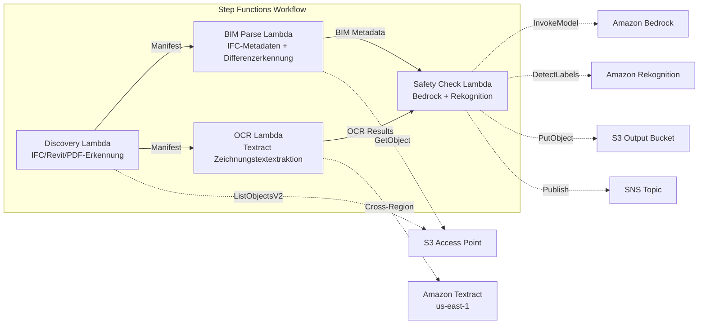

# UC10: Bau / AEC — BIM-Modellverwaltung, Plan-OCR, Sicherheitscompliance

🌐 **Language / 言語**: [日本語](README.md) | [English](README.en.md) | [한국어](README.ko.md) | [简体中文](README.zh-CN.md) | [繁體中文](README.zh-TW.md) | [Français](README.fr.md) | Deutsch | [Español](README.es.md)

📚 **Dokumentation**: [Architekturdiagramm](docs/architecture.md) | [Demo-Leitfaden](docs/demo-guide.md)

## Übersicht

Dies ist ein serverloser Workflow, der die S3 Access Points von FSx for ONTAP nutzt, um die Versionskontrolle von BIM-Modellen (IFC/Revit), die OCR-Textextraktion aus Zeichnungs-PDFs und die Sicherheits-Compliance-Prüfung zu automatisieren.

### Fälle, in denen dieses Muster geeignet ist

- BIM-Modelle (IFC/Revit) und Zeichnungs-PDFs sammeln sich auf FSx for ONTAP an
- Die Metadaten von IFC-Dateien (Projektname, Anzahl der Bauelemente, Stockwerke) sollen automatisch katalogisiert werden
- Unterschiede zwischen den Versionen der BIM-Modelle (Hinzufügen, Löschen, Ändern von Elementen) sollen automatisch erkannt werden
- Aus den Zeichnungs-PDFs sollen Text und Tabellen mit Textract extrahiert werden
- Eine automatische Überprüfung der Sicherheits-Compliance-Regeln (Brandschutz und Fluchtwege, Strukturlasten, Materialstandards) ist erforderlich

### Fälle, für die dieses Muster nicht geeignet ist

- Echtzeit-BIM-Zusammenarbeit (Revit Server / BIM 360 ist geeignet)
- Vollständige strukturelle Analysesimulation (FEM-Software erforderlich)
- Großflächige 3D-Rendering-Verarbeitung (EC2/GPU-Instanzen sind geeignet)
- Umgebungen, in denen keine Netzwerkverbindung zur ONTAP REST API hergestellt werden kann

### Hauptfunktionen

- Automatische Erkennung von IFC/Revit/PDF-Dateien über S3 AP
- IFC-Metadatenextraktion (project_name, building_elements_count, floor_count, coordinate_system, ifc_schema_version)
- Versionsdifferenzerkennung (element additions, deletions, modifications)
- OCR-Text- und Tabellenextraktion von Zeichnungs-PDFs mit Textract (Cross-Region)
- Sicherheits-Compliance-Regelprüfung mit Bedrock
- Erkennung sicherheitsrelevanter visueller Elemente in Zeichnungsbildern mit Rekognition (Notausgänge, Feuerlöscher, Gefahrenbereiche)

## Success Metrics

### Outcome
Effizienzsteigerung im Baumanagement durch Automatisierung von BIM-Versionskontrolle, Plan-OCR und Sicherheits-Compliance-Prüfung.

### Metrics
| Metrik | Zielwert (Beispiel) |
|-----------|------------|
| Verarbeitete Zeichnungen / Ausführung | > 100 files |
| Erfolgsrate der OCR-Textextraktion | > 90% |
| Erkennungsrate von Sicherheits-Compliance-Verstößen | 100 % (bekannte Muster) |
| Verarbeitungszeit / Datei | < 45 Sek. |
| Kosten / Ausführung | < $10 |
| Human-Review-Quote | < 15 % (bei erkanntem Sicherheitsverstoß) |

### Measurement Method
Step Functions-Ausführungsverlauf, Textract confidence score, Bedrock-Sicherheitsbericht, CloudWatch Metrics.

## Architektur



### Workflowschritte

1. **Discovery**: .ifc-, .rvt- und .pdf-Dateien von S3 AP erkennen
2. **BIM Parse**: Metadatenextraktion aus IFC-Dateien und Erkennung von Versionsunterschieden
3. **OCR**: Text- und Tabellenextraktion aus Zeichnungs-PDFs mit Textract (Cross-Region)
4. **Safety Check**: Sicherheits-Compliance-Regelprüfung mit Bedrock, visuelle Elementerkennung mit Rekognition

## Voraussetzungen

- AWS-Konto und geeignete IAM-Berechtigungen
- FSx for ONTAP-Dateisystem (ONTAP 9.17.1P4D3 oder höher)
- Ein Volume mit aktiviertem S3 Access Point (zum Speichern von BIM-Modellen und Zeichnungen)
- VPC, private Subnetze
- Amazon Bedrock-Modellzugriff aktiviert (Claude / Nova)
- **Cross-Region**: Da Textract nicht in ap-northeast-1 verfügbar ist, ist ein Cross-Region-Aufruf nach us-east-1 erforderlich

## Bereitstellungsschritte

### 1. Überprüfung der Cross-Region-Parameter

Da Textract nicht in der Tokyo-Region verfügbar ist, konfigurieren Sie den Cross-Region-Aufruf mit dem Parameter `CrossRegionTarget`.

### 2. SAM-Bereitstellung

```bash
# Voraussetzung: AWS SAM CLI erforderlich. „sam build“ verpackt Code und Shared Layer automatisch.
sam build

sam deploy \
  --stack-name fsxn-construction-bim \
  --parameter-overrides \
    S3AccessPointAlias=<your-volume-ext-s3alias> \
    S3AccessPointName=<your-s3ap-name> \
    VpcId=<your-vpc-id> \
    PrivateSubnetIds=<subnet-1>,<subnet-2> \
    ScheduleExpression="rate(1 hour)" \
    NotificationEmail=<your-email@example.com> \
    CrossRegion=us-east-1 \
    EnableVpcEndpoints=false \
    EnableCloudWatchAlarms=false \
  --capabilities CAPABILITY_NAMED_IAM \
  --resolve-s3 \
  --region ap-northeast-1
```

> **Hinweis**: `template.yaml` wird mit der SAM CLI (`sam build` + `sam deploy`) verwendet.
> Für eine direkte Bereitstellung mit dem Befehl `aws cloudformation deploy` verwenden Sie stattdessen `template-deploy.yaml` (erfordert das vorherige Packen der Lambda-Zip-Dateien und das Hochladen in S3).

## Liste der Konfigurationsparameter

| Parameter | Beschreibung | Standard | Erforderlich |
|-----------|------|----------|------|
| `S3AccessPointAlias` | FSx for ONTAP S3 AP Alias (für Eingabe) | — | ✅ |
| `S3AccessPointName` | S3 AP-Name (für ARN-basierte IAM-Berechtigungsvergabe; bei Auslassung nur Alias-basiert) | `""` | ⚠️ Empfohlen |
| `ScheduleExpression` | EventBridge Scheduler-Zeitplanausdruck | `rate(1 hour)` | |
| `VpcId` | VPC ID | — | ✅ |
| `PrivateSubnetIds` | Liste der privaten Subnetz-IDs | — | ✅ |
| `NotificationEmail` | SNS-Benachrichtigungs-E-Mail-Adresse | — | ✅ |
| `CrossRegionTarget` | Zielregion von Textract | `us-east-1` | |
| `MapConcurrency` | Parallele Ausführungen des Map-Status | `10` | |
| `LambdaMemorySize` | Lambda-Speichergröße (MB) | `1024` | |
| `LambdaTimeout` | Lambda-Timeout (Sek.) | `300` | |
| `EnableVpcEndpoints` | Interface VPC Endpoints aktivieren | `false` | |
| `EnableCloudWatchAlarms` | CloudWatch Alarms aktivieren | `false` | |

## Bereinigung

```bash
aws s3 rm s3://fsxn-construction-bim-output-${AWS_ACCOUNT_ID} --recursive

aws cloudformation delete-stack \
  --stack-name fsxn-construction-bim \
  --region ap-northeast-1

aws cloudformation wait stack-delete-complete \
  --stack-name fsxn-construction-bim \
  --region ap-northeast-1
```

## Unterstützte Regionen

UC10 verwendet die folgenden Dienste:

| Dienst | Regionsbeschränkung |
|---------|-------------|
| Amazon Textract | In ap-northeast-1 nicht verfügbar. Geben Sie über den Parameter `TEXTRACT_REGION` eine unterstützte Region (z. B. us-east-1) an |
| Amazon Bedrock | Unterstützte Regionen prüfen ([Von Bedrock unterstützte Regionen](https://docs.aws.amazon.com/general/latest/gr/bedrock.html)) |
| Amazon Rekognition | In fast allen Regionen verfügbar |
| AWS X-Ray | In fast allen Regionen verfügbar |
| CloudWatch EMF | In fast allen Regionen verfügbar |

> Rufen Sie die Textract API über den Cross-Region Client auf. Überprüfen Sie die Datenresidenzanforderungen. Weitere Informationen finden Sie in der [Regionskompatibilitätsmatrix](../docs/region-compatibility.md).

## Referenzlinks

- [Übersicht über S3 Access Points für FSx for ONTAP](https://docs.aws.amazon.com/fsx/latest/ONTAPGuide/accessing-data-via-s3-access-points.html)
- [Amazon Textract-Dokumentation](https://docs.aws.amazon.com/textract/latest/dg/what-is.html)
- [IFC-Formatspezifikation (buildingSMART)](https://www.buildingsmart.org/standards/bsi-standards/industry-foundation-classes/)
- [Amazon Rekognition Label-Erkennung](https://docs.aws.amazon.com/rekognition/latest/dg/labels.html)

---

## Links zur AWS-Dokumentation

| Dienst | Dokumentation |
|---------|------------|
| FSx for ONTAP | [Benutzerhandbuch](https://docs.aws.amazon.com/fsx/latest/ONTAPGuide/what-is-fsx-ontap.html) |
| S3 Access Points | [S3 AP for FSx for ONTAP](https://docs.aws.amazon.com/fsx/latest/ONTAPGuide/s3-access-points.html) |
| Step Functions | [Entwicklerhandbuch](https://docs.aws.amazon.com/step-functions/latest/dg/welcome.html) |
| Amazon Textract | [Entwicklerhandbuch](https://docs.aws.amazon.com/textract/latest/dg/what-is.html) |
| Amazon Rekognition | [Entwicklerhandbuch](https://docs.aws.amazon.com/rekognition/latest/dg/what-is.html) |
| Amazon Bedrock | [Benutzerhandbuch](https://docs.aws.amazon.com/bedrock/latest/userguide/what-is-bedrock.html) |

### Well-Architected Framework-Ausrichtung

| Säule | Ausrichtung |
|----|------|
| Operative Exzellenz | X-Ray-Tracing, EMF-Metriken, BIM-Versionsverfolgung |
| Sicherheit | IAM mit geringsten Rechten, KMS-Verschlüsselung, Zugriffskontrolle für Konstruktionsdaten |
| Zuverlässigkeit | Step Functions Retry/Catch, IFC-Parsing-Fehlerbehandlung |
| Leistungseffizienz | Lambda 1024MB (für IFC-Parsing), Parallelverarbeitung |
| Kostenoptimierung | Serverlos, Textract-Abrechnung pro Seite |
| Nachhaltigkeit | On-Demand-Ausführung, differenzielle Verarbeitung |

---

## Kostenschätzung (monatliche Näherung)

> **Anmerkung**: Das Folgende ist eine Näherung für die Region ap-northeast-1; die tatsächlichen Kosten variieren je nach Nutzung. Prüfen Sie die aktuellen Preise mit dem [AWS Pricing Calculator](https://calculator.aws/).

### Serverlose Komponenten (nutzungsbasierte Abrechnung)

| Dienst | Stückpreis | Angenommene Nutzung | Monatliche Näherung |
|---------|------|-----------|---------|
| Lambda | $0.0000166667/GB-sec | 4 Funktionen × 20 models/Tag | ~$1-5 |
| S3 API (GetObject/ListObjects) | $0.0047/10K requests | ~10K requests/Tag | ~$1.5 |
| Step Functions | $0.025/1K state transitions | ~1K transitions/Tag | ~$0.75 |
| Bedrock (Nova Lite) | $0.00006/1K input tokens | ~30K tokens/Ausführung | ~$3-10 |
| Athena | $5/TB scanned | ~5 MB/Abfrage | ~$0.5-2 |
| SNS | $0.50/100K notifications | ~100 notifications/Tag | ~$0.15 |
| CloudWatch Logs | $0.76/GB ingested | ~1 GB/Monat | ~$0.76 |

### Fixkosten (FSx for ONTAP — bestehende Umgebung vorausgesetzt)

| Komponente | Monatlich |
|--------------|------|
| FSx for ONTAP (128 MBps, 1 TB) | ~$230 (mit bestehender Umgebung geteilt) |
| S3 Access Point | Keine zusätzlichen Gebühren (nur S3 API-Gebühren) |

### Gesamtnäherung

| Konfiguration | Monatliche Näherung |
|------|---------|
| Minimalkonfiguration (tägliche Ausführung) | ~$5-15 |
| Standardkonfiguration (stündliche Ausführung) | ~$15-50 |
| Große Konfiguration (hohe Frequenz + Alarme) | ~$50-150 |

> **Governance Caveat**: Kostenschätzungen sind Näherungen, keine garantierten Werte. Die tatsächliche Abrechnung variiert je nach Nutzungsmuster, Datenvolumen und Region.

---

## Lokale Tests

### Prüfung der Voraussetzungen

```bash
# Voraussetzungen prüfen
aws --version          # AWS CLI v2
sam --version          # SAM CLI
python3 --version      # Python 3.9+
docker --version       # Docker (für sam local)
aws sts get-caller-identity  # AWS-Anmeldeinformationen
```

### sam local invoke

```bash
# Build
# Voraussetzung: AWS SAM CLI erforderlich. „sam build“ verpackt Code und Shared Layer automatisch.
sam build

# Discovery Lambda lokal ausführen
sam local invoke DiscoveryFunction --event events/discovery-event.json

# Mit Überschreibung von Umgebungsvariablen
sam local invoke DiscoveryFunction \
  --event events/discovery-event.json \
  --env-vars env.json
```

### Unit-Tests

```bash
python3 -m pytest tests/ -v
```

Weitere Informationen finden Sie im [Schnellstart für lokale Tests](../docs/local-testing-quick-start.md).

---

## Ausgabebeispiel (Output Sample)

Beispielausgabe der BIM-Modellverwaltungspipeline:

```json
{
  "discovery": {
    "status": "completed",
    "object_count": 8,
    "prefix": "bim-models/"
  },
  "ifc_metadata": [
    {
      "key": "bim-models/building-A-rev3.ifc",
      "schema_version": "IFC4",
      "element_count": 4521,
      "building_storeys": 5,
      "last_modified_by": "architect-team"
    }
  ],
  "version_diff": {
    "compared": "rev2 → rev3",
    "added_elements": 45,
    "modified_elements": 12,
    "deleted_elements": 3
  },
  "safety_compliance": {
    "checks_passed": 28,
    "checks_failed": 2,
    "issues": ["fire_exit_width_insufficient", "handrail_height_below_standard"]
  }
}
```

> **Anmerkung**: Das Obige ist eine Beispielausgabe; die tatsächlichen Werte variieren je nach Umgebung und Eingabedaten. Benchmark-Zahlen sind ein Dimensionierungsreferenzwert, keine Service-Grenze.

---

## Governance Note

> Dieses Muster bietet technische Architekturberatung. Es handelt sich nicht um rechtliche, Compliance- oder regulatorische Beratung. Organisationen sollten qualifizierte Fachleute konsultieren.

---

## S3AP Compatibility

Informationen zu Kompatibilitätsbeschränkungen, Fehlerbehebung und Trigger-Mustern von S3 Access Points für FSx for ONTAP finden Sie in den [S3AP Compatibility Notes](../docs/s3ap-compatibility-notes.md).
