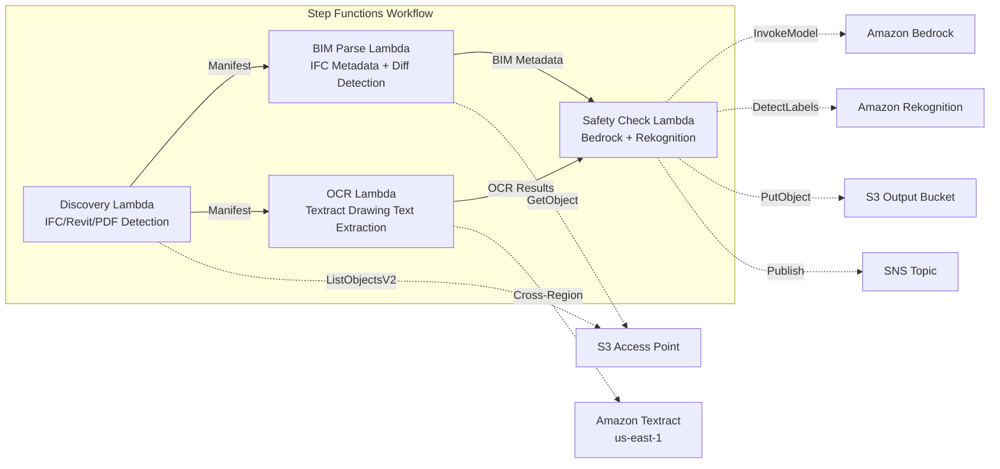

# UC10: Construction / AEC — BIM Model Management, Drawing OCR, Safety Compliance

🌐 **Language / 言語**: [日本語](README.md) | English | [한국어](README.ko.md) | [简体中文](README.zh-CN.md) | [繁體中文](README.zh-TW.md) | [Français](README.fr.md) | [Deutsch](README.de.md) | [Español](README.es.md)

📚 **Documentation**: [Architecture Diagram](docs/architecture.en.md) | [Demo Guide](docs/demo-guide.en.md)

## Overview

This is a serverless workflow that leverages the S3 Access Points of FSx for ONTAP to automate version control of BIM models (IFC/Revit), OCR text extraction from drawing PDFs, and safety compliance checks.

### When this pattern is suitable

- BIM models (IFC/Revit) and drawing PDFs are accumulating on FSx for ONTAP
- You want to automatically catalog IFC file metadata (project name, number of architectural elements, number of floors)
- You want to automatically detect differences between BIM model versions (added, deleted, and modified elements)
- You want to extract text and tables from drawing PDFs with Textract
- Automated checking of safety compliance rules (fire evacuation, structural loads, material standards) is required

### When this pattern is not suitable

- Real-time BIM collaboration (Revit Server / BIM 360 is more appropriate)
- Full structural analysis simulation (FEM software is required)
- Large-scale 3D rendering processing (EC2/GPU instances are more appropriate)
- Environments where network reachability to the ONTAP REST API cannot be ensured

### Main Features

- Automatic detection of IFC/Revit/PDF files via S3 AP
- IFC metadata extraction (project_name, building_elements_count, floor_count, coordinate_system, ifc_schema_version)
- Version-to-version diff detection (element additions, deletions, modifications)
- OCR text and table extraction from drawing PDFs with Textract (cross-region)
- Safety compliance rule checking with Bedrock
- Detection of safety-related visual elements in drawing images (emergency exits, fire extinguishers, hazard areas) with Rekognition

## Success Metrics

### Outcome
Streamline construction project management by automating BIM version control, drawing OCR, and safety compliance checks.

### Metrics
| Metric | Target (example) |
|-----------|------------|
| Drawings processed / run | > 100 files |
| OCR text extraction success rate | > 90% |
| Safety compliance violation detection rate | 100% (known patterns) |
| Processing time / file | < 45 sec |
| Cost / run | < $10 |
| Human Review rate | < 15% (when a safety violation is detected) |

### Measurement Method
Step Functions execution history, Textract confidence score, Bedrock safety report, CloudWatch Metrics.

## Architecture



### Workflow Steps

1. **Discovery**: Detect .ifc, .rvt, .pdf files from S3 AP
2. **BIM Parse**: Extract metadata from IFC files and detect version-to-version differences
3. **OCR**: Extract text and tables from drawing PDFs with Textract (cross-region)
4. **Safety Check**: Check safety compliance rules with Bedrock, detect visual elements with Rekognition

## Prerequisites

- AWS account and appropriate IAM permissions
- FSx for ONTAP file system (ONTAP 9.17.1P4D3 or higher)
- A volume with S3 Access Point enabled (to store BIM models and drawings)
- VPC, private subnets
- Amazon Bedrock model access enabled (Claude / Nova)
- **Cross-region**: Because Textract is not supported in ap-northeast-1, a cross-region call to us-east-1 is required

## Deployment Steps

### 1. Check cross-region parameters

Because Textract is not supported in the Tokyo region, configure the cross-region call with the `CrossRegionTarget` parameter.

### 2. SAM Deployment

```bash
# Prerequisite: AWS SAM CLI required. 'sam build' packages the code and shared layer automatically.
sam build

sam deploy \
  --stack-name fsxn-construction-bim \
  --parameter-overrides \
    S3AccessPointAlias=<your-volume-ext-s3alias> \
    S3AccessPointName=<your-s3ap-name> \
    VpcId=<your-vpc-id> \
    PrivateSubnetIds=<subnet-1>,<subnet-2> \
    ScheduleExpression="rate(1 hour)" \
    NotificationEmail=<your-email@example.com> \
    CrossRegion=us-east-1 \
    EnableVpcEndpoints=false \
    EnableCloudWatchAlarms=false \
  --capabilities CAPABILITY_NAMED_IAM \
  --resolve-s3 \
  --region ap-northeast-1
```

> **Note**: `template.yaml` is used with the SAM CLI (`sam build` + `sam deploy`).
> To deploy directly with the `aws cloudformation deploy` command, use `template-deploy.yaml` instead (requires pre-packaging the Lambda zip files and uploading them to S3).

## List of Configuration Parameters

| Parameter | Description | Default | Required |
|-----------|------|----------|------|
| `S3AccessPointAlias` | FSx for ONTAP S3 AP Alias (for input) | — | ✅ |
| `S3AccessPointName` | S3 AP name (for ARN-based IAM permission grants; only Alias-based when omitted) | `""` | ⚠️ Recommended |
| `ScheduleExpression` | EventBridge Scheduler schedule expression | `rate(1 hour)` | |
| `VpcId` | VPC ID | — | ✅ |
| `PrivateSubnetIds` | List of private subnet IDs | — | ✅ |
| `NotificationEmail` | SNS notification email address | — | ✅ |
| `CrossRegionTarget` | Textract target region | `us-east-1` | |
| `MapConcurrency` | Map state concurrency | `10` | |
| `LambdaMemorySize` | Lambda memory size (MB) | `1024` | |
| `LambdaTimeout` | Lambda timeout (sec) | `300` | |
| `EnableVpcEndpoints` | Enable Interface VPC Endpoints | `false` | |
| `EnableCloudWatchAlarms` | Enable CloudWatch Alarms | `false` | |

## Cleanup

```bash
aws s3 rm s3://fsxn-construction-bim-output-${AWS_ACCOUNT_ID} --recursive

aws cloudformation delete-stack \
  --stack-name fsxn-construction-bim \
  --region ap-northeast-1

aws cloudformation wait stack-delete-complete \
  --stack-name fsxn-construction-bim \
  --region ap-northeast-1
```

## Supported Regions

UC10 uses the following services:

| Service | Region Constraint |
|---------|-------------|
| Amazon Textract | Not supported in ap-northeast-1. Specify a supported region (e.g., us-east-1) via the `TEXTRACT_REGION` parameter |
| Amazon Bedrock | Check supported regions ([Bedrock supported regions](https://docs.aws.amazon.com/general/latest/gr/bedrock.html)) |
| Amazon Rekognition | Available in almost all regions |
| AWS X-Ray | Available in almost all regions |
| CloudWatch EMF | Available in almost all regions |

> The Textract API is called via the Cross-Region Client. Verify your data residency requirements. For details, see the [Region Compatibility Matrix](../docs/region-compatibility.md).

## References

- [FSx for ONTAP S3 Access Points Overview](https://docs.aws.amazon.com/fsx/latest/ONTAPGuide/accessing-data-via-s3-access-points.html)
- [Amazon Textract Documentation](https://docs.aws.amazon.com/textract/latest/dg/what-is.html)
- [IFC Format Specification (buildingSMART)](https://www.buildingsmart.org/standards/bsi-standards/industry-foundation-classes/)
- [Amazon Rekognition Label Detection](https://docs.aws.amazon.com/rekognition/latest/dg/labels.html)

---

## AWS Documentation Links

| Service | Documentation |
|---------|------------|
| FSx for ONTAP | [User Guide](https://docs.aws.amazon.com/fsx/latest/ONTAPGuide/what-is-fsx-ontap.html) |
| S3 Access Points | [S3 AP for FSx for ONTAP](https://docs.aws.amazon.com/fsx/latest/ONTAPGuide/s3-access-points.html) |
| Step Functions | [Developer Guide](https://docs.aws.amazon.com/step-functions/latest/dg/welcome.html) |
| Amazon Textract | [Developer Guide](https://docs.aws.amazon.com/textract/latest/dg/what-is.html) |
| Amazon Rekognition | [Developer Guide](https://docs.aws.amazon.com/rekognition/latest/dg/what-is.html) |
| Amazon Bedrock | [User Guide](https://docs.aws.amazon.com/bedrock/latest/userguide/what-is-bedrock.html) |

### Well-Architected Framework Alignment

| Pillar | Alignment |
|----|------|
| Operational Excellence | X-Ray tracing, EMF metrics, BIM version tracking |
| Security | Least-privilege IAM, KMS encryption, design data access control |
| Reliability | Step Functions Retry/Catch, IFC parse error handling |
| Performance Efficiency | Lambda 1024MB (for IFC parsing), parallel processing |
| Cost Optimization | Serverless, Textract per-page billing |
| Sustainability | On-demand execution, incremental processing |

---

## Cost Estimate (Monthly Approximation)

> **Note**: The following is an approximation for the ap-northeast-1 region; actual costs vary by usage. Check the latest pricing with the [AWS Pricing Calculator](https://calculator.aws/).

### Serverless Components (Pay-per-use)

| Service | Unit Price | Assumed Usage | Monthly Approx. |
|---------|------|-----------|---------|
| Lambda | $0.0000166667/GB-sec | 4 functions × 20 models/day | ~$1-5 |
| S3 API (GetObject/ListObjects) | $0.0047/10K requests | ~10K requests/day | ~$1.5 |
| Step Functions | $0.025/1K state transitions | ~1K transitions/day | ~$0.75 |
| Bedrock (Nova Lite) | $0.00006/1K input tokens | ~30K tokens/run | ~$3-10 |
| Athena | $5/TB scanned | ~5 MB/query | ~$0.5-2 |
| SNS | $0.50/100K notifications | ~100 notifications/day | ~$0.15 |
| CloudWatch Logs | $0.76/GB ingested | ~1 GB/month | ~$0.76 |

### Fixed Cost (FSx for ONTAP — assumes existing environment)

| Component | Monthly |
|--------------|------|
| FSx for ONTAP (128 MBps, 1 TB) | ~$230 (shared with existing environment) |
| S3 Access Point | No additional charge (S3 API charges only) |

### Total Approximation

| Configuration | Monthly Approx. |
|------|---------|
| Minimal (once-daily execution) | ~$5-15 |
| Standard (hourly execution) | ~$15-50 |
| Large-scale (high frequency + alarms) | ~$50-150 |

> **Governance Caveat**: Cost estimates are approximations, not guaranteed values. Actual billing varies by usage pattern, data volume, and region.

---

## Local Testing

### Prerequisites Check

```bash
# Check prerequisites
aws --version          # AWS CLI v2
sam --version          # SAM CLI
python3 --version      # Python 3.9+
docker --version       # Docker (for sam local)
aws sts get-caller-identity  # AWS credentials
```

### sam local invoke

```bash
# Build
# Prerequisite: AWS SAM CLI required. 'sam build' packages the code and shared layer automatically.
sam build

# Run Discovery Lambda locally
sam local invoke DiscoveryFunction --event events/discovery-event.json

# With environment variable overrides
sam local invoke DiscoveryFunction \
  --event events/discovery-event.json \
  --env-vars env.json
```

### Unit Tests

```bash
python3 -m pytest tests/ -v
```

For details, see the [Local Testing Quick Start](../docs/local-testing-quick-start.md).

---

## Output Sample

Example output of the BIM model management pipeline:

```json
{
  "discovery": {
    "status": "completed",
    "object_count": 8,
    "prefix": "bim-models/"
  },
  "ifc_metadata": [
    {
      "key": "bim-models/building-A-rev3.ifc",
      "schema_version": "IFC4",
      "element_count": 4521,
      "building_storeys": 5,
      "last_modified_by": "architect-team"
    }
  ],
  "version_diff": {
    "compared": "rev2 → rev3",
    "added_elements": 45,
    "modified_elements": 12,
    "deleted_elements": 3
  },
  "safety_compliance": {
    "checks_passed": 28,
    "checks_failed": 2,
    "issues": ["fire_exit_width_insufficient", "handrail_height_below_standard"]
  }
}
```

> **Note**: The above is sample output; actual values vary by environment and input data. Benchmark figures are a sizing reference, not a service limit.

---

## Governance Note

> This pattern provides technical architecture guidance. It is not legal, compliance, or regulatory advice. Organizations should consult qualified professionals.

---

## S3AP Compatibility

For compatibility constraints, troubleshooting, and trigger patterns of S3 Access Points for FSx for ONTAP, see the [S3AP Compatibility Notes](../docs/s3ap-compatibility-notes.md).
