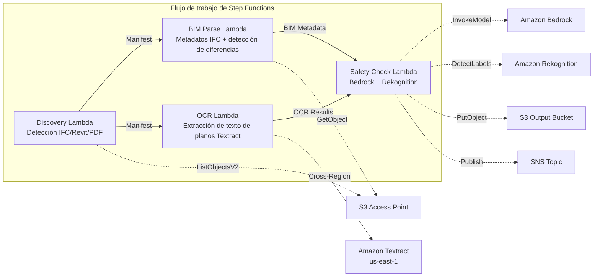

# UC10: Construcción / AEC — Gestión de modelos BIM, OCR de planos y cumplimiento de seguridad

🌐 **Language / 言語**: [日本語](README.md) | [English](README.en.md) | [한국어](README.ko.md) | [简体中文](README.zh-CN.md) | [繁體中文](README.zh-TW.md) | [Français](README.fr.md) | [Deutsch](README.de.md) | Español

📚 **Documentación**: [Diagrama de arquitectura](docs/architecture.md) | [Guía de demostración](docs/demo-guide.md)

## Resumen

Es un flujo de trabajo sin servidor que aprovecha los S3 Access Points de FSx for ONTAP para automatizar la gestión de versiones de modelos BIM (IFC/Revit), la extracción de texto OCR de PDFs de planos y la comprobación de cumplimiento de seguridad.

### Casos en los que este patrón es adecuado

- Los modelos BIM (IFC/Revit) y los PDF de planos se acumulan en FSx for ONTAP
- Desea catalogar automáticamente los metadatos de los archivos IFC (nombre del proyecto, número de elementos arquitectónicos, número de pisos)
- Desea detectar automáticamente las diferencias entre versiones de modelos BIM (adición, eliminación o modificación de elementos)
- Desea extraer texto y tablas de los PDF de planos con Textract
- Se necesita una verificación automática de reglas de cumplimiento de seguridad (evacuación contra incendios, cargas estructurales, estándares de materiales)

### Casos en los que este patrón no es adecuado

- Colaboración BIM en tiempo real (Revit Server / BIM 360 es adecuado)
- Simulación completa de análisis estructural (se necesita software FEM)
- Procesamiento de renderizado 3D a gran escala (las instancias EC2/GPU son adecuadas)
- Entornos donde no se puede garantizar el acceso de red a la API REST de ONTAP

### Características principales

- Detección automática de archivos IFC/Revit/PDF a través de S3 AP
- Extracción de metadatos IFC (project_name, building_elements_count, floor_count, coordinate_system, ifc_schema_version)
- Detección de diferencias entre versiones (element additions, deletions, modifications)
- Extracción de texto y tablas OCR de planos PDF mediante Textract (entre regiones)
- Comprobación de reglas de cumplimiento de seguridad mediante Bedrock
- Detección de elementos visuales relacionados con seguridad en imágenes de planos (salidas de emergencia, extintores, áreas peligrosas) mediante Rekognition

## Success Metrics

### Outcome
Optimizar la gestión de proyectos de construcción mediante la automatización de la gestión de versiones BIM, el OCR de planos y la comprobación de cumplimiento de seguridad.

### Metrics
| Métrica | Valor objetivo (ejemplo) |
|-----------|------------|
| Planos procesados / ejecución | > 100 files |
| Tasa de éxito de extracción de texto OCR | > 90% |
| Tasa de detección de infracciones de cumplimiento de seguridad | 100 % (patrones conocidos) |
| Tiempo de procesamiento / archivo | < 45 s |
| Coste / ejecución | < $10 |
| Tasa sujeta a Human Review | < 15 % (al detectar una infracción de seguridad) |

### Measurement Method
Historial de ejecución de Step Functions, Textract confidence score, informe de seguridad de Bedrock, CloudWatch Metrics.

## Arquitectura



### Pasos del flujo de trabajo

1. **Descubrimiento**: Detección de archivos .ifc, .rvt, .pdf desde S3 AP
2. **Análisis BIM**: Extracción de metadatos de archivos IFC y detección de diferencias entre versiones
3. **OCR**: Extracción de texto y tablas de planos en PDF con Textract (entre regiones)
4. **Revisión de seguridad**: Comprobación de reglas de cumplimiento de seguridad con Bedrock, detección de elementos visuales con Rekognition

## Requisitos previos

- Cuenta de AWS y permisos IAM adecuados
- Sistema de archivos FSx for ONTAP (ONTAP 9.17.1P4D3 o superior)
- Un volumen con S3 Access Point habilitado (para almacenar modelos BIM y planos)
- VPC, subredes privadas
- Acceso a modelos de Amazon Bedrock habilitado (Claude / Nova)
- **Entre regiones**: Debido a que Textract no es compatible con ap-northeast-1, se necesita una llamada entre regiones a us-east-1

## Pasos de implementación

### 1. Verificación de parámetros entre regiones

Debido a que Textract no es compatible con la región de Tokio, configure la llamada entre regiones con el parámetro `CrossRegionTarget`.

### 2. Despliegue de SAM

```bash
# Requisito: se necesita AWS SAM CLI. «sam build» empaqueta automáticamente el código y la capa compartida.
sam build

sam deploy \
  --stack-name fsxn-construction-bim \
  --parameter-overrides \
    S3AccessPointAlias=<your-volume-ext-s3alias> \
    S3AccessPointName=<your-s3ap-name> \
    VpcId=<your-vpc-id> \
    PrivateSubnetIds=<subnet-1>,<subnet-2> \
    ScheduleExpression="rate(1 hour)" \
    NotificationEmail=<your-email@example.com> \
    CrossRegion=us-east-1 \
    EnableVpcEndpoints=false \
    EnableCloudWatchAlarms=false \
  --capabilities CAPABILITY_NAMED_IAM \
  --resolve-s3 \
  --region ap-northeast-1
```

> **Nota**: `template.yaml` se usa con la SAM CLI (`sam build` + `sam deploy`).
> Para desplegar directamente con el comando `aws cloudformation deploy`, use `template-deploy.yaml` en su lugar (requiere empaquetar previamente los archivos zip de Lambda y subirlos a S3).

## Lista de parámetros de configuración

| Parámetro | Descripción | Predeterminado | Obligatorio |
|-----------|------|----------|------|
| `S3AccessPointAlias` | FSx for ONTAP S3 AP Alias (para la entrada) | — | ✅ |
| `S3AccessPointName` | Nombre del S3 AP (para la concesión de permisos IAM basados en ARN; solo basado en Alias si se omite) | `""` | ⚠️ Recomendado |
| `ScheduleExpression` | Expresión de programación de EventBridge Scheduler | `rate(1 hour)` | |
| `VpcId` | VPC ID | — | ✅ |
| `PrivateSubnetIds` | Lista de ID de subredes privadas | — | ✅ |
| `NotificationEmail` | Dirección de correo de notificación de SNS | — | ✅ |
| `CrossRegionTarget` | Región de destino de Textract | `us-east-1` | |
| `MapConcurrency` | Número de ejecuciones paralelas del estado Map | `10` | |
| `LambdaMemorySize` | Tamaño de memoria de Lambda (MB) | `1024` | |
| `LambdaTimeout` | Tiempo de espera de Lambda (s) | `300` | |
| `EnableVpcEndpoints` | Habilitar Interface VPC Endpoints | `false` | |
| `EnableCloudWatchAlarms` | Habilitar CloudWatch Alarms | `false` | |

## Limpieza

```bash
aws s3 rm s3://fsxn-construction-bim-output-${AWS_ACCOUNT_ID} --recursive

aws cloudformation delete-stack \
  --stack-name fsxn-construction-bim \
  --region ap-northeast-1

aws cloudformation wait stack-delete-complete \
  --stack-name fsxn-construction-bim \
  --region ap-northeast-1
```

## Regiones compatibles

UC10 utiliza los siguientes servicios:

| Servicio | Restricción de región |
|---------|-------------|
| Amazon Textract | No compatible con ap-northeast-1. Especifique una región compatible (us-east-1, etc.) mediante el parámetro `TEXTRACT_REGION` |
| Amazon Bedrock | Verifique las regiones compatibles ([Regiones compatibles con Bedrock](https://docs.aws.amazon.com/general/latest/gr/bedrock.html)) |
| Amazon Rekognition | Disponible en casi todas las regiones |
| AWS X-Ray | Disponible en casi todas las regiones |
| CloudWatch EMF | Disponible en casi todas las regiones |

> Llame a la API de Textract a través del Cliente entre Regiones. Verifique los requisitos de residencia de datos. Para más detalles, consulte la [Matriz de compatibilidad de regiones](../docs/region-compatibility.md).

## Enlaces de referencia

- [Descripción general de los S3 Access Points para FSx for ONTAP](https://docs.aws.amazon.com/fsx/latest/ONTAPGuide/accessing-data-via-s3-access-points.html)
- [Documentación de Amazon Textract](https://docs.aws.amazon.com/textract/latest/dg/what-is.html)
- [Especificaciones del formato IFC (buildingSMART)](https://www.buildingsmart.org/standards/bsi-standards/industry-foundation-classes/)
- [Detección de etiquetas de Amazon Rekognition](https://docs.aws.amazon.com/rekognition/latest/dg/labels.html)

---

## Enlaces a la documentación de AWS

| Servicio | Documentación |
|---------|------------|
| FSx for ONTAP | [Guía del usuario](https://docs.aws.amazon.com/fsx/latest/ONTAPGuide/what-is-fsx-ontap.html) |
| S3 Access Points | [S3 AP for FSx for ONTAP](https://docs.aws.amazon.com/fsx/latest/ONTAPGuide/s3-access-points.html) |
| Step Functions | [Guía del desarrollador](https://docs.aws.amazon.com/step-functions/latest/dg/welcome.html) |
| Amazon Textract | [Guía del desarrollador](https://docs.aws.amazon.com/textract/latest/dg/what-is.html) |
| Amazon Rekognition | [Guía del desarrollador](https://docs.aws.amazon.com/rekognition/latest/dg/what-is.html) |
| Amazon Bedrock | [Guía del usuario](https://docs.aws.amazon.com/bedrock/latest/userguide/what-is-bedrock.html) |

### Alineación con el Well-Architected Framework

| Pilar | Alineación |
|----|------|
| Excelencia operativa | Rastreo X-Ray, métricas EMF, seguimiento de versiones BIM |
| Seguridad | IAM de privilegios mínimos, cifrado KMS, control de acceso a datos de diseño |
| Fiabilidad | Step Functions Retry/Catch, manejo de errores de análisis IFC |
| Eficiencia del rendimiento | Lambda 1024MB (para análisis IFC), procesamiento paralelo |
| Optimización de costes | Sin servidor, facturación de Textract por página |
| Sostenibilidad | Ejecución bajo demanda, procesamiento diferencial |

---

## Estimación de costes (aproximación mensual)

> **Nota**: Lo siguiente es una aproximación para la región ap-northeast-1; los costes reales varían según el uso. Consulte los precios más recientes con la [AWS Pricing Calculator](https://calculator.aws/).

### Componentes sin servidor (facturación por uso)

| Servicio | Precio unitario | Uso estimado | Aprox. mensual |
|---------|------|-----------|---------|
| Lambda | $0.0000166667/GB-sec | 4 funciones × 20 models/día | ~$1-5 |
| S3 API (GetObject/ListObjects) | $0.0047/10K requests | ~10K requests/día | ~$1.5 |
| Step Functions | $0.025/1K state transitions | ~1K transitions/día | ~$0.75 |
| Bedrock (Nova Lite) | $0.00006/1K input tokens | ~30K tokens/ejecución | ~$3-10 |
| Athena | $5/TB scanned | ~5 MB/consulta | ~$0.5-2 |
| SNS | $0.50/100K notifications | ~100 notifications/día | ~$0.15 |
| CloudWatch Logs | $0.76/GB ingested | ~1 GB/mes | ~$0.76 |

### Coste fijo (FSx for ONTAP — se asume entorno existente)

| Componente | Mensual |
|--------------|------|
| FSx for ONTAP (128 MBps, 1 TB) | ~$230 (compartido con el entorno existente) |
| S3 Access Point | Sin cargo adicional (solo cargos de S3 API) |

### Aproximación total

| Configuración | Aprox. mensual |
|------|---------|
| Configuración mínima (ejecución diaria) | ~$5-15 |
| Configuración estándar (ejecución horaria) | ~$15-50 |
| Configuración a gran escala (alta frecuencia + alarmas) | ~$50-150 |

> **Governance Caveat**: Las estimaciones de costes son aproximaciones, no valores garantizados. La facturación real varía según el patrón de uso, el volumen de datos y la región.

---

## Pruebas locales

### Comprobación de requisitos previos

```bash
# Comprobar requisitos previos
aws --version          # AWS CLI v2
sam --version          # SAM CLI
python3 --version      # Python 3.9+
docker --version       # Docker (para sam local)
aws sts get-caller-identity  # Credenciales de AWS
```

### sam local invoke

```bash
# Build
# Requisito: se necesita AWS SAM CLI. «sam build» empaqueta automáticamente el código y la capa compartida.
sam build

# Ejecutar Discovery Lambda localmente
sam local invoke DiscoveryFunction --event events/discovery-event.json

# Con anulación de variables de entorno
sam local invoke DiscoveryFunction \
  --event events/discovery-event.json \
  --env-vars env.json
```

### Pruebas unitarias

```bash
python3 -m pytest tests/ -v
```

Para más detalles, consulte el [Inicio rápido de pruebas locales](../docs/local-testing-quick-start.md).

---

## Muestra de salida (Output Sample)

Ejemplo de salida del pipeline de gestión de modelos BIM:

```json
{
  "discovery": {
    "status": "completed",
    "object_count": 8,
    "prefix": "bim-models/"
  },
  "ifc_metadata": [
    {
      "key": "bim-models/building-A-rev3.ifc",
      "schema_version": "IFC4",
      "element_count": 4521,
      "building_storeys": 5,
      "last_modified_by": "architect-team"
    }
  ],
  "version_diff": {
    "compared": "rev2 → rev3",
    "added_elements": 45,
    "modified_elements": 12,
    "deleted_elements": 3
  },
  "safety_compliance": {
    "checks_passed": 28,
    "checks_failed": 2,
    "issues": ["fire_exit_width_insufficient", "handrail_height_below_standard"]
  }
}
```

> **Nota**: Lo anterior es una salida de muestra; los valores reales varían según el entorno y los datos de entrada. Las cifras de referencia son una referencia de dimensionamiento, no un límite de servicio.

---

## Governance Note

> Este patrón proporciona orientación de arquitectura técnica. No constituye asesoramiento legal, de cumplimiento ni regulatorio. Las organizaciones deben consultar a profesionales cualificados.

---

## S3AP Compatibility

Para conocer las restricciones de compatibilidad, la resolución de problemas y los patrones de activación de los S3 Access Points para FSx for ONTAP, consulte las [S3AP Compatibility Notes](../docs/s3ap-compatibility-notes.md).
