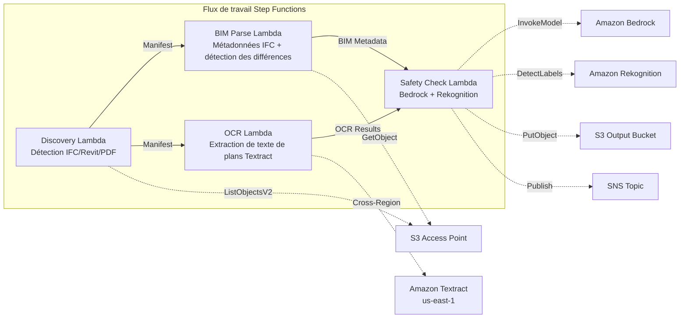

# UC10 : Construction / AEC — Gestion des modèles BIM, OCR des plans et conformité sécurité

🌐 **Language / 言語**: [日本語](README.md) | [English](README.en.md) | [한국어](README.ko.md) | [简体中文](README.zh-CN.md) | [繁體中文](README.zh-TW.md) | Français | [Deutsch](README.de.md) | [Español](README.es.md)

📚 **Documentation** : [Schéma d'architecture](docs/architecture.md) | [Guide de démonstration](docs/demo-guide.md)

## Aperçu

Il s'agit d'un flux de travail sans serveur qui exploite les S3 Access Points de FSx for ONTAP pour automatiser la gestion des versions des modèles BIM (IFC/Revit), l'extraction de texte OCR des PDF de plans et la vérification de conformité sécurité.

### Cas où ce modèle est approprié

- Les modèles BIM (IFC/Revit) et les PDF de plans s'accumulent sur FSx for ONTAP
- Vous souhaitez cataloguer automatiquement les métadonnées des fichiers IFC (nom du projet, nombre d'éléments architecturaux, nombre d'étages)
- Vous souhaitez détecter automatiquement les différences entre les versions des modèles BIM (ajout, suppression ou modification d'éléments)
- Vous souhaitez extraire le texte et les tableaux des PDF de plans à l'aide de Textract
- Un contrôle automatique des règles de conformité sécurité (évacuation en cas d'incendie, charges structurelles, normes de matériaux) est nécessaire

### Cas où ce modèle ne convient pas

- Collaboration BIM en temps réel (Revit Server / BIM 360 est approprié)
- Simulation complète d'analyse structurelle (logiciel FEM requis)
- Traitement de rendu 3D à grande échelle (des instances EC2/GPU sont appropriées)
- Environnements ne pouvant pas assurer la connectivité réseau vers l'API REST ONTAP

### Principales fonctionnalités

- Détection automatique des fichiers IFC/Revit/PDF via S3 AP
- Extraction des métadonnées IFC (project_name, building_elements_count, floor_count, coordinate_system, ifc_schema_version)
- Détection des différences entre versions (ajouts, suppressions, modifications d'éléments)
- Extraction de texte et de tableaux OCR des plans PDF avec Textract (inter-régions)
- Vérification des règles de conformité sécurité avec Bedrock
- Détection des éléments visuels liés à la sécurité sur les images de plans (sorties de secours, extincteurs, zones de danger) avec Rekognition

## Success Metrics

### Outcome
Optimiser la gestion des projets de construction en automatisant la gestion des versions BIM, l'OCR des plans et la vérification de conformité sécurité.

### Metrics
| Métrique | Valeur cible (exemple) |
|-----------|------------|
| Plans traités / exécution | > 100 files |
| Taux de réussite d'extraction de texte OCR | > 90% |
| Taux de détection des violations de conformité sécurité | 100 % (schémas connus) |
| Temps de traitement / fichier | < 45 sec |
| Coût / exécution | < $10 |
| Taux soumis à Human Review | < 15 % (en cas de détection de violation de sécurité) |

### Measurement Method
Historique d'exécution Step Functions, Textract confidence score, rapport de sécurité Bedrock, CloudWatch Metrics.

## Architecture



### Étapes du workflow

1. **Découverte** : Détection des fichiers .ifc, .rvt, .pdf depuis S3 AP
2. **Analyse BIM** : Extraction des métadonnées des fichiers IFC et détection des différences entre versions
3. **OCR** : Extraction de texte et de tableaux à partir de PDF de plans avec Textract (inter-régions)
4. **Vérification de sécurité** : Vérification des règles de conformité sécurité avec Bedrock, détection des éléments visuels avec Rekognition

## Prérequis

- Compte AWS et permissions IAM appropriées
- Système de fichiers FSx for ONTAP (ONTAP 9.17.1P4D3 ou supérieur)
- Un volume avec S3 Access Point activé (pour stocker les modèles BIM et les plans)
- VPC, sous-réseaux privés
- Accès au modèle Amazon Bedrock activé (Claude / Nova)
- **Inter-régions** : Textract n'étant pas pris en charge dans ap-northeast-1, un appel inter-régions vers us-east-1 est nécessaire

## Étapes de déploiement

### 1. Vérification des paramètres inter-régions

Textract n'étant pas pris en charge dans la région de Tokyo, configurez l'appel inter-régions avec le paramètre `CrossRegionTarget`.

### 2. Déploiement SAM

```bash
# Prérequis : AWS SAM CLI requis. « sam build » empaquette automatiquement le code et la couche partagée.
sam build

sam deploy \
  --stack-name fsxn-construction-bim \
  --parameter-overrides \
    S3AccessPointAlias=<your-volume-ext-s3alias> \
    S3AccessPointName=<your-s3ap-name> \
    VpcId=<your-vpc-id> \
    PrivateSubnetIds=<subnet-1>,<subnet-2> \
    ScheduleExpression="rate(1 hour)" \
    NotificationEmail=<your-email@example.com> \
    CrossRegion=us-east-1 \
    EnableVpcEndpoints=false \
    EnableCloudWatchAlarms=false \
  --capabilities CAPABILITY_NAMED_IAM \
  --resolve-s3 \
  --region ap-northeast-1
```

> **Remarque** : `template.yaml` s'utilise avec AWS SAM CLI (`sam build` + `sam deploy`).
> Pour un déploiement direct avec la commande `aws cloudformation deploy`, utilisez plutôt `template-deploy.yaml` (nécessite de packager au préalable les fichiers zip Lambda et de les téléverser dans un bucket S3).

## Liste des paramètres de configuration

| Paramètre | Description | Par défaut | Requis |
|-----------|------|----------|------|
| `S3AccessPointAlias` | FSx for ONTAP S3 AP Alias (pour l'entrée) | — | ✅ |
| `S3AccessPointName` | Nom du S3 AP (pour l'octroi de permissions IAM basées sur l'ARN ; basé uniquement sur l'Alias si omis) | `""` | ⚠️ Recommandé |
| `ScheduleExpression` | Expression de planification EventBridge Scheduler | `rate(1 hour)` | |
| `VpcId` | VPC ID | — | ✅ |
| `PrivateSubnetIds` | Liste des ID de sous-réseaux privés | — | ✅ |
| `NotificationEmail` | Adresse e-mail de notification SNS | — | ✅ |
| `CrossRegionTarget` | Région cible de Textract | `us-east-1` | |
| `MapConcurrency` | Nombre d'exécutions parallèles de l'état Map | `10` | |
| `LambdaMemorySize` | Taille de mémoire Lambda (MB) | `1024` | |
| `LambdaTimeout` | Délai d'expiration Lambda (sec) | `300` | |
| `EnableVpcEndpoints` | Activer les Interface VPC Endpoints | `false` | |
| `EnableCloudWatchAlarms` | Activer les CloudWatch Alarms | `false` | |

## Nettoyage

```bash
aws s3 rm s3://fsxn-construction-bim-output-${AWS_ACCOUNT_ID} --recursive

aws cloudformation delete-stack \
  --stack-name fsxn-construction-bim \
  --region ap-northeast-1

aws cloudformation wait stack-delete-complete \
  --stack-name fsxn-construction-bim \
  --region ap-northeast-1
```

## Régions prises en charge

UC10 utilise les services suivants :

| Service | Contrainte de région |
|---------|-------------|
| Amazon Textract | Non pris en charge dans ap-northeast-1. Spécifiez une région prise en charge (us-east-1, etc.) via le paramètre `TEXTRACT_REGION` |
| Amazon Bedrock | Vérifiez les régions prises en charge ([Régions prises en charge par Bedrock](https://docs.aws.amazon.com/general/latest/gr/bedrock.html)) |
| Amazon Rekognition | Disponible dans presque toutes les régions |
| AWS X-Ray | Disponible dans presque toutes les régions |
| CloudWatch EMF | Disponible dans presque toutes les régions |

> Appelez l'API Textract via le client inter-régions. Vérifiez les exigences de résidence des données. Pour plus de détails, consultez la [matrice de compatibilité des régions](../docs/region-compatibility.md).

## Liens de référence

- [Vue d'ensemble des S3 Access Points pour FSx for ONTAP](https://docs.aws.amazon.com/fsx/latest/ONTAPGuide/accessing-data-via-s3-access-points.html)
- [Documentation Amazon Textract](https://docs.aws.amazon.com/textract/latest/dg/what-is.html)
- [Spécifications du format IFC (buildingSMART)](https://www.buildingsmart.org/standards/bsi-standards/industry-foundation-classes/)
- [Détection de labels Amazon Rekognition](https://docs.aws.amazon.com/rekognition/latest/dg/labels.html)

---

## Liens vers la documentation AWS

| Service | Documentation |
|---------|------------|
| FSx for ONTAP | [Guide de l'utilisateur](https://docs.aws.amazon.com/fsx/latest/ONTAPGuide/what-is-fsx-ontap.html) |
| S3 Access Points | [S3 AP for FSx for ONTAP](https://docs.aws.amazon.com/fsx/latest/ONTAPGuide/s3-access-points.html) |
| Step Functions | [Guide du développeur](https://docs.aws.amazon.com/step-functions/latest/dg/welcome.html) |
| Amazon Textract | [Guide du développeur](https://docs.aws.amazon.com/textract/latest/dg/what-is.html) |
| Amazon Rekognition | [Guide du développeur](https://docs.aws.amazon.com/rekognition/latest/dg/what-is.html) |
| Amazon Bedrock | [Guide de l'utilisateur](https://docs.aws.amazon.com/bedrock/latest/userguide/what-is-bedrock.html) |

### Alignement sur le Well-Architected Framework

| Pilier | Alignement |
|----|------|
| Excellence opérationnelle | Traçage X-Ray, métriques EMF, suivi des versions BIM |
| Sécurité | IAM à moindre privilège, chiffrement KMS, contrôle d'accès aux données de conception |
| Fiabilité | Step Functions Retry/Catch, gestion des erreurs d'analyse IFC |
| Efficacité des performances | Lambda 1024MB (pour l'analyse IFC), traitement parallèle |
| Optimisation des coûts | Sans serveur, facturation Textract à la page |
| Durabilité | Exécution à la demande, traitement différentiel |

---

## Estimation des coûts (approximation mensuelle)

> **Note** : Ce qui suit est une approximation pour la région ap-northeast-1 ; les coûts réels varient selon l'utilisation. Vérifiez les tarifs les plus récents avec l'[AWS Pricing Calculator](https://calculator.aws/).

### Composants sans serveur (facturation à l'usage)

| Service | Prix unitaire | Utilisation estimée | Approx. mensuelle |
|---------|------|-----------|---------|
| Lambda | $0.0000166667/GB-sec | 4 fonctions × 20 models/jour | ~$1-5 |
| S3 API (GetObject/ListObjects) | $0.0047/10K requests | ~10K requests/jour | ~$1.5 |
| Step Functions | $0.025/1K state transitions | ~1K transitions/jour | ~$0.75 |
| Bedrock (Nova Lite) | $0.00006/1K input tokens | ~30K tokens/exécution | ~$3-10 |
| Athena | $5/TB scanned | ~5 MB/requête | ~$0.5-2 |
| SNS | $0.50/100K notifications | ~100 notifications/jour | ~$0.15 |
| CloudWatch Logs | $0.76/GB ingested | ~1 GB/mois | ~$0.76 |

### Coût fixe (FSx for ONTAP — environnement existant supposé)

| Composant | Mensuel |
|--------------|------|
| FSx for ONTAP (128 MBps, 1 TB) | ~$230 (partagé avec l'environnement existant) |
| S3 Access Point | Pas de frais supplémentaires (frais S3 API uniquement) |

### Approximation totale

| Configuration | Approx. mensuelle |
|------|---------|
| Configuration minimale (exécution quotidienne) | ~$5-15 |
| Configuration standard (exécution horaire) | ~$15-50 |
| Configuration à grande échelle (haute fréquence + alarmes) | ~$50-150 |

> **Governance Caveat** : Les estimations de coûts sont des approximations, non des valeurs garanties. La facturation réelle varie selon le schéma d'utilisation, le volume de données et la région.

---

## Tests locaux

### Vérification des prérequis

```bash
# Vérifier les prérequis
aws --version          # AWS CLI v2
sam --version          # SAM CLI
python3 --version      # Python 3.9+
docker --version       # Docker (pour sam local)
aws sts get-caller-identity  # Identifiants AWS
```

### sam local invoke

```bash
# Build
# Prérequis : AWS SAM CLI requis. « sam build » empaquette automatiquement le code et la couche partagée.
sam build

# Exécuter le Discovery Lambda localement
sam local invoke DiscoveryFunction --event events/discovery-event.json

# Avec remplacement de variables d'environnement
sam local invoke DiscoveryFunction \
  --event events/discovery-event.json \
  --env-vars env.json
```

### Tests unitaires

```bash
python3 -m pytest tests/ -v
```

Pour plus de détails, consultez le [Démarrage rapide des tests locaux](../docs/local-testing-quick-start.md).

---

## Exemple de sortie (Output Sample)

Exemple de sortie du pipeline de gestion des modèles BIM :

```json
{
  "discovery": {
    "status": "completed",
    "object_count": 8,
    "prefix": "bim-models/"
  },
  "ifc_metadata": [
    {
      "key": "bim-models/building-A-rev3.ifc",
      "schema_version": "IFC4",
      "element_count": 4521,
      "building_storeys": 5,
      "last_modified_by": "architect-team"
    }
  ],
  "version_diff": {
    "compared": "rev2 → rev3",
    "added_elements": 45,
    "modified_elements": 12,
    "deleted_elements": 3
  },
  "safety_compliance": {
    "checks_passed": 28,
    "checks_failed": 2,
    "issues": ["fire_exit_width_insufficient", "handrail_height_below_standard"]
  }
}
```

> **Note** : Ce qui précède est un exemple de sortie ; les valeurs réelles varient selon l'environnement et les données d'entrée. Les chiffres de référence sont un repère de dimensionnement, non une limite de service.

---

## Governance Note

> Ce modèle fournit des conseils d'architecture technique. Il ne constitue pas un conseil juridique, de conformité ou réglementaire. Les organisations doivent consulter des professionnels qualifiés.

---

## S3AP Compatibility

Pour les contraintes de compatibilité, le dépannage et les schémas de déclenchement des S3 Access Points pour FSx for ONTAP, consultez les [S3AP Compatibility Notes](../docs/s3ap-compatibility-notes.md).
