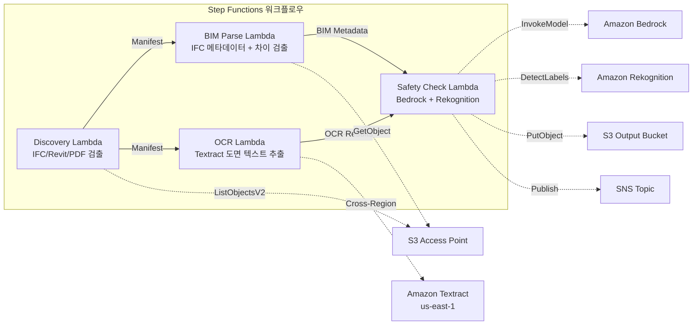

# UC10: 건설 / AEC — BIM 모델 관리·도면 OCR·안전 컴플라이언스

🌐 **Language / 言語**: [日本語](README.md) | [English](README.en.md) | 한국어 | [简体中文](README.zh-CN.md) | [繁體中文](README.zh-TW.md) | [Français](README.fr.md) | [Deutsch](README.de.md) | [Español](README.es.md)

📚 **문서**: [아키텍처 다이어그램](docs/architecture.md) | [데모 가이드](docs/demo-guide.md)

## 개요

FSx for ONTAP의 S3 Access Points를 활용하여 BIM 모델(IFC/Revit)의 버전 관리, 도면 PDF의 OCR 텍스트 추출, 안전 컴플라이언스 체크를 자동화하는 서버리스 워크플로우입니다.

### 이 패턴이 적합한 경우

- BIM 모델(IFC/Revit)과 도면 PDF가 FSx for ONTAP에 축적되어 있습니다
- IFC 파일의 메타데이터(프로젝트 이름, 건축 요소 수, 층 수)를 자동으로 카탈로그화하고 싶습니다
- BIM 모델 버전 간 차이(요소 추가·삭제·변경)를 자동으로 감지하고 싶습니다
- 도면 PDF에서 Textract를 사용하여 텍스트와 테이블을 추출하고 싶습니다
- 안전 규정 준수 규칙(화재 탈출, 구조 하중, 자재 기준)의 자동 검사가 필요합니다

### 이 패턴이 적합하지 않은 경우

- 실시간 BIM 협업(Revit Server / BIM 360이 적합)
- 완전한 구조 해석 시뮬레이션(FEM 소프트웨어 필요)
- 대규모 3D 렌더링 처리(EC2/GPU 인스턴스가 적합)
- ONTAP REST API에 대한 네트워크 도달성을 확보할 수 없는 환경

### 주요 기능

- S3 AP를 통한 IFC/Revit/PDF 파일 자동 검출
- IFC 메타데이터 추출(project_name, building_elements_count, floor_count, coordinate_system, ifc_schema_version)
- 버전 간 차이 검출(element additions, deletions, modifications)
- Textract(크로스 리전)를 통한 도면 PDF의 OCR 텍스트·테이블 추출
- Bedrock을 통한 안전 규정 준수 규칙 체크
- Rekognition을 통한 도면 이미지의 안전 관련 시각 요소 검출(비상구, 소화기, 위험 구역)

## Success Metrics

### Outcome
BIM 버전 관리·도면 OCR·안전 컴플라이언스 체크의 자동화를 통해 건설 프로젝트 관리를 효율화합니다.

### Metrics
| 메트릭 | 목표값(예) |
|-----------|------------|
| 처리된 도면 수 / 실행 | > 100 files |
| OCR 텍스트 추출 성공률 | > 90% |
| 안전 컴플라이언스 위반 검출률 | 100%(알려진 패턴) |
| 처리 시간 / 파일 | < 45 초 |
| 비용 / 실행 | < $10 |
| Human Review 대상률 | < 15%(안전 위반 검출 시) |

### Measurement Method
Step Functions 실행 이력, Textract confidence score, Bedrock 안전 리포트, CloudWatch Metrics.

## 아키텍처



### 워크플로우 단계

1. **Discovery**: S3 AP에서 .ifc, .rvt, .pdf 파일 검출
2. **BIM Parse**: IFC 파일의 메타데이터 추출 및 버전 간 차이 검출
3. **OCR**: Textract(크로스 리전)로 도면 PDF에서 텍스트·테이블 추출
4. **Safety Check**: Bedrock에서 안전 규정 준수 규칙 검사, Rekognition으로 시각 요소 검출

## 전제 조건

- AWS 계정과 적절한 IAM 권한
- FSx for ONTAP 파일 시스템(ONTAP 9.17.1P4D3 이상)
- S3 Access Point가 활성화된 볼륨(BIM 모델·도면 저장)
- VPC, 프라이빗 서브넷
- Amazon Bedrock 모델 액세스 활성화(Claude / Nova)
- **크로스 리전**: Textract는 ap-northeast-1을 지원하지 않으므로 us-east-1로의 크로스 리전 호출 필요

## 배포 절차

### 1. 크로스 리전 파라미터 확인

Textract는 도쿄 리전을 지원하지 않으므로, `CrossRegionTarget` 파라미터로 크로스 리전 호출을 설정합니다.

### 2. SAM 배포

```bash
# 사전 요구사항: AWS SAM CLI가 필요합니다. 'sam build'가 코드와 공유 레이어를 자동으로 패키징합니다.
sam build

sam deploy \
  --stack-name fsxn-construction-bim \
  --parameter-overrides \
    S3AccessPointAlias=<your-volume-ext-s3alias> \
    S3AccessPointName=<your-s3ap-name> \
    VpcId=<your-vpc-id> \
    PrivateSubnetIds=<subnet-1>,<subnet-2> \
    ScheduleExpression="rate(1 hour)" \
    NotificationEmail=<your-email@example.com> \
    CrossRegion=us-east-1 \
    EnableVpcEndpoints=false \
    EnableCloudWatchAlarms=false \
  --capabilities CAPABILITY_NAMED_IAM \
  --resolve-s3 \
  --region ap-northeast-1
```

> **참고**: `template.yaml`은 SAM CLI(`sam build` + `sam deploy`)로 사용합니다.
> `aws cloudformation deploy` 명령으로 직접 배포하려면 `template-deploy.yaml`을 사용하세요(Lambda zip 파일의 사전 패키징 및 S3 업로드가 필요합니다).

## 설정 매개변수 목록

| 매개변수 | 설명 | 기본값 | 필수 |
|-----------|------|----------|------|
| `S3AccessPointAlias` | FSx for ONTAP S3 AP Alias(입력용) | — | ✅ |
| `S3AccessPointName` | S3 AP 이름(ARN 기반 IAM 권한 부여용. 생략 시 Alias 기반만) | `""` | ⚠️ 권장 |
| `ScheduleExpression` | EventBridge Scheduler의 스케줄 표현식 | `rate(1 hour)` | |
| `VpcId` | VPC ID | — | ✅ |
| `PrivateSubnetIds` | 프라이빗 서브넷 ID 목록 | — | ✅ |
| `NotificationEmail` | SNS 알림 수신 이메일 주소 | — | ✅ |
| `CrossRegionTarget` | Textract의 대상 리전 | `us-east-1` | |
| `MapConcurrency` | Map 상태의 병렬 실행 수 | `10` | |
| `LambdaMemorySize` | Lambda 메모리 크기 (MB) | `1024` | |
| `LambdaTimeout` | Lambda 타임아웃 (초) | `300` | |
| `EnableVpcEndpoints` | Interface VPC Endpoints 활성화 | `false` | |
| `EnableCloudWatchAlarms` | CloudWatch Alarms 활성화 | `false` | |

## 정리

```bash
aws s3 rm s3://fsxn-construction-bim-output-${AWS_ACCOUNT_ID} --recursive

aws cloudformation delete-stack \
  --stack-name fsxn-construction-bim \
  --region ap-northeast-1

aws cloudformation wait stack-delete-complete \
  --stack-name fsxn-construction-bim \
  --region ap-northeast-1
```

## 지원되는 리전

UC10은 다음 서비스를 사용합니다:

| 서비스 | 리전 제약 |
|---------|-------------|
| Amazon Textract | ap-northeast-1 미지원. `TEXTRACT_REGION` 파라미터로 지원 리전(us-east-1 등)을 지정 |
| Amazon Bedrock | 지원 리전 확인([Bedrock 지원 리전](https://docs.aws.amazon.com/general/latest/gr/bedrock.html)) |
| Amazon Rekognition | 거의 모든 리전에서 이용 가능 |
| AWS X-Ray | 거의 모든 리전에서 이용 가능 |
| CloudWatch EMF | 거의 모든 리전에서 이용 가능 |

> Cross-Region Client을 통해 Textract API를 호출합니다. 데이터 레지던시 요건을 확인하세요. 자세한 내용은 [리전 호환성 매트릭스](../docs/region-compatibility.md)를 참조하세요.

## 참조 링크

- [FSx for ONTAP S3 Access Points 개요](https://docs.aws.amazon.com/fsx/latest/ONTAPGuide/accessing-data-via-s3-access-points.html)
- [Amazon Textract 문서](https://docs.aws.amazon.com/textract/latest/dg/what-is.html)
- [IFC 형식 사양 (buildingSMART)](https://www.buildingsmart.org/standards/bsi-standards/industry-foundation-classes/)
- [Amazon Rekognition 레이블 감지](https://docs.aws.amazon.com/rekognition/latest/dg/labels.html)

---

## AWS 문서 링크

| 서비스 | 문서 |
|---------|------------|
| FSx for ONTAP | [사용자 가이드](https://docs.aws.amazon.com/fsx/latest/ONTAPGuide/what-is-fsx-ontap.html) |
| S3 Access Points | [S3 AP for FSx for ONTAP](https://docs.aws.amazon.com/fsx/latest/ONTAPGuide/s3-access-points.html) |
| Step Functions | [개발자 가이드](https://docs.aws.amazon.com/step-functions/latest/dg/welcome.html) |
| Amazon Textract | [개발자 가이드](https://docs.aws.amazon.com/textract/latest/dg/what-is.html) |
| Amazon Rekognition | [개발자 가이드](https://docs.aws.amazon.com/rekognition/latest/dg/what-is.html) |
| Amazon Bedrock | [사용자 가이드](https://docs.aws.amazon.com/bedrock/latest/userguide/what-is-bedrock.html) |

### Well-Architected Framework 대응

| 기둥 | 대응 |
|----|------|
| 운영 우수성 | X-Ray 트레이싱, EMF 메트릭, BIM 버전 추적 |
| 보안 | 최소 권한 IAM, KMS 암호화, 설계 데이터 액세스 제어 |
| 신뢰성 | Step Functions Retry/Catch, IFC 파싱 오류 처리 |
| 성능 효율성 | Lambda 1024MB(IFC 파싱용), 병렬 처리 |
| 비용 최적화 | 서버리스, Textract 페이지 단위 과금 |
| 지속 가능성 | 온디맨드 실행, 차등 처리 |

---

## 비용 견적(월간 개산)

> **주기**: 아래는 ap-northeast-1 리전의 개산이며, 실제 비용은 사용량에 따라 다릅니다. 최신 요금은 [AWS Pricing Calculator](https://calculator.aws/)에서 확인하세요.

### 서버리스 컴포넌트(종량 과금)

| 서비스 | 단가 | 예상 사용량 | 월간 개산 |
|---------|------|-----------|---------|
| Lambda | $0.0000166667/GB-sec | 4 함수 × 20 models/일 | ~$1-5 |
| S3 API (GetObject/ListObjects) | $0.0047/10K requests | ~10K requests/일 | ~$1.5 |
| Step Functions | $0.025/1K state transitions | ~1K transitions/일 | ~$0.75 |
| Bedrock (Nova Lite) | $0.00006/1K input tokens | ~30K tokens/실행 | ~$3-10 |
| Athena | $5/TB scanned | ~5 MB/쿼리 | ~$0.5-2 |
| SNS | $0.50/100K notifications | ~100 notifications/일 | ~$0.15 |
| CloudWatch Logs | $0.76/GB ingested | ~1 GB/월 | ~$0.76 |

### 고정 비용(FSx for ONTAP — 기존 환경 전제)

| 컴포넌트 | 월간 |
|--------------|------|
| FSx for ONTAP (128 MBps, 1 TB) | ~$230 (기존 환경 공유) |
| S3 Access Point | 추가 요금 없음(S3 API 요금만) |

### 합계 개산

| 구성 | 월간 개산 |
|------|---------|
| 최소 구성(일 1회 실행) | ~$5-15 |
| 표준 구성(시간 단위 실행) | ~$15-50 |
| 대규모 구성(고빈도 + 알람) | ~$50-150 |

> **Governance Caveat**: 비용 견적은 개산이며 보증값이 아닙니다. 실제 청구액은 사용 패턴, 데이터 양, 리전에 따라 다릅니다.

---

## 로컬 테스트

### Prerequisites 체크

```bash
# 전제 조건 확인
aws --version          # AWS CLI v2
sam --version          # SAM CLI
python3 --version      # Python 3.9+
docker --version       # Docker (sam local 용)
aws sts get-caller-identity  # AWS 자격 증명
```

### sam local invoke

```bash
# 빌드
# 사전 요구사항: AWS SAM CLI가 필요합니다. 'sam build'가 코드와 공유 레이어를 자동으로 패키징합니다.
sam build

# Discovery Lambda 로컬 실행
sam local invoke DiscoveryFunction --event events/discovery-event.json

# 환경 변수 오버라이드 포함
sam local invoke DiscoveryFunction \
  --event events/discovery-event.json \
  --env-vars env.json
```

### 유닛 테스트

```bash
python3 -m pytest tests/ -v
```

자세한 내용은 [로컬 테스트 퀵 스타트](../docs/local-testing-quick-start.md)를 참조하세요.

---

## 출력 샘플 (Output Sample)

BIM 모델 관리 파이프라인의 출력 예:

```json
{
  "discovery": {
    "status": "completed",
    "object_count": 8,
    "prefix": "bim-models/"
  },
  "ifc_metadata": [
    {
      "key": "bim-models/building-A-rev3.ifc",
      "schema_version": "IFC4",
      "element_count": 4521,
      "building_storeys": 5,
      "last_modified_by": "architect-team"
    }
  ],
  "version_diff": {
    "compared": "rev2 → rev3",
    "added_elements": 45,
    "modified_elements": 12,
    "deleted_elements": 3
  },
  "safety_compliance": {
    "checks_passed": 28,
    "checks_failed": 2,
    "issues": ["fire_exit_width_insufficient", "handrail_height_below_standard"]
  }
}
```

> **주기**: 위는 샘플 출력이며, 실제 값은 환경·입력 데이터에 따라 다릅니다. 벤치마크 수치는 sizing reference이며 service limit이 아닙니다.

---

## Governance Note

> 본 패턴은 기술 아키텍처 가이던스를 제공합니다. 법적·컴플라이언스·규제상의 조언이 아닙니다. 조직은 자격을 갖춘 전문가와 상담하세요.

---

## S3AP Compatibility

S3 Access Points for FSx for ONTAP의 호환성 제약, 트러블슈팅, 트리거 패턴에 대해서는 [S3AP Compatibility Notes](../docs/s3ap-compatibility-notes.md)를 참조하세요.
