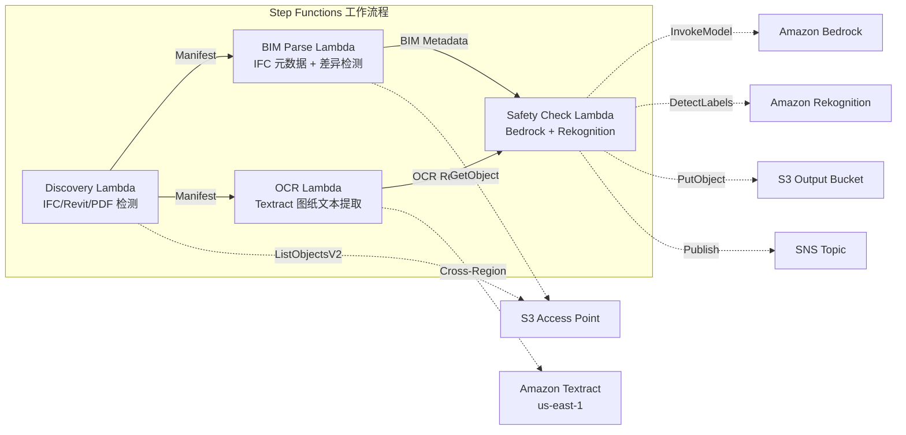

# UC10: 建筑 / AEC — BIM 模型管理、图纸 OCR、安全合规

🌐 **Language / 言語**: [日本語](README.md) | [English](README.en.md) | [한국어](README.ko.md) | 简体中文 | [繁體中文](README.zh-TW.md) | [Français](README.fr.md) | [Deutsch](README.de.md) | [Español](README.es.md)

📚 **文档**: [架构图](docs/architecture.md) | [演示指南](docs/demo-guide.md)

## 概述

利用 FSx for ONTAP 的 S3 Access Points，实现无服务器工作流程，用于 BIM 模型（IFC/Revit）的版本管理、图纸 PDF 的 OCR 文本提取以及安全合规性检查的自动化。

### 适用于这种模式的情况

- BIM 模型（IFC/Revit）和图纸 PDF 已经存储在 FSx for ONTAP 上
- 希望自动编目 IFC 文件的元数据（项目名称、建筑元素数量、楼层数）
- 希望自动检测 BIM 模型的版本差异（元素的添加、删除、修改）
- 希望从图纸 PDF 中使用 Textract 提取文本和表格
- 需要自动检查安全合规性规则（防火疏散、结构荷载、材料标准）

### 不适合的情况

- 实时 BIM 协作（适合使用 Revit Server / BIM 360）
- 完整的结构分析模拟（需要 FEM 软件）
- 大规模 3D 渲染处理（适合使用 EC2/GPU 实例）
- 环境中无法确保对 ONTAP REST API 的网络访问

### 主要功能

- 通过 S3 AP 自动检测 IFC/Revit/PDF 文件
- IFC 元数据提取（project_name, building_elements_count, floor_count, coordinate_system, ifc_schema_version）
- 版本差异检测（element additions, deletions, modifications）
- 使用 Textract（跨区域）从图纸 PDF 中提取 OCR 文本和表格
- 使用 Bedrock 检查安全合规性规则
- 使用 Rekognition 从图纸图像中检测安全相关的视觉元素（紧急出口、灭火器、危险区域）

## Success Metrics

### Outcome
通过 BIM 版本管理、图纸 OCR、安全合规性检查的自动化，提升建筑项目管理效率。

### Metrics
| 指标 | 目标值（示例） |
|-----------|------------|
| 已处理图纸数 / 执行 | > 100 files |
| OCR 文本提取成功率 | > 90% |
| 安全合规违规检出率 | 100%（已知模式） |
| 处理时间 / 文件 | < 45 秒 |
| 成本 / 执行 | < $10 |
| Human Review 对象率 | < 15%（检出安全违规时） |

### Measurement Method
Step Functions 执行历史、Textract confidence score、Bedrock 安全报告、CloudWatch Metrics。

## 架构



### 工作流程步骤

1. **发现**：从 S3 AP 检测 .ifc、.rvt、.pdf 文件
2. **BIM 解析**：IFC 文件元数据提取和版本差异检测
3. **OCR**：使用 Textract（跨区域）从图纸 PDF 中提取文本和表格
4. **安全检查**：使用 Bedrock 检查安全合规性规则，使用 Rekognition 检测视觉元素

## 前提条件

- AWS 账户和适当的 IAM 权限
- FSx for ONTAP 文件系统（ONTAP 9.17.1P4D3 及以上版本）
- 已启用 S3 Access Point 的卷（存储 BIM 模型和图纸）
- VPC、私有子网
- Amazon Bedrock 模型访问已启用（Claude / Nova）
- **跨区域**: 由于 Textract 不支持 ap-northeast-1，因此需要跨区域调用 us-east-1

## 部署步骤

### 1. 跨区域参数的确认

Textract 不支持东京区域，因此使用 `CrossRegionTarget` 参数来设置跨区域调用。

### 2. SAM 部署

```bash
# 前提条件：需要 AWS SAM CLI。'sam build' 会自动打包代码和共享层。
sam build

sam deploy \
  --stack-name fsxn-construction-bim \
  --parameter-overrides \
    S3AccessPointAlias=<your-volume-ext-s3alias> \
    S3AccessPointName=<your-s3ap-name> \
    VpcId=<your-vpc-id> \
    PrivateSubnetIds=<subnet-1>,<subnet-2> \
    ScheduleExpression="rate(1 hour)" \
    NotificationEmail=<your-email@example.com> \
    CrossRegion=us-east-1 \
    EnableVpcEndpoints=false \
    EnableCloudWatchAlarms=false \
  --capabilities CAPABILITY_NAMED_IAM \
  --resolve-s3 \
  --region ap-northeast-1
```

> **注意**: `template.yaml` 用于 SAM CLI（`sam build` + `sam deploy`）。
> 如需使用原生 `aws cloudformation deploy` 部署，请改用 `template-deploy.yaml`（需要预先打包 Lambda zip 文件并上传到 S3 存储桶）。

## 设置参数列表

| 参数 | 说明 | 默认值 | 必填 |
|-----------|------|----------|------|
| `S3AccessPointAlias` | FSx for ONTAP S3 AP Alias（输入用） | — | ✅ |
| `S3AccessPointName` | S3 AP 名称（用于基于 ARN 的 IAM 权限授予。省略时仅基于 Alias） | `""` | ⚠️ 推荐 |
| `ScheduleExpression` | EventBridge Scheduler 的调度表达式 | `rate(1 hour)` | |
| `VpcId` | VPC ID | — | ✅ |
| `PrivateSubnetIds` | 私有子网 ID 列表 | — | ✅ |
| `NotificationEmail` | SNS 通知目标邮箱地址 | — | ✅ |
| `CrossRegionTarget` | Textract 的目标区域 | `us-east-1` | |
| `MapConcurrency` | Map 状态的并行执行数 | `10` | |
| `LambdaMemorySize` | Lambda 内存大小 (MB) | `1024` | |
| `LambdaTimeout` | Lambda 超时 (秒) | `300` | |
| `EnableVpcEndpoints` | 启用 Interface VPC Endpoints | `false` | |
| `EnableCloudWatchAlarms` | 启用 CloudWatch Alarms | `false` | |

## 清理

```bash
aws s3 rm s3://fsxn-construction-bim-output-${AWS_ACCOUNT_ID} --recursive

aws cloudformation delete-stack \
  --stack-name fsxn-construction-bim \
  --region ap-northeast-1

aws cloudformation wait stack-delete-complete \
  --stack-name fsxn-construction-bim \
  --region ap-northeast-1
```

## 支持的区域

UC10 使用以下服务：

| 服务 | 区域约束 |
|---------|-------------|
| Amazon Textract | 不支持 ap-northeast-1。通过 `TEXTRACT_REGION` 参数指定支持的区域（us-east-1 等） |
| Amazon Bedrock | 确认支持的区域（[Bedrock 支持的区域](https://docs.aws.amazon.com/general/latest/gr/bedrock.html)） |
| Amazon Rekognition | 几乎所有区域均可用 |
| AWS X-Ray | 几乎所有区域均可用 |
| CloudWatch EMF | 几乎所有区域均可用 |

> 通过跨区域客户端调用 Textract API。请确认数据驻留要求。有关详细信息，请参阅 [区域兼容性矩阵](../docs/region-compatibility.md)。

## 参考链接

- [FSx for ONTAP S3 Access Points 概述](https://docs.aws.amazon.com/fsx/latest/ONTAPGuide/accessing-data-via-s3-access-points.html)
- [Amazon Textract 文档](https://docs.aws.amazon.com/textract/latest/dg/what-is.html)
- [IFC 格式规范 (buildingSMART)](https://www.buildingsmart.org/standards/bsi-standards/industry-foundation-classes/)
- [Amazon Rekognition 标签检测](https://docs.aws.amazon.com/rekognition/latest/dg/labels.html)

---

## AWS 文档链接

| 服务 | 文档 |
|---------|------------|
| FSx for ONTAP | [用户指南](https://docs.aws.amazon.com/fsx/latest/ONTAPGuide/what-is-fsx-ontap.html) |
| S3 Access Points | [S3 AP for FSx for ONTAP](https://docs.aws.amazon.com/fsx/latest/ONTAPGuide/s3-access-points.html) |
| Step Functions | [开发者指南](https://docs.aws.amazon.com/step-functions/latest/dg/welcome.html) |
| Amazon Textract | [开发者指南](https://docs.aws.amazon.com/textract/latest/dg/what-is.html) |
| Amazon Rekognition | [开发者指南](https://docs.aws.amazon.com/rekognition/latest/dg/what-is.html) |
| Amazon Bedrock | [用户指南](https://docs.aws.amazon.com/bedrock/latest/userguide/what-is-bedrock.html) |

### Well-Architected Framework 对应

| 支柱 | 对应 |
|----|------|
| 卓越运营 | X-Ray 追踪、EMF 指标、BIM 版本追踪 |
| 安全性 | 最小权限 IAM、KMS 加密、设计数据访问控制 |
| 可靠性 | Step Functions Retry/Catch、IFC 解析错误处理 |
| 性能效率 | Lambda 1024MB（用于 IFC 解析）、并行处理 |
| 成本优化 | 无服务器、Textract 按页计费 |
| 可持续性 | 按需执行、差异处理 |

---

## 成本估算（每月概算）

> **注记**: 以下为 ap-northeast-1 区域的概算，实际成本因使用量而异。最新价格请在 [AWS Pricing Calculator](https://calculator.aws/) 中确认。

### 无服务器组件（按量计费）

| 服务 | 单价 | 预计使用量 | 每月概算 |
|---------|------|-----------|---------|
| Lambda | $0.0000166667/GB-sec | 4 函数 × 20 models/天 | ~$1-5 |
| S3 API (GetObject/ListObjects) | $0.0047/10K requests | ~10K requests/天 | ~$1.5 |
| Step Functions | $0.025/1K state transitions | ~1K transitions/天 | ~$0.75 |
| Bedrock (Nova Lite) | $0.00006/1K input tokens | ~30K tokens/执行 | ~$3-10 |
| Athena | $5/TB scanned | ~5 MB/查询 | ~$0.5-2 |
| SNS | $0.50/100K notifications | ~100 notifications/天 | ~$0.15 |
| CloudWatch Logs | $0.76/GB ingested | ~1 GB/月 | ~$0.76 |

### 固定成本（FSx for ONTAP — 以现有环境为前提）

| 组件 | 每月 |
|--------------|------|
| FSx for ONTAP (128 MBps, 1 TB) | ~$230 (共享现有环境) |
| S3 Access Point | 无额外费用（仅 S3 API 费用） |

### 合计概算

| 配置 | 每月概算 |
|------|---------|
| 最小配置（每日 1 次执行） | ~$5-15 |
| 标准配置（每小时执行） | ~$15-50 |
| 大规模配置（高频率 + 告警） | ~$50-150 |

> **Governance Caveat**: 成本估算为概算，非保证值。实际账单因使用模式、数据量、区域而异。

---

## 本地测试

### Prerequisites 检查

```bash
# 确认前提条件
aws --version          # AWS CLI v2
sam --version          # SAM CLI
python3 --version      # Python 3.9+
docker --version       # Docker (sam local 用)
aws sts get-caller-identity  # AWS 凭证
```

### sam local invoke

```bash
# 构建
# 前提条件：需要 AWS SAM CLI。'sam build' 会自动打包代码和共享层。
sam build

# 本地运行 Discovery Lambda
sam local invoke DiscoveryFunction --event events/discovery-event.json

# 带环境变量覆盖
sam local invoke DiscoveryFunction \
  --event events/discovery-event.json \
  --env-vars env.json
```

### 单元测试

```bash
python3 -m pytest tests/ -v
```

有关详细信息，请参阅 [本地测试快速入门](../docs/local-testing-quick-start.md)。

---

## 输出样本 (Output Sample)

BIM 模型管理管道的输出示例：

```json
{
  "discovery": {
    "status": "completed",
    "object_count": 8,
    "prefix": "bim-models/"
  },
  "ifc_metadata": [
    {
      "key": "bim-models/building-A-rev3.ifc",
      "schema_version": "IFC4",
      "element_count": 4521,
      "building_storeys": 5,
      "last_modified_by": "architect-team"
    }
  ],
  "version_diff": {
    "compared": "rev2 → rev3",
    "added_elements": 45,
    "modified_elements": 12,
    "deleted_elements": 3
  },
  "safety_compliance": {
    "checks_passed": 28,
    "checks_failed": 2,
    "issues": ["fire_exit_width_insufficient", "handrail_height_below_standard"]
  }
}
```

> **注记**: 以上为样本输出，实际值因环境、输入数据而异。基准数值为 sizing reference，非 service limit。

---

## Governance Note

> 本模式提供技术架构指导。并非法律、合规、监管方面的建议。组织应咨询合格的专业人士。

---

## S3AP Compatibility

有关 S3 Access Points for FSx for ONTAP 的兼容性约束、故障排除和触发模式，请参阅 [S3AP Compatibility Notes](../docs/s3ap-compatibility-notes.md)。
