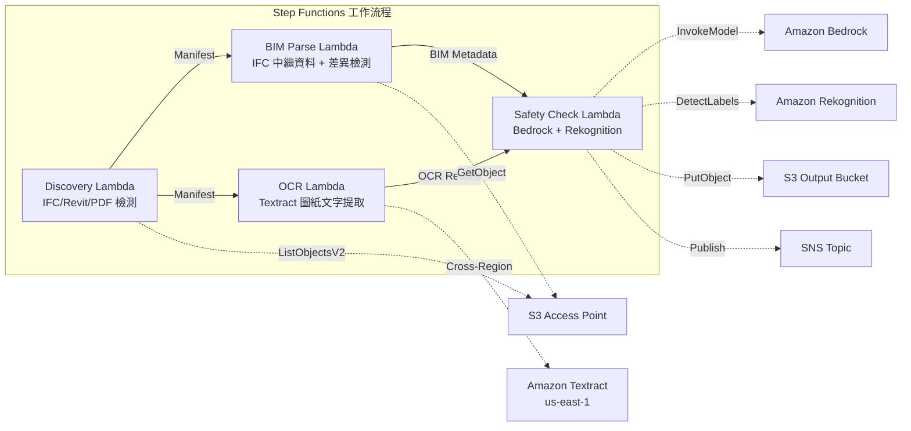

# UC10：建築 / AEC — BIM 模型管理、圖面 OCR、安全合規

🌐 **Language / 言語**: [日本語](README.md) | [English](README.en.md) | [한국어](README.ko.md) | [简体中文](README.zh-CN.md) | 繁體中文 | [Français](README.fr.md) | [Deutsch](README.de.md) | [Español](README.es.md)

📚 **文件**: [架構圖](docs/architecture.md) | [示範指南](docs/demo-guide.md)

## 概述

利用 FSx for ONTAP 的 S3 Access Points，以無伺服器工作流程自動化 BIM 模型（IFC/Revit）的版本控制、圖紙 PDF 的 OCR 文字提取和安全合規性檢查。

### 適用這種模式的情況

- BIM 模型（IFC/Revit）和圖紙 PDF 已在 FSx for ONTAP 上儲存
- 希望自動編目 IFC 檔案的中繼資料（專案名稱、建築元素數、樓層數）
- 希望自動檢測 BIM 模型的版本差異（元素的新增、刪除、修改）
- 希望使用 Textract 從圖紙 PDF 中提取文字和表格
- 需要自動檢查安全合規規則（防火疏散、結構負荷、材料標準）

### 不適用的情況

- 即時 BIM 協作（適合 Revit Server / BIM 360）
- 完整的結構分析模擬（需要 FEM 軟體）
- 大規模 3D 渲染處理（適合 EC2/GPU 執行個體）
- 無法確保到 ONTAP REST API 的網路連接的環境

### 主要功能

- 透過 S3 AP 自動檢測 IFC/Revit/PDF 檔案
- IFC 中繼資料提取（project_name、building_elements_count、floor_count、coordinate_system、ifc_schema_version）
- 版本間差異檢測（element additions、deletions、modifications）
- 透過 Textract（跨區域）從圖紙 PDF 提取 OCR 文字和表格
- 透過 Bedrock 進行安全合規規則檢查
- 使用 Rekognition 從圖紙圖像中檢測安全相關的視覺元素（出口、滅火器、危險區域）

## Success Metrics

### Outcome
透過 BIM 版本控制、圖紙 OCR、安全合規性檢查的自動化，提升建築專案管理效率。

### Metrics
| 指標 | 目標值（範例） |
|-----------|------------|
| 已處理圖紙數 / 執行 | > 100 files |
| OCR 文字提取成功率 | > 90% |
| 安全合規違規檢出率 | 100%（已知模式） |
| 處理時間 / 檔案 | < 45 秒 |
| 成本 / 執行 | < $10 |
| Human Review 對象率 | < 15%（檢出安全違規時） |

### Measurement Method
Step Functions 執行歷程、Textract confidence score、Bedrock 安全報告、CloudWatch Metrics。

## 架構



### 工作流程步驟

1. **探索**：從 S3 AP 中檢測 .ifc、.rvt、.pdf 檔案
2. **BIM 解析**：從 IFC 檔案中提取中繼資料並檢測版本間差異
3. **OCR**：使用 Textract（跨區域）從圖紙 PDF 中提取文字和表格
4. **安全檢查**：使用 Bedrock 檢查安全合規規則，使用 Rekognition 檢測視覺元素

## 前提條件

- AWS 帳戶和適當的 IAM 權限
- FSx for ONTAP 檔案系統（ONTAP 9.17.1P4D3 及以上版本）
- 已啟用 S3 Access Point 的磁碟區（用於儲存 BIM 模型和圖紙）
- VPC、私有子網路
- Amazon Bedrock 模型存取已啟用（Claude / Nova）
- **跨區域**: Textract 不支援 ap-northeast-1，因此需要跨區域呼叫 us-east-1

## 部署步驟

### 1. 確認跨區域參數

Textract 不支援東京區域，因此要在 `CrossRegionTarget` 參數中設定跨區域呼叫。

### 2. SAM 部署

```bash
# 前提條件：需要 AWS SAM CLI。'sam build' 會自動打包程式碼與共用層。
sam build

sam deploy \
  --stack-name fsxn-construction-bim \
  --parameter-overrides \
    S3AccessPointAlias=<your-volume-ext-s3alias> \
    S3AccessPointName=<your-s3ap-name> \
    VpcId=<your-vpc-id> \
    PrivateSubnetIds=<subnet-1>,<subnet-2> \
    ScheduleExpression="rate(1 hour)" \
    NotificationEmail=<your-email@example.com> \
    CrossRegion=us-east-1 \
    EnableVpcEndpoints=false \
    EnableCloudWatchAlarms=false \
  --capabilities CAPABILITY_NAMED_IAM \
  --resolve-s3 \
  --region ap-northeast-1
```

> **注意**: `template.yaml` 用於 SAM CLI（`sam build` + `sam deploy`）。
> 如需使用原生 `aws cloudformation deploy` 部署，請改用 `template-deploy.yaml`（需要預先封裝 Lambda zip 檔案並上傳至 S3 儲存貯體）。

## 設定參數清單

| 參數 | 說明 | 預設值 | 必填 |
|-----------|------|----------|------|
| `S3AccessPointAlias` | FSx for ONTAP S3 AP Alias（輸入用） | — | ✅ |
| `S3AccessPointName` | S3 AP 名稱（用於基於 ARN 的 IAM 權限授予。省略時僅基於 Alias） | `""` | ⚠️ 建議 |
| `ScheduleExpression` | EventBridge Scheduler 的排程表達式 | `rate(1 hour)` | |
| `VpcId` | VPC ID | — | ✅ |
| `PrivateSubnetIds` | 私有子網路 ID 清單 | — | ✅ |
| `NotificationEmail` | SNS 通知目標電子郵件地址 | — | ✅ |
| `CrossRegionTarget` | Textract 的目標區域 | `us-east-1` | |
| `MapConcurrency` | Map 狀態的並行執行數 | `10` | |
| `LambdaMemorySize` | Lambda 記憶體大小 (MB) | `1024` | |
| `LambdaTimeout` | Lambda 逾時 (秒) | `300` | |
| `EnableVpcEndpoints` | 啟用 Interface VPC Endpoints | `false` | |
| `EnableCloudWatchAlarms` | 啟用 CloudWatch Alarms | `false` | |

## 清理

```bash
aws s3 rm s3://fsxn-construction-bim-output-${AWS_ACCOUNT_ID} --recursive

aws cloudformation delete-stack \
  --stack-name fsxn-construction-bim \
  --region ap-northeast-1

aws cloudformation wait stack-delete-complete \
  --stack-name fsxn-construction-bim \
  --region ap-northeast-1
```

## 支援的區域

UC10 使用以下服務：

| 服務 | 區域限制 |
|---------|-------------|
| Amazon Textract | 不支援 ap-northeast-1。透過 `TEXTRACT_REGION` 參數指定支援的區域（us-east-1 等） |
| Amazon Bedrock | 確認支援的區域（[Bedrock 支援的區域](https://docs.aws.amazon.com/general/latest/gr/bedrock.html)） |
| Amazon Rekognition | 幾乎所有區域均可使用 |
| AWS X-Ray | 幾乎所有區域均可使用 |
| CloudWatch EMF | 幾乎所有區域均可使用 |

> 透過跨區域用戶端呼叫 Textract API。請確認資料駐留要求。詳細資訊請參閱 [區域相容性矩陣](../docs/region-compatibility.md)。

## 參考連結

- [FSx for ONTAP S3 Access Points 概觀](https://docs.aws.amazon.com/fsx/latest/ONTAPGuide/accessing-data-via-s3-access-points.html)
- [Amazon Textract 文件](https://docs.aws.amazon.com/textract/latest/dg/what-is.html)
- [IFC 格式規範 (buildingSMART)](https://www.buildingsmart.org/standards/bsi-standards/industry-foundation-classes/)
- [Amazon Rekognition 標籤偵測](https://docs.aws.amazon.com/rekognition/latest/dg/labels.html)

---

## AWS 文件連結

| 服務 | 文件 |
|---------|------------|
| FSx for ONTAP | [使用者指南](https://docs.aws.amazon.com/fsx/latest/ONTAPGuide/what-is-fsx-ontap.html) |
| S3 Access Points | [S3 AP for FSx for ONTAP](https://docs.aws.amazon.com/fsx/latest/ONTAPGuide/s3-access-points.html) |
| Step Functions | [開發人員指南](https://docs.aws.amazon.com/step-functions/latest/dg/welcome.html) |
| Amazon Textract | [開發人員指南](https://docs.aws.amazon.com/textract/latest/dg/what-is.html) |
| Amazon Rekognition | [開發人員指南](https://docs.aws.amazon.com/rekognition/latest/dg/what-is.html) |
| Amazon Bedrock | [使用者指南](https://docs.aws.amazon.com/bedrock/latest/userguide/what-is-bedrock.html) |

### Well-Architected Framework 對應

| 支柱 | 對應 |
|----|------|
| 卓越營運 | X-Ray 追蹤、EMF 指標、BIM 版本追蹤 |
| 安全性 | 最小權限 IAM、KMS 加密、設計資料存取控制 |
| 可靠性 | Step Functions Retry/Catch、IFC 解析錯誤處理 |
| 效能效率 | Lambda 1024MB（用於 IFC 解析）、並行處理 |
| 成本最佳化 | 無伺服器、Textract 按頁計費 |
| 永續性 | 隨需執行、差異處理 |

---

## 成本估算（每月概算）

> **註記**: 以下為 ap-northeast-1 區域的概算，實際成本因使用量而異。最新價格請在 [AWS Pricing Calculator](https://calculator.aws/) 中確認。

### 無伺服器元件（按量計費）

| 服務 | 單價 | 預計使用量 | 每月概算 |
|---------|------|-----------|---------|
| Lambda | $0.0000166667/GB-sec | 4 函數 × 20 models/天 | ~$1-5 |
| S3 API (GetObject/ListObjects) | $0.0047/10K requests | ~10K requests/天 | ~$1.5 |
| Step Functions | $0.025/1K state transitions | ~1K transitions/天 | ~$0.75 |
| Bedrock (Nova Lite) | $0.00006/1K input tokens | ~30K tokens/執行 | ~$3-10 |
| Athena | $5/TB scanned | ~5 MB/查詢 | ~$0.5-2 |
| SNS | $0.50/100K notifications | ~100 notifications/天 | ~$0.15 |
| CloudWatch Logs | $0.76/GB ingested | ~1 GB/月 | ~$0.76 |

### 固定成本（FSx for ONTAP — 以現有環境為前提）

| 元件 | 每月 |
|--------------|------|
| FSx for ONTAP (128 MBps, 1 TB) | ~$230 (共用現有環境) |
| S3 Access Point | 無額外費用（僅 S3 API 費用） |

### 合計概算

| 配置 | 每月概算 |
|------|---------|
| 最小配置（每日 1 次執行） | ~$5-15 |
| 標準配置（每小時執行） | ~$15-50 |
| 大規模配置（高頻率 + 警報） | ~$50-150 |

> **Governance Caveat**: 成本估算為概算，非保證值。實際帳單因使用模式、資料量、區域而異。

---

## 本地測試

### Prerequisites 檢查

```bash
# 確認前提條件
aws --version          # AWS CLI v2
sam --version          # SAM CLI
python3 --version      # Python 3.9+
docker --version       # Docker (sam local 用)
aws sts get-caller-identity  # AWS 憑證
```

### sam local invoke

```bash
# 建置
# 前提條件：需要 AWS SAM CLI。'sam build' 會自動打包程式碼與共用層。
sam build

# 本地執行 Discovery Lambda
sam local invoke DiscoveryFunction --event events/discovery-event.json

# 帶環境變數覆寫
sam local invoke DiscoveryFunction \
  --event events/discovery-event.json \
  --env-vars env.json
```

### 單元測試

```bash
python3 -m pytest tests/ -v
```

詳細資訊請參閱 [本地測試快速入門](../docs/local-testing-quick-start.md)。

---

## 輸出範例 (Output Sample)

BIM 模型管理管線的輸出範例：

```json
{
  "discovery": {
    "status": "completed",
    "object_count": 8,
    "prefix": "bim-models/"
  },
  "ifc_metadata": [
    {
      "key": "bim-models/building-A-rev3.ifc",
      "schema_version": "IFC4",
      "element_count": 4521,
      "building_storeys": 5,
      "last_modified_by": "architect-team"
    }
  ],
  "version_diff": {
    "compared": "rev2 → rev3",
    "added_elements": 45,
    "modified_elements": 12,
    "deleted_elements": 3
  },
  "safety_compliance": {
    "checks_passed": 28,
    "checks_failed": 2,
    "issues": ["fire_exit_width_insufficient", "handrail_height_below_standard"]
  }
}
```

> **註記**: 以上為範例輸出，實際值因環境、輸入資料而異。基準數值為 sizing reference，非 service limit。

---

## Governance Note

> 本模式提供技術架構指導。並非法律、合規、法規方面的建議。組織應諮詢合格的專業人士。

---

## S3AP Compatibility

有關 S3 Access Points for FSx for ONTAP 的相容性限制、疑難排解和觸發模式，請參閱 [S3AP Compatibility Notes](../docs/s3ap-compatibility-notes.md)。
