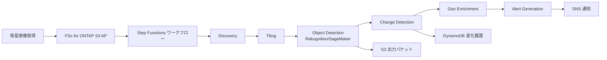

# 防衛・宇宙 — 衛星画像解析パイプライン Demo Guide

🌐 **Language / 言語**: 日本語 | [English](demo-guide.en.md) | [한국어](demo-guide.ko.md) | [简体中文](demo-guide.zh-CN.md) | [繁體中文](demo-guide.zh-TW.md) | [Français](demo-guide.fr.md) | [Deutsch](demo-guide.de.md) | [Español](demo-guide.es.md)

## Executive Summary

衛星画像データ（Sentinel, Landsat, 商用 SAR）の増加に対し、従来型 NAS のコピーベースワークフローでは時間・コストが課題となっている。本デモでは FSx for ONTAP S3 Access Point による zero-copy アーキテクチャと、Step Functions による衛星画像タイリング・物体検出・変化検出・Geo enrichment の自動化パイプラインを実演する。NTFS ACL 連動によりセキュリティを維持しながらサーバーレス処理を実現する。

## Target Audience & Persona

| 項目 | 内容 |
|------|------|
| **ユースケース ID** | UC15 |
| **業界** | 防衛・宇宙 |
| **主要ペルソナ** | 防衛省 画像情報分析官 / 宇宙状況監視担当 |
| **役割** | 衛星画像の取得・解析・変化検出レポート作成 |
| **課題** | 大量の衛星画像を手動で処理しており、即時性・網羅性に限界がある |
| **期待する成果** | AI/ML による自動物体検出と変化検出で、分析サイクルを数時間から数分に短縮 |
| **技術レベル** | GIS ツール操作に習熟、クラウドインフラは基礎レベル |

## Demo Scenario



**ワークフロー概要**:

1. 衛星画像（GeoTIFF）を FSx for ONTAP ボリュームに配置（S3 AP 経由でアクセス可能）
2. Step Functions が自動的に画像を発見・タイリング
3. 画像サイズに応じて Rekognition（< 5MB）または SageMaker（≥ 5MB）で物体検出
4. geohash ベースの変化検出で過去画像との比較
5. 座標情報付きの enriched 検出結果を生成
6. 異常検知時に SNS でアラート通知

## ステップバイステップ デプロイ・検証手順

### Step 1: 前提条件の確認

以下の環境が整っていることを確認してください:

- AWS アカウント、ap-northeast-1 リージョン
- FSx for ONTAP + S3 Access Point が構成済み
- `defense-satellite/template-deploy.yaml` をデプロイ済み（`EnableSageMaker=false`）
- AWS CLI v2 がインストール済み
- 適切な IAM 権限（CloudFormation, Step Functions, S3, Lambda, Rekognition）

```bash
# AWS CLI の確認
aws --version
aws sts get-caller-identity

# S3 Access Point の疎通確認
aws s3 ls s3://<your-ap-ext-s3alias>/ --max-items 5
```

### Step 2: リポジトリのクローンとディレクトリ移動

```bash
git clone https://github.com/Yoshiki0705/fsxn-s3ap-serverless-patterns.git
cd fsxn-s3ap-serverless-patterns/solutions/industry/defense-satellite
```

### Step 3: テスト用サンプルデータの配置

```bash
# サンプル GeoTIFF を S3 Access Point 経由でアップロード
aws s3 cp sample-satellite.tif \
  s3://<s3-ap-arn>/satellite/2026/05/tokyo_bay.tif
```

### Step 4: SAM ビルドとデプロイ

```bash
aws cloudformation deploy \
  --template-file defense-satellite/template-deploy.yaml \
  --stack-name fsxn-uc15-demo \
  --parameter-overrides \
    DeployBucket=<your-deploy-bucket> \
    S3AccessPointAlias=<your-ap-ext-s3alias> \
    VpcId=<vpc-id> \
    PrivateSubnetIds=<subnet-ids> \
    NotificationEmail=ops@example.com \
  --capabilities CAPABILITY_NAMED_IAM \
  --region ap-northeast-1
```

デプロイ完了まで約 5 分。CloudFormation コンソールでスタックステータスが `CREATE_COMPLETE` になることを確認。

### Step 5: ワークフローの手動実行

```bash
# Step Functions 実行
aws stepfunctions start-execution \
  --state-machine-arn <uc15-StateMachineArn> \
  --input '{}'
```

- AWS コンソールで Step Functions グラフを確認（Discovery → Map → Tiling → ObjectDetection → ChangeDetection → GeoEnrichment → AlertGeneration）
- SUCCEEDED までの実行時間を確認（通常 2-3 分）

### Step 6: 出力結果の確認

S3 出力バケットの階層を確認:

```bash
# タイリング結果
aws s3 ls s3://<output-bucket>/tiles/

# 物体検出結果
aws s3 ls s3://<output-bucket>/detections/

# Geo enriched 結果
aws s3 ls s3://<output-bucket>/enriched/
```

出力構造:
- `tiles/YYYY/MM/DD/<basename>/metadata.json`
- `detections/<tile_key>_detections.json`
- `enriched/YYYY/MM/DD/<tile_id>.json`

追加確認:
- CloudWatch Logs で EMF メトリクス確認
- DynamoDB `change-history` テーブルで変化検出履歴を確認
- SNS 通知メールの受信確認

## 検証チェックリスト

| # | 検証項目 | 期待結果 | 確認方法 |
|---|----------|----------|----------|
| 1 | CloudFormation スタック作成 | `CREATE_COMPLETE` | AWS コンソール |
| 2 | Step Functions 実行 | `SUCCEEDED` | 実行履歴 |
| 3 | タイリング出力 | `tiles/` 配下に metadata.json | S3 バケット |
| 4 | 物体検出出力 | `detections/` 配下に JSON | S3 バケット |
| 5 | Geo enrichment 出力 | `enriched/` 配下に JSON | S3 バケット |
| 6 | 変化検出履歴 | DynamoDB にレコード追加 | DynamoDB コンソール |
| 7 | アラート通知 | SNS メール受信 | メール確認 |
| 8 | EMF メトリクス | CloudWatch にカスタムメトリクス | CloudWatch コンソール |

## よくある質問と回答

**Q. SAR データ（Sentinel-1 の HDF5）はどう扱う？**  
A. Discovery Lambda で `image_type=sar` に分類、Tiling は HDF5 パーサ実装可（rasterio or h5py）。Object Detection は専用 SAR 解析モデル（SageMaker）必須。

**Q. 画像サイズ閾値（5MB）の根拠？**  
A. Rekognition DetectLabels API の Bytes パラメータ上限。S3 経由なら 15MB まで可。プロトタイプは Bytes ルートを採用。

**Q. 変化検出の精度は？**  
A. 現行実装は bbox 面積ベースの簡易比較。本格運用では SageMaker のセマンティックセグメンテーション推奨。

**Q. GovCloud への移行は可能か？**  
A. 同じテンプレートで `ap-northeast-1` → `us-gov-west-1` に変更可能。DoD CC SRG, CSfC, FedRAMP 対応。

**Q. コスト最適化のポイントは？**  
A. SageMaker Endpoint は実運用時のみ有効化（`EnableSageMaker=true`）。開発・デモ時は Rekognition のみで十分。

## トラブルシューティング

| 症状 | 原因 | 解決策 |
|------|------|--------|
| Step Functions が `FAILED` | Lambda タイムアウト | Lambda メモリ・タイムアウト値を増加。VPC Lambda の場合は ENI 作成待ちの可能性 |
| S3 AP から `AccessDenied` | IAM ポリシーの Resource ARN 形式が不正 | `arn:aws:s3:{region}:{account}:accesspoint/{name}/object/*` 形式を使用 |
| Rekognition が `ImageTooLargeException` | 画像が 5MB 超 | `EnableSageMaker=true` でデプロイし直すか、S3 経由の DetectLabels を使用 |
| DynamoDB に変化検出レコードが無い | 初回実行で比較対象が存在しない | 2 回目の実行で変化検出が機能する（初回はベースライン作成） |
| SNS 通知が届かない | メールサブスクリプション未確認 | SNS サブスクリプションの確認メールを承認する |
| デプロイ時 `ROLLBACK_COMPLETE` | パラメータ不足・権限不足 | CloudFormation イベントでエラー詳細を確認 |

---

## 出力先について: OutputDestination で選択可能 (Pattern B)

UC15 defense-satellite は 2026-05-11 のアップデートで `OutputDestination` パラメータをサポートしました
（`docs/output-destination-patterns.md` 参照）。

**対象ワークロード**: 衛星画像タイリング / 物体検出 / Geo enrichment

**2 つのモード**:

### STANDARD_S3（デフォルト、従来どおり）
新しい S3 バケット（`${AWS::StackName}-output-${AWS::AccountId}`）を作成し、
AI 成果物をそこに書き込みます。Discovery Lambda の manifest のみ S3 Access Point
に書き込まれます（従来通り）。

```bash
aws cloudformation deploy \
  --template-file defense-satellite/template-deploy.yaml \
  --stack-name fsxn-defense-satellite-demo \
  --parameter-overrides \
    OutputDestination=STANDARD_S3 \
    ... (他の必須パラメータ)
```

### FSXN_S3AP（"no data movement" パターン）
タイリング metadata、物体検出 JSON、Geo enrichment 済み検出結果を、FSx for ONTAP S3 Access Point
経由でオリジナル衛星画像と**同一の FSx for ONTAP ボリューム**に書き戻します。
分析担当者が SMB/NFS の既存ディレクトリ構造内で AI 成果物を直接参照できます。
標準 S3 バケットは作成されません。

```bash
aws cloudformation deploy \
  --template-file defense-satellite/template-deploy.yaml \
  --stack-name fsxn-defense-satellite-demo \
  --parameter-overrides \
    OutputDestination=FSXN_S3AP \
    OutputS3APPrefix=ai-outputs/ \
    S3AccessPointName=eda-demo-s3ap \
    ... (他の必須パラメータ)
```

**注意事項**:

- `S3AccessPointName` の指定を強く推奨（Alias 形式と ARN 形式の両方で IAM 許可する）
- 5GB 超のオブジェクトは FSx for ONTAP S3 AP では不可（AWS 仕様）、マルチパートアップロード必須
- ChangeDetection Lambda は DynamoDB のみを使用するため `OutputDestination` の影響を受けません
- AlertGeneration Lambda は SNS のみを使用するため `OutputDestination` の影響を受けません
- AWS 仕様上の制約は
  [プロジェクト README の "AWS 仕様上の制約と回避策" セクション](../../README.md#aws-仕様上の制約と回避策)
  および [`docs/output-destination-patterns.md`](../../docs/output-destination-patterns.md) を参照

---

## クリーンアップ

デモ終了後は以下の手順でリソースを削除してください:

```bash
# CloudFormation スタック削除
aws cloudformation delete-stack \
  --stack-name fsxn-uc15-demo \
  --region ap-northeast-1

# 削除完了を待機
aws cloudformation wait stack-delete-complete \
  --stack-name fsxn-uc15-demo \
  --region ap-northeast-1

# S3 出力バケットの手動削除（バケットが空でない場合）
aws s3 rb s3://fsxn-uc15-demo-output-<account-id> --force
```

> **注意**: VPC Lambda の ENI 解放に 15-30 分かかる場合があります（AWS の仕様）。`DELETE_FAILED` になった場合は数分後に再試行してください。

---

## 検証済みの UI/UX スクリーンショット

Phase 7 UC15/16/17 と UC6/11/14 のデモと同じ方針で、**エンドユーザーが日常業務で実際に
見る UI/UX 画面**を対象とする。技術者向けビュー（Step Functions グラフ、CloudFormation
スタックイベント等）は `docs/verification-results-*.md` に集約。

### このユースケースの検証ステータス

- ✅ **E2E 検証**: SUCCEEDED（Phase 7 Extended Round, commit b77fc3b）
- 📸 **UI/UX 撮影**: ✅ 完了（Phase 8 Theme D, commit d7ebabd）

### 既存スクリーンショット（Phase 7 検証時）


### 再検証時の UI/UX 対象画面（推奨撮影リスト）

- S3 出力バケット（detections/、geo-enriched/、alerts/）
- Rekognition 衛星画像物体検出結果 JSON プレビュー
- GeoEnrichment 座標付き検出結果
- SNS アラート通知メール
- FSx for ONTAP ボリューム上の AI 成果物（FSXN_S3AP モード時）

### 撮影ガイド

1. **事前準備**:
   - `bash scripts/verify_phase7_prerequisites.sh` で前提確認（共通 VPC/S3 AP 有無）
   - `UC=defense-satellite bash scripts/package_generic_uc.sh` で Lambda パッケージ
   - `bash scripts/deploy_generic_ucs.sh UC15` でデプロイ

2. **サンプルデータ配置**:
   - S3 AP Alias 経由で `satellite-imagery/` プレフィックスにサンプル GeoTIFF をアップロード
   - Step Functions `fsxn-defense-satellite-demo-workflow` を起動（入力 `{}`）

3. **撮影**（CloudShell・ターミナルは閉じる、ブラウザ右上のユーザー名は黒塗り）:
   - S3 出力バケット `fsxn-defense-satellite-demo-output-<account>` の俯瞰
   - AI/ML 出力 JSON のプレビュー（detections, geo-enriched）
   - SNS メール通知（AlertGeneration からの通知）

4. **マスク処理**:
   - `python3 scripts/mask_uc_demos.py defense-satellite-demo` で自動マスク
   - `docs/screenshots/MASK_GUIDE.md` に従って追加マスク（必要に応じて）

5. **クリーンアップ**:
   - `bash scripts/cleanup_generic_ucs.sh UC15` で削除
   - VPC Lambda ENI 解放に 15-30 分（AWS の仕様）
