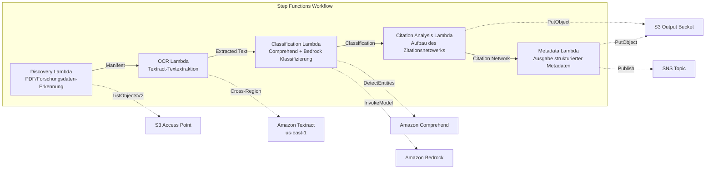

# UC13: Bildung / Forschung — Automatische Klassifizierung von Paper-PDFs und Zitationsnetzwerk-Analyse

🌐 **Language / 言語**: [日本語](README.md) | [English](README.en.md) | [한국어](README.ko.md) | [简体中文](README.zh-CN.md) | [繁體中文](README.zh-TW.md) | [Français](README.fr.md) | Deutsch | [Español](README.es.md)

📚 **Dokumentation**: [Architekturdiagramm](docs/architecture.md) | [Demo-Leitfaden](docs/demo-guide.md)

## Überblick

Ein Serverless-Workflow, der die S3 Access Points von Amazon FSx for NetApp ONTAP nutzt, um die Klassifizierung von Paper-PDFs, die Zitationsnetzwerk-Analyse und die Extraktion von Metadaten aus Forschungsdaten zu automatisieren.

### Wann dieses Pattern geeignet ist

- Eine große Menge an Paper-PDFs und Forschungsdaten ist auf FSx for ONTAP angesammelt
- Sie möchten die Textextraktion aus Paper-PDFs mit Textract automatisieren
- Sie benötigen Themenerkennung und Entitätsextraktion (Autoren, Institutionen, Schlüsselwörter) mit Comprehend
- Sie benötigen eine Analyse von Zitationsbeziehungen und den automatischen Aufbau eines Zitationsnetzwerks (Adjazenzliste)
- Sie möchten Forschungsdomänen-Klassifizierung und strukturierte Abstract-Zusammenfassungen automatisch generieren

### Wann dieses Pattern nicht geeignet ist

- Eine Echtzeit-Suchmaschine für Paper ist erforderlich (OpenSearch / Elasticsearch ist besser geeignet)
- Eine vollständige Zitationsdatenbank ist erforderlich (CrossRef / Semantic Scholar API ist besser geeignet)
- Das Fine-Tuning großer Modelle zur Verarbeitung natürlicher Sprache ist erforderlich
- Eine Umgebung, in der die Netzwerkerreichbarkeit der ONTAP REST API nicht sichergestellt werden kann

### Hauptfunktionen

- Automatische Erkennung von Paper-PDFs (.pdf) und Forschungsdaten (.csv, .json, .xml) über S3 AP
- PDF-Textextraktion mit Textract (Cross-Region)
- Themenerkennung und Entitätsextraktion mit Comprehend
- Forschungsdomänen-Klassifizierung und Generierung strukturierter Abstract-Zusammenfassungen mit Bedrock
- Analyse von Zitationsbeziehungen aus dem Literaturverzeichnis und Aufbau einer Zitations-Adjazenzliste
- Ausgabe strukturierter Metadaten (title, authors, classification, keywords, citation_count) für jedes Paper

## Success Metrics

### Outcome
Die Automatisierung der Paper-PDF-Klassifizierung und der Zitationsnetzwerk-Analyse optimiert die Verwaltung von Forschungsdaten und die Organisation von Lehrmaterialien.

### Metrics
| Metrik | Zielwert (Beispiel) |
|-----------|------------|
| Verarbeitete Dokumente / Ausführung | > 200 documents |
| Klassifizierungsgenauigkeit | > 85 % |
| Erfolgsrate der Zitationsextraktion | > 90 % |
| Verarbeitungszeit / Dokument | < 30 Sekunden |
| Kosten / Ausführung | < 8 $ |
| Human-Review-Anteil | < 20 % (Dokumente mit unsicherer Klassifizierung) |

### Measurement Method
Step-Functions-Ausführungsverlauf, Comprehend-Klassifizierungsergebnisse, Textract-Textextraktion, CloudWatch Metrics.

## Architektur



### Workflow-Schritte

1. **Discovery**: .pdf-, .csv-, .json-, .xml-Dateien vom S3 AP erkennen
2. **OCR**: Text aus PDFs mit Textract (Cross-Region) extrahieren
3. **Classification**: Entitäten mit Comprehend extrahieren und Forschungsdomänen mit Bedrock klassifizieren
4. **Citation Analysis**: Zitationsbeziehungen aus dem Literaturverzeichnis analysieren und eine Adjazenzliste aufbauen
5. **Metadata**: Strukturierte Metadaten jedes Papers als JSON nach S3 ausgeben

## Voraussetzungen

- Ein AWS-Konto und geeignete IAM-Berechtigungen
- Ein FSx for ONTAP-Dateisystem (ONTAP 9.17.1P4D3 oder höher)
- Ein Volume mit aktiviertem S3 Access Point (zur Speicherung von Paper-PDFs und Forschungsdaten)
- Eine VPC und private Subnetze
- Aktivierter Amazon-Bedrock-Modellzugriff (Claude / Nova)
- **Cross-Region**: Da Textract in ap-northeast-1 nicht verfügbar ist, ist ein Cross-Region-Aufruf nach us-east-1 erforderlich

## Bereitstellungsschritte

### 1. Cross-Region-Parameter überprüfen

Da Textract in der Region Tokio nicht verfügbar ist, konfigurieren Sie den Cross-Region-Aufruf mit dem Parameter `CrossRegionTarget`.

### 2. SAM-Bereitstellung

```bash
# Voraussetzung: AWS SAM CLI erforderlich. „sam build" packt den Code und den Shared Layer automatisch.
sam build

sam deploy \
  --stack-name fsxn-education-research \
  --parameter-overrides \
    S3AccessPointAlias=<your-volume-ext-s3alias> \
    S3AccessPointName=<your-s3ap-name> \
    VpcId=<your-vpc-id> \
    PrivateSubnetIds=<subnet-1>,<subnet-2> \
    ScheduleExpression="rate(1 hour)" \
    NotificationEmail=<your-email@example.com> \
    CrossRegion=us-east-1 \
    EnableVpcEndpoints=false \
    EnableCloudWatchAlarms=false \
  --capabilities CAPABILITY_NAMED_IAM \
  --resolve-s3 \
  --region ap-northeast-1
```

> **Hinweis**: `template.yaml` wird mit der SAM CLI (`sam build` + `sam deploy`) verwendet.
> Um direkt mit dem Befehl `aws cloudformation deploy` bereitzustellen, verwenden Sie stattdessen `template-deploy.yaml` (das Vorab-Packen der Lambda-Zip-Dateien und das Hochladen nach S3 sind erforderlich).

## Liste der Konfigurationsparameter

| Parameter | Beschreibung | Standard | Erforderlich |
|-----------|------|----------|------|
| `S3AccessPointAlias` | FSx for ONTAP S3 AP Alias (für Eingabe) | — | ✅ |
| `S3AccessPointName` | S3-AP-Name (für ARN-basierte IAM-Berechtigungsvergabe; wenn ausgelassen, nur Alias-basiert) | `""` | ⚠️ Empfohlen |
| `ScheduleExpression` | Zeitplanausdruck des EventBridge Scheduler | `rate(1 hour)` | |
| `VpcId` | VPC-ID | — | ✅ |
| `PrivateSubnetIds` | Liste der privaten Subnetz-IDs | — | ✅ |
| `NotificationEmail` | SNS-Benachrichtigungs-E-Mail-Adresse | — | ✅ |
| `CrossRegionTarget` | Zielregion für Textract | `us-east-1` | |
| `MapConcurrency` | Anzahl paralleler Ausführungen des Map-Status | `10` | |
| `LambdaMemorySize` | Lambda-Speichergröße (MB) | `512` | |
| `LambdaTimeout` | Lambda-Timeout (Sekunden) | `300` | |
| `EnableVpcEndpoints` | Interface VPC Endpoints aktivieren | `false` | |
| `EnableCloudWatchAlarms` | CloudWatch Alarms aktivieren | `false` | |

## Bereinigung

```bash
aws s3 rm s3://fsxn-education-research-output-${AWS_ACCOUNT_ID} --recursive

aws cloudformation delete-stack \
  --stack-name fsxn-education-research \
  --region ap-northeast-1

aws cloudformation wait stack-delete-complete \
  --stack-name fsxn-education-research \
  --region ap-northeast-1
```

## Supported Regions

UC13 verwendet die folgenden Services:

| Service | Regionseinschränkung |
|---------|-------------|
| Amazon Textract | In ap-northeast-1 nicht verfügbar. Geben Sie mit dem Parameter `TEXTRACT_REGION` eine unterstützte Region (z. B. us-east-1) an |
| Amazon Comprehend | In fast allen Regionen verfügbar |
| Amazon Bedrock | Unterstützte Regionen prüfen ([Von Bedrock unterstützte Regionen](https://docs.aws.amazon.com/general/latest/gr/bedrock.html)) |
| AWS X-Ray | In fast allen Regionen verfügbar |
| CloudWatch EMF | In fast allen Regionen verfügbar |

> Die Textract-API wird über den Cross-Region Client aufgerufen. Prüfen Sie Ihre Anforderungen an die Datenresidenz. Weitere Informationen finden Sie in der [Regions-Kompatibilitätsmatrix](../docs/region-compatibility.md).

## Referenzlinks

- [Übersicht über FSx for ONTAP S3 Access Points](https://docs.aws.amazon.com/fsx/latest/ONTAPGuide/accessing-data-via-s3-access-points.html)
- [Amazon-Textract-Dokumentation](https://docs.aws.amazon.com/textract/latest/dg/what-is.html)
- [Amazon-Comprehend-Dokumentation](https://docs.aws.amazon.com/comprehend/latest/dg/what-is.html)
- [Amazon-Bedrock-API-Referenz](https://docs.aws.amazon.com/bedrock/latest/APIReference/API_runtime_InvokeModel.html)

---

## AWS-Dokumentationslinks

| Service | Dokumentation |
|---------|------------|
| FSx for ONTAP | [Benutzerhandbuch](https://docs.aws.amazon.com/fsx/latest/ONTAPGuide/what-is-fsx-ontap.html) |
| S3 Access Points | [S3 AP for FSx for ONTAP](https://docs.aws.amazon.com/fsx/latest/ONTAPGuide/s3-access-points.html) |
| Step Functions | [Entwicklerhandbuch](https://docs.aws.amazon.com/step-functions/latest/dg/welcome.html) |
| Amazon Textract | [Entwicklerhandbuch](https://docs.aws.amazon.com/textract/latest/dg/what-is.html) |
| Amazon Comprehend | [Entwicklerhandbuch](https://docs.aws.amazon.com/comprehend/latest/dg/what-is.html) |
| Amazon Bedrock | [Benutzerhandbuch](https://docs.aws.amazon.com/bedrock/latest/userguide/what-is-bedrock.html) |

### Ausrichtung am Well-Architected Framework

| Säule | Ausrichtung |
|----|------|
| Operational Excellence | X-Ray-Tracing, EMF-Metriken, Überwachung der Klassifizierungsgenauigkeit |
| Sicherheit | IAM mit geringsten Rechten, KMS-Verschlüsselung, Zugriffskontrolle für Forschungsdaten |
| Zuverlässigkeit | Step Functions Retry/Catch, Cross-Region Textract |
| Leistungseffizienz | Paralleler Aufbau des Zitationsnetzwerks, Athena-Partitionen |
| Kostenoptimierung | Serverless, Comprehend-Batchverarbeitung |
| Nachhaltigkeit | On-Demand-Ausführung, inkrementelle Verarbeitung (nur neue Paper) |

---

## Kostenschätzung (ungefähr monatlich)

> **Anmerkung**: Die folgenden Werte sind Näherungswerte für die Region ap-northeast-1, und die tatsächlichen Kosten variieren je nach Nutzung. Prüfen Sie die aktuellen Preise mit dem [AWS Pricing Calculator](https://calculator.aws/).

### Serverless-Komponenten (nutzungsbasierte Abrechnung)

| Service | Stückpreis | Angenommene Nutzung | Ungefähr monatlich |
|---------|------|-----------|---------|
| Lambda | $0.0000166667/GB-sec | 5 Funktionen × 50 papers/Tag | ~$1-5 |
| S3 API (GetObject/ListObjects) | $0.0047/10K requests | ~10K requests/Tag | ~$1.5 |
| Step Functions | $0.025/1K state transitions | ~1K transitions/Tag | ~$0.75 |
| Bedrock (Nova Lite) | $0.00006/1K input tokens | ~60K tokens/Ausführung | ~$3-10 |
| Athena | $5/TB scanned | ~5 MB/Abfrage | ~$0.5-2 |
| SNS | $0.50/100K notifications | ~100 notifications/Tag | ~$0.15 |
| CloudWatch Logs | $0.76/GB ingested | ~1 GB/Monat | ~$0.76 |

### Fixkosten (FSx for ONTAP — bestehende Umgebung vorausgesetzt)

| Komponente | Monatlich |
|--------------|------|
| FSx for ONTAP (128 MBps, 1 TB) | ~$230 (bestehende Umgebung wird geteilt) |
| S3 Access Point | Keine zusätzlichen Gebühren (nur S3-API-Gebühren) |

### Gesamtschätzung

| Konfiguration | Ungefähr monatlich |
|------|---------|
| Minimalkonfiguration (einmal tägliche Ausführung) | ~$5-15 |
| Standardkonfiguration (stündliche Ausführung) | ~$15-50 |
| Große Konfiguration (hohe Frequenz + Alarme) | ~$50-150 |

> **Governance Caveat**: Kostenschätzungen sind Näherungswerte und keine garantierten Werte. Die tatsächliche Abrechnung variiert je nach Nutzungsmustern, Datenvolumen und Region.

---

## Lokales Testen

### Prüfung der Voraussetzungen

```bash
# Voraussetzungen prüfen
aws --version          # AWS CLI v2
sam --version          # SAM CLI
python3 --version      # Python 3.9+
docker --version       # Docker (für sam local)
aws sts get-caller-identity  # AWS-Anmeldeinformationen
```

### sam local invoke

```bash
# Build
# Voraussetzung: AWS SAM CLI erforderlich. „sam build" packt den Code und den Shared Layer automatisch.
sam build

# Lokale Ausführung der Discovery Lambda
sam local invoke DiscoveryFunction --event events/discovery-event.json

# Mit Überschreibung der Umgebungsvariablen
sam local invoke DiscoveryFunction \
  --event events/discovery-event.json \
  --env-vars env.json
```

### Unit-Tests

```bash
python3 -m pytest tests/ -v
```

Weitere Informationen finden Sie im [Schnellstart für lokales Testen](../docs/local-testing-quick-start.md).

---

## Ausgabebeispiel (Output Sample)

Beispielausgabe der Paper-PDF-Klassifizierung + Zitationsnetzwerk-Analyse:

```json
{
  "discovery": {
    "status": "completed",
    "object_count": 15,
    "prefix": "papers/"
  },
  "classification": [
    {
      "key": "papers/deep-learning-survey-2026.pdf",
      "category": "Computer Science / Machine Learning",
      "keywords": ["deep learning", "transformer", "attention"],
      "language": "en",
      "confidence": 0.94
    }
  ],
  "citation_network": {
    "nodes": 15,
    "edges": 42,
    "most_cited": "papers/attention-is-all-you-need.pdf",
    "clusters": 3,
    "adjacency_list_key": "s3://output-bucket/citations/network.json"
  },
  "summary": {
    "report_key": "reports/research-summary-2026-05-23.md",
    "total_classified": 15,
    "categories_found": 4
  }
}
```

> **Anmerkung**: Das Obige ist eine Beispielausgabe; die tatsächlichen Werte variieren je nach Umgebung und Eingabedaten. Benchmark-Zahlen sind eine Dimensionierungsreferenz (sizing reference), kein Service-Limit (service limit).

---

## Governance Note

> Dieses Pattern bietet technische Architekturleitlinien. Es stellt keine rechtliche, Compliance- oder regulatorische Beratung dar. Organisationen sollten qualifizierte Fachleute konsultieren.

---

## S3AP Compatibility

Informationen zu Kompatibilitätseinschränkungen, Fehlerbehebung und Trigger-Patterns von S3 Access Points for FSx for ONTAP finden Sie in den [S3AP Compatibility Notes](../docs/s3ap-compatibility-notes.md).
