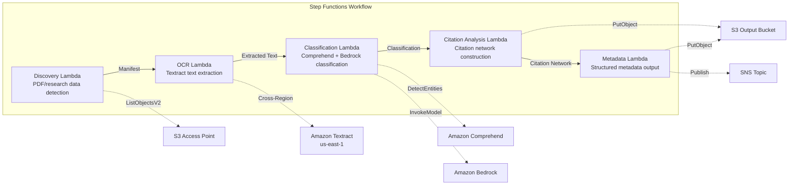

# UC13: Education / Research — Automatic Paper PDF Classification and Citation Network Analysis

🌐 **Language / 言語**: [日本語](README.md) | English | [한국어](README.ko.md) | [简体中文](README.zh-CN.md) | [繁體中文](README.zh-TW.md) | [Français](README.fr.md) | [Deutsch](README.de.md) | [Español](README.es.md)

📚 **Documentation**: [Architecture Diagram](docs/architecture.md) | [Demo Guide](docs/demo-guide.md)

## Overview

A serverless workflow that leverages the S3 Access Points of Amazon FSx for NetApp ONTAP to automate paper PDF classification, citation network analysis, and research data metadata extraction.

### When this pattern is a good fit

- A large volume of paper PDFs and research data is accumulated on FSx for ONTAP
- You want to automate text extraction from paper PDFs with Textract
- You need topic detection and entity extraction (authors, institutions, keywords) with Comprehend
- You need citation relationship analysis and automatic construction of a citation network (adjacency list)
- You want to automatically generate research domain classification and structured abstract summaries

### When this pattern is not a good fit

- A real-time paper search engine is required (OpenSearch / Elasticsearch is more appropriate)
- A complete citation database is required (CrossRef / Semantic Scholar API is more appropriate)
- Fine-tuning of large natural language processing models is required
- An environment where network reachability to the ONTAP REST API cannot be ensured

### Key features

- Automatic detection of paper PDFs (.pdf) and research data (.csv, .json, .xml) via S3 AP
- PDF text extraction with Textract (cross-region)
- Topic detection and entity extraction with Comprehend
- Research domain classification and structured abstract summary generation with Bedrock
- Citation relationship analysis from the references section and citation adjacency list construction
- Output of structured metadata (title, authors, classification, keywords, citation_count) for each paper

## Success Metrics

### Outcome
Automating paper PDF classification and citation network analysis streamlines research data management and teaching material organization.

### Metrics
| Metric | Target (example) |
|-----------|------------|
| Documents processed / run | > 200 documents |
| Classification accuracy | > 85% |
| Citation extraction success rate | > 90% |
| Processing time / document | < 30 seconds |
| Cost / run | < $8 |
| Human Review rate | < 20% (documents with uncertain classification) |

### Measurement Method
Step Functions execution history, Comprehend classification results, Textract text extraction, CloudWatch Metrics.

## Architecture



### Workflow Steps

1. **Discovery**: Detect .pdf, .csv, .json, .xml files from the S3 AP
2. **OCR**: Extract text from PDFs with Textract (cross-region)
3. **Classification**: Extract entities with Comprehend and classify research domains with Bedrock
4. **Citation Analysis**: Analyze citation relationships from the references section and build an adjacency list
5. **Metadata**: Output structured metadata for each paper as JSON to S3

## Prerequisites

- An AWS account and appropriate IAM permissions
- An FSx for ONTAP file system (ONTAP 9.17.1P4D3 or later)
- A volume with S3 Access Point enabled (storing paper PDFs and research data)
- A VPC and private subnets
- Amazon Bedrock model access enabled (Claude / Nova)
- **Cross-region**: Because Textract is not available in ap-northeast-1, a cross-region call to us-east-1 is required

## Deployment Steps

### 1. Verify cross-region parameters

Because Textract is not available in the Tokyo region, configure cross-region invocation with the `CrossRegionTarget` parameter.

### 2. SAM deployment

```bash
# Prerequisite: AWS SAM CLI required. 'sam build' packages the code and shared layer automatically.
sam build

sam deploy \
  --stack-name fsxn-education-research \
  --parameter-overrides \
    S3AccessPointAlias=<your-volume-ext-s3alias> \
    S3AccessPointName=<your-s3ap-name> \
    VpcId=<your-vpc-id> \
    PrivateSubnetIds=<subnet-1>,<subnet-2> \
    ScheduleExpression="rate(1 hour)" \
    NotificationEmail=<your-email@example.com> \
    CrossRegion=us-east-1 \
    EnableVpcEndpoints=false \
    EnableCloudWatchAlarms=false \
  --capabilities CAPABILITY_NAMED_IAM \
  --resolve-s3 \
  --region ap-northeast-1
```

> **Note**: `template.yaml` is used with the SAM CLI (`sam build` + `sam deploy`).
> To deploy directly with the `aws cloudformation deploy` command, use `template-deploy.yaml` instead (pre-packaging of Lambda zip files and upload to S3 are required).

## List of Configuration Parameters

| Parameter | Description | Default | Required |
|-----------|------|----------|------|
| `S3AccessPointAlias` | FSx for ONTAP S3 AP Alias (for input) | — | ✅ |
| `S3AccessPointName` | S3 AP name (for ARN-based IAM permission grants; when omitted, Alias-based only) | `""` | ⚠️ Recommended |
| `ScheduleExpression` | EventBridge Scheduler schedule expression | `rate(1 hour)` | |
| `VpcId` | VPC ID | — | ✅ |
| `PrivateSubnetIds` | Private subnet ID list | — | ✅ |
| `NotificationEmail` | SNS notification email address | — | ✅ |
| `CrossRegionTarget` | Target region for Textract | `us-east-1` | |
| `MapConcurrency` | Number of parallel executions of the Map state | `10` | |
| `LambdaMemorySize` | Lambda memory size (MB) | `512` | |
| `LambdaTimeout` | Lambda timeout (seconds) | `300` | |
| `EnableVpcEndpoints` | Enable Interface VPC Endpoints | `false` | |
| `EnableCloudWatchAlarms` | Enable CloudWatch Alarms | `false` | |

## Cleanup

```bash
aws s3 rm s3://fsxn-education-research-output-${AWS_ACCOUNT_ID} --recursive

aws cloudformation delete-stack \
  --stack-name fsxn-education-research \
  --region ap-northeast-1

aws cloudformation wait stack-delete-complete \
  --stack-name fsxn-education-research \
  --region ap-northeast-1
```

## Supported Regions

UC13 uses the following services:

| Service | Region constraint |
|---------|-------------|
| Amazon Textract | Not available in ap-northeast-1. Specify a supported region (e.g., us-east-1) with the `TEXTRACT_REGION` parameter |
| Amazon Comprehend | Available in almost all regions |
| Amazon Bedrock | Verify supported regions ([Bedrock supported regions](https://docs.aws.amazon.com/general/latest/gr/bedrock.html)) |
| AWS X-Ray | Available in almost all regions |
| CloudWatch EMF | Available in almost all regions |

> The Textract API is called via the Cross-Region Client. Verify your data residency requirements. For details, see the [Region Compatibility Matrix](../docs/region-compatibility.md).

## References

- [FSx for ONTAP S3 Access Points overview](https://docs.aws.amazon.com/fsx/latest/ONTAPGuide/accessing-data-via-s3-access-points.html)
- [Amazon Textract documentation](https://docs.aws.amazon.com/textract/latest/dg/what-is.html)
- [Amazon Comprehend documentation](https://docs.aws.amazon.com/comprehend/latest/dg/what-is.html)
- [Amazon Bedrock API reference](https://docs.aws.amazon.com/bedrock/latest/APIReference/API_runtime_InvokeModel.html)

---

## AWS Documentation Links

| Service | Documentation |
|---------|------------|
| FSx for ONTAP | [User Guide](https://docs.aws.amazon.com/fsx/latest/ONTAPGuide/what-is-fsx-ontap.html) |
| S3 Access Points | [S3 AP for FSx for ONTAP](https://docs.aws.amazon.com/fsx/latest/ONTAPGuide/s3-access-points.html) |
| Step Functions | [Developer Guide](https://docs.aws.amazon.com/step-functions/latest/dg/welcome.html) |
| Amazon Textract | [Developer Guide](https://docs.aws.amazon.com/textract/latest/dg/what-is.html) |
| Amazon Comprehend | [Developer Guide](https://docs.aws.amazon.com/comprehend/latest/dg/what-is.html) |
| Amazon Bedrock | [User Guide](https://docs.aws.amazon.com/bedrock/latest/userguide/what-is-bedrock.html) |

### Well-Architected Framework alignment

| Pillar | Alignment |
|----|------|
| Operational Excellence | X-Ray tracing, EMF metrics, classification accuracy monitoring |
| Security | Least-privilege IAM, KMS encryption, research data access control |
| Reliability | Step Functions Retry/Catch, cross-region Textract |
| Performance Efficiency | Parallel citation network construction, Athena partitions |
| Cost Optimization | Serverless, Comprehend batch processing |
| Sustainability | On-demand execution, incremental processing (new papers only) |

---

## Cost Estimate (Approximate Monthly)

> **Note**: The following are approximate figures for the ap-northeast-1 region, and actual costs vary with usage. Verify the latest pricing with the [AWS Pricing Calculator](https://calculator.aws/).

### Serverless components (pay-as-you-go)

| Service | Unit price | Assumed usage | Approx. monthly |
|---------|------|-----------|---------|
| Lambda | $0.0000166667/GB-sec | 5 functions × 50 papers/day | ~$1-5 |
| S3 API (GetObject/ListObjects) | $0.0047/10K requests | ~10K requests/day | ~$1.5 |
| Step Functions | $0.025/1K state transitions | ~1K transitions/day | ~$0.75 |
| Bedrock (Nova Lite) | $0.00006/1K input tokens | ~60K tokens/run | ~$3-10 |
| Athena | $5/TB scanned | ~5 MB/query | ~$0.5-2 |
| SNS | $0.50/100K notifications | ~100 notifications/day | ~$0.15 |
| CloudWatch Logs | $0.76/GB ingested | ~1 GB/month | ~$0.76 |

### Fixed cost (FSx for ONTAP — assuming existing environment)

| Component | Monthly |
|--------------|------|
| FSx for ONTAP (128 MBps, 1 TB) | ~$230 (shared existing environment) |
| S3 Access Point | No additional charge (S3 API charges only) |

### Total estimate

| Configuration | Approx. monthly |
|------|---------|
| Minimal (once-daily execution) | ~$5-15 |
| Standard (hourly execution) | ~$15-50 |
| Large-scale (high frequency + alarms) | ~$50-150 |

> **Governance Caveat**: Cost estimates are approximate and not guaranteed values. Actual billing varies with usage patterns, data volume, and region.

---

## Local Testing

### Prerequisites check

```bash
# Verify prerequisites
aws --version          # AWS CLI v2
sam --version          # SAM CLI
python3 --version      # Python 3.9+
docker --version       # Docker (for sam local)
aws sts get-caller-identity  # AWS credentials
```

### sam local invoke

```bash
# Build
# Prerequisite: AWS SAM CLI required. 'sam build' packages the code and shared layer automatically.
sam build

# Local execution of the Discovery Lambda
sam local invoke DiscoveryFunction --event events/discovery-event.json

# With environment variable overrides
sam local invoke DiscoveryFunction \
  --event events/discovery-event.json \
  --env-vars env.json
```

### Unit tests

```bash
python3 -m pytest tests/ -v
```

For details, see the [Local Testing Quick Start](../docs/local-testing-quick-start.md).

---

## Output Sample

Example output of paper PDF classification + citation network analysis:

```json
{
  "discovery": {
    "status": "completed",
    "object_count": 15,
    "prefix": "papers/"
  },
  "classification": [
    {
      "key": "papers/deep-learning-survey-2026.pdf",
      "category": "Computer Science / Machine Learning",
      "keywords": ["deep learning", "transformer", "attention"],
      "language": "en",
      "confidence": 0.94
    }
  ],
  "citation_network": {
    "nodes": 15,
    "edges": 42,
    "most_cited": "papers/attention-is-all-you-need.pdf",
    "clusters": 3,
    "adjacency_list_key": "s3://output-bucket/citations/network.json"
  },
  "summary": {
    "report_key": "reports/research-summary-2026-05-23.md",
    "total_classified": 15,
    "categories_found": 4
  }
}
```

> **Note**: The above is sample output; actual values vary with the environment and input data. Benchmark figures are a sizing reference, not a service limit.

---

## Governance Note

> This pattern provides technical architecture guidance. It is not legal, compliance, or regulatory advice. Organizations should consult qualified professionals.

---

## S3AP Compatibility

For the compatibility constraints, troubleshooting, and trigger patterns of S3 Access Points for FSx for ONTAP, see the [S3AP Compatibility Notes](../docs/s3ap-compatibility-notes.md).
