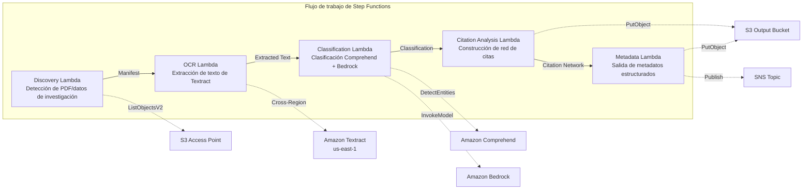

# UC13: Educación / Investigación — Clasificación automática de PDF de artículos y análisis de red de citas

🌐 **Language / 言語**: [日本語](README.md) | [English](README.en.md) | [한국어](README.ko.md) | [简体中文](README.zh-CN.md) | [繁體中文](README.zh-TW.md) | [Français](README.fr.md) | [Deutsch](README.de.md) | Español

📚 **Documentación**: [Diagrama de arquitectura](docs/architecture.md) | [Guía de demostración](docs/demo-guide.md)

## Resumen

Un flujo de trabajo serverless que aprovecha los S3 Access Points de Amazon FSx for NetApp ONTAP para automatizar la clasificación de PDF de artículos, el análisis de red de citas y la extracción de metadatos de datos de investigación.

### Cuándo es adecuado este patrón

- Se ha acumulado un gran volumen de PDF de artículos y datos de investigación en FSx for ONTAP
- Desea automatizar la extracción de texto de los PDF de artículos con Textract
- Necesita detección de temas y extracción de entidades (autores, instituciones, palabras clave) con Comprehend
- Necesita análisis de relaciones de citas y la construcción automática de una red de citas (lista de adyacencia)
- Desea generar automáticamente clasificación de dominio de investigación y resúmenes de abstract estructurados

### Cuándo no es adecuado este patrón

- Se requiere un motor de búsqueda de artículos en tiempo real (OpenSearch / Elasticsearch es más adecuado)
- Se requiere una base de datos de citas completa (CrossRef / Semantic Scholar API es más adecuada)
- Se requiere el ajuste fino de grandes modelos de procesamiento de lenguaje natural
- Un entorno en el que no se puede garantizar la accesibilidad de red a la API REST de ONTAP

### Funciones principales

- Detección automática de PDF de artículos (.pdf) y datos de investigación (.csv, .json, .xml) a través de S3 AP
- Extracción de texto de PDF con Textract (cross-region)
- Detección de temas y extracción de entidades con Comprehend
- Clasificación de dominio de investigación y generación de resúmenes de abstract estructurados con Bedrock
- Análisis de relaciones de citas desde la sección de referencias y construcción de una lista de adyacencia de citas
- Salida de metadatos estructurados (title, authors, classification, keywords, citation_count) para cada artículo

## Success Metrics

### Outcome
La automatización de la clasificación de PDF de artículos y el análisis de red de citas agiliza la gestión de datos de investigación y la organización de materiales didácticos.

### Metrics
| Métrica | Valor objetivo (ejemplo) |
|-----------|------------|
| Documentos procesados / ejecución | > 200 documents |
| Precisión de clasificación | > 85 % |
| Tasa de éxito de extracción de citas | > 90 % |
| Tiempo de procesamiento / documento | < 30 segundos |
| Costo / ejecución | < 8 $ |
| Tasa de Human Review | < 20 % (documentos con clasificación incierta) |

### Measurement Method
Historial de ejecución de Step Functions, resultados de clasificación de Comprehend, extracción de texto de Textract, CloudWatch Metrics.

## Arquitectura



### Pasos del flujo de trabajo

1. **Discovery**: Detectar archivos .pdf, .csv, .json, .xml desde el S3 AP
2. **OCR**: Extraer texto de los PDF con Textract (cross-region)
3. **Classification**: Extraer entidades con Comprehend y clasificar dominios de investigación con Bedrock
4. **Citation Analysis**: Analizar relaciones de citas desde la sección de referencias y construir una lista de adyacencia
5. **Metadata**: Generar los metadatos estructurados de cada artículo como JSON en S3

## Requisitos previos

- Una cuenta de AWS y permisos IAM adecuados
- Un sistema de archivos FSx for ONTAP (ONTAP 9.17.1P4D3 o posterior)
- Un volumen con S3 Access Point habilitado (para almacenar PDF de artículos y datos de investigación)
- Una VPC y subredes privadas
- Acceso al modelo de Amazon Bedrock habilitado (Claude / Nova)
- **Cross-region**: Dado que Textract no está disponible en ap-northeast-1, se requiere una llamada cross-region a us-east-1

## Pasos de despliegue

### 1. Verificar los parámetros cross-region

Dado que Textract no está disponible en la región de Tokio, configure la invocación cross-region con el parámetro `CrossRegionTarget`.

### 2. Despliegue con SAM

```bash
# Requisito previo: se requiere AWS SAM CLI. «sam build» empaqueta el código y la capa compartida automáticamente.
sam build

sam deploy \
  --stack-name fsxn-education-research \
  --parameter-overrides \
    S3AccessPointAlias=<your-volume-ext-s3alias> \
    S3AccessPointName=<your-s3ap-name> \
    VpcId=<your-vpc-id> \
    PrivateSubnetIds=<subnet-1>,<subnet-2> \
    ScheduleExpression="rate(1 hour)" \
    NotificationEmail=<your-email@example.com> \
    CrossRegion=us-east-1 \
    EnableVpcEndpoints=false \
    EnableCloudWatchAlarms=false \
  --capabilities CAPABILITY_NAMED_IAM \
  --resolve-s3 \
  --region ap-northeast-1
```

> **Nota**: `template.yaml` se usa con la SAM CLI (`sam build` + `sam deploy`).
> Para desplegar directamente con el comando `aws cloudformation deploy`, use `template-deploy.yaml` en su lugar (se requiere el empaquetado previo de los archivos zip de Lambda y su carga en S3).

## Lista de parámetros de configuración

| Parámetro | Descripción | Predeterminado | Obligatorio |
|-----------|------|----------|------|
| `S3AccessPointAlias` | Alias S3 AP de FSx for ONTAP (para entrada) | — | ✅ |
| `S3AccessPointName` | Nombre del S3 AP (para la concesión de permisos IAM basados en ARN; si se omite, solo basado en Alias) | `""` | ⚠️ Recomendado |
| `ScheduleExpression` | Expresión de programación de EventBridge Scheduler | `rate(1 hour)` | |
| `VpcId` | ID de VPC | — | ✅ |
| `PrivateSubnetIds` | Lista de ID de subredes privadas | — | ✅ |
| `NotificationEmail` | Dirección de correo electrónico de notificación de SNS | — | ✅ |
| `CrossRegionTarget` | Región de destino para Textract | `us-east-1` | |
| `MapConcurrency` | Número de ejecuciones paralelas del estado Map | `10` | |
| `LambdaMemorySize` | Tamaño de memoria de Lambda (MB) | `512` | |
| `LambdaTimeout` | Tiempo de espera de Lambda (segundos) | `300` | |
| `EnableVpcEndpoints` | Habilitar Interface VPC Endpoints | `false` | |
| `EnableCloudWatchAlarms` | Habilitar CloudWatch Alarms | `false` | |

## Limpieza

```bash
aws s3 rm s3://fsxn-education-research-output-${AWS_ACCOUNT_ID} --recursive

aws cloudformation delete-stack \
  --stack-name fsxn-education-research \
  --region ap-northeast-1

aws cloudformation wait stack-delete-complete \
  --stack-name fsxn-education-research \
  --region ap-northeast-1
```

## Supported Regions

UC13 utiliza los siguientes servicios:

| Servicio | Restricción de región |
|---------|-------------|
| Amazon Textract | No disponible en ap-northeast-1. Especifique una región compatible (p. ej., us-east-1) con el parámetro `TEXTRACT_REGION` |
| Amazon Comprehend | Disponible en casi todas las regiones |
| Amazon Bedrock | Verifique las regiones compatibles ([Regiones compatibles con Bedrock](https://docs.aws.amazon.com/general/latest/gr/bedrock.html)) |
| AWS X-Ray | Disponible en casi todas las regiones |
| CloudWatch EMF | Disponible en casi todas las regiones |

> La API de Textract se llama a través del Cross-Region Client. Verifique sus requisitos de residencia de datos. Para más detalles, consulte la [matriz de compatibilidad de regiones](../docs/region-compatibility.md).

## Enlaces de referencia

- [Descripción general de FSx for ONTAP S3 Access Points](https://docs.aws.amazon.com/fsx/latest/ONTAPGuide/accessing-data-via-s3-access-points.html)
- [Documentación de Amazon Textract](https://docs.aws.amazon.com/textract/latest/dg/what-is.html)
- [Documentación de Amazon Comprehend](https://docs.aws.amazon.com/comprehend/latest/dg/what-is.html)
- [Referencia de la API de Amazon Bedrock](https://docs.aws.amazon.com/bedrock/latest/APIReference/API_runtime_InvokeModel.html)

---

## Enlaces de documentación de AWS

| Servicio | Documentación |
|---------|------------|
| FSx for ONTAP | [Guía del usuario](https://docs.aws.amazon.com/fsx/latest/ONTAPGuide/what-is-fsx-ontap.html) |
| S3 Access Points | [S3 AP for FSx for ONTAP](https://docs.aws.amazon.com/fsx/latest/ONTAPGuide/s3-access-points.html) |
| Step Functions | [Guía para desarrolladores](https://docs.aws.amazon.com/step-functions/latest/dg/welcome.html) |
| Amazon Textract | [Guía para desarrolladores](https://docs.aws.amazon.com/textract/latest/dg/what-is.html) |
| Amazon Comprehend | [Guía para desarrolladores](https://docs.aws.amazon.com/comprehend/latest/dg/what-is.html) |
| Amazon Bedrock | [Guía del usuario](https://docs.aws.amazon.com/bedrock/latest/userguide/what-is-bedrock.html) |

### Alineación con el Well-Architected Framework

| Pilar | Alineación |
|----|------|
| Excelencia operativa | Rastreo con X-Ray, métricas EMF, supervisión de la precisión de clasificación |
| Seguridad | IAM de mínimo privilegio, cifrado KMS, control de acceso a datos de investigación |
| Fiabilidad | Retry/Catch de Step Functions, Textract cross-region |
| Eficiencia del rendimiento | Construcción paralela de la red de citas, particiones de Athena |
| Optimización de costos | Serverless, procesamiento por lotes de Comprehend |
| Sostenibilidad | Ejecución bajo demanda, procesamiento incremental (solo artículos nuevos) |

---

## Estimación de costos (aproximación mensual)

> **Nota**: Los siguientes son valores aproximados para la región ap-northeast-1, y los costos reales varían según el uso. Verifique los precios más recientes con la [AWS Pricing Calculator](https://calculator.aws/).

### Componentes serverless (pago por uso)

| Servicio | Precio unitario | Uso previsto | Aprox. mensual |
|---------|------|-----------|---------|
| Lambda | $0.0000166667/GB-sec | 5 funciones × 50 papers/día | ~$1-5 |
| S3 API (GetObject/ListObjects) | $0.0047/10K requests | ~10K requests/día | ~$1.5 |
| Step Functions | $0.025/1K state transitions | ~1K transitions/día | ~$0.75 |
| Bedrock (Nova Lite) | $0.00006/1K input tokens | ~60K tokens/ejecución | ~$3-10 |
| Athena | $5/TB scanned | ~5 MB/consulta | ~$0.5-2 |
| SNS | $0.50/100K notifications | ~100 notifications/día | ~$0.15 |
| CloudWatch Logs | $0.76/GB ingested | ~1 GB/mes | ~$0.76 |

### Costo fijo (FSx for ONTAP — asumiendo un entorno existente)

| Componente | Mensual |
|--------------|------|
| FSx for ONTAP (128 MBps, 1 TB) | ~$230 (entorno existente compartido) |
| S3 Access Point | Sin cargo adicional (solo cargos de S3 API) |

### Estimación total

| Configuración | Aprox. mensual |
|------|---------|
| Configuración mínima (ejecución diaria) | ~$5-15 |
| Configuración estándar (ejecución horaria) | ~$15-50 |
| Configuración a gran escala (alta frecuencia + alarmas) | ~$50-150 |

> **Governance Caveat**: Las estimaciones de costos son aproximadas y no son valores garantizados. La facturación real varía según los patrones de uso, el volumen de datos y la región.

---

## Pruebas locales

### Comprobación de requisitos previos

```bash
# Verificar los requisitos previos
aws --version          # AWS CLI v2
sam --version          # SAM CLI
python3 --version      # Python 3.9+
docker --version       # Docker (para sam local)
aws sts get-caller-identity  # Credenciales de AWS
```

### sam local invoke

```bash
# Build
# Requisito previo: se requiere AWS SAM CLI. «sam build» empaqueta el código y la capa compartida automáticamente.
sam build

# Ejecución local de la Discovery Lambda
sam local invoke DiscoveryFunction --event events/discovery-event.json

# Con anulación de variables de entorno
sam local invoke DiscoveryFunction \
  --event events/discovery-event.json \
  --env-vars env.json
```

### Pruebas unitarias

```bash
python3 -m pytest tests/ -v
```

Para más detalles, consulte el [Inicio rápido de pruebas locales](../docs/local-testing-quick-start.md).

---

## Muestra de salida (Output Sample)

Ejemplo de salida de la clasificación de PDF de artículos + análisis de red de citas:

```json
{
  "discovery": {
    "status": "completed",
    "object_count": 15,
    "prefix": "papers/"
  },
  "classification": [
    {
      "key": "papers/deep-learning-survey-2026.pdf",
      "category": "Computer Science / Machine Learning",
      "keywords": ["deep learning", "transformer", "attention"],
      "language": "en",
      "confidence": 0.94
    }
  ],
  "citation_network": {
    "nodes": 15,
    "edges": 42,
    "most_cited": "papers/attention-is-all-you-need.pdf",
    "clusters": 3,
    "adjacency_list_key": "s3://output-bucket/citations/network.json"
  },
  "summary": {
    "report_key": "reports/research-summary-2026-05-23.md",
    "total_classified": 15,
    "categories_found": 4
  }
}
```

> **Nota**: Lo anterior es una salida de muestra; los valores reales varían según el entorno y los datos de entrada. Las cifras de referencia (benchmark) son una referencia de dimensionamiento (sizing reference), no un límite de servicio (service limit).

---

## Governance Note

> Este patrón proporciona orientación sobre arquitectura técnica. No constituye asesoramiento legal, de cumplimiento ni regulatorio. Las organizaciones deben consultar a profesionales cualificados.

---

## S3AP Compatibility

Para conocer las restricciones de compatibilidad, la resolución de problemas y los patrones de activación de S3 Access Points for FSx for ONTAP, consulte las [S3AP Compatibility Notes](../docs/s3ap-compatibility-notes.md).
