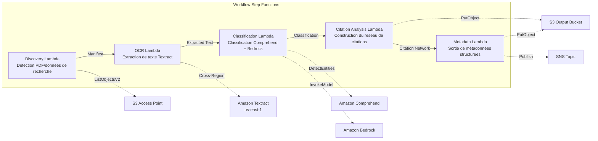

# UC13 : Éducation / Recherche — Classification automatique de PDF d'articles et analyse de réseau de citations

🌐 **Language / 言語**: [日本語](README.md) | [English](README.en.md) | [한국어](README.ko.md) | [简体中文](README.zh-CN.md) | [繁體中文](README.zh-TW.md) | Français | [Deutsch](README.de.md) | [Español](README.es.md)

📚 **Documentation** : [Schéma d'architecture](docs/architecture.md) | [Guide de démonstration](docs/demo-guide.md)

## Aperçu

Un workflow serverless qui s'appuie sur les S3 Access Points d'Amazon FSx for NetApp ONTAP pour automatiser la classification des PDF d'articles, l'analyse de réseau de citations et l'extraction de métadonnées de données de recherche.

### Quand ce pattern convient

- Un grand volume de PDF d'articles et de données de recherche est accumulé sur FSx for ONTAP
- Vous souhaitez automatiser l'extraction de texte des PDF d'articles avec Textract
- Vous avez besoin de détection de sujets et d'extraction d'entités (auteurs, institutions, mots-clés) avec Comprehend
- Vous avez besoin d'une analyse des relations de citation et de la construction automatique d'un réseau de citations (liste d'adjacence)
- Vous souhaitez générer automatiquement une classification de domaine de recherche et des résumés d'abstract structurés

### Quand ce pattern ne convient pas

- Un moteur de recherche d'articles en temps réel est requis (OpenSearch / Elasticsearch est plus adapté)
- Une base de données de citations complète est requise (CrossRef / Semantic Scholar API est plus adapté)
- Un fine-tuning de grands modèles de traitement du langage naturel est requis
- Un environnement où l'accessibilité réseau à l'API REST ONTAP ne peut pas être garantie

### Fonctionnalités principales

- Détection automatique des PDF d'articles (.pdf) et des données de recherche (.csv, .json, .xml) via S3 AP
- Extraction de texte des PDF avec Textract (cross-region)
- Détection de sujets et extraction d'entités avec Comprehend
- Classification de domaine de recherche et génération de résumés d'abstract structurés avec Bedrock
- Analyse des relations de citation depuis la section des références et construction d'une liste d'adjacence de citations
- Sortie de métadonnées structurées (title, authors, classification, keywords, citation_count) pour chaque article

## Success Metrics

### Outcome
L'automatisation de la classification des PDF d'articles et de l'analyse de réseau de citations rationalise la gestion des données de recherche et l'organisation des supports pédagogiques.

### Metrics
| Métrique | Valeur cible (exemple) |
|-----------|------------|
| Documents traités / exécution | > 200 documents |
| Précision de classification | > 85 % |
| Taux de réussite d'extraction de citations | > 90 % |
| Temps de traitement / document | < 30 secondes |
| Coût / exécution | < 8 $ |
| Taux de Human Review | < 20 % (documents à classification incertaine) |

### Measurement Method
Historique d'exécution Step Functions, résultats de classification Comprehend, extraction de texte Textract, CloudWatch Metrics.

## Architecture



### Étapes du workflow

1. **Discovery** : Détecter les fichiers .pdf, .csv, .json, .xml depuis le S3 AP
2. **OCR** : Extraire le texte des PDF avec Textract (cross-region)
3. **Classification** : Extraire les entités avec Comprehend et classer les domaines de recherche avec Bedrock
4. **Citation Analysis** : Analyser les relations de citation depuis la section des références et construire une liste d'adjacence
5. **Metadata** : Sortir les métadonnées structurées de chaque article au format JSON vers S3

## Prérequis

- Un compte AWS et des permissions IAM appropriées
- Un système de fichiers FSx for ONTAP (ONTAP 9.17.1P4D3 ou version ultérieure)
- Un volume avec S3 Access Point activé (pour stocker les PDF d'articles et les données de recherche)
- Un VPC et des sous-réseaux privés
- L'accès au modèle Amazon Bedrock activé (Claude / Nova)
- **Cross-region** : Comme Textract n'est pas disponible dans ap-northeast-1, un appel cross-region vers us-east-1 est requis

## Étapes de déploiement

### 1. Vérifier les paramètres cross-region

Comme Textract n'est pas disponible dans la région de Tokyo, configurez l'invocation cross-region avec le paramètre `CrossRegionTarget`.

### 2. Déploiement SAM

```bash
# Prérequis : AWS SAM CLI requis. « sam build » package le code et la couche partagée automatiquement.
sam build

sam deploy \
  --stack-name fsxn-education-research \
  --parameter-overrides \
    S3AccessPointAlias=<your-volume-ext-s3alias> \
    S3AccessPointName=<your-s3ap-name> \
    VpcId=<your-vpc-id> \
    PrivateSubnetIds=<subnet-1>,<subnet-2> \
    ScheduleExpression="rate(1 hour)" \
    NotificationEmail=<your-email@example.com> \
    CrossRegion=us-east-1 \
    EnableVpcEndpoints=false \
    EnableCloudWatchAlarms=false \
  --capabilities CAPABILITY_NAMED_IAM \
  --resolve-s3 \
  --region ap-northeast-1
```

> **Note** : `template.yaml` s'utilise avec la SAM CLI (`sam build` + `sam deploy`).
> Pour déployer directement avec la commande `aws cloudformation deploy`, utilisez `template-deploy.yaml` à la place (le pré-packaging des fichiers zip Lambda et leur téléversement vers S3 sont requis).

## Liste des paramètres de configuration

| Paramètre | Description | Par défaut | Requis |
|-----------|------|----------|------|
| `S3AccessPointAlias` | Alias S3 AP FSx for ONTAP (pour l'entrée) | — | ✅ |
| `S3AccessPointName` | Nom du S3 AP (pour l'octroi de permissions IAM basées sur l'ARN ; si omis, uniquement basé sur l'Alias) | `""` | ⚠️ Recommandé |
| `ScheduleExpression` | Expression de planification d'EventBridge Scheduler | `rate(1 hour)` | |
| `VpcId` | ID du VPC | — | ✅ |
| `PrivateSubnetIds` | Liste des ID de sous-réseaux privés | — | ✅ |
| `NotificationEmail` | Adresse e-mail de notification SNS | — | ✅ |
| `CrossRegionTarget` | Région cible pour Textract | `us-east-1` | |
| `MapConcurrency` | Nombre d'exécutions parallèles de l'état Map | `10` | |
| `LambdaMemorySize` | Taille mémoire Lambda (Mo) | `512` | |
| `LambdaTimeout` | Délai d'expiration Lambda (secondes) | `300` | |
| `EnableVpcEndpoints` | Activer les Interface VPC Endpoints | `false` | |
| `EnableCloudWatchAlarms` | Activer les CloudWatch Alarms | `false` | |

## Nettoyage

```bash
aws s3 rm s3://fsxn-education-research-output-${AWS_ACCOUNT_ID} --recursive

aws cloudformation delete-stack \
  --stack-name fsxn-education-research \
  --region ap-northeast-1

aws cloudformation wait stack-delete-complete \
  --stack-name fsxn-education-research \
  --region ap-northeast-1
```

## Supported Regions

UC13 utilise les services suivants :

| Service | Contrainte de région |
|---------|-------------|
| Amazon Textract | Non disponible dans ap-northeast-1. Spécifiez une région prise en charge (p. ex. us-east-1) avec le paramètre `TEXTRACT_REGION` |
| Amazon Comprehend | Disponible dans presque toutes les régions |
| Amazon Bedrock | Vérifiez les régions prises en charge ([Régions prises en charge par Bedrock](https://docs.aws.amazon.com/general/latest/gr/bedrock.html)) |
| AWS X-Ray | Disponible dans presque toutes les régions |
| CloudWatch EMF | Disponible dans presque toutes les régions |

> L'API Textract est appelée via le Cross-Region Client. Vérifiez vos exigences de résidence des données. Pour plus de détails, consultez la [matrice de compatibilité des régions](../docs/region-compatibility.md).

## Liens de référence

- [Présentation des S3 Access Points FSx for ONTAP](https://docs.aws.amazon.com/fsx/latest/ONTAPGuide/accessing-data-via-s3-access-points.html)
- [Documentation Amazon Textract](https://docs.aws.amazon.com/textract/latest/dg/what-is.html)
- [Documentation Amazon Comprehend](https://docs.aws.amazon.com/comprehend/latest/dg/what-is.html)
- [Référence de l'API Amazon Bedrock](https://docs.aws.amazon.com/bedrock/latest/APIReference/API_runtime_InvokeModel.html)

---

## Liens de documentation AWS

| Service | Documentation |
|---------|------------|
| FSx for ONTAP | [Guide de l'utilisateur](https://docs.aws.amazon.com/fsx/latest/ONTAPGuide/what-is-fsx-ontap.html) |
| S3 Access Points | [S3 AP for FSx for ONTAP](https://docs.aws.amazon.com/fsx/latest/ONTAPGuide/s3-access-points.html) |
| Step Functions | [Guide du développeur](https://docs.aws.amazon.com/step-functions/latest/dg/welcome.html) |
| Amazon Textract | [Guide du développeur](https://docs.aws.amazon.com/textract/latest/dg/what-is.html) |
| Amazon Comprehend | [Guide du développeur](https://docs.aws.amazon.com/comprehend/latest/dg/what-is.html) |
| Amazon Bedrock | [Guide de l'utilisateur](https://docs.aws.amazon.com/bedrock/latest/userguide/what-is-bedrock.html) |

### Alignement avec le Well-Architected Framework

| Pilier | Alignement |
|----|------|
| Excellence opérationnelle | Traçage X-Ray, métriques EMF, surveillance de la précision de classification |
| Sécurité | IAM à moindre privilège, chiffrement KMS, contrôle d'accès aux données de recherche |
| Fiabilité | Retry/Catch Step Functions, Textract cross-region |
| Efficacité des performances | Construction parallèle du réseau de citations, partitions Athena |
| Optimisation des coûts | Serverless, traitement par lots Comprehend |
| Durabilité | Exécution à la demande, traitement incrémental (nouveaux articles uniquement) |

---

## Estimation des coûts (approximation mensuelle)

> **Remarque** : Les valeurs suivantes sont des approximations pour la région ap-northeast-1, et les coûts réels varient selon l'utilisation. Vérifiez les tarifs les plus récents avec l'[AWS Pricing Calculator](https://calculator.aws/).

### Composants serverless (paiement à l'usage)

| Service | Prix unitaire | Utilisation estimée | Approx. mensuelle |
|---------|------|-----------|---------|
| Lambda | $0.0000166667/GB-sec | 5 fonctions × 50 papers/jour | ~$1-5 |
| S3 API (GetObject/ListObjects) | $0.0047/10K requests | ~10K requests/jour | ~$1.5 |
| Step Functions | $0.025/1K state transitions | ~1K transitions/jour | ~$0.75 |
| Bedrock (Nova Lite) | $0.00006/1K input tokens | ~60K tokens/exécution | ~$3-10 |
| Athena | $5/TB scanned | ~5 MB/requête | ~$0.5-2 |
| SNS | $0.50/100K notifications | ~100 notifications/jour | ~$0.15 |
| CloudWatch Logs | $0.76/GB ingested | ~1 GB/mois | ~$0.76 |

### Coût fixe (FSx for ONTAP — en supposant un environnement existant)

| Composant | Mensuel |
|--------------|------|
| FSx for ONTAP (128 MBps, 1 TB) | ~$230 (environnement existant partagé) |
| S3 Access Point | Aucun frais supplémentaire (uniquement les frais S3 API) |

### Estimation totale

| Configuration | Approx. mensuelle |
|------|---------|
| Configuration minimale (exécution quotidienne) | ~$5-15 |
| Configuration standard (exécution horaire) | ~$15-50 |
| Configuration à grande échelle (haute fréquence + alarmes) | ~$50-150 |

> **Governance Caveat** : Les estimations de coûts sont approximatives et ne constituent pas des valeurs garanties. La facturation réelle varie selon les modèles d'utilisation, le volume de données et la région.

---

## Tests locaux

### Vérification des prérequis

```bash
# Vérifier les prérequis
aws --version          # AWS CLI v2
sam --version          # SAM CLI
python3 --version      # Python 3.9+
docker --version       # Docker (pour sam local)
aws sts get-caller-identity  # Identifiants AWS
```

### sam local invoke

```bash
# Build
# Prérequis : AWS SAM CLI requis. « sam build » package le code et la couche partagée automatiquement.
sam build

# Exécution locale de la Discovery Lambda
sam local invoke DiscoveryFunction --event events/discovery-event.json

# Avec surcharge des variables d'environnement
sam local invoke DiscoveryFunction \
  --event events/discovery-event.json \
  --env-vars env.json
```

### Tests unitaires

```bash
python3 -m pytest tests/ -v
```

Pour plus de détails, consultez le [Démarrage rapide des tests locaux](../docs/local-testing-quick-start.md).

---

## Exemple de sortie (Output Sample)

Exemple de sortie de la classification des PDF d'articles + analyse de réseau de citations :

```json
{
  "discovery": {
    "status": "completed",
    "object_count": 15,
    "prefix": "papers/"
  },
  "classification": [
    {
      "key": "papers/deep-learning-survey-2026.pdf",
      "category": "Computer Science / Machine Learning",
      "keywords": ["deep learning", "transformer", "attention"],
      "language": "en",
      "confidence": 0.94
    }
  ],
  "citation_network": {
    "nodes": 15,
    "edges": 42,
    "most_cited": "papers/attention-is-all-you-need.pdf",
    "clusters": 3,
    "adjacency_list_key": "s3://output-bucket/citations/network.json"
  },
  "summary": {
    "report_key": "reports/research-summary-2026-05-23.md",
    "total_classified": 15,
    "categories_found": 4
  }
}
```

> **Remarque** : Ce qui précède est un exemple de sortie ; les valeurs réelles varient selon l'environnement et les données d'entrée. Les chiffres de benchmark sont une référence de dimensionnement (sizing reference), pas une limite de service (service limit).

---

## Governance Note

> Ce pattern fournit des orientations d'architecture technique. Il ne s'agit pas de conseils juridiques, de conformité ou réglementaires. Les organisations doivent consulter des professionnels qualifiés.

---

## S3AP Compatibility

Pour les contraintes de compatibilité, le dépannage et les patterns de déclenchement des S3 Access Points for FSx for ONTAP, consultez les [S3AP Compatibility Notes](../docs/s3ap-compatibility-notes.md).
