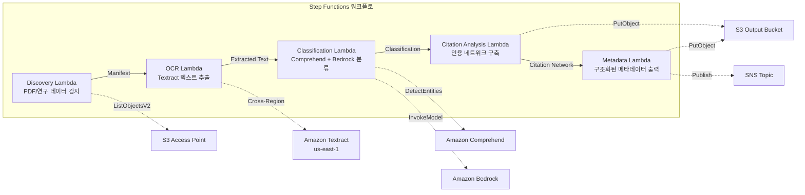

# UC13: 교육 / 연구 — 논문 PDF 자동 분류 · 인용 네트워크 분석

🌐 **Language / 言語**: [日本語](README.md) | [English](README.en.md) | 한국어 | [简体中文](README.zh-CN.md) | [繁體中文](README.zh-TW.md) | [Français](README.fr.md) | [Deutsch](README.de.md) | [Español](README.es.md)

📚 **문서**: [아키텍처 다이어그램](docs/architecture.md) | [데모 가이드](docs/demo-guide.md)

## 개요

Amazon FSx for NetApp ONTAP의 S3 Access Points를 활용하여 논문 PDF 자동 분류, 인용 네트워크 분석, 연구 데이터 메타데이터 추출을 자동화하는 서버리스 워크플로입니다.

### 이 패턴이 적합한 경우

- 논문 PDF나 연구 데이터가 FSx for ONTAP에 대량으로 축적되어 있음
- Textract를 사용한 논문 PDF의 텍스트 추출을 자동화하고 싶음
- Comprehend를 사용한 토픽 감지 · 엔터티 추출(저자, 기관, 키워드)이 필요함
- 인용 관계 분석과 인용 네트워크(인접 리스트)의 자동 구축이 필요함
- 연구 도메인 분류와 구조화된 초록 요약을 자동 생성하고 싶음

### 이 패턴이 적합하지 않은 경우

- 실시간 논문 검색 엔진이 필요함(OpenSearch / Elasticsearch가 적합)
- 완전한 인용 데이터베이스가 필요함(CrossRef / Semantic Scholar API가 적합)
- 대규모 자연어 처리 모델의 파인 튜닝이 필요함
- ONTAP REST API로의 네트워크 도달성을 확보할 수 없는 환경

### 주요 기능

- S3 AP를 통해 논문 PDF(.pdf)와 연구 데이터(.csv, .json, .xml)를 자동 감지
- Textract(교차 리전)를 통한 PDF 텍스트 추출
- Comprehend를 통한 토픽 감지 · 엔터티 추출
- Bedrock을 통한 연구 도메인 분류와 구조화된 초록 요약 생성
- 참고문헌 섹션에서의 인용 관계 분석과 인용 인접 리스트 구축
- 각 논문의 구조화된 메타데이터(title, authors, classification, keywords, citation_count) 출력

## Success Metrics

### Outcome
논문 PDF 분류 · 인용 네트워크 분석의 자동화를 통해 연구 데이터 관리와 교재 정리를 효율화합니다.

### Metrics
| 메트릭 | 목표값(예) |
|-----------|------------|
| 처리 완료 문서 수 / 실행 | > 200 documents |
| 분류 정확도 | > 85% |
| 인용 추출 성공률 | > 90% |
| 처리 시간 / 문서 | < 30 초 |
| 비용 / 실행 | < $8 |
| Human Review 대상 비율 | < 20%(분류가 불확실한 문서) |

### Measurement Method
Step Functions 실행 이력, Comprehend 분류 결과, Textract 텍스트 추출, CloudWatch Metrics.

## 아키텍처



### 워크플로 단계

1. **Discovery**: S3 AP에서 .pdf, .csv, .json, .xml 파일을 감지
2. **OCR**: Textract(교차 리전)로 PDF에서 텍스트 추출
3. **Classification**: Comprehend로 엔터티 추출, Bedrock으로 연구 도메인 분류
4. **Citation Analysis**: 참고문헌 섹션에서 인용 관계를 분석하여 인접 리스트를 구축
5. **Metadata**: 각 논문의 구조화된 메타데이터를 JSON으로 S3에 출력

## 전제 조건

- AWS 계정과 적절한 IAM 권한
- FSx for ONTAP 파일 시스템(ONTAP 9.17.1P4D3 이상)
- S3 Access Point가 활성화된 볼륨(논문 PDF · 연구 데이터를 저장)
- VPC, 프라이빗 서브넷
- Amazon Bedrock 모델 액세스가 활성화됨(Claude / Nova)
- **교차 리전**: Textract는 ap-northeast-1을 지원하지 않으므로 us-east-1로의 교차 리전 호출이 필요함

## 배포 절차

### 1. 교차 리전 파라미터 확인

Textract는 도쿄 리전을 지원하지 않으므로 `CrossRegionTarget` 파라미터로 교차 리전 호출을 설정합니다.

### 2. SAM 배포

```bash
# 전제: AWS SAM CLI가 필요합니다. sam build가 코드와 공유 레이어를 자동으로 패키징합니다.
sam build

sam deploy \
  --stack-name fsxn-education-research \
  --parameter-overrides \
    S3AccessPointAlias=<your-volume-ext-s3alias> \
    S3AccessPointName=<your-s3ap-name> \
    VpcId=<your-vpc-id> \
    PrivateSubnetIds=<subnet-1>,<subnet-2> \
    ScheduleExpression="rate(1 hour)" \
    NotificationEmail=<your-email@example.com> \
    CrossRegion=us-east-1 \
    EnableVpcEndpoints=false \
    EnableCloudWatchAlarms=false \
  --capabilities CAPABILITY_NAMED_IAM \
  --resolve-s3 \
  --region ap-northeast-1
```

> **주의**: `template.yaml`은 SAM CLI(`sam build` + `sam deploy`)로 사용합니다.
> `aws cloudformation deploy` 명령으로 직접 배포하는 경우에는 `template-deploy.yaml`을 사용하세요(Lambda zip 파일의 사전 패키징과 S3 업로드가 필요합니다).

## 설정 파라미터 목록

| 파라미터 | 설명 | 기본값 | 필수 |
|-----------|------|----------|------|
| `S3AccessPointAlias` | FSx for ONTAP S3 AP Alias(입력용) | — | ✅ |
| `S3AccessPointName` | S3 AP 이름(ARN 기반 IAM 권한 부여용. 생략 시 Alias 기반만) | `""` | ⚠️ 권장 |
| `ScheduleExpression` | EventBridge Scheduler의 스케줄 식 | `rate(1 hour)` | |
| `VpcId` | VPC ID | — | ✅ |
| `PrivateSubnetIds` | 프라이빗 서브넷 ID 목록 | — | ✅ |
| `NotificationEmail` | SNS 알림 대상 이메일 주소 | — | ✅ |
| `CrossRegionTarget` | Textract의 대상 리전 | `us-east-1` | |
| `MapConcurrency` | Map 상태의 병렬 실행 수 | `10` | |
| `LambdaMemorySize` | Lambda 메모리 크기 (MB) | `512` | |
| `LambdaTimeout` | Lambda 타임아웃 (초) | `300` | |
| `EnableVpcEndpoints` | Interface VPC Endpoints 활성화 | `false` | |
| `EnableCloudWatchAlarms` | CloudWatch Alarms 활성화 | `false` | |

## 정리

```bash
aws s3 rm s3://fsxn-education-research-output-${AWS_ACCOUNT_ID} --recursive

aws cloudformation delete-stack \
  --stack-name fsxn-education-research \
  --region ap-northeast-1

aws cloudformation wait stack-delete-complete \
  --stack-name fsxn-education-research \
  --region ap-northeast-1
```

## Supported Regions

UC13은 다음 서비스를 사용합니다:

| 서비스 | 리전 제약 |
|---------|-------------|
| Amazon Textract | ap-northeast-1 미지원. `TEXTRACT_REGION` 파라미터로 지원 리전(us-east-1 등)을 지정 |
| Amazon Comprehend | 거의 모든 리전에서 사용 가능 |
| Amazon Bedrock | 지원 리전 확인([Bedrock 지원 리전](https://docs.aws.amazon.com/general/latest/gr/bedrock.html)) |
| AWS X-Ray | 거의 모든 리전에서 사용 가능 |
| CloudWatch EMF | 거의 모든 리전에서 사용 가능 |

> Cross-Region Client를 통해 Textract API를 호출합니다. 데이터 레지던시 요건을 확인하세요. 자세한 내용은 [리전 호환성 매트릭스](../docs/region-compatibility.md)를 참조하세요.

## 참고 링크

- [FSx for ONTAP S3 Access Points 개요](https://docs.aws.amazon.com/fsx/latest/ONTAPGuide/accessing-data-via-s3-access-points.html)
- [Amazon Textract 문서](https://docs.aws.amazon.com/textract/latest/dg/what-is.html)
- [Amazon Comprehend 문서](https://docs.aws.amazon.com/comprehend/latest/dg/what-is.html)
- [Amazon Bedrock API 레퍼런스](https://docs.aws.amazon.com/bedrock/latest/APIReference/API_runtime_InvokeModel.html)

---

## AWS 문서 링크

| 서비스 | 문서 |
|---------|------------|
| FSx for ONTAP | [사용자 가이드](https://docs.aws.amazon.com/fsx/latest/ONTAPGuide/what-is-fsx-ontap.html) |
| S3 Access Points | [S3 AP for FSx for ONTAP](https://docs.aws.amazon.com/fsx/latest/ONTAPGuide/s3-access-points.html) |
| Step Functions | [개발자 가이드](https://docs.aws.amazon.com/step-functions/latest/dg/welcome.html) |
| Amazon Textract | [개발자 가이드](https://docs.aws.amazon.com/textract/latest/dg/what-is.html) |
| Amazon Comprehend | [개발자 가이드](https://docs.aws.amazon.com/comprehend/latest/dg/what-is.html) |
| Amazon Bedrock | [사용자 가이드](https://docs.aws.amazon.com/bedrock/latest/userguide/what-is-bedrock.html) |

### Well-Architected Framework 대응

| 기둥 | 대응 |
|----|------|
| 운영 우수성 | X-Ray 트레이싱, EMF 메트릭, 분류 정확도 모니터링 |
| 보안 | 최소 권한 IAM, KMS 암호화, 연구 데이터 액세스 제어 |
| 신뢰성 | Step Functions Retry/Catch, 교차 리전 Textract |
| 성능 효율성 | 인용 네트워크 병렬 구축, Athena 파티션 |
| 비용 최적화 | 서버리스, Comprehend 배치 처리 |
| 지속 가능성 | 온디맨드 실행, 증분 처리(신규 논문만) |

---

## 비용 견적(월간 개산)

> **참고**: 다음은 ap-northeast-1 리전의 개산이며 실제 비용은 사용량에 따라 다릅니다. 최신 요금은 [AWS Pricing Calculator](https://calculator.aws/)에서 확인하세요.

### 서버리스 컴포넌트(종량 과금)

| 서비스 | 단가 | 예상 사용량 | 월간 개산 |
|---------|------|-----------|---------|
| Lambda | $0.0000166667/GB-sec | 5 함수 × 50 papers/일 | ~$1-5 |
| S3 API (GetObject/ListObjects) | $0.0047/10K requests | ~10K requests/일 | ~$1.5 |
| Step Functions | $0.025/1K state transitions | ~1K transitions/일 | ~$0.75 |
| Bedrock (Nova Lite) | $0.00006/1K input tokens | ~60K tokens/실행 | ~$3-10 |
| Athena | $5/TB scanned | ~5 MB/쿼리 | ~$0.5-2 |
| SNS | $0.50/100K notifications | ~100 notifications/일 | ~$0.15 |
| CloudWatch Logs | $0.76/GB ingested | ~1 GB/월 | ~$0.76 |

### 고정 비용(FSx for ONTAP — 기존 환경 전제)

| 컴포넌트 | 월간 |
|--------------|------|
| FSx for ONTAP (128 MBps, 1 TB) | ~$230 (기존 환경을 공유) |
| S3 Access Point | 추가 요금 없음(S3 API 요금만) |

### 합계 개산

| 구성 | 월간 개산 |
|------|---------|
| 최소 구성(일 1회 실행) | ~$5-15 |
| 표준 구성(시간 단위 실행) | ~$15-50 |
| 대규모 구성(고빈도 + 알람) | ~$50-150 |

> **Governance Caveat**: 비용 견적은 개산이며 보장값이 아닙니다. 실제 청구액은 사용 패턴, 데이터 양, 리전에 따라 다릅니다.

---

## 로컬 테스트

### Prerequisites 확인

```bash
# 전제 조건 확인
aws --version          # AWS CLI v2
sam --version          # SAM CLI
python3 --version      # Python 3.9+
docker --version       # Docker (sam local 용)
aws sts get-caller-identity  # AWS 자격 증명
```

### sam local invoke

```bash
# 빌드
# 전제: AWS SAM CLI가 필요합니다. sam build가 코드와 공유 레이어를 자동으로 패키징합니다.
sam build

# Discovery Lambda 로컬 실행
sam local invoke DiscoveryFunction --event events/discovery-event.json

# 환경 변수 오버라이드 포함
sam local invoke DiscoveryFunction \
  --event events/discovery-event.json \
  --env-vars env.json
```

### 유닛 테스트

```bash
python3 -m pytest tests/ -v
```

자세한 내용은 [로컬 테스트 퀵 스타트](../docs/local-testing-quick-start.md)를 참조하세요.

---

## 출력 샘플 (Output Sample)

논문 PDF 분류 + 인용 네트워크 분석의 출력 예:

```json
{
  "discovery": {
    "status": "completed",
    "object_count": 15,
    "prefix": "papers/"
  },
  "classification": [
    {
      "key": "papers/deep-learning-survey-2026.pdf",
      "category": "Computer Science / Machine Learning",
      "keywords": ["deep learning", "transformer", "attention"],
      "language": "en",
      "confidence": 0.94
    }
  ],
  "citation_network": {
    "nodes": 15,
    "edges": 42,
    "most_cited": "papers/attention-is-all-you-need.pdf",
    "clusters": 3,
    "adjacency_list_key": "s3://output-bucket/citations/network.json"
  },
  "summary": {
    "report_key": "reports/research-summary-2026-05-23.md",
    "total_classified": 15,
    "categories_found": 4
  }
}
```

> **참고**: 위는 샘플 출력이며 실제 값은 환경 · 입력 데이터에 따라 다릅니다. 벤치마크 수치는 sizing reference이며 service limit이 아닙니다.

---

## Governance Note

> 본 패턴은 기술 아키텍처 가이던스를 제공합니다. 법률 · 컴플라이언스 · 규제상의 조언이 아닙니다. 조직은 적격한 전문가에게 상담하세요.

---

## S3AP Compatibility

S3 Access Points for FSx for ONTAP의 호환성 제약, 문제 해결, 트리거 패턴에 대해서는 [S3AP Compatibility Notes](../docs/s3ap-compatibility-notes.md)를 참조하세요.
