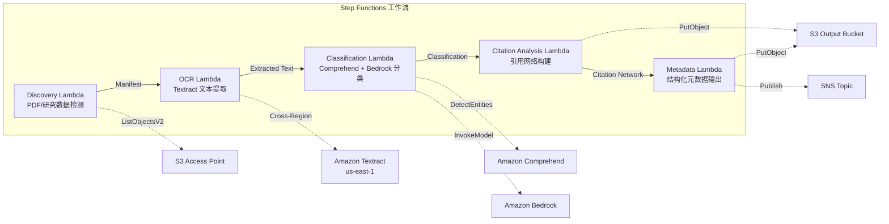

# UC13：教育 / 研究 — 论文 PDF 自动分类与引用网络分析

🌐 **Language / 言語**: [日本語](README.md) | [English](README.en.md) | [한국어](README.ko.md) | 简体中文 | [繁體中文](README.zh-TW.md) | [Français](README.fr.md) | [Deutsch](README.de.md) | [Español](README.es.md)

📚 **文档**: [架构图](docs/architecture.md) | [演示指南](docs/demo-guide.md)

## 概述

一个借助 Amazon FSx for NetApp ONTAP 的 S3 Access Points，自动完成论文 PDF 分类、引用网络分析和研究数据元数据提取的无服务器工作流。

### 适用此模式的场景

- 大量论文 PDF 或研究数据已积累在 FSx for ONTAP 上
- 希望使用 Textract 自动完成论文 PDF 的文本提取
- 需要使用 Comprehend 进行主题检测与实体提取（作者、机构、关键词）
- 需要引用关系解析和引用网络（邻接表）的自动构建
- 希望自动生成研究领域分类和结构化摘要总结

### 不适用此模式的场景

- 需要实时论文检索引擎（OpenSearch / Elasticsearch 更合适）
- 需要完整的引用数据库（CrossRef / Semantic Scholar API 更合适）
- 需要对大规模自然语言处理模型进行微调
- 无法确保到 ONTAP REST API 网络可达性的环境

### 主要功能

- 通过 S3 AP 自动检测论文 PDF（.pdf）和研究数据（.csv、.json、.xml）
- 使用 Textract（跨区域）进行 PDF 文本提取
- 使用 Comprehend 进行主题检测与实体提取
- 使用 Bedrock 进行研究领域分类和结构化摘要总结生成
- 从参考文献部分解析引用关系并构建引用邻接表
- 输出每篇论文的结构化元数据（title、authors、classification、keywords、citation_count）

## Success Metrics

### Outcome
通过论文 PDF 分类与引用网络分析的自动化，提升研究数据管理和教材整理的效率。

### Metrics
| 指标 | 目标值（示例） |
|-----------|------------|
| 已处理文档数 / 每次执行 | > 200 documents |
| 分类准确率 | > 85% |
| 引用提取成功率 | > 90% |
| 处理时间 / 每篇文档 | < 30 秒 |
| 成本 / 每次执行 | < $8 |
| Human Review 对象比例 | < 20%（分类不确定的文档） |

### Measurement Method
Step Functions 执行历史、Comprehend 分类结果、Textract 文本提取、CloudWatch Metrics。

## 架构



### 工作流步骤

1. **Discovery**：从 S3 AP 检测 .pdf、.csv、.json、.xml 文件
2. **OCR**：使用 Textract（跨区域）从 PDF 提取文本
3. **Classification**：使用 Comprehend 提取实体，使用 Bedrock 分类研究领域
4. **Citation Analysis**：从参考文献部分解析引用关系并构建邻接表
5. **Metadata**：将每篇论文的结构化元数据以 JSON 形式输出到 S3

## 前提条件

- AWS 账户和适当的 IAM 权限
- FSx for ONTAP 文件系统（ONTAP 9.17.1P4D3 或更高版本）
- 已启用 S3 Access Point 的卷（用于存放论文 PDF 与研究数据）
- VPC、私有子网
- 已启用 Amazon Bedrock 模型访问（Claude / Nova）
- **跨区域**：由于 Textract 不支持 ap-northeast-1，因此需要进行到 us-east-1 的跨区域调用

## 部署步骤

### 1. 确认跨区域参数

由于 Textract 不支持东京区域，请使用 `CrossRegionTarget` 参数配置跨区域调用。

### 2. SAM 部署

```bash
# 前提：需要 AWS SAM CLI。sam build 会自动打包代码和共享层。
sam build

sam deploy \
  --stack-name fsxn-education-research \
  --parameter-overrides \
    S3AccessPointAlias=<your-volume-ext-s3alias> \
    S3AccessPointName=<your-s3ap-name> \
    VpcId=<your-vpc-id> \
    PrivateSubnetIds=<subnet-1>,<subnet-2> \
    ScheduleExpression="rate(1 hour)" \
    NotificationEmail=<your-email@example.com> \
    CrossRegion=us-east-1 \
    EnableVpcEndpoints=false \
    EnableCloudWatchAlarms=false \
  --capabilities CAPABILITY_NAMED_IAM \
  --resolve-s3 \
  --region ap-northeast-1
```

> **注意**：`template.yaml` 用于 SAM CLI（`sam build` + `sam deploy`）。
> 若使用 `aws cloudformation deploy` 命令直接部署，请改用 `template-deploy.yaml`（需要预先打包 Lambda zip 文件并上传到 S3）。

## 配置参数一览

| 参数 | 说明 | 默认值 | 必填 |
|-----------|------|----------|------|
| `S3AccessPointAlias` | FSx for ONTAP S3 AP Alias（用于输入） | — | ✅ |
| `S3AccessPointName` | S3 AP 名称（用于基于 ARN 的 IAM 权限授予；省略时仅基于 Alias） | `""` | ⚠️ 推荐 |
| `ScheduleExpression` | EventBridge Scheduler 的调度表达式 | `rate(1 hour)` | |
| `VpcId` | VPC ID | — | ✅ |
| `PrivateSubnetIds` | 私有子网 ID 列表 | — | ✅ |
| `NotificationEmail` | SNS 通知目标邮箱地址 | — | ✅ |
| `CrossRegionTarget` | Textract 的目标区域 | `us-east-1` | |
| `MapConcurrency` | Map 状态的并行执行数 | `10` | |
| `LambdaMemorySize` | Lambda 内存大小 (MB) | `512` | |
| `LambdaTimeout` | Lambda 超时时间 (秒) | `300` | |
| `EnableVpcEndpoints` | 启用 Interface VPC Endpoints | `false` | |
| `EnableCloudWatchAlarms` | 启用 CloudWatch Alarms | `false` | |

## 清理

```bash
aws s3 rm s3://fsxn-education-research-output-${AWS_ACCOUNT_ID} --recursive

aws cloudformation delete-stack \
  --stack-name fsxn-education-research \
  --region ap-northeast-1

aws cloudformation wait stack-delete-complete \
  --stack-name fsxn-education-research \
  --region ap-northeast-1
```

## Supported Regions

UC13 使用以下服务：

| 服务 | 区域约束 |
|---------|-------------|
| Amazon Textract | 不支持 ap-northeast-1。使用 `TEXTRACT_REGION` 参数指定支持的区域（如 us-east-1） |
| Amazon Comprehend | 几乎所有区域均可用 |
| Amazon Bedrock | 确认支持的区域（[Bedrock 支持的区域](https://docs.aws.amazon.com/general/latest/gr/bedrock.html)） |
| AWS X-Ray | 几乎所有区域均可用 |
| CloudWatch EMF | 几乎所有区域均可用 |

> 通过 Cross-Region Client 调用 Textract API。请确认您的数据驻留要求。详情请参阅[区域兼容性矩阵](../docs/region-compatibility.md)。

## 参考链接

- [FSx for ONTAP S3 Access Points 概述](https://docs.aws.amazon.com/fsx/latest/ONTAPGuide/accessing-data-via-s3-access-points.html)
- [Amazon Textract 文档](https://docs.aws.amazon.com/textract/latest/dg/what-is.html)
- [Amazon Comprehend 文档](https://docs.aws.amazon.com/comprehend/latest/dg/what-is.html)
- [Amazon Bedrock API 参考](https://docs.aws.amazon.com/bedrock/latest/APIReference/API_runtime_InvokeModel.html)

---

## AWS 文档链接

| 服务 | 文档 |
|---------|------------|
| FSx for ONTAP | [用户指南](https://docs.aws.amazon.com/fsx/latest/ONTAPGuide/what-is-fsx-ontap.html) |
| S3 Access Points | [S3 AP for FSx for ONTAP](https://docs.aws.amazon.com/fsx/latest/ONTAPGuide/s3-access-points.html) |
| Step Functions | [开发者指南](https://docs.aws.amazon.com/step-functions/latest/dg/welcome.html) |
| Amazon Textract | [开发者指南](https://docs.aws.amazon.com/textract/latest/dg/what-is.html) |
| Amazon Comprehend | [开发者指南](https://docs.aws.amazon.com/comprehend/latest/dg/what-is.html) |
| Amazon Bedrock | [用户指南](https://docs.aws.amazon.com/bedrock/latest/userguide/what-is-bedrock.html) |

### Well-Architected Framework 对应

| 支柱 | 对应 |
|----|------|
| 卓越运营 | X-Ray 追踪、EMF 指标、分类准确率监控 |
| 安全性 | 最小权限 IAM、KMS 加密、研究数据访问控制 |
| 可靠性 | Step Functions Retry/Catch、跨区域 Textract |
| 性能效率 | 引用网络并行构建、Athena 分区 |
| 成本优化 | 无服务器、Comprehend 批处理 |
| 可持续性 | 按需执行、增量处理（仅新论文） |

---

## 成本估算（每月概算）

> **备注**：以下为 ap-northeast-1 区域的概算，实际成本因使用量而异。请在 [AWS Pricing Calculator](https://calculator.aws/) 中确认最新价格。

### 无服务器组件（按量计费）

| 服务 | 单价 | 预计使用量 | 每月概算 |
|---------|------|-----------|---------|
| Lambda | $0.0000166667/GB-sec | 5 个函数 × 50 papers/天 | ~$1-5 |
| S3 API (GetObject/ListObjects) | $0.0047/10K requests | ~10K requests/天 | ~$1.5 |
| Step Functions | $0.025/1K state transitions | ~1K transitions/天 | ~$0.75 |
| Bedrock (Nova Lite) | $0.00006/1K input tokens | ~60K tokens/次执行 | ~$3-10 |
| Athena | $5/TB scanned | ~5 MB/查询 | ~$0.5-2 |
| SNS | $0.50/100K notifications | ~100 notifications/天 | ~$0.15 |
| CloudWatch Logs | $0.76/GB ingested | ~1 GB/月 | ~$0.76 |

### 固定成本（FSx for ONTAP — 以现有环境为前提）

| 组件 | 每月 |
|--------------|------|
| FSx for ONTAP (128 MBps, 1 TB) | ~$230（共享现有环境） |
| S3 Access Point | 无额外费用（仅 S3 API 费用） |

### 合计概算

| 配置 | 每月概算 |
|------|---------|
| 最小配置（每天执行 1 次） | ~$5-15 |
| 标准配置（每小时执行） | ~$15-50 |
| 大规模配置（高频 + 告警） | ~$50-150 |

> **Governance Caveat**：成本估算为概算而非保证值。实际账单因使用模式、数据量和区域而异。

---

## 本地测试

### Prerequisites 检查

```bash
# 确认前提条件
aws --version          # AWS CLI v2
sam --version          # SAM CLI
python3 --version      # Python 3.9+
docker --version       # Docker（用于 sam local）
aws sts get-caller-identity  # AWS 凭证
```

### sam local invoke

```bash
# 构建
# 前提：需要 AWS SAM CLI。sam build 会自动打包代码和共享层。
sam build

# Discovery Lambda 的本地执行
sam local invoke DiscoveryFunction --event events/discovery-event.json

# 附带环境变量覆盖
sam local invoke DiscoveryFunction \
  --event events/discovery-event.json \
  --env-vars env.json
```

### 单元测试

```bash
python3 -m pytest tests/ -v
```

详情请参阅[本地测试快速入门](../docs/local-testing-quick-start.md)。

---

## 输出示例 (Output Sample)

论文 PDF 分类 + 引用网络分析的输出示例：

```json
{
  "discovery": {
    "status": "completed",
    "object_count": 15,
    "prefix": "papers/"
  },
  "classification": [
    {
      "key": "papers/deep-learning-survey-2026.pdf",
      "category": "Computer Science / Machine Learning",
      "keywords": ["deep learning", "transformer", "attention"],
      "language": "en",
      "confidence": 0.94
    }
  ],
  "citation_network": {
    "nodes": 15,
    "edges": 42,
    "most_cited": "papers/attention-is-all-you-need.pdf",
    "clusters": 3,
    "adjacency_list_key": "s3://output-bucket/citations/network.json"
  },
  "summary": {
    "report_key": "reports/research-summary-2026-05-23.md",
    "total_classified": 15,
    "categories_found": 4
  }
}
```

> **备注**：以上为示例输出，实际值因环境和输入数据而异。基准数值为 sizing reference，而非 service limit。

---

## Governance Note

> 本模式提供技术架构指导。它不构成法律、合规或监管方面的建议。组织应咨询具备资质的专业人士。

---

## S3AP Compatibility

有关 S3 Access Points for FSx for ONTAP 的兼容性约束、故障排除和触发模式，请参阅 [S3AP Compatibility Notes](../docs/s3ap-compatibility-notes.md)。
