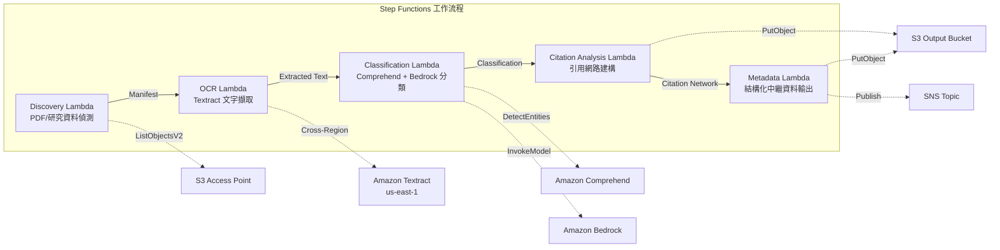

# UC13：教育 / 研究 — 論文 PDF 自動分類與引用網路分析

🌐 **Language / 言語**: [日本語](README.md) | [English](README.en.md) | [한국어](README.ko.md) | [简体中文](README.zh-CN.md) | 繁體中文 | [Français](README.fr.md) | [Deutsch](README.de.md) | [Español](README.es.md)

📚 **文件**: [架構圖](docs/architecture.md) | [示範指南](docs/demo-guide.md)

## 概述

一個藉助 Amazon FSx for NetApp ONTAP 的 S3 Access Points，自動完成論文 PDF 分類、引用網路分析與研究資料中繼資料擷取的無伺服器工作流程。

### 適用此模式的情境

- 大量論文 PDF 或研究資料已累積在 FSx for ONTAP 上
- 希望使用 Textract 自動完成論文 PDF 的文字擷取
- 需要使用 Comprehend 進行主題偵測與實體擷取（作者、機構、關鍵字）
- 需要引用關係解析與引用網路（鄰接串列）的自動建構
- 希望自動產生研究領域分類與結構化摘要總結

### 不適用此模式的情境

- 需要即時論文檢索引擎（OpenSearch / Elasticsearch 較合適）
- 需要完整的引用資料庫（CrossRef / Semantic Scholar API 較合適）
- 需要對大規模自然語言處理模型進行微調
- 無法確保到 ONTAP REST API 網路可達性的環境

### 主要功能

- 透過 S3 AP 自動偵測論文 PDF（.pdf）與研究資料（.csv、.json、.xml）
- 使用 Textract（跨區域）進行 PDF 文字擷取
- 使用 Comprehend 進行主題偵測與實體擷取
- 使用 Bedrock 進行研究領域分類與結構化摘要總結產生
- 從參考文獻章節解析引用關係並建構引用鄰接串列
- 輸出每篇論文的結構化中繼資料（title、authors、classification、keywords、citation_count）

## Success Metrics

### Outcome
透過論文 PDF 分類與引用網路分析的自動化，提升研究資料管理與教材整理的效率。

### Metrics
| 指標 | 目標值（範例） |
|-----------|------------|
| 已處理文件數 / 每次執行 | > 200 documents |
| 分類準確率 | > 85% |
| 引用擷取成功率 | > 90% |
| 處理時間 / 每篇文件 | < 30 秒 |
| 成本 / 每次執行 | < $8 |
| Human Review 對象比例 | < 20%（分類不確定的文件） |

### Measurement Method
Step Functions 執行歷程、Comprehend 分類結果、Textract 文字擷取、CloudWatch Metrics。

## 架構



### 工作流程步驟

1. **Discovery**：從 S3 AP 偵測 .pdf、.csv、.json、.xml 檔案
2. **OCR**：使用 Textract（跨區域）從 PDF 擷取文字
3. **Classification**：使用 Comprehend 擷取實體，使用 Bedrock 分類研究領域
4. **Citation Analysis**：從參考文獻章節解析引用關係並建構鄰接串列
5. **Metadata**：將每篇論文的結構化中繼資料以 JSON 形式輸出至 S3

## 前提條件

- AWS 帳戶與適當的 IAM 權限
- FSx for ONTAP 檔案系統（ONTAP 9.17.1P4D3 或更高版本）
- 已啟用 S3 Access Point 的磁碟區（用於存放論文 PDF 與研究資料）
- VPC、私有子網路
- 已啟用 Amazon Bedrock 模型存取（Claude / Nova）
- **跨區域**：由於 Textract 不支援 ap-northeast-1，因此需要進行到 us-east-1 的跨區域呼叫

## 部署步驟

### 1. 確認跨區域參數

由於 Textract 不支援東京區域，請使用 `CrossRegionTarget` 參數設定跨區域呼叫。

### 2. SAM 部署

```bash
# 前提：需要 AWS SAM CLI。sam build 會自動封裝程式碼與共用層。
sam build

sam deploy \
  --stack-name fsxn-education-research \
  --parameter-overrides \
    S3AccessPointAlias=<your-volume-ext-s3alias> \
    S3AccessPointName=<your-s3ap-name> \
    VpcId=<your-vpc-id> \
    PrivateSubnetIds=<subnet-1>,<subnet-2> \
    ScheduleExpression="rate(1 hour)" \
    NotificationEmail=<your-email@example.com> \
    CrossRegion=us-east-1 \
    EnableVpcEndpoints=false \
    EnableCloudWatchAlarms=false \
  --capabilities CAPABILITY_NAMED_IAM \
  --resolve-s3 \
  --region ap-northeast-1
```

> **注意**：`template.yaml` 用於 SAM CLI（`sam build` + `sam deploy`）。
> 若使用 `aws cloudformation deploy` 命令直接部署，請改用 `template-deploy.yaml`（需要預先封裝 Lambda zip 檔案並上傳至 S3）。

## 設定參數一覽

| 參數 | 說明 | 預設值 | 必填 |
|-----------|------|----------|------|
| `S3AccessPointAlias` | FSx for ONTAP S3 AP Alias（用於輸入） | — | ✅ |
| `S3AccessPointName` | S3 AP 名稱（用於以 ARN 為基礎的 IAM 權限授予；省略時僅以 Alias 為基礎） | `""` | ⚠️ 建議 |
| `ScheduleExpression` | EventBridge Scheduler 的排程運算式 | `rate(1 hour)` | |
| `VpcId` | VPC ID | — | ✅ |
| `PrivateSubnetIds` | 私有子網路 ID 清單 | — | ✅ |
| `NotificationEmail` | SNS 通知目標電子郵件地址 | — | ✅ |
| `CrossRegionTarget` | Textract 的目標區域 | `us-east-1` | |
| `MapConcurrency` | Map 狀態的並行執行數 | `10` | |
| `LambdaMemorySize` | Lambda 記憶體大小 (MB) | `512` | |
| `LambdaTimeout` | Lambda 逾時時間 (秒) | `300` | |
| `EnableVpcEndpoints` | 啟用 Interface VPC Endpoints | `false` | |
| `EnableCloudWatchAlarms` | 啟用 CloudWatch Alarms | `false` | |

## 清理

```bash
aws s3 rm s3://fsxn-education-research-output-${AWS_ACCOUNT_ID} --recursive

aws cloudformation delete-stack \
  --stack-name fsxn-education-research \
  --region ap-northeast-1

aws cloudformation wait stack-delete-complete \
  --stack-name fsxn-education-research \
  --region ap-northeast-1
```

## Supported Regions

UC13 使用以下服務：

| 服務 | 區域限制 |
|---------|-------------|
| Amazon Textract | 不支援 ap-northeast-1。使用 `TEXTRACT_REGION` 參數指定支援的區域（如 us-east-1） |
| Amazon Comprehend | 幾乎所有區域皆可使用 |
| Amazon Bedrock | 確認支援的區域（[Bedrock 支援的區域](https://docs.aws.amazon.com/general/latest/gr/bedrock.html)） |
| AWS X-Ray | 幾乎所有區域皆可使用 |
| CloudWatch EMF | 幾乎所有區域皆可使用 |

> 透過 Cross-Region Client 呼叫 Textract API。請確認您的資料落地要求。詳情請參閱[區域相容性矩陣](../docs/region-compatibility.md)。

## 參考連結

- [FSx for ONTAP S3 Access Points 概述](https://docs.aws.amazon.com/fsx/latest/ONTAPGuide/accessing-data-via-s3-access-points.html)
- [Amazon Textract 文件](https://docs.aws.amazon.com/textract/latest/dg/what-is.html)
- [Amazon Comprehend 文件](https://docs.aws.amazon.com/comprehend/latest/dg/what-is.html)
- [Amazon Bedrock API 參考](https://docs.aws.amazon.com/bedrock/latest/APIReference/API_runtime_InvokeModel.html)

---

## AWS 文件連結

| 服務 | 文件 |
|---------|------------|
| FSx for ONTAP | [使用者指南](https://docs.aws.amazon.com/fsx/latest/ONTAPGuide/what-is-fsx-ontap.html) |
| S3 Access Points | [S3 AP for FSx for ONTAP](https://docs.aws.amazon.com/fsx/latest/ONTAPGuide/s3-access-points.html) |
| Step Functions | [開發人員指南](https://docs.aws.amazon.com/step-functions/latest/dg/welcome.html) |
| Amazon Textract | [開發人員指南](https://docs.aws.amazon.com/textract/latest/dg/what-is.html) |
| Amazon Comprehend | [開發人員指南](https://docs.aws.amazon.com/comprehend/latest/dg/what-is.html) |
| Amazon Bedrock | [使用者指南](https://docs.aws.amazon.com/bedrock/latest/userguide/what-is-bedrock.html) |

### Well-Architected Framework 對應

| 支柱 | 對應 |
|----|------|
| 卓越營運 | X-Ray 追蹤、EMF 指標、分類準確率監控 |
| 安全性 | 最小權限 IAM、KMS 加密、研究資料存取控制 |
| 可靠性 | Step Functions Retry/Catch、跨區域 Textract |
| 效能效率 | 引用網路並行建構、Athena 分割區 |
| 成本最佳化 | 無伺服器、Comprehend 批次處理 |
| 永續性 | 隨需執行、增量處理（僅新論文） |

---

## 成本估算（每月概算）

> **備註**：以下為 ap-northeast-1 區域的概算，實際成本因使用量而異。請在 [AWS Pricing Calculator](https://calculator.aws/) 中確認最新價格。

### 無伺服器元件（按量計費）

| 服務 | 單價 | 預計使用量 | 每月概算 |
|---------|------|-----------|---------|
| Lambda | $0.0000166667/GB-sec | 5 個函式 × 50 papers/天 | ~$1-5 |
| S3 API (GetObject/ListObjects) | $0.0047/10K requests | ~10K requests/天 | ~$1.5 |
| Step Functions | $0.025/1K state transitions | ~1K transitions/天 | ~$0.75 |
| Bedrock (Nova Lite) | $0.00006/1K input tokens | ~60K tokens/次執行 | ~$3-10 |
| Athena | $5/TB scanned | ~5 MB/查詢 | ~$0.5-2 |
| SNS | $0.50/100K notifications | ~100 notifications/天 | ~$0.15 |
| CloudWatch Logs | $0.76/GB ingested | ~1 GB/月 | ~$0.76 |

### 固定成本（FSx for ONTAP — 以現有環境為前提）

| 元件 | 每月 |
|--------------|------|
| FSx for ONTAP (128 MBps, 1 TB) | ~$230（共用現有環境） |
| S3 Access Point | 無額外費用（僅 S3 API 費用） |

### 合計概算

| 組態 | 每月概算 |
|------|---------|
| 最小組態（每天執行 1 次） | ~$5-15 |
| 標準組態（每小時執行） | ~$15-50 |
| 大規模組態（高頻 + 警示） | ~$50-150 |

> **Governance Caveat**：成本估算為概算而非保證值。實際帳單因使用模式、資料量與區域而異。

---

## 本地測試

### Prerequisites 檢查

```bash
# 確認前提條件
aws --version          # AWS CLI v2
sam --version          # SAM CLI
python3 --version      # Python 3.9+
docker --version       # Docker（用於 sam local）
aws sts get-caller-identity  # AWS 憑證
```

### sam local invoke

```bash
# 建置
# 前提：需要 AWS SAM CLI。sam build 會自動封裝程式碼與共用層。
sam build

# Discovery Lambda 的本地執行
sam local invoke DiscoveryFunction --event events/discovery-event.json

# 附帶環境變數覆寫
sam local invoke DiscoveryFunction \
  --event events/discovery-event.json \
  --env-vars env.json
```

### 單元測試

```bash
python3 -m pytest tests/ -v
```

詳情請參閱[本地測試快速入門](../docs/local-testing-quick-start.md)。

---

## 輸出範例 (Output Sample)

論文 PDF 分類 + 引用網路分析的輸出範例：

```json
{
  "discovery": {
    "status": "completed",
    "object_count": 15,
    "prefix": "papers/"
  },
  "classification": [
    {
      "key": "papers/deep-learning-survey-2026.pdf",
      "category": "Computer Science / Machine Learning",
      "keywords": ["deep learning", "transformer", "attention"],
      "language": "en",
      "confidence": 0.94
    }
  ],
  "citation_network": {
    "nodes": 15,
    "edges": 42,
    "most_cited": "papers/attention-is-all-you-need.pdf",
    "clusters": 3,
    "adjacency_list_key": "s3://output-bucket/citations/network.json"
  },
  "summary": {
    "report_key": "reports/research-summary-2026-05-23.md",
    "total_classified": 15,
    "categories_found": 4
  }
}
```

> **備註**：以上為範例輸出，實際值因環境與輸入資料而異。基準數值為 sizing reference，而非 service limit。

---

## Governance Note

> 本模式提供技術架構指導。它不構成法律、合規或監管方面的建議。組織應諮詢具備資格的專業人士。

---

## S3AP Compatibility

有關 S3 Access Points for FSx for ONTAP 的相容性限制、疑難排解與觸發模式，請參閱 [S3AP Compatibility Notes](../docs/s3ap-compatibility-notes.md)。
