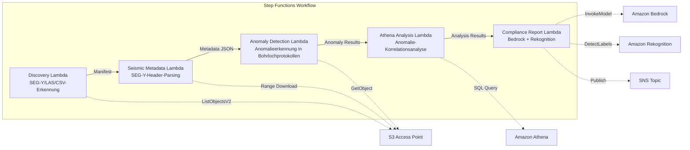

# UC8: Energie / Öl & Gas — Verarbeitung seismischer Daten und Anomalieerkennung in Bohrlochprotokollen

🌐 **Language / 言語**: [日本語](README.md) | [English](README.en.md) | [한국어](README.ko.md) | [简体中文](README.zh-CN.md) | [繁體中文](README.zh-TW.md) | [Français](README.fr.md) | Deutsch | [Español](README.es.md)

📚 **Dokumentation**: [Architekturdiagramm](docs/architecture.de.md) | [Demo-Leitfaden](docs/demo-guide.de.md)

## Überblick

Unter Nutzung der S3 Access Points von FSx for ONTAP automatisiert dieser serverlose Workflow die Metadatenextraktion für seismische SEG-Y-Vermessungsdaten, die Anomalieerkennung in Bohrlochprotokollen und die Erstellung von Compliance-Berichten.

### Fälle, in denen dieses Muster geeignet ist

- SEG-Y-seismische Vermessungsdaten oder Bohrlochprotokolle sind in großen Mengen auf FSx for ONTAP angesammelt
- Sie möchten die Metadaten seismischer Vermessungsdaten (Vermessungsname, Koordinatensystem, Abtastintervall, Spuranzahl) automatisch katalogisieren
- Sie möchten Anomalien aus den Sensormesswerten von Bohrlochprotokollen automatisch erkennen
- Sie benötigen eine Anomalie-Korrelationsanalyse zwischen Bohrlöchern und über die Zeit mithilfe von Athena SQL
- Sie möchten Compliance-Berichte automatisch erstellen

### Fälle, in denen dieses Muster nicht geeignet ist

- Echtzeit-Verarbeitung seismischer Daten (ein HPC-Cluster ist besser geeignet)
- Vollständige Interpretation seismischer Vermessungsdaten (spezialisierte Software ist erforderlich)
- Verarbeitung großformatiger 3D/4D-seismischer Datenvolumina (ein EC2-basierter Ansatz ist besser geeignet)
- Umgebungen, in denen die Netzwerkerreichbarkeit zur ONTAP REST API nicht sichergestellt werden kann

### Hauptfunktionen

- Automatische Erkennung von SEG-Y/LAS/CSV-Dateien über S3 AP
- Streaming-Abruf von SEG-Y-Headern (erste 3600 Bytes) mithilfe von Range-Anfragen
- Metadatenextraktion (survey_name, coordinate_system, sample_interval, trace_count, data_format_code)
- Anomalieerkennung in Bohrlochprotokollen mithilfe einer statistischen Methode (Standardabweichungsschwelle)
- Anomalie-Korrelationsanalyse zwischen Bohrlöchern und über die Zeit mithilfe von Athena SQL
- Mustererkennung von Bohrlochprotokoll-Visualisierungsbildern mithilfe von Rekognition
- Erstellung von Compliance-Berichten mithilfe von Amazon Bedrock

## Success Metrics

### Outcome
Durch die Automatisierung der SEG-Y-Metadatenextraktion und der Anomalieerkennung in Bohrlochprotokollen den Aufwand für die Vorbereitung der geologischen Analyse reduzieren.

### Metrics
| Metrik | Zielwert (Beispiel) |
|-----------|------------|
| Verarbeitete Dateien / Ausführung | > 200 files |
| Erfolgsrate der Metadatenextraktion | > 95% |
| Genauigkeit der Anomalieerkennung | > 85% |
| Verarbeitungszeit / Datei | < 45 Sekunden |
| Kosten / Ausführung | < $8 |
| Human-Review-Anteil | < 20% (Ergebnisse der Anomalieerkennung) |

### Measurement Method
Step Functions-Ausführungsverlauf, Athena-Abfrageergebnisse, Bedrock-Analyseberichte und CloudWatch Metrics.

## Architektur



### Workflow-Schritte

1. **Discovery**: Erkennung von .segy-, .sgy-, .las-, .csv-Dateien aus dem S3 AP
2. **Seismic Metadata**: SEG-Y-Header mit Range-Anfragen abrufen und Metadaten extrahieren
3. **Anomaly Detection**: Anomalien in den Sensorwerten von Bohrlochprotokollen mit einer statistischen Methode erkennen
4. **Athena Analysis**: Anomalie-Korrelationen zwischen Bohrlöchern und über die Zeit mit SQL analysieren
5. **Compliance Report**: Compliance-Berichte mit Bedrock erstellen und Bildmuster mit Rekognition erkennen

## Voraussetzungen

- Ein AWS-Konto und angemessene IAM-Berechtigungen
- Ein FSx for ONTAP-Dateisystem (ONTAP 9.17.1P4D3 oder höher)
- Ein Volume mit aktiviertem S3 Access Point (zur Speicherung seismischer Vermessungsdaten und Bohrlochprotokolle)
- Ein VPC und private Subnetze
- Aktivierter Amazon Bedrock-Modellzugriff (Claude / Nova)

## Bereitstellungsschritte

### 1. SAM-Bereitstellung

```bash
# Voraussetzung: AWS SAM CLI ist erforderlich. „sam build" verpackt den Code und den gemeinsamen Layer automatisch.
sam build

sam deploy \
  --stack-name fsxn-energy-seismic \
  --parameter-overrides \
    S3AccessPointAlias=<your-volume-ext-s3alias> \
    S3AccessPointName=<your-s3ap-name> \
    VpcId=<your-vpc-id> \
    PrivateSubnetIds=<subnet-1>,<subnet-2> \
    ScheduleExpression="rate(1 hour)" \
    NotificationEmail=<your-email@example.com> \
    EnableVpcEndpoints=false \
    EnableCloudWatchAlarms=false \
  --capabilities CAPABILITY_NAMED_IAM \
  --resolve-s3 \
  --region ap-northeast-1
```

> **Hinweis**: `template.yaml` wird mit der SAM CLI (`sam build` + `sam deploy`) verwendet.
> Um direkt mit dem Befehl `aws cloudformation deploy` bereitzustellen, verwenden Sie stattdessen `template-deploy.yaml` (dies erfordert das Vorverpacken der Lambda-Zip-Dateien und deren Hochladen zu S3).

## Liste der Konfigurationsparameter

| Parameter | Beschreibung | Standard | Erforderlich |
|-----------|------|----------|------|
| `S3AccessPointAlias` | FSx for ONTAP S3 AP Alias (für die Eingabe) | — | ✅ |
| `S3AccessPointName` | S3 AP-Name (für ARN-basierte IAM-Berechtigungserteilung. Bei Weglassen wird nur der Alias-basierte Zugriff verwendet) | `""` | ⚠️ Empfohlen |
| `ScheduleExpression` | Zeitplanausdruck des EventBridge Scheduler | `rate(1 hour)` | |
| `VpcId` | VPC ID | — | ✅ |
| `PrivateSubnetIds` | Liste der privaten Subnetz-IDs | — | ✅ |
| `NotificationEmail` | SNS-Benachrichtigungs-E-Mail-Adresse | — | ✅ |
| `AnomalyStddevThreshold` | Standardabweichungsschwelle für die Anomalieerkennung | `3.0` | |
| `MapConcurrency` | Anzahl paralleler Ausführungen im Map-Zustand | `10` | |
| `LambdaMemorySize` | Lambda-Speichergröße (MB) | `1024` | |
| `LambdaTimeout` | Lambda-Timeout (Sekunden) | `300` | |
| `EnableVpcEndpoints` | Interface VPC Endpoints aktivieren | `false` | |
| `EnableCloudWatchAlarms` | CloudWatch Alarms aktivieren | `false` | |

## Bereinigung

```bash
aws s3 rm s3://fsxn-energy-seismic-output-${AWS_ACCOUNT_ID} --recursive

aws cloudformation delete-stack \
  --stack-name fsxn-energy-seismic \
  --region ap-northeast-1

aws cloudformation wait stack-delete-complete \
  --stack-name fsxn-energy-seismic \
  --region ap-northeast-1
```

## Supported Regions

UC8 verwendet die folgenden Dienste:

| Dienst | Regionseinschränkung |
|---------|-------------|
| Amazon Athena | In fast allen Regionen verfügbar |
| Amazon Bedrock | Unterstützte Regionen prüfen ([Von Bedrock unterstützte Regionen](https://docs.aws.amazon.com/general/latest/gr/bedrock.html)) |
| Amazon Rekognition | In fast allen Regionen verfügbar |
| AWS X-Ray | In fast allen Regionen verfügbar |
| CloudWatch EMF | In fast allen Regionen verfügbar |

> Siehe die [Regionskompatibilitätsmatrix](../docs/region-compatibility.md) für Details.

## Referenzlinks

- [FSx for ONTAP S3 Access Points Überblick](https://docs.aws.amazon.com/fsx/latest/ONTAPGuide/accessing-data-via-s3-access-points.html)
- [SEG-Y-Formatspezifikation (Rev 2.0)](https://seg.org/Portals/0/SEG/News%20and%20Resources/Technical%20Standards/seg_y_rev2_0-mar2017.pdf)
- [Amazon Athena Benutzerhandbuch](https://docs.aws.amazon.com/athena/latest/ug/what-is.html)
- [Amazon Rekognition Label-Erkennung](https://docs.aws.amazon.com/rekognition/latest/dg/labels.html)

---

## AWS-Dokumentationslinks

| Dienst | Dokumentation |
|---------|------------|
| FSx for ONTAP | [Benutzerhandbuch](https://docs.aws.amazon.com/fsx/latest/ONTAPGuide/what-is-fsx-ontap.html) |
| S3 Access Points | [S3 AP for FSx for ONTAP](https://docs.aws.amazon.com/fsx/latest/ONTAPGuide/s3-access-points.html) |
| Step Functions | [Entwicklerhandbuch](https://docs.aws.amazon.com/step-functions/latest/dg/welcome.html) |
| Amazon Athena | [Benutzerhandbuch](https://docs.aws.amazon.com/athena/latest/ug/what-is.html) |
| Amazon Bedrock | [Benutzerhandbuch](https://docs.aws.amazon.com/bedrock/latest/userguide/what-is-bedrock.html) |

### Well-Architected Framework-Konformität

| Säule | Konformität |
|----|------|
| Operative Exzellenz | X-Ray-Tracing, EMF-Metriken, Anomalieerkennungswarnungen |
| Sicherheit | IAM mit geringsten Rechten, KMS-Verschlüsselung, Zugriffskontrolle für Vermessungsdaten |
| Zuverlässigkeit | Step Functions Retry/Catch, Behandlung von SEG-Y-Parsing-Anomalien |
| Leistungseffizienz | Range GET (partielles Header-Lesen), Athena-Partitionierung |
| Kostenoptimierung | Serverless (nur bei Nutzung abgerechnet), partielle Lesevorgänge zur Reduzierung des Übertragungsvolumens |
| Nachhaltigkeit | On-Demand-Ausführung, inkrementelle Verarbeitung |

---

## Kostenschätzung (monatliche Näherung)

> **Anmerkung**: Das Folgende ist eine Näherung für die Region ap-northeast-1; die tatsächlichen Kosten variieren je nach Nutzung. Prüfen Sie die neuesten Preise mit dem [AWS Pricing Calculator](https://calculator.aws/).

### Serverlose Komponenten (nutzungsbasierte Abrechnung)

| Dienst | Stückpreis | Angenommene Nutzung | Monatliche Näherung |
|---------|------|-----------|---------|
| Lambda | $0.0000166667/GB-sec | 5 Funktionen × 10 surveys/Tag | ~$1-5 |
| S3 API (GetObject/ListObjects) | $0.0047/10K requests | ~10K requests/Tag | ~$1.5 |
| Step Functions | $0.025/1K state transitions | ~1K transitions/Tag | ~$0.75 |
| Bedrock (Nova Lite) | $0.00006/1K input tokens | ~20K tokens/Ausführung | ~$3-10 |
| Athena | $5/TB scanned | ~20 MB/Abfrage | ~$0.5-2 |
| SNS | $0.50/100K notifications | ~100 notifications/Tag | ~$0.15 |
| CloudWatch Logs | $0.76/GB ingested | ~1 GB/Monat | ~$0.76 |

### Fixkosten (FSx for ONTAP — unter Annahme einer bestehenden Umgebung)

| Komponente | Monatlich |
|--------------|------|
| FSx for ONTAP (128 MBps, 1 TB) | ~$230 (gemeinsam genutzte bestehende Umgebung) |
| S3 Access Point | Keine zusätzlichen Kosten (nur S3 API-Kosten) |

### Gesamtschätzung

| Konfiguration | Monatliche Näherung |
|------|---------|
| Minimale Konfiguration (tägliche Ausführung) | ~$5-15 |
| Standardkonfiguration (stündliche Ausführung) | ~$15-50 |
| Großkonfiguration (hohe Frequenz + Alarme) | ~$50-150 |

> **Governance Caveat**: Kostenschätzungen sind Näherungen, keine garantierten Werte. Die tatsächliche Abrechnung variiert je nach Nutzungsmuster, Datenvolumen und Region.

---

## Lokale Tests

### Prerequisites-Prüfung

```bash
# Voraussetzungen prüfen
aws --version          # AWS CLI v2
sam --version          # SAM CLI
python3 --version      # Python 3.9+
docker --version       # Docker (für sam local)
aws sts get-caller-identity  # AWS-Anmeldeinformationen
```

### sam local invoke

```bash
# Build
# Voraussetzung: AWS SAM CLI ist erforderlich. „sam build" verpackt den Code und den gemeinsamen Layer automatisch.
sam build

# Die Discovery Lambda lokal ausführen
sam local invoke DiscoveryFunction --event events/discovery-event.json

# Mit Überschreibung der Umgebungsvariablen
sam local invoke DiscoveryFunction \
  --event events/discovery-event.json \
  --env-vars env.json
```

### Unit-Tests

```bash
python3 -m pytest tests/ -v
```

Siehe [Schnellstart für lokale Tests](../docs/local-testing-quick-start.md) für Details.

---

## Ausgabebeispiel (Output Sample)

Beispielausgabe der Analyse seismischer Vermessungsdaten:

```json
{
  "discovery": {
    "status": "completed",
    "object_count": 3,
    "prefix": "seismic/surveys/"
  },
  "seismic_metadata": [
    {
      "key": "seismic/surveys/line-2026-A.segy",
      "format": "SEG-Y Rev 1",
      "trace_count": 12000,
      "sample_interval_us": 2000,
      "coordinate_system": "WGS84/UTM Zone 54N"
    }
  ],
  "anomaly_detection": {
    "anomalies_found": 2,
    "types": ["amplitude_spike", "trace_gap"],
    "severity": "medium"
  },
  "compliance_report": {
    "report_key": "reports/seismic-compliance-2026-05-23.json",
    "regulatory_status": "COMPLIANT",
    "data_retention_days": 2555
  }
}
```

> **Anmerkung**: Das Obige ist eine Beispielausgabe; die tatsächlichen Werte variieren je nach Umgebung und Eingabedaten. Benchmark-Zahlen sind eine Dimensionierungsreferenz, kein Service-Limit.

---

## Governance Note

> Dieses Muster bietet technische Architekturberatung. Es handelt sich nicht um rechtliche, Compliance- oder aufsichtsrechtliche Beratung. Organisationen sollten qualifizierte Fachleute konsultieren.

---

## S3AP Compatibility

Für Kompatibilitätseinschränkungen, Fehlerbehebung und Trigger-Muster der S3 Access Points for FSx for ONTAP siehe die [S3AP Compatibility Notes](../docs/s3ap-compatibility-notes.md).
