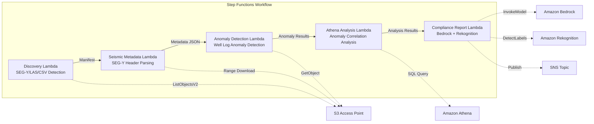

# UC8: Energy / Oil & Gas — Seismic Data Processing and Well Log Anomaly Detection

🌐 **Language / 言語**: [日本語](README.md) | English | [한국어](README.ko.md) | [简体中文](README.zh-CN.md) | [繁體中文](README.zh-TW.md) | [Français](README.fr.md) | [Deutsch](README.de.md) | [Español](README.es.md)

📚 **Documentation**: [Architecture Diagram](docs/architecture.en.md) | [Demo Guide](docs/demo-guide.en.md)

## Overview

Leveraging the S3 Access Points of FSx for ONTAP, this is a serverless workflow that automates metadata extraction for SEG-Y seismic survey data, anomaly detection in well logs, and compliance report generation.

### Cases where this pattern is suitable

- SEG-Y seismic survey data and well logs are accumulated in large volumes on FSx for ONTAP
- You want to automatically catalog seismic survey data metadata (survey name, coordinate system, sample interval, trace count)
- You want to automatically detect anomalies from well log sensor readings
- You need cross-well and time-series anomaly correlation analysis using Athena SQL
- You want to automatically generate compliance reports

### Cases where this pattern is not suitable

- Real-time seismic data processing (an HPC cluster is more appropriate)
- Full seismic survey data interpretation (specialized software is required)
- Processing large-scale 3D/4D seismic data volumes (an EC2-based approach is more appropriate)
- Environments where network reachability to the ONTAP REST API cannot be ensured

### Main Features

- Automatic detection of SEG-Y/LAS/CSV files via S3 AP
- Streaming retrieval of SEG-Y headers (first 3600 bytes) using Range requests
- Metadata extraction (survey_name, coordinate_system, sample_interval, trace_count, data_format_code)
- Well log anomaly detection using a statistical method (standard deviation threshold)
- Cross-well and time-series anomaly correlation analysis using Athena SQL
- Pattern recognition of well log visualization images using Rekognition
- Compliance report generation using Amazon Bedrock

## Success Metrics

### Outcome
By automating SEG-Y metadata extraction and well log anomaly detection, reduce the effort needed to prepare for geological analysis.

### Metrics
| Metric | Target value (example) |
|-----------|------------|
| Files processed / run | > 200 files |
| Metadata extraction success rate | > 95% |
| Anomaly detection accuracy | > 85% |
| Processing time / file | < 45 seconds |
| Cost / run | < $8 |
| Human Review rate | < 20% (anomaly detection results) |

### Measurement Method
Step Functions execution history, Athena query results, Bedrock analysis reports, and CloudWatch Metrics.

## Architecture



### Workflow Steps

1. **Discovery**: Detect .segy, .sgy, .las, .csv files from the S3 AP
2. **Seismic Metadata**: Retrieve SEG-Y headers with Range requests and extract metadata
3. **Anomaly Detection**: Detect anomalies in well log sensor values using a statistical method
4. **Athena Analysis**: Analyze cross-well and time-series anomaly correlations with SQL
5. **Compliance Report**: Generate compliance reports with Bedrock and recognize image patterns with Rekognition

## Prerequisites

- An AWS account and appropriate IAM permissions
- An FSx for ONTAP file system (ONTAP 9.17.1P4D3 or later)
- A volume with S3 Access Point enabled (storing seismic survey data and well logs)
- A VPC and private subnets
- Amazon Bedrock model access enabled (Claude / Nova)

## Deployment Steps

### 1. SAM Deployment

```bash
# Prerequisite: AWS SAM CLI is required. 'sam build' automatically packages the code and shared layer.
sam build

sam deploy \
  --stack-name fsxn-energy-seismic \
  --parameter-overrides \
    S3AccessPointAlias=<your-volume-ext-s3alias> \
    S3AccessPointName=<your-s3ap-name> \
    VpcId=<your-vpc-id> \
    PrivateSubnetIds=<subnet-1>,<subnet-2> \
    ScheduleExpression="rate(1 hour)" \
    NotificationEmail=<your-email@example.com> \
    EnableVpcEndpoints=false \
    EnableCloudWatchAlarms=false \
  --capabilities CAPABILITY_NAMED_IAM \
  --resolve-s3 \
  --region ap-northeast-1
```

> **Note**: `template.yaml` is used with the SAM CLI (`sam build` + `sam deploy`).
> To deploy directly with the `aws cloudformation deploy` command, use `template-deploy.yaml` instead (this requires pre-packaging the Lambda zip files and uploading them to S3).

## Configuration Parameters

| Parameter | Description | Default | Required |
|-----------|------|----------|------|
| `S3AccessPointAlias` | FSx for ONTAP S3 AP Alias (for input) | — | ✅ |
| `S3AccessPointName` | S3 AP name (for ARN-based IAM permission grants. When omitted, only Alias-based access is used) | `""` | ⚠️ Recommended |
| `ScheduleExpression` | EventBridge Scheduler schedule expression | `rate(1 hour)` | |
| `VpcId` | VPC ID | — | ✅ |
| `PrivateSubnetIds` | List of private subnet IDs | — | ✅ |
| `NotificationEmail` | SNS notification email address | — | ✅ |
| `AnomalyStddevThreshold` | Standard deviation threshold for anomaly detection | `3.0` | |
| `MapConcurrency` | Number of parallel executions in the Map state | `10` | |
| `LambdaMemorySize` | Lambda memory size (MB) | `1024` | |
| `LambdaTimeout` | Lambda timeout (seconds) | `300` | |
| `EnableVpcEndpoints` | Enable Interface VPC Endpoints | `false` | |
| `EnableCloudWatchAlarms` | Enable CloudWatch Alarms | `false` | |

## Cleanup

```bash
aws s3 rm s3://fsxn-energy-seismic-output-${AWS_ACCOUNT_ID} --recursive

aws cloudformation delete-stack \
  --stack-name fsxn-energy-seismic \
  --region ap-northeast-1

aws cloudformation wait stack-delete-complete \
  --stack-name fsxn-energy-seismic \
  --region ap-northeast-1
```

## Supported Regions

UC8 uses the following services:

| Service | Region constraint |
|---------|-------------|
| Amazon Athena | Available in nearly all regions |
| Amazon Bedrock | Check supported regions ([Bedrock supported regions](https://docs.aws.amazon.com/general/latest/gr/bedrock.html)) |
| Amazon Rekognition | Available in nearly all regions |
| AWS X-Ray | Available in nearly all regions |
| CloudWatch EMF | Available in nearly all regions |

> See the [Region Compatibility Matrix](../docs/region-compatibility.md) for details.

## References

- [FSx for ONTAP S3 Access Points Overview](https://docs.aws.amazon.com/fsx/latest/ONTAPGuide/accessing-data-via-s3-access-points.html)
- [SEG-Y Format Specification (Rev 2.0)](https://seg.org/Portals/0/SEG/News%20and%20Resources/Technical%20Standards/seg_y_rev2_0-mar2017.pdf)
- [Amazon Athena User Guide](https://docs.aws.amazon.com/athena/latest/ug/what-is.html)
- [Amazon Rekognition Label Detection](https://docs.aws.amazon.com/rekognition/latest/dg/labels.html)

---

## AWS Documentation Links

| Service | Documentation |
|---------|------------|
| FSx for ONTAP | [User Guide](https://docs.aws.amazon.com/fsx/latest/ONTAPGuide/what-is-fsx-ontap.html) |
| S3 Access Points | [S3 AP for FSx for ONTAP](https://docs.aws.amazon.com/fsx/latest/ONTAPGuide/s3-access-points.html) |
| Step Functions | [Developer Guide](https://docs.aws.amazon.com/step-functions/latest/dg/welcome.html) |
| Amazon Athena | [User Guide](https://docs.aws.amazon.com/athena/latest/ug/what-is.html) |
| Amazon Bedrock | [User Guide](https://docs.aws.amazon.com/bedrock/latest/userguide/what-is-bedrock.html) |

### Well-Architected Framework Alignment

| Pillar | Alignment |
|----|------|
| Operational Excellence | X-Ray tracing, EMF metrics, anomaly detection alerts |
| Security | Least-privilege IAM, KMS encryption, survey data access control |
| Reliability | Step Functions Retry/Catch, SEG-Y parse anomaly handling |
| Performance Efficiency | Range GET (partial header read), Athena partitioning |
| Cost Optimization | Serverless (billed only when used), partial reads to reduce transfer volume |
| Sustainability | On-demand execution, incremental processing |

---

## Cost Estimate (Approximate Monthly)

> **Note**: The following is an approximation for the ap-northeast-1 region; actual costs vary by usage. Check the latest pricing with the [AWS Pricing Calculator](https://calculator.aws/).

### Serverless Components (pay-as-you-go)

| Service | Unit price | Assumed usage | Approx. monthly |
|---------|------|-----------|---------|
| Lambda | $0.0000166667/GB-sec | 5 functions × 10 surveys/day | ~$1-5 |
| S3 API (GetObject/ListObjects) | $0.0047/10K requests | ~10K requests/day | ~$1.5 |
| Step Functions | $0.025/1K state transitions | ~1K transitions/day | ~$0.75 |
| Bedrock (Nova Lite) | $0.00006/1K input tokens | ~20K tokens/run | ~$3-10 |
| Athena | $5/TB scanned | ~20 MB/query | ~$0.5-2 |
| SNS | $0.50/100K notifications | ~100 notifications/day | ~$0.15 |
| CloudWatch Logs | $0.76/GB ingested | ~1 GB/month | ~$0.76 |

### Fixed Costs (FSx for ONTAP — assumes an existing environment)

| Component | Monthly |
|--------------|------|
| FSx for ONTAP (128 MBps, 1 TB) | ~$230 (shared existing environment) |
| S3 Access Point | No additional charge (S3 API charges only) |

### Total Estimate

| Configuration | Approx. monthly |
|------|---------|
| Minimal (daily execution) | ~$5-15 |
| Standard (hourly execution) | ~$15-50 |
| Large scale (high frequency + alarms) | ~$50-150 |

> **Governance Caveat**: Cost estimates are approximations, not guaranteed values. Actual billing varies by usage pattern, data volume, and region.

---

## Local Testing

### Prerequisites Check

```bash
# Verify prerequisites
aws --version          # AWS CLI v2
sam --version          # SAM CLI
python3 --version      # Python 3.9+
docker --version       # Docker (for sam local)
aws sts get-caller-identity  # AWS credentials
```

### sam local invoke

```bash
# Build
# Prerequisite: AWS SAM CLI is required. 'sam build' automatically packages the code and shared layer.
sam build

# Run the Discovery Lambda locally
sam local invoke DiscoveryFunction --event events/discovery-event.json

# With environment variable overrides
sam local invoke DiscoveryFunction \
  --event events/discovery-event.json \
  --env-vars env.json
```

### Unit Tests

```bash
python3 -m pytest tests/ -v
```

See the [Local Testing Quick Start](../docs/local-testing-quick-start.md) for details.

---

## Output Sample

Example output of seismic survey data analysis:

```json
{
  "discovery": {
    "status": "completed",
    "object_count": 3,
    "prefix": "seismic/surveys/"
  },
  "seismic_metadata": [
    {
      "key": "seismic/surveys/line-2026-A.segy",
      "format": "SEG-Y Rev 1",
      "trace_count": 12000,
      "sample_interval_us": 2000,
      "coordinate_system": "WGS84/UTM Zone 54N"
    }
  ],
  "anomaly_detection": {
    "anomalies_found": 2,
    "types": ["amplitude_spike", "trace_gap"],
    "severity": "medium"
  },
  "compliance_report": {
    "report_key": "reports/seismic-compliance-2026-05-23.json",
    "regulatory_status": "COMPLIANT",
    "data_retention_days": 2555
  }
}
```

> **Note**: The above is sample output; actual values vary by environment and input data. Benchmark figures are a sizing reference, not a service limit.

---

## Governance Note

> This pattern provides technical architecture guidance. It is not legal, compliance, or regulatory advice. Organizations should consult qualified professionals.

---

## S3AP Compatibility

For compatibility constraints, troubleshooting, and trigger patterns of S3 Access Points for FSx for ONTAP, see the [S3AP Compatibility Notes](../docs/s3ap-compatibility-notes.md).
