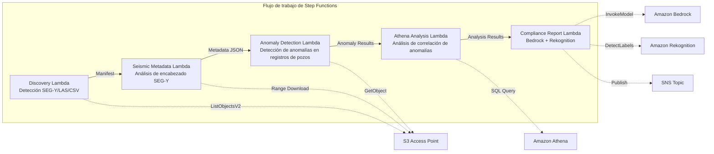

# UC8: Energía / Petróleo y Gas — Procesamiento de datos sísmicos y detección de anomalías en registros de pozos

🌐 **Language / 言語**: [日本語](README.md) | [English](README.en.md) | [한국어](README.ko.md) | [简体中文](README.zh-CN.md) | [繁體中文](README.zh-TW.md) | [Français](README.fr.md) | [Deutsch](README.de.md) | Español

📚 **Documentación**: [Diagrama de arquitectura](docs/architecture.es.md) | [Guía de demostración](docs/demo-guide.es.md)

## Descripción general

Aprovechando los S3 Access Points de FSx for ONTAP, este flujo de trabajo sin servidor automatiza la extracción de metadatos de datos sísmicos SEG-Y, la detección de anomalías en registros de pozos y la generación de informes de cumplimiento.

### Casos en los que este patrón es adecuado

- Grandes volúmenes de datos sísmicos SEG-Y o registros de pozos están acumulados en FSx for ONTAP
- Desea catalogar automáticamente los metadatos de los datos sísmicos (nombre del estudio, sistema de coordenadas, intervalo de muestreo, número de trazas)
- Desea detectar automáticamente anomalías a partir de las lecturas de los sensores de los registros de pozos
- Necesita un análisis de correlación de anomalías entre pozos y a lo largo del tiempo mediante Athena SQL
- Desea generar automáticamente informes de cumplimiento

### Casos en los que este patrón no es adecuado

- Procesamiento de datos sísmicos en tiempo real (un clúster HPC es más apropiado)
- Interpretación completa de datos sísmicos (se requiere software especializado)
- Procesamiento de volúmenes de datos sísmicos 3D/4D a gran escala (un enfoque basado en EC2 es más apropiado)
- Entornos donde no se puede garantizar la accesibilidad de red a la API REST de ONTAP

### Funciones principales

- Detección automática de archivos SEG-Y/LAS/CSV a través de S3 AP
- Recuperación en streaming de encabezados SEG-Y (primeros 3600 bytes) mediante solicitudes Range
- Extracción de metadatos (survey_name, coordinate_system, sample_interval, trace_count, data_format_code)
- Detección de anomalías en registros de pozos mediante un método estadístico (umbral de desviación estándar)
- Análisis de correlación de anomalías entre pozos y a lo largo del tiempo mediante Athena SQL
- Reconocimiento de patrones en imágenes de visualización de registros de pozos mediante Rekognition
- Generación de informes de cumplimiento mediante Amazon Bedrock

## Success Metrics

### Outcome
Al automatizar la extracción de metadatos SEG-Y y la detección de anomalías en registros de pozos, reducir el esfuerzo de preparación para el análisis geológico.

### Metrics
| Métrica | Valor objetivo (ejemplo) |
|-----------|------------|
| Archivos procesados / ejecución | > 200 files |
| Tasa de éxito de extracción de metadatos | > 95% |
| Precisión de detección de anomalías | > 85% |
| Tiempo de procesamiento / archivo | < 45 segundos |
| Coste / ejecución | < $8 |
| Tasa de Human Review | < 20% (resultados de detección de anomalías) |

### Measurement Method
Historial de ejecución de Step Functions, resultados de consultas de Athena, informes de análisis de Bedrock y CloudWatch Metrics.

## Arquitectura



### Pasos del flujo de trabajo

1. **Discovery**: Detectar archivos .segy, .sgy, .las, .csv desde el S3 AP
2. **Seismic Metadata**: Recuperar encabezados SEG-Y con solicitudes Range y extraer metadatos
3. **Anomaly Detection**: Detectar anomalías en los valores de los sensores de los registros de pozos mediante un método estadístico
4. **Athena Analysis**: Analizar correlaciones de anomalías entre pozos y a lo largo del tiempo con SQL
5. **Compliance Report**: Generar informes de cumplimiento con Bedrock y reconocer patrones de imágenes con Rekognition

## Requisitos previos

- Una cuenta de AWS y permisos IAM apropiados
- Un sistema de archivos FSx for ONTAP (ONTAP 9.17.1P4D3 o posterior)
- Un volumen con S3 Access Point habilitado (que almacene datos sísmicos y registros de pozos)
- Un VPC y subredes privadas
- Acceso a modelos de Amazon Bedrock habilitado (Claude / Nova)

## Procedimiento de despliegue

### 1. Despliegue con SAM

```bash
# Requisito previo: se requiere AWS SAM CLI. «sam build» empaqueta automáticamente el código y la capa compartida.
sam build

sam deploy \
  --stack-name fsxn-energy-seismic \
  --parameter-overrides \
    S3AccessPointAlias=<your-volume-ext-s3alias> \
    S3AccessPointName=<your-s3ap-name> \
    VpcId=<your-vpc-id> \
    PrivateSubnetIds=<subnet-1>,<subnet-2> \
    ScheduleExpression="rate(1 hour)" \
    NotificationEmail=<your-email@example.com> \
    EnableVpcEndpoints=false \
    EnableCloudWatchAlarms=false \
  --capabilities CAPABILITY_NAMED_IAM \
  --resolve-s3 \
  --region ap-northeast-1
```

> **Nota**: `template.yaml` se utiliza con la SAM CLI (`sam build` + `sam deploy`).
> Para desplegar directamente con el comando `aws cloudformation deploy`, utilice `template-deploy.yaml` en su lugar (esto requiere el preempaquetado de los archivos zip de Lambda y su carga a S3).

## Lista de parámetros de configuración

| Parámetro | Descripción | Predeterminado | Obligatorio |
|-----------|------|----------|------|
| `S3AccessPointAlias` | FSx for ONTAP S3 AP Alias (para la entrada) | — | ✅ |
| `S3AccessPointName` | Nombre del S3 AP (para la concesión de permisos IAM basados en ARN. Si se omite, solo se usa el acceso basado en Alias) | `""` | ⚠️ Recomendado |
| `ScheduleExpression` | Expresión de programación de EventBridge Scheduler | `rate(1 hour)` | |
| `VpcId` | VPC ID | — | ✅ |
| `PrivateSubnetIds` | Lista de ID de subredes privadas | — | ✅ |
| `NotificationEmail` | Dirección de correo electrónico de notificación de SNS | — | ✅ |
| `AnomalyStddevThreshold` | Umbral de desviación estándar para la detección de anomalías | `3.0` | |
| `MapConcurrency` | Número de ejecuciones paralelas en el estado Map | `10` | |
| `LambdaMemorySize` | Tamaño de memoria de Lambda (MB) | `1024` | |
| `LambdaTimeout` | Tiempo de espera de Lambda (segundos) | `300` | |
| `EnableVpcEndpoints` | Habilitar Interface VPC Endpoints | `false` | |
| `EnableCloudWatchAlarms` | Habilitar CloudWatch Alarms | `false` | |

## Limpieza

```bash
aws s3 rm s3://fsxn-energy-seismic-output-${AWS_ACCOUNT_ID} --recursive

aws cloudformation delete-stack \
  --stack-name fsxn-energy-seismic \
  --region ap-northeast-1

aws cloudformation wait stack-delete-complete \
  --stack-name fsxn-energy-seismic \
  --region ap-northeast-1
```

## Supported Regions

UC8 utiliza los siguientes servicios:

| Servicio | Restricción de región |
|---------|-------------|
| Amazon Athena | Disponible en casi todas las regiones |
| Amazon Bedrock | Comprobar las regiones compatibles ([Regiones compatibles con Bedrock](https://docs.aws.amazon.com/general/latest/gr/bedrock.html)) |
| Amazon Rekognition | Disponible en casi todas las regiones |
| AWS X-Ray | Disponible en casi todas las regiones |
| CloudWatch EMF | Disponible en casi todas las regiones |

> Consulte la [Matriz de compatibilidad de regiones](../docs/region-compatibility.md) para más detalles.

## Enlaces de referencia

- [Descripción general de FSx for ONTAP S3 Access Points](https://docs.aws.amazon.com/fsx/latest/ONTAPGuide/accessing-data-via-s3-access-points.html)
- [Especificación del formato SEG-Y (Rev 2.0)](https://seg.org/Portals/0/SEG/News%20and%20Resources/Technical%20Standards/seg_y_rev2_0-mar2017.pdf)
- [Guía del usuario de Amazon Athena](https://docs.aws.amazon.com/athena/latest/ug/what-is.html)
- [Detección de etiquetas de Amazon Rekognition](https://docs.aws.amazon.com/rekognition/latest/dg/labels.html)

---

## Enlaces a la documentación de AWS

| Servicio | Documentación |
|---------|------------|
| FSx for ONTAP | [Guía del usuario](https://docs.aws.amazon.com/fsx/latest/ONTAPGuide/what-is-fsx-ontap.html) |
| S3 Access Points | [S3 AP for FSx for ONTAP](https://docs.aws.amazon.com/fsx/latest/ONTAPGuide/s3-access-points.html) |
| Step Functions | [Guía del desarrollador](https://docs.aws.amazon.com/step-functions/latest/dg/welcome.html) |
| Amazon Athena | [Guía del usuario](https://docs.aws.amazon.com/athena/latest/ug/what-is.html) |
| Amazon Bedrock | [Guía del usuario](https://docs.aws.amazon.com/bedrock/latest/userguide/what-is-bedrock.html) |

### Cumplimiento del Well-Architected Framework

| Pilar | Cumplimiento |
|----|------|
| Excelencia operativa | Trazado X-Ray, métricas EMF, alertas de detección de anomalías |
| Seguridad | IAM de privilegio mínimo, cifrado KMS, control de acceso a datos sísmicos |
| Fiabilidad | Step Functions Retry/Catch, gestión de anomalías de análisis SEG-Y |
| Eficiencia del rendimiento | Range GET (lectura parcial de encabezados), particionamiento de Athena |
| Optimización de costes | Sin servidor (facturado solo cuando se usa), lecturas parciales para reducir el volumen de transferencia |
| Sostenibilidad | Ejecución bajo demanda, procesamiento incremental |

---

## Estimación de costes (aproximación mensual)

> **Aviso**: Lo siguiente es una aproximación para la región ap-northeast-1; los costes reales varían según el uso. Consulte los precios más recientes con la [AWS Pricing Calculator](https://calculator.aws/).

### Componentes sin servidor (pago por uso)

| Servicio | Precio unitario | Uso supuesto | Aproximación mensual |
|---------|------|-----------|---------|
| Lambda | $0.0000166667/GB-sec | 5 funciones × 10 surveys/día | ~$1-5 |
| S3 API (GetObject/ListObjects) | $0.0047/10K requests | ~10K requests/día | ~$1.5 |
| Step Functions | $0.025/1K state transitions | ~1K transitions/día | ~$0.75 |
| Bedrock (Nova Lite) | $0.00006/1K input tokens | ~20K tokens/ejecución | ~$3-10 |
| Athena | $5/TB scanned | ~20 MB/consulta | ~$0.5-2 |
| SNS | $0.50/100K notifications | ~100 notifications/día | ~$0.15 |
| CloudWatch Logs | $0.76/GB ingested | ~1 GB/mes | ~$0.76 |

### Costes fijos (FSx for ONTAP — se supone un entorno existente)

| Componente | Mensual |
|--------------|------|
| FSx for ONTAP (128 MBps, 1 TB) | ~$230 (entorno existente compartido) |
| S3 Access Point | Sin cargo adicional (solo cargos de S3 API) |

### Estimación total

| Configuración | Aproximación mensual |
|------|---------|
| Configuración mínima (ejecución diaria) | ~$5-15 |
| Configuración estándar (ejecución horaria) | ~$15-50 |
| Configuración a gran escala (alta frecuencia + alarmas) | ~$50-150 |

> **Governance Caveat**: Las estimaciones de costes son aproximaciones, no valores garantizados. La facturación real varía según el patrón de uso, el volumen de datos y la región.

---

## Pruebas locales

### Comprobación de Prerequisites

```bash
# Verificar los requisitos previos
aws --version          # AWS CLI v2
sam --version          # SAM CLI
python3 --version      # Python 3.9+
docker --version       # Docker (para sam local)
aws sts get-caller-identity  # Credenciales de AWS
```

### sam local invoke

```bash
# Build
# Requisito previo: se requiere AWS SAM CLI. «sam build» empaqueta automáticamente el código y la capa compartida.
sam build

# Ejecutar la Discovery Lambda localmente
sam local invoke DiscoveryFunction --event events/discovery-event.json

# Con anulación de variables de entorno
sam local invoke DiscoveryFunction \
  --event events/discovery-event.json \
  --env-vars env.json
```

### Pruebas unitarias

```bash
python3 -m pytest tests/ -v
```

Consulte el [Inicio rápido de pruebas locales](../docs/local-testing-quick-start.md) para más detalles.

---

## Muestra de salida (Output Sample)

Ejemplo de salida del análisis de datos sísmicos:

```json
{
  "discovery": {
    "status": "completed",
    "object_count": 3,
    "prefix": "seismic/surveys/"
  },
  "seismic_metadata": [
    {
      "key": "seismic/surveys/line-2026-A.segy",
      "format": "SEG-Y Rev 1",
      "trace_count": 12000,
      "sample_interval_us": 2000,
      "coordinate_system": "WGS84/UTM Zone 54N"
    }
  ],
  "anomaly_detection": {
    "anomalies_found": 2,
    "types": ["amplitude_spike", "trace_gap"],
    "severity": "medium"
  },
  "compliance_report": {
    "report_key": "reports/seismic-compliance-2026-05-23.json",
    "regulatory_status": "COMPLIANT",
    "data_retention_days": 2555
  }
}
```

> **Aviso**: Lo anterior es una salida de muestra; los valores reales varían según el entorno y los datos de entrada. Las cifras de referencia son una referencia de dimensionamiento, no un límite de servicio.

---

## Governance Note

> Este patrón proporciona orientación de arquitectura técnica. No constituye asesoramiento legal, de cumplimiento ni regulatorio. Las organizaciones deben consultar a profesionales cualificados.

---

## S3AP Compatibility

Para conocer las restricciones de compatibilidad, la resolución de problemas y los patrones de activación de los S3 Access Points for FSx for ONTAP, consulte las [S3AP Compatibility Notes](../docs/s3ap-compatibility-notes.md).
