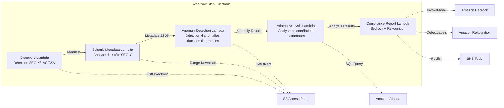

# UC8 : Énergie / Pétrole et Gaz — Traitement des données sismiques et détection d'anomalies dans les diagraphies de puits

🌐 **Language / 言語**: [日本語](README.md) | [English](README.en.md) | [한국어](README.ko.md) | [简体中文](README.zh-CN.md) | [繁體中文](README.zh-TW.md) | Français | [Deutsch](README.de.md) | [Español](README.es.md)

📚 **Documentation** : [Schéma d'architecture](docs/architecture.fr.md) | [Guide de démonstration](docs/demo-guide.fr.md)

## Vue d'ensemble

En exploitant les S3 Access Points de FSx for ONTAP, ce workflow serverless automatise l'extraction des métadonnées des données sismiques SEG-Y, la détection d'anomalies dans les diagraphies de puits et la génération de rapports de conformité.

### Cas où ce modèle est adapté

- De grands volumes de données sismiques SEG-Y ou de diagraphies de puits sont accumulés sur FSx for ONTAP
- Vous souhaitez cataloguer automatiquement les métadonnées des données sismiques (nom de campagne, système de coordonnées, intervalle d'échantillonnage, nombre de traces)
- Vous souhaitez détecter automatiquement les anomalies à partir des relevés des capteurs des diagraphies de puits
- Vous avez besoin d'une analyse de corrélation d'anomalies entre puits et dans le temps à l'aide d'Athena SQL
- Vous souhaitez générer automatiquement des rapports de conformité

### Cas où ce modèle n'est pas adapté

- Traitement de données sismiques en temps réel (un cluster HPC est plus approprié)
- Interprétation complète des données sismiques (un logiciel spécialisé est requis)
- Traitement de volumes de données sismiques 3D/4D à grande échelle (une approche basée sur EC2 est plus appropriée)
- Environnements où l'accessibilité réseau à l'API REST ONTAP ne peut pas être assurée

### Fonctionnalités principales

- Détection automatique des fichiers SEG-Y/LAS/CSV via S3 AP
- Récupération en streaming des en-têtes SEG-Y (les 3600 premiers octets) à l'aide de requêtes Range
- Extraction de métadonnées (survey_name, coordinate_system, sample_interval, trace_count, data_format_code)
- Détection d'anomalies dans les diagraphies de puits par une méthode statistique (seuil d'écart-type)
- Analyse de corrélation d'anomalies entre puits et dans le temps à l'aide d'Athena SQL
- Reconnaissance de motifs sur les images de visualisation des diagraphies de puits à l'aide de Rekognition
- Génération de rapports de conformité à l'aide d'Amazon Bedrock

## Success Metrics

### Outcome
En automatisant l'extraction des métadonnées SEG-Y et la détection d'anomalies dans les diagraphies de puits, réduire l'effort de préparation à l'analyse géologique.

### Metrics
| Métrique | Valeur cible (exemple) |
|-----------|------------|
| Fichiers traités / exécution | > 200 files |
| Taux de réussite d'extraction des métadonnées | > 95% |
| Précision de détection d'anomalies | > 85% |
| Temps de traitement / fichier | < 45 secondes |
| Coût / exécution | < $8 |
| Taux de Human Review | < 20% (résultats de détection d'anomalies) |

### Measurement Method
Historique d'exécution Step Functions, résultats de requêtes Athena, rapports d'analyse Bedrock et CloudWatch Metrics.

## Architecture



### Étapes du workflow

1. **Discovery** : Détecter les fichiers .segy, .sgy, .las, .csv depuis le S3 AP
2. **Seismic Metadata** : Récupérer les en-têtes SEG-Y avec des requêtes Range et extraire les métadonnées
3. **Anomaly Detection** : Détecter les anomalies dans les valeurs des capteurs des diagraphies de puits par une méthode statistique
4. **Athena Analysis** : Analyser les corrélations d'anomalies entre puits et dans le temps avec SQL
5. **Compliance Report** : Générer des rapports de conformité avec Bedrock et reconnaître les motifs d'images avec Rekognition

## Prérequis

- Un compte AWS et les autorisations IAM appropriées
- Un système de fichiers FSx for ONTAP (ONTAP 9.17.1P4D3 ou ultérieur)
- Un volume avec S3 Access Point activé (stockant les données sismiques et les diagraphies de puits)
- Un VPC et des sous-réseaux privés
- Accès aux modèles Amazon Bedrock activé (Claude / Nova)

## Procédure de déploiement

### 1. Déploiement SAM

```bash
# Prérequis : AWS SAM CLI est requis. « sam build » empaquette automatiquement le code et la couche partagée.
sam build

sam deploy \
  --stack-name fsxn-energy-seismic \
  --parameter-overrides \
    S3AccessPointAlias=<your-volume-ext-s3alias> \
    S3AccessPointName=<your-s3ap-name> \
    VpcId=<your-vpc-id> \
    PrivateSubnetIds=<subnet-1>,<subnet-2> \
    ScheduleExpression="rate(1 hour)" \
    NotificationEmail=<your-email@example.com> \
    EnableVpcEndpoints=false \
    EnableCloudWatchAlarms=false \
  --capabilities CAPABILITY_NAMED_IAM \
  --resolve-s3 \
  --region ap-northeast-1
```

> **Remarque** : `template.yaml` s'utilise avec la SAM CLI (`sam build` + `sam deploy`).
> Pour déployer directement avec la commande `aws cloudformation deploy`, utilisez plutôt `template-deploy.yaml` (cela nécessite le pré-empaquetage des fichiers zip Lambda et leur téléversement vers S3).

## Liste des paramètres de configuration

| Paramètre | Description | Par défaut | Requis |
|-----------|------|----------|------|
| `S3AccessPointAlias` | FSx for ONTAP S3 AP Alias (pour l'entrée) | — | ✅ |
| `S3AccessPointName` | Nom du S3 AP (pour l'octroi d'autorisations IAM basées sur ARN. En cas d'omission, seul l'accès basé sur Alias est utilisé) | `""` | ⚠️ Recommandé |
| `ScheduleExpression` | Expression de planification d'EventBridge Scheduler | `rate(1 hour)` | |
| `VpcId` | VPC ID | — | ✅ |
| `PrivateSubnetIds` | Liste des ID de sous-réseaux privés | — | ✅ |
| `NotificationEmail` | Adresse e-mail de notification SNS | — | ✅ |
| `AnomalyStddevThreshold` | Seuil d'écart-type pour la détection d'anomalies | `3.0` | |
| `MapConcurrency` | Nombre d'exécutions parallèles dans l'état Map | `10` | |
| `LambdaMemorySize` | Taille mémoire Lambda (MB) | `1024` | |
| `LambdaTimeout` | Délai d'expiration Lambda (secondes) | `300` | |
| `EnableVpcEndpoints` | Activer les Interface VPC Endpoints | `false` | |
| `EnableCloudWatchAlarms` | Activer les CloudWatch Alarms | `false` | |

## Nettoyage

```bash
aws s3 rm s3://fsxn-energy-seismic-output-${AWS_ACCOUNT_ID} --recursive

aws cloudformation delete-stack \
  --stack-name fsxn-energy-seismic \
  --region ap-northeast-1

aws cloudformation wait stack-delete-complete \
  --stack-name fsxn-energy-seismic \
  --region ap-northeast-1
```

## Supported Regions

UC8 utilise les services suivants :

| Service | Contrainte de région |
|---------|-------------|
| Amazon Athena | Disponible dans presque toutes les régions |
| Amazon Bedrock | Vérifiez les régions prises en charge ([Régions prises en charge par Bedrock](https://docs.aws.amazon.com/general/latest/gr/bedrock.html)) |
| Amazon Rekognition | Disponible dans presque toutes les régions |
| AWS X-Ray | Disponible dans presque toutes les régions |
| CloudWatch EMF | Disponible dans presque toutes les régions |

> Consultez la [Matrice de compatibilité des régions](../docs/region-compatibility.md) pour plus de détails.

## Liens de référence

- [Présentation des FSx for ONTAP S3 Access Points](https://docs.aws.amazon.com/fsx/latest/ONTAPGuide/accessing-data-via-s3-access-points.html)
- [Spécification du format SEG-Y (Rev 2.0)](https://seg.org/Portals/0/SEG/News%20and%20Resources/Technical%20Standards/seg_y_rev2_0-mar2017.pdf)
- [Guide de l'utilisateur Amazon Athena](https://docs.aws.amazon.com/athena/latest/ug/what-is.html)
- [Détection de labels Amazon Rekognition](https://docs.aws.amazon.com/rekognition/latest/dg/labels.html)

---

## Liens vers la documentation AWS

| Service | Documentation |
|---------|------------|
| FSx for ONTAP | [Guide de l'utilisateur](https://docs.aws.amazon.com/fsx/latest/ONTAPGuide/what-is-fsx-ontap.html) |
| S3 Access Points | [S3 AP for FSx for ONTAP](https://docs.aws.amazon.com/fsx/latest/ONTAPGuide/s3-access-points.html) |
| Step Functions | [Guide du développeur](https://docs.aws.amazon.com/step-functions/latest/dg/welcome.html) |
| Amazon Athena | [Guide de l'utilisateur](https://docs.aws.amazon.com/athena/latest/ug/what-is.html) |
| Amazon Bedrock | [Guide de l'utilisateur](https://docs.aws.amazon.com/bedrock/latest/userguide/what-is-bedrock.html) |

### Conformité au Well-Architected Framework

| Pilier | Conformité |
|----|------|
| Excellence opérationnelle | Traçage X-Ray, métriques EMF, alertes de détection d'anomalies |
| Sécurité | IAM au moindre privilège, chiffrement KMS, contrôle d'accès aux données sismiques |
| Fiabilité | Step Functions Retry/Catch, gestion des anomalies d'analyse SEG-Y |
| Efficacité des performances | Range GET (lecture partielle des en-têtes), partitionnement Athena |
| Optimisation des coûts | Serverless (facturé uniquement à l'usage), lectures partielles pour réduire le volume de transfert |
| Durabilité | Exécution à la demande, traitement incrémental |

---

## Estimation des coûts (approximation mensuelle)

> **Note** : Ce qui suit est une approximation pour la région ap-northeast-1 ; les coûts réels varient selon l'utilisation. Vérifiez les tarifs les plus récents avec l'[AWS Pricing Calculator](https://calculator.aws/).

### Composants serverless (paiement à l'usage)

| Service | Prix unitaire | Utilisation supposée | Approximation mensuelle |
|---------|------|-----------|---------|
| Lambda | $0.0000166667/GB-sec | 5 fonctions × 10 surveys/jour | ~$1-5 |
| S3 API (GetObject/ListObjects) | $0.0047/10K requests | ~10K requests/jour | ~$1.5 |
| Step Functions | $0.025/1K state transitions | ~1K transitions/jour | ~$0.75 |
| Bedrock (Nova Lite) | $0.00006/1K input tokens | ~20K tokens/exécution | ~$3-10 |
| Athena | $5/TB scanned | ~20 MB/requête | ~$0.5-2 |
| SNS | $0.50/100K notifications | ~100 notifications/jour | ~$0.15 |
| CloudWatch Logs | $0.76/GB ingested | ~1 GB/mois | ~$0.76 |

### Coûts fixes (FSx for ONTAP — en supposant un environnement existant)

| Composant | Mensuel |
|--------------|------|
| FSx for ONTAP (128 MBps, 1 TB) | ~$230 (environnement existant partagé) |
| S3 Access Point | Aucun frais supplémentaire (frais S3 API uniquement) |

### Estimation totale

| Configuration | Approximation mensuelle |
|------|---------|
| Configuration minimale (exécution quotidienne) | ~$5-15 |
| Configuration standard (exécution horaire) | ~$15-50 |
| Configuration à grande échelle (haute fréquence + alarmes) | ~$50-150 |

> **Governance Caveat** : Les estimations de coûts sont des approximations, pas des valeurs garanties. La facturation réelle varie selon le profil d'utilisation, le volume de données et la région.

---

## Tests locaux

### Vérification des Prerequisites

```bash
# Vérifier les prérequis
aws --version          # AWS CLI v2
sam --version          # SAM CLI
python3 --version      # Python 3.9+
docker --version       # Docker (pour sam local)
aws sts get-caller-identity  # Identifiants AWS
```

### sam local invoke

```bash
# Build
# Prérequis : AWS SAM CLI est requis. « sam build » empaquette automatiquement le code et la couche partagée.
sam build

# Exécuter la Discovery Lambda localement
sam local invoke DiscoveryFunction --event events/discovery-event.json

# Avec remplacement des variables d'environnement
sam local invoke DiscoveryFunction \
  --event events/discovery-event.json \
  --env-vars env.json
```

### Tests unitaires

```bash
python3 -m pytest tests/ -v
```

Consultez le [Démarrage rapide des tests locaux](../docs/local-testing-quick-start.md) pour plus de détails.

---

## Exemple de sortie (Output Sample)

Exemple de sortie de l'analyse des données sismiques :

```json
{
  "discovery": {
    "status": "completed",
    "object_count": 3,
    "prefix": "seismic/surveys/"
  },
  "seismic_metadata": [
    {
      "key": "seismic/surveys/line-2026-A.segy",
      "format": "SEG-Y Rev 1",
      "trace_count": 12000,
      "sample_interval_us": 2000,
      "coordinate_system": "WGS84/UTM Zone 54N"
    }
  ],
  "anomaly_detection": {
    "anomalies_found": 2,
    "types": ["amplitude_spike", "trace_gap"],
    "severity": "medium"
  },
  "compliance_report": {
    "report_key": "reports/seismic-compliance-2026-05-23.json",
    "regulatory_status": "COMPLIANT",
    "data_retention_days": 2555
  }
}
```

> **Note** : Ce qui précède est un exemple de sortie ; les valeurs réelles varient selon l'environnement et les données d'entrée. Les chiffres de benchmark sont une référence de dimensionnement, pas une limite de service.

---

## Governance Note

> Ce modèle fournit des conseils d'architecture technique. Il ne s'agit pas de conseils juridiques, de conformité ou réglementaires. Les organisations doivent consulter des professionnels qualifiés.

---

## S3AP Compatibility

Pour les contraintes de compatibilité, le dépannage et les modèles de déclenchement des S3 Access Points for FSx for ONTAP, consultez les [S3AP Compatibility Notes](../docs/s3ap-compatibility-notes.md).
