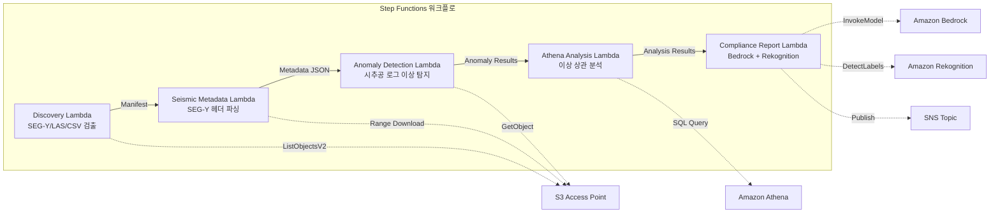

# UC8: 에너지 / 석유·가스 — 탄성파 탐사 데이터 처리·시추공 로그 이상 탐지

🌐 **Language / 言語**: [日本語](README.md) | [English](README.en.md) | 한국어 | [简体中文](README.zh-CN.md) | [繁體中文](README.zh-TW.md) | [Français](README.fr.md) | [Deutsch](README.de.md) | [Español](README.es.md)

📚 **문서**: [아키텍처 다이어그램](docs/architecture.ko.md) | [데모 가이드](docs/demo-guide.ko.md)

## 개요

FSx for ONTAP의 S3 Access Points를 활용하여 SEG-Y 탄성파 탐사 데이터의 메타데이터 추출, 시추공 로그 이상 탐지, 컴플라이언스 보고서 생성을 자동화하는 서버리스 워크플로입니다.

### 이 패턴이 적합한 경우

- SEG-Y 탄성파 탐사 데이터나 시추공 로그가 FSx for ONTAP에 대량으로 축적되어 있음
- 탄성파 탐사 데이터의 메타데이터(측량명, 좌표계, 샘플 간격, 트레이스 수)를 자동으로 카탈로그화하고 싶음
- 시추공 로그의 센서 판독값에서 이상을 자동으로 탐지하고 싶음
- Athena SQL을 통한 시추공 간·시계열 이상 상관 분석이 필요함
- 컴플라이언스 보고서를 자동으로 생성하고 싶음

### 이 패턴이 적합하지 않은 경우

- 실시간 탄성파 데이터 처리(HPC 클러스터가 적절함)
- 완전한 탄성파 탐사 데이터 해석(전용 소프트웨어가 필요함)
- 대규모 3D/4D 탄성파 데이터 볼륨의 처리(EC2 기반이 적절함)
- ONTAP REST API에 대한 네트워크 도달성을 확보할 수 없는 환경

### 주요 기능

- S3 AP를 경유하여 SEG-Y/LAS/CSV 파일을 자동 검출
- Range 요청을 통한 SEG-Y 헤더(선두 3600바이트)의 스트리밍 취득
- 메타데이터 추출(survey_name, coordinate_system, sample_interval, trace_count, data_format_code)
- 통계적 기법(표준편차 임계값)에 의한 시추공 로그 이상 탐지
- Athena SQL을 통한 시추공 간·시계열 이상 상관 분석
- Rekognition에 의한 시추공 로그 시각화 이미지의 패턴 인식
- Amazon Bedrock에 의한 컴플라이언스 보고서 생성

## Success Metrics

### Outcome
SEG-Y 메타데이터 추출·시추공 로그 이상 탐지의 자동화를 통해 지질 분석 준비 공수를 절감합니다.

### Metrics
| 메트릭 | 목표값(예) |
|-----------|------------|
| 처리 완료 파일 수 / 실행 | > 200 files |
| 메타데이터 추출 성공률 | > 95% |
| 이상 탐지 정확도 | > 85% |
| 처리 시간 / 파일 | < 45초 |
| 비용 / 실행 | < $8 |
| Human Review 대상률 | < 20%(이상 탐지 결과) |

### Measurement Method
Step Functions 실행 이력, Athena 쿼리 결과, Bedrock 분석 보고서, CloudWatch Metrics.

## 아키텍처



### 워크플로 단계

1. **Discovery**: S3 AP에서 .segy, .sgy, .las, .csv 파일을 검출
2. **Seismic Metadata**: Range 요청으로 SEG-Y 헤더를 취득하고 메타데이터를 추출
3. **Anomaly Detection**: 시추공 로그의 센서 값을 통계적 기법으로 이상 탐지
4. **Athena Analysis**: 시추공 간·시계열 이상 상관을 SQL로 분석
5. **Compliance Report**: Bedrock으로 컴플라이언스 보고서 생성, Rekognition으로 이미지 패턴 인식

## 사전 요구 사항

- AWS 계정과 적절한 IAM 권한
- FSx for ONTAP 파일 시스템(ONTAP 9.17.1P4D3 이상)
- S3 Access Point가 활성화된 볼륨(탄성파 탐사 데이터·시추공 로그를 저장)
- VPC, 프라이빗 서브넷
- Amazon Bedrock 모델 액세스가 활성화됨(Claude / Nova)

## 배포 절차

### 1. SAM 배포

```bash
# 전제: AWS SAM CLI가 필요합니다. sam build가 코드와 공유 레이어를 자동으로 패키징합니다.
sam build

sam deploy \
  --stack-name fsxn-energy-seismic \
  --parameter-overrides \
    S3AccessPointAlias=<your-volume-ext-s3alias> \
    S3AccessPointName=<your-s3ap-name> \
    VpcId=<your-vpc-id> \
    PrivateSubnetIds=<subnet-1>,<subnet-2> \
    ScheduleExpression="rate(1 hour)" \
    NotificationEmail=<your-email@example.com> \
    EnableVpcEndpoints=false \
    EnableCloudWatchAlarms=false \
  --capabilities CAPABILITY_NAMED_IAM \
  --resolve-s3 \
  --region ap-northeast-1
```

> **주의**: `template.yaml`은 SAM CLI(`sam build` + `sam deploy`)로 사용합니다.
> `aws cloudformation deploy` 명령으로 직접 배포하는 경우에는 `template-deploy.yaml`을 사용하세요(Lambda zip 파일의 사전 패키징과 S3 업로드가 필요합니다).

## 설정 파라미터 목록

| 파라미터 | 설명 | 기본값 | 필수 |
|-----------|------|----------|------|
| `S3AccessPointAlias` | FSx for ONTAP S3 AP Alias(입력용) | — | ✅ |
| `S3AccessPointName` | S3 AP 이름(ARN 기반 IAM 권한 부여용. 생략 시 Alias 기반만) | `""` | ⚠️ 권장 |
| `ScheduleExpression` | EventBridge Scheduler의 스케줄 표현식 | `rate(1 hour)` | |
| `VpcId` | VPC ID | — | ✅ |
| `PrivateSubnetIds` | 프라이빗 서브넷 ID 목록 | — | ✅ |
| `NotificationEmail` | SNS 통지 대상 이메일 주소 | — | ✅ |
| `AnomalyStddevThreshold` | 이상 탐지의 표준편차 임계값 | `3.0` | |
| `MapConcurrency` | Map 스테이트의 병렬 실행 수 | `10` | |
| `LambdaMemorySize` | Lambda 메모리 크기 (MB) | `1024` | |
| `LambdaTimeout` | Lambda 타임아웃 (초) | `300` | |
| `EnableVpcEndpoints` | Interface VPC Endpoints 활성화 | `false` | |
| `EnableCloudWatchAlarms` | CloudWatch Alarms 활성화 | `false` | |

## 정리

```bash
aws s3 rm s3://fsxn-energy-seismic-output-${AWS_ACCOUNT_ID} --recursive

aws cloudformation delete-stack \
  --stack-name fsxn-energy-seismic \
  --region ap-northeast-1

aws cloudformation wait stack-delete-complete \
  --stack-name fsxn-energy-seismic \
  --region ap-northeast-1
```

## Supported Regions

UC8은 다음 서비스를 사용합니다:

| 서비스 | 리전 제약 |
|---------|-------------|
| Amazon Athena | 거의 모든 리전에서 이용 가능 |
| Amazon Bedrock | 지원 리전 확인([Bedrock 지원 리전](https://docs.aws.amazon.com/general/latest/gr/bedrock.html)) |
| Amazon Rekognition | 거의 모든 리전에서 이용 가능 |
| AWS X-Ray | 거의 모든 리전에서 이용 가능 |
| CloudWatch EMF | 거의 모든 리전에서 이용 가능 |

> 자세한 내용은 [리전 호환성 매트릭스](../docs/region-compatibility.md)를 참조하세요.

## 참고 링크

- [FSx for ONTAP S3 Access Points 개요](https://docs.aws.amazon.com/fsx/latest/ONTAPGuide/accessing-data-via-s3-access-points.html)
- [SEG-Y 포맷 사양 (Rev 2.0)](https://seg.org/Portals/0/SEG/News%20and%20Resources/Technical%20Standards/seg_y_rev2_0-mar2017.pdf)
- [Amazon Athena 사용 설명서](https://docs.aws.amazon.com/athena/latest/ug/what-is.html)
- [Amazon Rekognition 레이블 검출](https://docs.aws.amazon.com/rekognition/latest/dg/labels.html)

---

## AWS 문서 링크

| 서비스 | 문서 |
|---------|------------|
| FSx for ONTAP | [사용 설명서](https://docs.aws.amazon.com/fsx/latest/ONTAPGuide/what-is-fsx-ontap.html) |
| S3 Access Points | [S3 AP for FSx for ONTAP](https://docs.aws.amazon.com/fsx/latest/ONTAPGuide/s3-access-points.html) |
| Step Functions | [개발자 가이드](https://docs.aws.amazon.com/step-functions/latest/dg/welcome.html) |
| Amazon Athena | [사용 설명서](https://docs.aws.amazon.com/athena/latest/ug/what-is.html) |
| Amazon Bedrock | [사용 설명서](https://docs.aws.amazon.com/bedrock/latest/userguide/what-is-bedrock.html) |

### Well-Architected Framework 대응

| 기둥 | 대응 |
|----|------|
| 운영 우수성 | X-Ray 트레이싱, EMF 메트릭, 이상 탐지 알림 |
| 보안 | 최소 권한 IAM, KMS 암호화, 탐사 데이터 액세스 제어 |
| 신뢰성 | Step Functions Retry/Catch, SEG-Y 파싱 이상 처리 |
| 성능 효율성 | Range GET(헤더 부분 읽기), Athena 파티션 |
| 비용 최적화 | 서버리스(사용 시에만 과금), 부분 읽기로 전송량 절감 |
| 지속 가능성 | 온디맨드 실행, 차분 처리 |

---

## 비용 견적(월간 개산)

> **참고**: 아래는 ap-northeast-1 리전의 개산이며, 실제 비용은 사용량에 따라 다릅니다. 최신 요금은 [AWS Pricing Calculator](https://calculator.aws/)에서 확인하세요.

### 서버리스 컴포넌트(종량 과금)

| 서비스 | 단가 | 예상 사용량 | 월간 개산 |
|---------|------|-----------|---------|
| Lambda | $0.0000166667/GB-sec | 5 함수 × 10 surveys/일 | ~$1-5 |
| S3 API (GetObject/ListObjects) | $0.0047/10K requests | ~10K requests/일 | ~$1.5 |
| Step Functions | $0.025/1K state transitions | ~1K transitions/일 | ~$0.75 |
| Bedrock (Nova Lite) | $0.00006/1K input tokens | ~20K tokens/실행 | ~$3-10 |
| Athena | $5/TB scanned | ~20 MB/쿼리 | ~$0.5-2 |
| SNS | $0.50/100K notifications | ~100 notifications/일 | ~$0.15 |
| CloudWatch Logs | $0.76/GB ingested | ~1 GB/월 | ~$0.76 |

### 고정 비용(FSx for ONTAP — 기존 환경 전제)

| 컴포넌트 | 월간 |
|--------------|------|
| FSx for ONTAP (128 MBps, 1 TB) | ~$230 (기존 환경을 공유) |
| S3 Access Point | 추가 요금 없음(S3 API 요금만) |

### 합계 개산

| 구성 | 월간 개산 |
|------|---------|
| 최소 구성(일 1회 실행) | ~$5-15 |
| 표준 구성(시간별 실행) | ~$15-50 |
| 대규모 구성(고빈도 + 알람) | ~$50-150 |

> **Governance Caveat**: 비용 견적은 개산이며 보증값이 아닙니다. 실제 청구액은 사용 패턴, 데이터 양, 리전에 따라 다릅니다.

---

## 로컬 테스트

### Prerequisites 확인

```bash
# 전제 조건 확인
aws --version          # AWS CLI v2
sam --version          # SAM CLI
python3 --version      # Python 3.9+
docker --version       # Docker (sam local 용)
aws sts get-caller-identity  # AWS 인증 정보
```

### sam local invoke

```bash
# 빌드
# 전제: AWS SAM CLI가 필요합니다. sam build가 코드와 공유 레이어를 자동으로 패키징합니다.
sam build

# Discovery Lambda의 로컬 실행
sam local invoke DiscoveryFunction --event events/discovery-event.json

# 환경 변수 오버라이드 포함
sam local invoke DiscoveryFunction \
  --event events/discovery-event.json \
  --env-vars env.json
```

### 유닛 테스트

```bash
python3 -m pytest tests/ -v
```

자세한 내용은 [로컬 테스트 퀵 스타트](../docs/local-testing-quick-start.md)를 참조하세요.

---

## 출력 샘플 (Output Sample)

탄성파 탐사 데이터 분석의 출력 예:

```json
{
  "discovery": {
    "status": "completed",
    "object_count": 3,
    "prefix": "seismic/surveys/"
  },
  "seismic_metadata": [
    {
      "key": "seismic/surveys/line-2026-A.segy",
      "format": "SEG-Y Rev 1",
      "trace_count": 12000,
      "sample_interval_us": 2000,
      "coordinate_system": "WGS84/UTM Zone 54N"
    }
  ],
  "anomaly_detection": {
    "anomalies_found": 2,
    "types": ["amplitude_spike", "trace_gap"],
    "severity": "medium"
  },
  "compliance_report": {
    "report_key": "reports/seismic-compliance-2026-05-23.json",
    "regulatory_status": "COMPLIANT",
    "data_retention_days": 2555
  }
}
```

> **참고**: 위는 샘플 출력이며, 실제 값은 환경·입력 데이터에 따라 다릅니다. 벤치마크 수치는 sizing reference이며 service limit이 아닙니다.

---

## Governance Note

> 본 패턴은 기술 아키텍처 가이던스를 제공합니다. 법적·컴플라이언스·규제상의 조언이 아닙니다. 조직은 자격을 갖춘 전문가에게 상담해야 합니다.

---

## S3AP Compatibility

S3 Access Points for FSx for ONTAP의 호환성 제약, 문제 해결, 트리거 패턴에 대해서는 [S3AP Compatibility Notes](../docs/s3ap-compatibility-notes.md)를 참조하세요.
