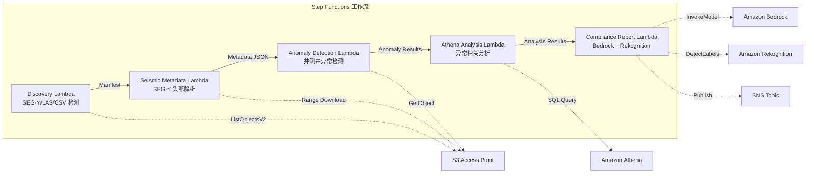

# UC8：能源 / 石油天然气 — 地震勘探数据处理·井测井异常检测

🌐 **Language / 言語**: [日本語](README.md) | [English](README.en.md) | [한국어](README.ko.md) | 简体中文 | [繁體中文](README.zh-TW.md) | [Français](README.fr.md) | [Deutsch](README.de.md) | [Español](README.es.md)

📚 **文档**: [架构图](docs/architecture.zh-CN.md) | [演示指南](docs/demo-guide.zh-CN.md)

## 概述

利用 FSx for ONTAP 的 S3 Access Points，自动化 SEG-Y 地震勘探数据的元数据提取、井测井异常检测以及合规报告生成的无服务器工作流。

### 适合此模式的场景

- FSx for ONTAP 上大量积累了 SEG-Y 地震勘探数据或井测井数据
- 希望自动编目地震勘探数据的元数据（测量名称、坐标系、采样间隔、道数）
- 希望从井测井传感器读数中自动检测异常
- 需要通过 Athena SQL 进行井间·时间序列的异常相关分析
- 希望自动生成合规报告

### 不适合此模式的场景

- 实时地震数据处理（HPC 集群更为合适）
- 完整的地震勘探数据解释（需要专用软件）
- 大规模 3D/4D 地震数据卷的处理（基于 EC2 更为合适）
- 无法确保对 ONTAP REST API 网络可达性的环境

### 主要功能

- 通过 S3 AP 自动检测 SEG-Y/LAS/CSV 文件
- 通过 Range 请求流式获取 SEG-Y 头部（前 3600 字节）
- 元数据提取（survey_name、coordinate_system、sample_interval、trace_count、data_format_code）
- 通过统计方法（标准差阈值）进行井测井异常检测
- 通过 Athena SQL 进行井间·时间序列的异常相关分析
- 通过 Rekognition 对井测井可视化图像进行模式识别
- 通过 Amazon Bedrock 生成合规报告

## Success Metrics

### Outcome
通过自动化 SEG-Y 元数据提取·井测井异常检测，减少地质分析准备工时。

### Metrics
| 指标 | 目标值（示例） |
|-----------|------------|
| 已处理文件数 / 执行 | > 200 files |
| 元数据提取成功率 | > 95% |
| 异常检测精度 | > 85% |
| 处理时间 / 文件 | < 45 秒 |
| 成本 / 执行 | < $8 |
| Human Review 对象率 | < 20%（异常检测结果） |

### Measurement Method
Step Functions 执行历史、Athena 查询结果、Bedrock 分析报告、CloudWatch Metrics。

## 架构



### 工作流步骤

1. **Discovery**：从 S3 AP 检测 .segy、.sgy、.las、.csv 文件
2. **Seismic Metadata**：通过 Range 请求获取 SEG-Y 头部并提取元数据
3. **Anomaly Detection**：通过统计方法对井测井传感器值进行异常检测
4. **Athena Analysis**：通过 SQL 分析井间·时间序列的异常相关性
5. **Compliance Report**：通过 Bedrock 生成合规报告，通过 Rekognition 进行图像模式识别

## 前提条件

- AWS 账户和适当的 IAM 权限
- FSx for ONTAP 文件系统（ONTAP 9.17.1P4D3 或更高版本）
- 已启用 S3 Access Point 的卷（存储地震勘探数据·井测井数据）
- VPC、私有子网
- 已启用 Amazon Bedrock 模型访问（Claude / Nova）

## 部署步骤

### 1. SAM 部署

```bash
# 前提：需要 AWS SAM CLI。sam build 会自动打包代码和共享层。
sam build

sam deploy \
  --stack-name fsxn-energy-seismic \
  --parameter-overrides \
    S3AccessPointAlias=<your-volume-ext-s3alias> \
    S3AccessPointName=<your-s3ap-name> \
    VpcId=<your-vpc-id> \
    PrivateSubnetIds=<subnet-1>,<subnet-2> \
    ScheduleExpression="rate(1 hour)" \
    NotificationEmail=<your-email@example.com> \
    EnableVpcEndpoints=false \
    EnableCloudWatchAlarms=false \
  --capabilities CAPABILITY_NAMED_IAM \
  --resolve-s3 \
  --region ap-northeast-1
```

> **注意**：`template.yaml` 用于 SAM CLI（`sam build` + `sam deploy`）。
> 若使用 `aws cloudformation deploy` 命令直接部署，请使用 `template-deploy.yaml`（需要预先打包 Lambda zip 文件并上传到 S3）。

## 配置参数一览

| 参数 | 说明 | 默认值 | 必填 |
|-----------|------|----------|------|
| `S3AccessPointAlias` | FSx for ONTAP S3 AP Alias（用于输入） | — | ✅ |
| `S3AccessPointName` | S3 AP 名称（用于基于 ARN 的 IAM 权限授予。省略时仅使用基于 Alias 的方式） | `""` | ⚠️ 推荐 |
| `ScheduleExpression` | EventBridge Scheduler 的调度表达式 | `rate(1 hour)` | |
| `VpcId` | VPC ID | — | ✅ |
| `PrivateSubnetIds` | 私有子网 ID 列表 | — | ✅ |
| `NotificationEmail` | SNS 通知目标邮箱地址 | — | ✅ |
| `AnomalyStddevThreshold` | 异常检测的标准差阈值 | `3.0` | |
| `MapConcurrency` | Map 状态的并行执行数 | `10` | |
| `LambdaMemorySize` | Lambda 内存大小 (MB) | `1024` | |
| `LambdaTimeout` | Lambda 超时时间 (秒) | `300` | |
| `EnableVpcEndpoints` | 启用 Interface VPC Endpoints | `false` | |
| `EnableCloudWatchAlarms` | 启用 CloudWatch Alarms | `false` | |

## 清理

```bash
aws s3 rm s3://fsxn-energy-seismic-output-${AWS_ACCOUNT_ID} --recursive

aws cloudformation delete-stack \
  --stack-name fsxn-energy-seismic \
  --region ap-northeast-1

aws cloudformation wait stack-delete-complete \
  --stack-name fsxn-energy-seismic \
  --region ap-northeast-1
```

## Supported Regions

UC8 使用以下服务：

| 服务 | 区域约束 |
|---------|-------------|
| Amazon Athena | 几乎所有区域均可用 |
| Amazon Bedrock | 确认支持的区域（[Bedrock 支持区域](https://docs.aws.amazon.com/general/latest/gr/bedrock.html)） |
| Amazon Rekognition | 几乎所有区域均可用 |
| AWS X-Ray | 几乎所有区域均可用 |
| CloudWatch EMF | 几乎所有区域均可用 |

> 详情请参阅[区域兼容性矩阵](../docs/region-compatibility.md)。

## 参考链接

- [FSx for ONTAP S3 Access Points 概述](https://docs.aws.amazon.com/fsx/latest/ONTAPGuide/accessing-data-via-s3-access-points.html)
- [SEG-Y 格式规范 (Rev 2.0)](https://seg.org/Portals/0/SEG/News%20and%20Resources/Technical%20Standards/seg_y_rev2_0-mar2017.pdf)
- [Amazon Athena 用户指南](https://docs.aws.amazon.com/athena/latest/ug/what-is.html)
- [Amazon Rekognition 标签检测](https://docs.aws.amazon.com/rekognition/latest/dg/labels.html)

---

## AWS 文档链接

| 服务 | 文档 |
|---------|------------|
| FSx for ONTAP | [用户指南](https://docs.aws.amazon.com/fsx/latest/ONTAPGuide/what-is-fsx-ontap.html) |
| S3 Access Points | [S3 AP for FSx for ONTAP](https://docs.aws.amazon.com/fsx/latest/ONTAPGuide/s3-access-points.html) |
| Step Functions | [开发者指南](https://docs.aws.amazon.com/step-functions/latest/dg/welcome.html) |
| Amazon Athena | [用户指南](https://docs.aws.amazon.com/athena/latest/ug/what-is.html) |
| Amazon Bedrock | [用户指南](https://docs.aws.amazon.com/bedrock/latest/userguide/what-is-bedrock.html) |

### Well-Architected Framework 对应

| 支柱 | 对应 |
|----|------|
| 卓越运营 | X-Ray 跟踪、EMF 指标、异常检测告警 |
| 安全性 | 最小权限 IAM、KMS 加密、勘探数据访问控制 |
| 可靠性 | Step Functions Retry/Catch、SEG-Y 解析异常处理 |
| 性能效率 | Range GET（头部部分读取）、Athena 分区 |
| 成本优化 | 无服务器（仅在使用时计费）、部分读取以减少传输量 |
| 可持续性 | 按需执行、增量处理 |

---

## 成本估算（每月概算）

> **备注**：以下为 ap-northeast-1 区域的概算，实际成本因使用量而异。最新价格请在 [AWS Pricing Calculator](https://calculator.aws/) 上确认。

### 无服务器组件（按量计费）

| 服务 | 单价 | 预计使用量 | 每月概算 |
|---------|------|-----------|---------|
| Lambda | $0.0000166667/GB-sec | 5 个函数 × 10 surveys/天 | ~$1-5 |
| S3 API (GetObject/ListObjects) | $0.0047/10K requests | ~10K requests/天 | ~$1.5 |
| Step Functions | $0.025/1K state transitions | ~1K transitions/天 | ~$0.75 |
| Bedrock (Nova Lite) | $0.00006/1K input tokens | ~20K tokens/执行 | ~$3-10 |
| Athena | $5/TB scanned | ~20 MB/查询 | ~$0.5-2 |
| SNS | $0.50/100K notifications | ~100 notifications/天 | ~$0.15 |
| CloudWatch Logs | $0.76/GB ingested | ~1 GB/月 | ~$0.76 |

### 固定成本（FSx for ONTAP — 以现有环境为前提）

| 组件 | 每月 |
|--------------|------|
| FSx for ONTAP (128 MBps, 1 TB) | ~$230 (共享现有环境) |
| S3 Access Point | 无额外费用（仅 S3 API 费用） |

### 合计概算

| 配置 | 每月概算 |
|------|---------|
| 最小配置（每日执行 1 次） | ~$5-15 |
| 标准配置（每小时执行） | ~$15-50 |
| 大规模配置（高频 + 告警） | ~$50-150 |

> **Governance Caveat**：成本估算为概算，并非保证值。实际账单金额因使用模式、数据量、区域而异。

---

## 本地测试

### Prerequisites 检查

```bash
# 确认前提条件
aws --version          # AWS CLI v2
sam --version          # SAM CLI
python3 --version      # Python 3.9+
docker --version       # Docker (sam local 用)
aws sts get-caller-identity  # AWS 凭证
```

### sam local invoke

```bash
# 构建
# 前提：需要 AWS SAM CLI。sam build 会自动打包代码和共享层。
sam build

# 本地运行 Discovery Lambda
sam local invoke DiscoveryFunction --event events/discovery-event.json

# 带环境变量覆盖
sam local invoke DiscoveryFunction \
  --event events/discovery-event.json \
  --env-vars env.json
```

### 单元测试

```bash
python3 -m pytest tests/ -v
```

详情请参阅[本地测试快速入门](../docs/local-testing-quick-start.md)。

---

## 输出示例 (Output Sample)

地震勘探数据分析的输出示例：

```json
{
  "discovery": {
    "status": "completed",
    "object_count": 3,
    "prefix": "seismic/surveys/"
  },
  "seismic_metadata": [
    {
      "key": "seismic/surveys/line-2026-A.segy",
      "format": "SEG-Y Rev 1",
      "trace_count": 12000,
      "sample_interval_us": 2000,
      "coordinate_system": "WGS84/UTM Zone 54N"
    }
  ],
  "anomaly_detection": {
    "anomalies_found": 2,
    "types": ["amplitude_spike", "trace_gap"],
    "severity": "medium"
  },
  "compliance_report": {
    "report_key": "reports/seismic-compliance-2026-05-23.json",
    "regulatory_status": "COMPLIANT",
    "data_retention_days": 2555
  }
}
```

> **备注**：上述为示例输出，实际值因环境·输入数据而异。基准数值为 sizing reference，并非 service limit。

---

## Governance Note

> 本模式提供技术架构指导。并非法律·合规·监管方面的建议。组织应咨询合格的专业人员。

---

## S3AP Compatibility

关于 S3 Access Points for FSx for ONTAP 的兼容性约束、故障排除及触发模式，请参阅 [S3AP Compatibility Notes](../docs/s3ap-compatibility-notes.md)。
