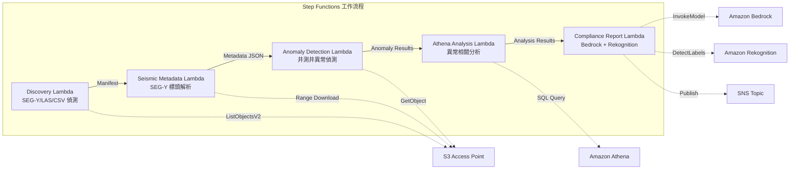

# UC8：能源 / 石油天然氣 — 地震探勘資料處理·井測井異常偵測

🌐 **Language / 言語**: [日本語](README.md) | [English](README.en.md) | [한국어](README.ko.md) | [简体中文](README.zh-CN.md) | 繁體中文 | [Français](README.fr.md) | [Deutsch](README.de.md) | [Español](README.es.md)

📚 **文件**: [架構圖](docs/architecture.zh-TW.md) | [示範指南](docs/demo-guide.zh-TW.md)

## 概述

運用 FSx for ONTAP 的 S3 Access Points，自動化 SEG-Y 地震探勘資料的中繼資料擷取、井測井異常偵測以及合規報告產生的無伺服器工作流程。

### 適合此模式的情境

- FSx for ONTAP 上大量累積了 SEG-Y 地震探勘資料或井測井資料
- 希望自動編目地震探勘資料的中繼資料（測量名稱、座標系統、取樣間隔、道數）
- 希望從井測井感測器讀數中自動偵測異常
- 需要透過 Athena SQL 進行井間·時間序列的異常相關分析
- 希望自動產生合規報告

### 不適合此模式的情境

- 即時地震資料處理（HPC 叢集較為合適）
- 完整的地震探勘資料解釋（需要專用軟體）
- 大規模 3D/4D 地震資料卷的處理（以 EC2 為基礎較為合適）
- 無法確保對 ONTAP REST API 網路可達性的環境

### 主要功能

- 透過 S3 AP 自動偵測 SEG-Y/LAS/CSV 檔案
- 透過 Range 請求串流擷取 SEG-Y 標頭（前 3600 位元組）
- 中繼資料擷取（survey_name、coordinate_system、sample_interval、trace_count、data_format_code）
- 透過統計方法（標準差閾值）進行井測井異常偵測
- 透過 Athena SQL 進行井間·時間序列的異常相關分析
- 透過 Rekognition 對井測井視覺化影像進行模式辨識
- 透過 Amazon Bedrock 產生合規報告

## Success Metrics

### Outcome
透過自動化 SEG-Y 中繼資料擷取·井測井異常偵測，減少地質分析準備工時。

### Metrics
| 指標 | 目標值（範例） |
|-----------|------------|
| 已處理檔案數 / 執行 | > 200 files |
| 中繼資料擷取成功率 | > 95% |
| 異常偵測精確度 | > 85% |
| 處理時間 / 檔案 | < 45 秒 |
| 成本 / 執行 | < $8 |
| Human Review 對象率 | < 20%（異常偵測結果） |

### Measurement Method
Step Functions 執行歷史、Athena 查詢結果、Bedrock 分析報告、CloudWatch Metrics。

## 架構



### 工作流程步驟

1. **Discovery**：從 S3 AP 偵測 .segy、.sgy、.las、.csv 檔案
2. **Seismic Metadata**：透過 Range 請求擷取 SEG-Y 標頭並擷取中繼資料
3. **Anomaly Detection**：透過統計方法對井測井感測器值進行異常偵測
4. **Athena Analysis**：透過 SQL 分析井間·時間序列的異常相關性
5. **Compliance Report**：透過 Bedrock 產生合規報告，透過 Rekognition 進行影像模式辨識

## 前提條件

- AWS 帳戶和適當的 IAM 權限
- FSx for ONTAP 檔案系統（ONTAP 9.17.1P4D3 或更新版本）
- 已啟用 S3 Access Point 的磁碟區（儲存地震探勘資料·井測井資料）
- VPC、私有子網路
- 已啟用 Amazon Bedrock 模型存取（Claude / Nova）

## 部署步驟

### 1. SAM 部署

```bash
# 前提：需要 AWS SAM CLI。sam build 會自動封裝程式碼和共用層。
sam build

sam deploy \
  --stack-name fsxn-energy-seismic \
  --parameter-overrides \
    S3AccessPointAlias=<your-volume-ext-s3alias> \
    S3AccessPointName=<your-s3ap-name> \
    VpcId=<your-vpc-id> \
    PrivateSubnetIds=<subnet-1>,<subnet-2> \
    ScheduleExpression="rate(1 hour)" \
    NotificationEmail=<your-email@example.com> \
    EnableVpcEndpoints=false \
    EnableCloudWatchAlarms=false \
  --capabilities CAPABILITY_NAMED_IAM \
  --resolve-s3 \
  --region ap-northeast-1
```

> **注意**：`template.yaml` 用於 SAM CLI（`sam build` + `sam deploy`）。
> 若使用 `aws cloudformation deploy` 命令直接部署，請使用 `template-deploy.yaml`（需要預先封裝 Lambda zip 檔案並上傳至 S3）。

## 設定參數一覽

| 參數 | 說明 | 預設值 | 必填 |
|-----------|------|----------|------|
| `S3AccessPointAlias` | FSx for ONTAP S3 AP Alias（用於輸入） | — | ✅ |
| `S3AccessPointName` | S3 AP 名稱（用於以 ARN 為基礎的 IAM 權限授予。省略時僅使用以 Alias 為基礎的方式） | `""` | ⚠️ 建議 |
| `ScheduleExpression` | EventBridge Scheduler 的排程運算式 | `rate(1 hour)` | |
| `VpcId` | VPC ID | — | ✅ |
| `PrivateSubnetIds` | 私有子網路 ID 清單 | — | ✅ |
| `NotificationEmail` | SNS 通知目標電子郵件地址 | — | ✅ |
| `AnomalyStddevThreshold` | 異常偵測的標準差閾值 | `3.0` | |
| `MapConcurrency` | Map 狀態的平行執行數 | `10` | |
| `LambdaMemorySize` | Lambda 記憶體大小 (MB) | `1024` | |
| `LambdaTimeout` | Lambda 逾時 (秒) | `300` | |
| `EnableVpcEndpoints` | 啟用 Interface VPC Endpoints | `false` | |
| `EnableCloudWatchAlarms` | 啟用 CloudWatch Alarms | `false` | |

## 清理

```bash
aws s3 rm s3://fsxn-energy-seismic-output-${AWS_ACCOUNT_ID} --recursive

aws cloudformation delete-stack \
  --stack-name fsxn-energy-seismic \
  --region ap-northeast-1

aws cloudformation wait stack-delete-complete \
  --stack-name fsxn-energy-seismic \
  --region ap-northeast-1
```

## Supported Regions

UC8 使用以下服務：

| 服務 | 區域限制 |
|---------|-------------|
| Amazon Athena | 幾乎所有區域皆可使用 |
| Amazon Bedrock | 確認支援的區域（[Bedrock 支援區域](https://docs.aws.amazon.com/general/latest/gr/bedrock.html)） |
| Amazon Rekognition | 幾乎所有區域皆可使用 |
| AWS X-Ray | 幾乎所有區域皆可使用 |
| CloudWatch EMF | 幾乎所有區域皆可使用 |

> 詳情請參閱[區域相容性矩陣](../docs/region-compatibility.md)。

## 參考連結

- [FSx for ONTAP S3 Access Points 概述](https://docs.aws.amazon.com/fsx/latest/ONTAPGuide/accessing-data-via-s3-access-points.html)
- [SEG-Y 格式規範 (Rev 2.0)](https://seg.org/Portals/0/SEG/News%20and%20Resources/Technical%20Standards/seg_y_rev2_0-mar2017.pdf)
- [Amazon Athena 使用者指南](https://docs.aws.amazon.com/athena/latest/ug/what-is.html)
- [Amazon Rekognition 標籤偵測](https://docs.aws.amazon.com/rekognition/latest/dg/labels.html)

---

## AWS 文件連結

| 服務 | 文件 |
|---------|------------|
| FSx for ONTAP | [使用者指南](https://docs.aws.amazon.com/fsx/latest/ONTAPGuide/what-is-fsx-ontap.html) |
| S3 Access Points | [S3 AP for FSx for ONTAP](https://docs.aws.amazon.com/fsx/latest/ONTAPGuide/s3-access-points.html) |
| Step Functions | [開發人員指南](https://docs.aws.amazon.com/step-functions/latest/dg/welcome.html) |
| Amazon Athena | [使用者指南](https://docs.aws.amazon.com/athena/latest/ug/what-is.html) |
| Amazon Bedrock | [使用者指南](https://docs.aws.amazon.com/bedrock/latest/userguide/what-is-bedrock.html) |

### Well-Architected Framework 對應

| 支柱 | 對應 |
|----|------|
| 卓越營運 | X-Ray 追蹤、EMF 指標、異常偵測告警 |
| 安全性 | 最小權限 IAM、KMS 加密、探勘資料存取控制 |
| 可靠性 | Step Functions Retry/Catch、SEG-Y 解析異常處理 |
| 效能效率 | Range GET（標頭部分讀取）、Athena 分割區 |
| 成本最佳化 | 無伺服器（僅在使用時計費）、部分讀取以減少傳輸量 |
| 永續性 | 隨需執行、增量處理 |

---

## 成本估算（每月概算）

> **備註**：以下為 ap-northeast-1 區域的概算，實際成本因使用量而異。最新價格請於 [AWS Pricing Calculator](https://calculator.aws/) 上確認。

### 無伺服器元件（按量計費）

| 服務 | 單價 | 預計使用量 | 每月概算 |
|---------|------|-----------|---------|
| Lambda | $0.0000166667/GB-sec | 5 個函數 × 10 surveys/日 | ~$1-5 |
| S3 API (GetObject/ListObjects) | $0.0047/10K requests | ~10K requests/日 | ~$1.5 |
| Step Functions | $0.025/1K state transitions | ~1K transitions/日 | ~$0.75 |
| Bedrock (Nova Lite) | $0.00006/1K input tokens | ~20K tokens/執行 | ~$3-10 |
| Athena | $5/TB scanned | ~20 MB/查詢 | ~$0.5-2 |
| SNS | $0.50/100K notifications | ~100 notifications/日 | ~$0.15 |
| CloudWatch Logs | $0.76/GB ingested | ~1 GB/月 | ~$0.76 |

### 固定成本（FSx for ONTAP — 以現有環境為前提）

| 元件 | 每月 |
|--------------|------|
| FSx for ONTAP (128 MBps, 1 TB) | ~$230 (共用現有環境) |
| S3 Access Point | 無額外費用（僅 S3 API 費用） |

### 合計概算

| 組態 | 每月概算 |
|------|---------|
| 最小組態（每日執行 1 次） | ~$5-15 |
| 標準組態（每小時執行） | ~$15-50 |
| 大規模組態（高頻率 + 告警） | ~$50-150 |

> **Governance Caveat**：成本估算為概算，並非保證值。實際帳單金額因使用模式、資料量、區域而異。

---

## 本機測試

### Prerequisites 檢查

```bash
# 確認前提條件
aws --version          # AWS CLI v2
sam --version          # SAM CLI
python3 --version      # Python 3.9+
docker --version       # Docker (sam local 用)
aws sts get-caller-identity  # AWS 認證資訊
```

### sam local invoke

```bash
# 建置
# 前提：需要 AWS SAM CLI。sam build 會自動封裝程式碼和共用層。
sam build

# 在本機執行 Discovery Lambda
sam local invoke DiscoveryFunction --event events/discovery-event.json

# 帶環境變數覆寫
sam local invoke DiscoveryFunction \
  --event events/discovery-event.json \
  --env-vars env.json
```

### 單元測試

```bash
python3 -m pytest tests/ -v
```

詳情請參閱[本機測試快速入門](../docs/local-testing-quick-start.md)。

---

## 輸出範例 (Output Sample)

地震探勘資料分析的輸出範例：

```json
{
  "discovery": {
    "status": "completed",
    "object_count": 3,
    "prefix": "seismic/surveys/"
  },
  "seismic_metadata": [
    {
      "key": "seismic/surveys/line-2026-A.segy",
      "format": "SEG-Y Rev 1",
      "trace_count": 12000,
      "sample_interval_us": 2000,
      "coordinate_system": "WGS84/UTM Zone 54N"
    }
  ],
  "anomaly_detection": {
    "anomalies_found": 2,
    "types": ["amplitude_spike", "trace_gap"],
    "severity": "medium"
  },
  "compliance_report": {
    "report_key": "reports/seismic-compliance-2026-05-23.json",
    "regulatory_status": "COMPLIANT",
    "data_retention_days": 2555
  }
}
```

> **備註**：上述為範例輸出，實際值因環境·輸入資料而異。基準數值為 sizing reference，並非 service limit。

---

## Governance Note

> 本模式提供技術架構指導。並非法律·合規·監管方面的建議。組織應諮詢合格的專業人員。

---

## S3AP Compatibility

關於 S3 Access Points for FSx for ONTAP 的相容性限制、疑難排解及觸發模式，請參閱 [S3AP Compatibility Notes](../docs/s3ap-compatibility-notes.md)。
