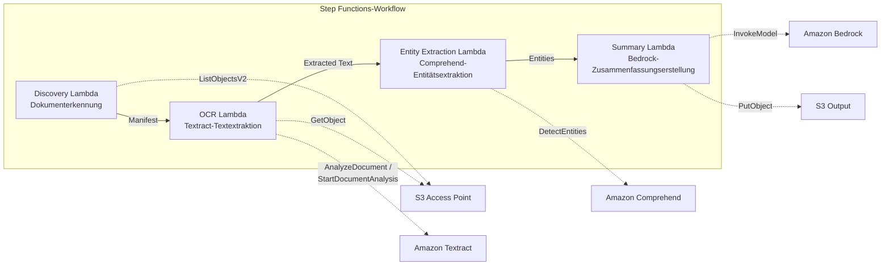

# UC2: Finanzen & Versicherung — Automatisierte Vertrags- und Rechnungsverarbeitung (IDP)

🌐 **Language / 言語**: [日本語](README.md) | [English](README.en.md) | [한국어](README.ko.md) | [简体中文](README.zh-CN.md) | [繁體中文](README.zh-TW.md) | [Français](README.fr.md) | Deutsch | [Español](README.es.md)

📚 **Dokumentation**: [Architekturdiagramm](docs/architecture.de.md) | [Demo-Leitfaden](docs/demo-guide.de.md)

## Überblick

Ein Serverless-Workflow, der die S3 Access Points von FSx for ONTAP nutzt, um bei Dokumenten wie Verträgen und Rechnungen automatisch OCR-Verarbeitung, Entitätsextraktion und Zusammenfassungserstellung durchzuführen.

### Wann dieses Muster geeignet ist

- Sie möchten PDF/TIFF/JPEG-Dokumente auf einem Dateiserver regelmäßig per OCR im Batch verarbeiten
- Sie möchten einem bestehenden NAS-Workflow (Scanner → Ablage auf dem Dateiserver) KI-Verarbeitung hinzufügen, ohne ihn zu ändern
- Sie möchten Datum, Beträge und Organisationsnamen aus Verträgen und Rechnungen automatisch extrahieren und als strukturierte Daten nutzen
- Sie möchten eine IDP-Pipeline aus Textract + Comprehend + Bedrock zu minimalen Kosten ausprobieren

### Wann dieses Muster nicht geeignet ist

- Es ist eine Echtzeitverarbeitung unmittelbar nach dem Hochladen eines Dokuments erforderlich
- Verarbeitung großer Dokumentmengen (mehrere Zehntausend pro Tag oder mehr) (beachten Sie die API-Ratenbegrenzungen von Textract)
- Die Latenz von regionsübergreifenden Aufrufen ist in Regionen, in denen Textract nicht verfügbar ist, nicht akzeptabel
- Die Dokumente liegen bereits in einem S3-Standard-Bucket und können über S3-Ereignisbenachrichtigungen verarbeitet werden

### Hauptfunktionen

- Automatische Erkennung von PDF-, TIFF- und JPEG-Dokumenten über den S3 AP
- OCR-Textextraktion mit Amazon Textract (automatische Auswahl der synchronen/asynchronen API)
- Extraktion benannter Entitäten mit Amazon Comprehend (Datum, Beträge, Organisationsnamen, Personennamen)
- Erstellung strukturierter Zusammenfassungen mit Amazon Bedrock

## Success Metrics

### Outcome
Reduzierung des manuellen Dateneingabeaufwands durch die automatisierte Verarbeitung von Verträgen und Rechnungen.

### Metrics
| Metrik | Zielwert (Beispiel) |
|-----------|------------|
| Verarbeitete Dokumente pro Ausführung | > 500 documents |
| OCR-Genauigkeit (Zeichenerkennungsrate) | > 95% |
| Erfolgsquote der Datenextraktion | > 90% |
| Verarbeitungszeit pro Dokument | < 30 Sekunden |
| Kosten pro Dokument | < $0.10 |
| Anteil an Human Review | < 20% (niedrige Konfidenzwerte) |

### Measurement Method
Step Functions-Ausführungsverlauf, Textract confidence score, CloudWatch Metrics, Anzahl der S3-Ausgabedateien.

## Architektur



### Workflow-Schritte

1. **Discovery**: Erkennt PDF-, TIFF- und JPEG-Dokumente aus dem S3 AP und erzeugt ein Manifest
2. **OCR**: Wählt basierend auf der Seitenzahl des Dokuments automatisch die synchrone/asynchrone Textract-API aus und führt OCR durch
3. **Entity Extraction**: Extrahiert benannte Entitäten (Datum, Beträge, Organisationsnamen, Personennamen) mit Comprehend
4. **Summary**: Erstellt mit Bedrock eine strukturierte Zusammenfassung und gibt sie im JSON-Format nach S3 aus

## Voraussetzungen

- Ein AWS-Konto und geeignete IAM-Berechtigungen
- Ein FSx for ONTAP-Dateisystem (ONTAP 9.17.1P4D3 oder höher)
- Ein Volume mit aktiviertem S3 Access Point
- In Secrets Manager registrierte ONTAP-REST-API-Anmeldeinformationen
- Ein VPC und private Subnetze
- Aktivierter Zugriff auf Amazon-Bedrock-Modelle (Claude / Nova)
- Eine Region, in der Amazon Textract und Amazon Comprehend verfügbar sind

## Bereitstellungsschritte

### 1. Vorbereitung der Parameter

Überprüfen Sie vor der Bereitstellung die folgenden Werte:

- FSx for ONTAP S3 Access Point Alias
- ONTAP-Management-IP-Adresse
- Secrets Manager-Secret-Name
- VPC-ID, private Subnetz-IDs

### 2. SAM-Bereitstellung

```bash
# Voraussetzung: Die AWS SAM CLI ist erforderlich. sam build verpackt den Code und den gemeinsamen Layer automatisch.
sam build

sam deploy \
  --stack-name fsxn-financial-idp \
  --parameter-overrides \
    S3AccessPointAlias=<your-volume-ext-s3alias> \
    S3AccessPointName=<your-s3ap-name> \
    S3AccessPointOutputAlias=<your-output-volume-ext-s3alias> \
    OntapSecretName=<your-ontap-secret-name> \
    OntapManagementIp=<your-ontap-management-ip> \
    ScheduleExpression="rate(1 hour)" \
    VpcId=<your-vpc-id> \
    PrivateSubnetIds=<subnet-1>,<subnet-2> \
    NotificationEmail=<your-email@example.com> \
    EnableVpcEndpoints=false \
    EnableCloudWatchAlarms=false \
  --capabilities CAPABILITY_NAMED_IAM \
  --resolve-s3 \
  --region ap-northeast-1
```

> **Hinweis**: `template.yaml` wird mit der SAM CLI (`sam build` + `sam deploy`) verwendet.
> Um direkt mit dem Befehl `aws cloudformation deploy` bereitzustellen, verwenden Sie stattdessen `template-deploy.yaml` (das Vorverpacken der Lambda-Zip-Dateien und der Upload nach S3 sind erforderlich).

> **Hinweis**: Ersetzen Sie die Platzhalter `<...>` durch die tatsächlichen Werte Ihrer Umgebung.

### 3. Bestätigung des SNS-Abonnements

Nach der Bereitstellung wird eine SNS-Abonnementbestätigungs-E-Mail an die von Ihnen angegebene E-Mail-Adresse gesendet.

> **Hinweis**: Wenn Sie `S3AccessPointName` weglassen, wird die IAM-Richtlinie nur Alias-basiert, was einen `AccessDenied`-Fehler verursachen kann. In Produktionsumgebungen wird die Angabe empfohlen. Weitere Informationen finden Sie im [Leitfaden zur Fehlerbehebung](../docs/guides/troubleshooting-guide.md#1-accessdenied-エラー).

## Liste der Konfigurationsparameter

| Parameter | Beschreibung | Standard | Erforderlich |
|-----------|------|----------|------|
| `S3AccessPointAlias` | FSx for ONTAP S3 AP Alias (für Eingabe) | — | ✅ |
| `S3AccessPointName` | S3-AP-Name (für die Erteilung ARN-basierter IAM-Berechtigungen; nur Alias-basiert, wenn ausgelassen) | `""` | ⚠️ Empfohlen |
| `S3AccessPointOutputAlias` | FSx for ONTAP S3 AP Alias (für Ausgabe) | — | ✅ |
| `OntapSecretName` | Secrets Manager-Secret-Name für die ONTAP-Anmeldeinformationen | — | ✅ |
| `OntapManagementIp` | Management-IP-Adresse des ONTAP-Clusters | — | ✅ |
| `ScheduleExpression` | EventBridge Scheduler-Zeitplanausdruck | `rate(1 hour)` | |
| `VpcId` | VPC-ID | — | ✅ |
| `PrivateSubnetIds` | Liste der privaten Subnetz-IDs | — | ✅ |
| `NotificationEmail` | SNS-Benachrichtigungs-E-Mail-Adresse | — | ✅ |
| `EnableVpcEndpoints` | Aktivierung der Interface VPC Endpoints | `false` | |
| `EnableCloudWatchAlarms` | Aktivierung der CloudWatch Alarms | `false` | |

## Kostenstruktur

### Anfragebasiert (nutzungsabhängig)

| Service | Abrechnungseinheit | Schätzung (100 Dokumente/Monat) |
|---------|---------|--------------------------|
| Lambda | Anzahl der Anfragen + Ausführungszeit | ~$0.01 |
| Step Functions | Anzahl der Zustandsübergänge | Innerhalb des kostenlosen Kontingents |
| S3 API | Anzahl der Anfragen | ~$0.01 |
| Textract | Anzahl der Seiten | ~$0.15 |
| Comprehend | Anzahl der Einheiten (pro 100 Zeichen) | ~$0.03 |
| Bedrock | Anzahl der Token | ~$0.10 |

### Dauerbetrieb (optional)

| Service | Parameter | Monatlich |
|---------|-----------|------|
| Interface VPC Endpoints | `EnableVpcEndpoints=true` | ~$28.80 |
| CloudWatch Alarms | `EnableCloudWatchAlarms=true` | ~$0.30 |

> In Demo-/PoC-Umgebungen können Sie ab **~$0.30/Monat** mit ausschließlich variablen Kosten starten.

## Format der Ausgabedaten

Das Ausgabe-JSON des Summary Lambda:

```json
{
  "extracted_text": "Volltext des Vertrags...",
  "entities": [
    {"type": "DATE", "text": "15. Januar 2026"},
    {"type": "ORGANIZATION", "text": "Beispiel AG"},
    {"type": "QUANTITY", "text": "1.000.000 JPY"}
  ],
  "summary": "Dieser Vertrag...",
  "document_key": "contracts/2026/sample-contract.pdf",
  "processed_at": "2026-01-15T10:00:00Z"
}
```

## Bereinigung

```bash
# Löschen des CloudFormation-Stacks
aws cloudformation delete-stack \
  --stack-name fsxn-financial-idp \
  --region ap-northeast-1

# Warten auf den Abschluss der Löschung
aws cloudformation wait stack-delete-complete \
  --stack-name fsxn-financial-idp \
  --region ap-northeast-1
```

> **Hinweis**: Wenn im S3-Bucket noch Objekte vorhanden sind, kann das Löschen des Stacks fehlschlagen. Leeren Sie den Bucket vorab.

## Supported Regions

UC2 verwendet die folgenden Services:

| Service | Regionsbeschränkung |
|---------|-------------|
| Amazon Textract | In ap-northeast-1 nicht unterstützt. Geben Sie mit dem Parameter `TEXTRACT_REGION` eine unterstützte Region (z. B. us-east-1) an |
| Amazon Comprehend | In fast allen Regionen verfügbar |
| Amazon Bedrock | Unterstützte Regionen prüfen ([Von Bedrock unterstützte Regionen](https://docs.aws.amazon.com/general/latest/gr/bedrock.html)) |
| AWS X-Ray | In fast allen Regionen verfügbar |
| CloudWatch EMF | In fast allen Regionen verfügbar |

> Die Textract-API wird über einen Cross-Region Client aufgerufen. Prüfen Sie Ihre Anforderungen an die Datenresidenz. Weitere Informationen finden Sie in der [Matrix zur Regionskompatibilität](../docs/region-compatibility.md).

## Referenzlinks

### Offizielle AWS-Dokumentation

- [Überblick über FSx for ONTAP S3 Access Points](https://docs.aws.amazon.com/fsx/latest/ONTAPGuide/accessing-data-via-s3-access-points.html)
- [Serverlose Verarbeitung mit Lambda (offizielles Tutorial)](https://docs.aws.amazon.com/fsx/latest/ONTAPGuide/tutorial-process-files-with-lambda.html)
- [Textract-API-Referenz](https://docs.aws.amazon.com/textract/latest/dg/API_Reference.html)
- [Comprehend DetectEntities API](https://docs.aws.amazon.com/comprehend/latest/dg/API_DetectEntities.html)
- [Bedrock InvokeModel-API-Referenz](https://docs.aws.amazon.com/bedrock/latest/APIReference/API_runtime_InvokeModel.html)

### AWS-Blogbeiträge und Leitfäden

- [S3-AP-Ankündigungsblog](https://aws.amazon.com/blogs/aws/amazon-fsx-for-netapp-ontap-now-integrates-with-amazon-s3-for-seamless-data-access/)
- [Step Functions + Bedrock-Dokumentverarbeitung](https://aws.amazon.com/blogs/compute/orchestrating-large-scale-document-processing-with-aws-step-functions-and-amazon-bedrock-batch-inference/)
- [IDP-Leitfaden (Intelligent Document Processing on AWS)](https://aws.amazon.com/solutions/guidance/intelligent-document-processing-on-aws3/)

### GitHub-Beispiele

- [aws-samples/amazon-textract-serverless-large-scale-document-processing](https://github.com/aws-samples/amazon-textract-serverless-large-scale-document-processing) — Textract-Verarbeitung im großen Maßstab
- [aws-samples/serverless-patterns](https://github.com/aws-samples/serverless-patterns) — Sammlung von Serverless-Mustern
- [aws-samples/aws-stepfunctions-examples](https://github.com/aws-samples/aws-stepfunctions-examples) — Step Functions-Beispiele

## Validierte Umgebung

| Element | Wert |
|------|-----|
| AWS-Region | ap-northeast-1 (Tokio) |
| FSx for ONTAP-Version | ONTAP 9.17.1P4D3 |
| FSx-Konfiguration | SINGLE_AZ_1 |
| Python | 3.12 |
| Bereitstellungsmethode | CloudFormation (standard) |

## Lambda-VPC-Platzierungsarchitektur

Basierend auf den in der Validierung gewonnenen Erkenntnissen sind die Lambda-Funktionen getrennt innerhalb und außerhalb des VPC platziert.

**Lambda im VPC** (nur Funktionen, die ONTAP-REST-API-Zugriff benötigen):
- Discovery Lambda — S3 AP + ONTAP API

**Lambda außerhalb des VPC** (verwendet nur APIs verwalteter AWS-Services):
- Alle anderen Lambda-Funktionen

> **Grund**: Um von einer Lambda im VPC auf APIs verwalteter AWS-Services (Athena, Bedrock, Textract usw.) zuzugreifen, ist ein Interface VPC Endpoint erforderlich (je 7,20 $/Monat). Eine Lambda außerhalb des VPC kann über das Internet direkt auf AWS-APIs zugreifen und funktioniert ohne zusätzliche Kosten.

> **Hinweis**: Für UCs, die die ONTAP-REST-API verwenden (UC1 Recht und Compliance), ist `EnableVpcEndpoints=true` obligatorisch. Dies liegt daran, dass die ONTAP-Anmeldeinformationen über den Secrets Manager VPC Endpoint abgerufen werden.

---

## AWS-Dokumentationslinks

| Service | Dokumentation |
|---------|------------|
| FSx for ONTAP | [FSx for ONTAP](https://docs.aws.amazon.com/fsx/latest/ONTAPGuide/what-is-fsx-ontap.html) |
| S3 Access Points | [S3 Access Points](https://docs.aws.amazon.com/fsx/latest/ONTAPGuide/s3-access-points.html) |
| Step Functions | [Step Functions](https://docs.aws.amazon.com/step-functions/latest/dg/welcome.html) |
| Amazon Textract | [Amazon Textract](https://docs.aws.amazon.com/textract/latest/dg/what-is.html) |
| Amazon Comprehend | [Amazon Comprehend](https://docs.aws.amazon.com/comprehend/latest/dg/what-is.html) |
| Amazon Bedrock | [Amazon Bedrock](https://docs.aws.amazon.com/bedrock/latest/userguide/what-is-bedrock.html) |

### Well-Architected Framework-Konformität

| Säule | Umsetzung |
|----|------|
| Operative Exzellenz | X-Ray-Tracing, EMF-Metriken, strukturierte Protokollierung |
| Sicherheit | IAM mit geringsten Rechten, KMS-Verschlüsselung, PII-Erkennung |
| Zuverlässigkeit | Step Functions Retry/Catch, regionsübergreifendes Fallback |
| Leistungseffizienz | Optimierung des Lambda-Speichers, parallele OCR-Verarbeitung |
| Kostenoptimierung | Serverless (nur bei Nutzung abgerechnet), seitenweise Textract-Abrechnung |
| Nachhaltigkeit | On-Demand-Ausführung, automatisches Abschalten nicht benötigter Ressourcen |

---

## Lokales Testen

### Prüfung der Voraussetzungen

```bash
# Prüfung der Voraussetzungen
aws --version          # AWS CLI v2
sam --version          # SAM CLI
python3 --version      # Python 3.9+
docker --version       # Docker (für sam local)
aws sts get-caller-identity  # AWS-Anmeldeinformationen
```

### sam local invoke

```bash
# Build
# Voraussetzung: Die AWS SAM CLI ist erforderlich. sam build verpackt den Code und den gemeinsamen Layer automatisch.
sam build

# Lokale Ausführung des Discovery Lambda
sam local invoke DiscoveryFunction --event events/discovery-event.json

# Mit Überschreibung von Umgebungsvariablen
sam local invoke DiscoveryFunction \
  --event events/discovery-event.json \
  --env-vars env.json
```

### Unit-Tests

```bash
python3 -m pytest tests/ -v
```

Weitere Informationen finden Sie im [Schnellstart für lokales Testen](../docs/local-testing-quick-start.md).

---

## Ausgabebeispiel (Output Sample)

Beispielausgabe für Formular-OCR → Entitätsextraktion:

```json
{
  "discovery": {
    "status": "completed",
    "object_count": 25,
    "prefix": "invoices/"
  },
  "processing": [
    {
      "key": "invoices/INV-2026-001.pdf",
      "ocr_result": {
        "document_type": "invoice",
        "confidence": 0.97
      },
      "entities": {
        "vendor_name": "Beispiel AG",
        "invoice_number": "INV-2026-001",
        "amount": "1,234,567",
        "currency": "JPY",
        "due_date": "2026-06-30"
      },
      "summary": "Rechnung der Firma Beispiel. Betrag 1.234.567 JPY, Fälligkeitsdatum 2026/6/30."
    }
  ],
  "report": {
    "total_processed": 25,
    "succeeded": 24,
    "failed": 1,
    "output_prefix": "s3://output-bucket/extracted/"
  }
}
```

> **Anmerkung**: Das Obige ist eine Beispielausgabe; die tatsächlichen Werte variieren je nach Umgebung und Eingabedaten. Benchmark-Zahlen sind ein sizing reference, kein service limit.

---

## Governance Note

> Dieses Muster bietet technische Architekturleitlinien. Es stellt keine rechtliche, Compliance- oder regulatorische Beratung dar. Organisationen sollten qualifizierte Fachleute konsultieren.

### Konformität mit den FISC-Sicherheitsrichtlinien

Für Finanzinstitute in Japan ordnet dieser Abschnitt die Designelemente dieses Musters den FISC-Sicherheitsrichtlinien (The Center for Financial Industry Information Systems) zu.

> **Wichtig**: Dieser Abschnitt garantiert keine FISC-Konformität. Die endgültige Entscheidung über die FISC-Konformität muss von der Informationssicherheitsabteilung des Finanzinstituts und seiner Wirtschaftsprüfungsgesellschaft getroffen werden.

| FISC-Richtlinienkategorie | Entsprechendes Designelement dieses Musters |
|---------------------|----------------------|
| Zugriffsverwaltung | IAM mit geringsten Rechten, S3-AP-Ressourcenrichtlinie, ONTAP-Autorisierung auf zwei Ebenen |
| Verschlüsselung | SSE-FSX (im Ruhezustand), TLS 1.2+ (bei der Übertragung), KMS (Ausgabe-Bucket) |
| Audit-Trail | CloudTrail (alle API-Aufrufe), CloudWatch Logs (Lambda-Ausführungsprotokolle), X-Ray-Tracing |
| Datenschutz | Ausführung im VPC (optional), Secrets Manager (Verwaltung der Anmeldeinformationen), Datenklassifizierungslabels |
| Verfügbarkeit | Step Functions Retry/Catch, automatische Lambda-Skalierung, Multi-AZ FSx for ONTAP (optional) |
| Änderungsverwaltung | CloudFormation (IaC), Git-Verwaltung, CI/CD-Pipeline |
| Störungsbehebung | CloudWatch Alarms, SNS-Benachrichtigungen, Playbook zur Vorfallreaktion |

**Zusätzlich zu berücksichtigende Punkte**:
- Anforderungen an die inländische Speicherung von Finanzdaten (durch Verwendung der Region ap-northeast-1 erfüllt)
- Zulässigkeit des Datenpfads bei regionsübergreifenden Textract-Aufrufen (über us-east-1)
- Klärung der Aufsichtspflichten gegenüber dem Auftragsverarbeiter (AWS)
- Ein Plan für regelmäßige Schwachstellenbewertungen und Penetrationstests

---

## S3AP Compatibility

Informationen zu Kompatibilitätsbeschränkungen, Fehlerbehebung und Trigger-Mustern von S3 Access Points for FSx for ONTAP finden Sie in den [S3AP Compatibility Notes](../docs/s3ap-compatibility-notes.md).
