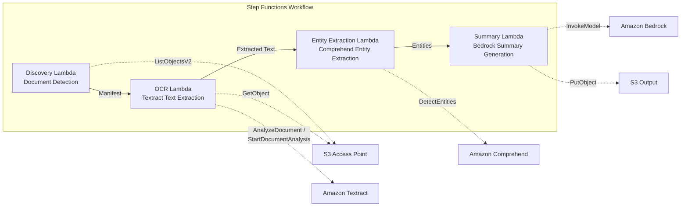

# UC2: Financial & Insurance — Automated Contract & Invoice Processing (IDP)

🌐 **Language / 言語**: [日本語](README.md) | English | [한국어](README.ko.md) | [简体中文](README.zh-CN.md) | [繁體中文](README.zh-TW.md) | [Français](README.fr.md) | [Deutsch](README.de.md) | [Español](README.es.md)

📚 **Documentation**: [Architecture Diagram](docs/architecture.en.md) | [Demo Guide](docs/demo-guide.en.md)

## Overview

A serverless workflow that leverages the S3 Access Points of FSx for ONTAP to automatically perform OCR processing, entity extraction, and summary generation on documents such as contracts and invoices.

### When This Pattern Is a Good Fit

- You want to run periodic batch OCR processing on PDF/TIFF/JPEG documents stored on a file server
- You want to add AI processing to an existing NAS workflow (scanner → file server storage) without changing it
- You want to automatically extract dates, amounts, and organization names from contracts and invoices, and use them as structured data
- You want to try a Textract + Comprehend + Bedrock IDP pipeline at minimal cost

### When This Pattern Is Not a Good Fit

- You need real-time processing immediately after a document is uploaded
- You process tens of thousands of documents per day or more (be mindful of Textract API rate limits)
- The latency of cross-region calls is unacceptable in regions where Textract is not available
- Documents already exist in a standard S3 bucket and can be processed via S3 event notifications

### Key Features

- Automatic detection of PDF, TIFF, and JPEG documents via the S3 AP
- OCR text extraction with Amazon Textract (automatic synchronous/asynchronous API selection)
- Named Entity extraction with Amazon Comprehend (dates, amounts, organization names, person names)
- Structured summary generation with Amazon Bedrock

## Success Metrics

### Outcome
Reduce manual data-entry effort through automated processing of contracts and invoices.

### Metrics
| Metric | Target (example) |
|-----------|------------|
| Documents processed per run | > 500 documents |
| OCR accuracy (character recognition rate) | > 95% |
| Data extraction success rate | > 90% |
| Processing time per document | < 30 seconds |
| Cost per document | < $0.10 |
| Human Review rate | < 20% (low confidence scores) |

### Measurement Method
Step Functions execution history, Textract confidence score, CloudWatch Metrics, and the number of S3 output files.

## Architecture



### Workflow Steps

1. **Discovery**: Detect PDF, TIFF, and JPEG documents from the S3 AP and generate a Manifest
2. **OCR**: Automatically select the Textract synchronous/asynchronous API based on the document page count and run OCR
3. **Entity Extraction**: Extract Named Entities (dates, amounts, organization names, person names) with Comprehend
4. **Summary**: Generate a structured summary with Bedrock and output it to S3 in JSON format

## Prerequisites

- An AWS account and appropriate IAM permissions
- An FSx for ONTAP file system (ONTAP 9.17.1P4D3 or later)
- A volume with S3 Access Point enabled
- ONTAP REST API credentials registered in Secrets Manager
- A VPC and private subnets
- Amazon Bedrock model access enabled (Claude / Nova)
- A region where Amazon Textract and Amazon Comprehend are available

## Deployment Steps

### 1. Prepare Parameters

Verify the following values before deployment:

- FSx for ONTAP S3 Access Point Alias
- ONTAP management IP address
- Secrets Manager secret name
- VPC ID and private subnet IDs

### 2. SAM Deployment

```bash
# Prerequisite: AWS SAM CLI is required. sam build packages the code and shared layer automatically.
sam build

sam deploy \
  --stack-name fsxn-financial-idp \
  --parameter-overrides \
    S3AccessPointAlias=<your-volume-ext-s3alias> \
    S3AccessPointName=<your-s3ap-name> \
    S3AccessPointOutputAlias=<your-output-volume-ext-s3alias> \
    OntapSecretName=<your-ontap-secret-name> \
    OntapManagementIp=<your-ontap-management-ip> \
    ScheduleExpression="rate(1 hour)" \
    VpcId=<your-vpc-id> \
    PrivateSubnetIds=<subnet-1>,<subnet-2> \
    NotificationEmail=<your-email@example.com> \
    EnableVpcEndpoints=false \
    EnableCloudWatchAlarms=false \
  --capabilities CAPABILITY_NAMED_IAM \
  --resolve-s3 \
  --region ap-northeast-1
```

> **Note**: `template.yaml` is used with the SAM CLI (`sam build` + `sam deploy`).
> To deploy directly with the `aws cloudformation deploy` command, use `template-deploy.yaml` instead (pre-packaging of the Lambda zip files and upload to S3 are required).

> **Note**: Replace the `<...>` placeholders with your actual environment values.

### 3. Confirm the SNS Subscription

After deployment, an SNS subscription confirmation email is sent to the address you specified.

> **Note**: If you omit `S3AccessPointName`, the IAM policy becomes Alias-based only, which can cause an `AccessDenied` error. Specifying it is recommended in production environments. For details, see the [Troubleshooting Guide](../docs/guides/troubleshooting-guide.md#1-accessdenied-エラー).

## Configuration Parameters

| Parameter | Description | Default | Required |
|-----------|------|----------|------|
| `S3AccessPointAlias` | FSx for ONTAP S3 AP Alias (for input) | — | ✅ |
| `S3AccessPointName` | S3 AP name (for granting ARN-based IAM permissions; Alias-based only if omitted) | `""` | ⚠️ Recommended |
| `S3AccessPointOutputAlias` | FSx for ONTAP S3 AP Alias (for output) | — | ✅ |
| `OntapSecretName` | Secrets Manager secret name for the ONTAP credentials | — | ✅ |
| `OntapManagementIp` | ONTAP cluster management IP address | — | ✅ |
| `ScheduleExpression` | EventBridge Scheduler schedule expression | `rate(1 hour)` | |
| `VpcId` | VPC ID | — | ✅ |
| `PrivateSubnetIds` | List of private subnet IDs | — | ✅ |
| `NotificationEmail` | SNS notification email address | — | ✅ |
| `EnableVpcEndpoints` | Enable Interface VPC Endpoints | `false` | |
| `EnableCloudWatchAlarms` | Enable CloudWatch Alarms | `false` | |

## Cost Structure

### Request-based (pay-as-you-go)

| Service | Billing unit | Estimate (100 documents/month) |
|---------|---------|--------------------------|
| Lambda | Number of requests + execution time | ~$0.01 |
| Step Functions | Number of state transitions | Within free tier |
| S3 API | Number of requests | ~$0.01 |
| Textract | Number of pages | ~$0.15 |
| Comprehend | Number of units (per 100 characters) | ~$0.03 |
| Bedrock | Number of tokens | ~$0.10 |

### Always-on (Optional)

| Service | Parameter | Monthly |
|---------|-----------|------|
| Interface VPC Endpoints | `EnableVpcEndpoints=true` | ~$28.80 |
| CloudWatch Alarms | `EnableCloudWatchAlarms=true` | ~$0.30 |

> In demo/PoC environments, you can start from **~$0.30/month** with variable costs only.

## Output Data Format

The output JSON from the Summary Lambda:

```json
{
  "extracted_text": "Full text of the contract...",
  "entities": [
    {"type": "DATE", "text": "January 15, 2026"},
    {"type": "ORGANIZATION", "text": "Sample Corporation"},
    {"type": "QUANTITY", "text": "1,000,000 JPY"}
  ],
  "summary": "This contract...",
  "document_key": "contracts/2026/sample-contract.pdf",
  "processed_at": "2026-01-15T10:00:00Z"
}
```

## Cleanup

```bash
# Delete the CloudFormation stack
aws cloudformation delete-stack \
  --stack-name fsxn-financial-idp \
  --region ap-northeast-1

# Wait for deletion to complete
aws cloudformation wait stack-delete-complete \
  --stack-name fsxn-financial-idp \
  --region ap-northeast-1
```

> **Note**: If objects remain in the S3 bucket, stack deletion may fail. Empty the bucket beforehand.

## Supported Regions

UC2 uses the following services:

| Service | Region constraint |
|---------|-------------|
| Amazon Textract | Not available in ap-northeast-1. Specify a supported region (e.g., us-east-1) with the `TEXTRACT_REGION` parameter |
| Amazon Comprehend | Available in almost all regions |
| Amazon Bedrock | Check supported regions ([Bedrock supported regions](https://docs.aws.amazon.com/general/latest/gr/bedrock.html)) |
| AWS X-Ray | Available in almost all regions |
| CloudWatch EMF | Available in almost all regions |

> The Textract API is called via a Cross-Region Client. Check your data residency requirements. For details, see the [Region Compatibility Matrix](../docs/region-compatibility.md).

## Reference Links

### AWS Official Documentation

- [FSx for ONTAP S3 Access Points overview](https://docs.aws.amazon.com/fsx/latest/ONTAPGuide/accessing-data-via-s3-access-points.html)
- [Serverless processing with Lambda (official tutorial)](https://docs.aws.amazon.com/fsx/latest/ONTAPGuide/tutorial-process-files-with-lambda.html)
- [Textract API reference](https://docs.aws.amazon.com/textract/latest/dg/API_Reference.html)
- [Comprehend DetectEntities API](https://docs.aws.amazon.com/comprehend/latest/dg/API_DetectEntities.html)
- [Bedrock InvokeModel API reference](https://docs.aws.amazon.com/bedrock/latest/APIReference/API_runtime_InvokeModel.html)

### AWS Blog Posts & Guidance

- [S3 AP announcement blog](https://aws.amazon.com/blogs/aws/amazon-fsx-for-netapp-ontap-now-integrates-with-amazon-s3-for-seamless-data-access/)
- [Step Functions + Bedrock document processing](https://aws.amazon.com/blogs/compute/orchestrating-large-scale-document-processing-with-aws-step-functions-and-amazon-bedrock-batch-inference/)
- [IDP guidance (Intelligent Document Processing on AWS)](https://aws.amazon.com/solutions/guidance/intelligent-document-processing-on-aws3/)

### GitHub Samples

- [aws-samples/amazon-textract-serverless-large-scale-document-processing](https://github.com/aws-samples/amazon-textract-serverless-large-scale-document-processing) — Large-scale Textract processing
- [aws-samples/serverless-patterns](https://github.com/aws-samples/serverless-patterns) — Serverless patterns collection
- [aws-samples/aws-stepfunctions-examples](https://github.com/aws-samples/aws-stepfunctions-examples) — Step Functions samples

## Verified Environment

| Item | Value |
|------|-----|
| AWS region | ap-northeast-1 (Tokyo) |
| FSx for ONTAP version | ONTAP 9.17.1P4D3 |
| FSx configuration | SINGLE_AZ_1 |
| Python | 3.12 |
| Deployment method | CloudFormation (standard) |

## Lambda VPC Placement Architecture

Based on the insights gained during validation, the Lambda functions are placed separately inside and outside the VPC.

**In-VPC Lambda** (only functions that require ONTAP REST API access):
- Discovery Lambda — S3 AP + ONTAP API

**Out-of-VPC Lambda** (only uses AWS managed service APIs):
- All other Lambda functions

> **Reason**: To access AWS managed service APIs (Athena, Bedrock, Textract, etc.) from an in-VPC Lambda, an Interface VPC Endpoint is required (each $7.20/month). An out-of-VPC Lambda can access AWS APIs directly over the internet and works with no additional cost.

> **Note**: For UCs that use the ONTAP REST API (UC1 Legal & Compliance), `EnableVpcEndpoints=true` is mandatory. This is because ONTAP credentials are retrieved via the Secrets Manager VPC Endpoint.

---

## AWS Documentation Links

| Service | Documentation |
|---------|------------|
| FSx for ONTAP | [FSx for ONTAP](https://docs.aws.amazon.com/fsx/latest/ONTAPGuide/what-is-fsx-ontap.html) |
| S3 Access Points | [S3 Access Points](https://docs.aws.amazon.com/fsx/latest/ONTAPGuide/s3-access-points.html) |
| Step Functions | [Step Functions](https://docs.aws.amazon.com/step-functions/latest/dg/welcome.html) |
| Amazon Textract | [Amazon Textract](https://docs.aws.amazon.com/textract/latest/dg/what-is.html) |
| Amazon Comprehend | [Amazon Comprehend](https://docs.aws.amazon.com/comprehend/latest/dg/what-is.html) |
| Amazon Bedrock | [Amazon Bedrock](https://docs.aws.amazon.com/bedrock/latest/userguide/what-is-bedrock.html) |

### Well-Architected Framework Alignment

| Pillar | Alignment |
|----|------|
| Operational Excellence | X-Ray tracing, EMF metrics, structured logging |
| Security | Least-privilege IAM, KMS encryption, PII detection |
| Reliability | Step Functions Retry/Catch, cross-region fallback |
| Performance Efficiency | Lambda memory optimization, parallel OCR processing |
| Cost Optimization | Serverless (billed only on use), Textract per-page billing |
| Sustainability | On-demand execution, automatic shutdown of unused resources |

---

## Local Testing

### Prerequisites Check

```bash
# Verify prerequisites
aws --version          # AWS CLI v2
sam --version          # SAM CLI
python3 --version      # Python 3.9+
docker --version       # Docker (for sam local)
aws sts get-caller-identity  # AWS credentials
```

### sam local invoke

```bash
# Build
# Prerequisite: AWS SAM CLI is required. sam build packages the code and shared layer automatically.
sam build

# Run the Discovery Lambda locally
sam local invoke DiscoveryFunction --event events/discovery-event.json

# With environment variable overrides
sam local invoke DiscoveryFunction \
  --event events/discovery-event.json \
  --env-vars env.json
```

### Unit Tests

```bash
python3 -m pytest tests/ -v
```

For details, see the [Local Testing Quick Start](../docs/local-testing-quick-start.md).

---

## Output Sample

Example output for form OCR → entity extraction:

```json
{
  "discovery": {
    "status": "completed",
    "object_count": 25,
    "prefix": "invoices/"
  },
  "processing": [
    {
      "key": "invoices/INV-2026-001.pdf",
      "ocr_result": {
        "document_type": "invoice",
        "confidence": 0.97
      },
      "entities": {
        "vendor_name": "Sample Corporation",
        "invoice_number": "INV-2026-001",
        "amount": "1,234,567",
        "currency": "JPY",
        "due_date": "2026-06-30"
      },
      "summary": "Invoice from Sample Corporation. Amount 1,234,567 JPY, due date 2026/6/30."
    }
  ],
  "report": {
    "total_processed": 25,
    "succeeded": 24,
    "failed": 1,
    "output_prefix": "s3://output-bucket/extracted/"
  }
}
```

> **Note**: The above is sample output; actual values vary depending on the environment and input data. Benchmark figures are a sizing reference, not a service limit.

---

## Governance Note

> This pattern provides technical architecture guidance. It is not legal, compliance, or regulatory advice. Organizations should consult qualified professionals.

### FISC Security Guidelines Alignment

For financial institutions in Japan, this section maps the design elements of this pattern to the FISC (The Center for Financial Industry Information Systems) Security Guidelines.

> **Important**: This section does not guarantee FISC compliance. The final determination of FISC compliance must be made by the financial institution's information security department and its audit firm.

| FISC guideline category | Corresponding design element of this pattern |
|---------------------|----------------------|
| Access management | Least-privilege IAM, S3 AP resource policy, ONTAP dual-layer authorization |
| Encryption | SSE-FSX (at rest), TLS 1.2+ (in transit), KMS (output bucket) |
| Audit trail | CloudTrail (all API calls), CloudWatch Logs (Lambda execution logs), X-Ray tracing |
| Data protection | In-VPC execution (optional), Secrets Manager (credential management), data classification labels |
| Availability | Step Functions Retry/Catch, Lambda auto scaling, Multi-AZ FSx for ONTAP (optional) |
| Change management | CloudFormation (IaC), Git management, CI/CD pipeline |
| Incident response | CloudWatch Alarms, SNS notifications, incident response playbook |

**Additional considerations**:
- Domestic storage requirements for financial data (addressed by using the ap-northeast-1 region)
- Whether the data path for Textract cross-region calls (via us-east-1) is acceptable
- Clarifying supervisory obligations toward the outsourcing provider (AWS)
- A plan for regular vulnerability assessments and penetration testing

---

## S3AP Compatibility

For compatibility constraints, troubleshooting, and trigger patterns of S3 Access Points for FSx for ONTAP, see the [S3AP Compatibility Notes](../docs/s3ap-compatibility-notes.md).
