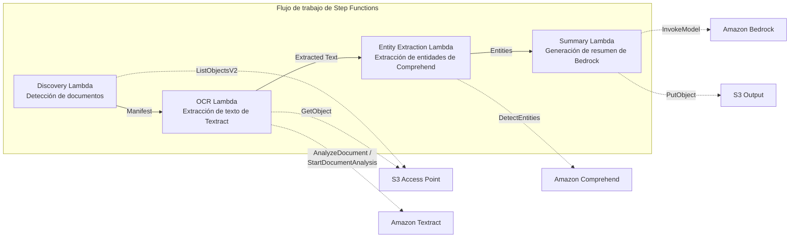

# UC2: Finanzas y seguros — Procesamiento automatizado de contratos y facturas (IDP)

🌐 **Language / 言語**: [日本語](README.md) | [English](README.en.md) | [한국어](README.ko.md) | [简体中文](README.zh-CN.md) | [繁體中文](README.zh-TW.md) | [Français](README.fr.md) | [Deutsch](README.de.md) | Español

📚 **Documentación**: [Diagrama de arquitectura](docs/architecture.es.md) | [Guía de demostración](docs/demo-guide.es.md)

## Descripción general

Un flujo de trabajo serverless que aprovecha los S3 Access Points de FSx for ONTAP para realizar automáticamente el procesamiento OCR, la extracción de entidades y la generación de resúmenes en documentos como contratos y facturas.

### Casos en los que este patrón es adecuado

- Desea procesar por lotes, de forma periódica, documentos PDF/TIFF/JPEG almacenados en un servidor de archivos mediante OCR
- Desea agregar procesamiento de IA a un flujo de trabajo NAS existente (escáner → almacenamiento en servidor de archivos) sin modificarlo
- Desea extraer automáticamente fechas, importes y nombres de organizaciones de contratos y facturas, y utilizarlos como datos estructurados
- Desea probar una canalización IDP de Textract + Comprehend + Bedrock con un coste mínimo

### Casos en los que este patrón no es adecuado

- Se requiere procesamiento en tiempo real inmediatamente después de cargar un documento
- Procesamiento de un gran volumen de documentos (decenas de miles al día o más) (preste atención al límite de tasa de la API de Textract)
- La latencia de las llamadas entre regiones es inaceptable en regiones donde Textract no está disponible
- Los documentos ya existen en un bucket S3 estándar y pueden procesarse mediante notificaciones de eventos de S3

### Funciones principales

- Detección automática de documentos PDF, TIFF y JPEG a través del S3 AP
- Extracción de texto OCR con Amazon Textract (selección automática de API síncrona/asíncrona)
- Extracción de entidades nombradas con Amazon Comprehend (fechas, importes, nombres de organizaciones, nombres de personas)
- Generación de resúmenes estructurados con Amazon Bedrock

## Success Metrics

### Outcome
Reducir el esfuerzo de introducción manual de datos mediante el procesamiento automatizado de contratos y facturas.

### Metrics
| Métrica | Valor objetivo (ejemplo) |
|-----------|------------|
| Documentos procesados por ejecución | > 500 documents |
| Precisión del OCR (tasa de reconocimiento de caracteres) | > 95% |
| Tasa de éxito de la extracción de datos | > 90% |
| Tiempo de procesamiento por documento | < 30 segundos |
| Coste por documento | < $0.10 |
| Proporción de documentos en Human Review | < 20% (puntuaciones de baja confianza) |

### Measurement Method
Historial de ejecución de Step Functions, Textract confidence score, CloudWatch Metrics, número de archivos de salida de S3.

## Arquitectura



### Pasos del flujo de trabajo

1. **Discovery**: Detecta documentos PDF, TIFF y JPEG desde el S3 AP y genera un Manifest
2. **OCR**: Selecciona automáticamente la API síncrona/asíncrona de Textract según el número de páginas del documento y ejecuta el OCR
3. **Entity Extraction**: Extrae entidades nombradas (fechas, importes, nombres de organizaciones, nombres de personas) con Comprehend
4. **Summary**: Genera un resumen estructurado con Bedrock y lo exporta a S3 en formato JSON

## Requisitos previos

- Una cuenta de AWS y los permisos de IAM adecuados
- Un sistema de archivos FSx for ONTAP (ONTAP 9.17.1P4D3 o posterior)
- Un volumen con S3 Access Point habilitado
- Credenciales de la API REST de ONTAP registradas en Secrets Manager
- Una VPC y subredes privadas
- Acceso a los modelos de Amazon Bedrock habilitado (Claude / Nova)
- Una región donde Amazon Textract y Amazon Comprehend estén disponibles

## Procedimiento de implementación

### 1. Preparación de los parámetros

Verifique los siguientes valores antes de la implementación:

- FSx for ONTAP S3 Access Point Alias
- Dirección IP de administración de ONTAP
- Nombre del secreto de Secrets Manager
- ID de VPC, ID de subredes privadas

### 2. Implementación con SAM

```bash
# Requisito previo: se necesita AWS SAM CLI. sam build empaqueta automáticamente el código y la capa compartida.
sam build

sam deploy \
  --stack-name fsxn-financial-idp \
  --parameter-overrides \
    S3AccessPointAlias=<your-volume-ext-s3alias> \
    S3AccessPointName=<your-s3ap-name> \
    S3AccessPointOutputAlias=<your-output-volume-ext-s3alias> \
    OntapSecretName=<your-ontap-secret-name> \
    OntapManagementIp=<your-ontap-management-ip> \
    ScheduleExpression="rate(1 hour)" \
    VpcId=<your-vpc-id> \
    PrivateSubnetIds=<subnet-1>,<subnet-2> \
    NotificationEmail=<your-email@example.com> \
    EnableVpcEndpoints=false \
    EnableCloudWatchAlarms=false \
  --capabilities CAPABILITY_NAMED_IAM \
  --resolve-s3 \
  --region ap-northeast-1
```

> **Nota**: `template.yaml` se utiliza con la SAM CLI (`sam build` + `sam deploy`).
> Para implementar directamente con el comando `aws cloudformation deploy`, utilice `template-deploy.yaml` en su lugar (se requiere el empaquetado previo de los archivos zip de Lambda y su carga en S3).

> **Nota**: Reemplace los marcadores de posición `<...>` por los valores reales de su entorno.

### 3. Confirmación de la suscripción de SNS

Tras la implementación, se envía un correo electrónico de confirmación de suscripción de SNS a la dirección de correo electrónico que haya especificado.

> **Nota**: Si omite `S3AccessPointName`, la política de IAM queda basada únicamente en el Alias, lo que puede provocar un error `AccessDenied`. Se recomienda especificarlo en entornos de producción. Para más detalles, consulte la [Guía de resolución de problemas](../docs/guides/troubleshooting-guide.md#1-accessdenied-エラー).

## Lista de parámetros de configuración

| Parámetro | Descripción | Predeterminado | Obligatorio |
|-----------|------|----------|------|
| `S3AccessPointAlias` | FSx for ONTAP S3 AP Alias (para entrada) | — | ✅ |
| `S3AccessPointName` | Nombre del S3 AP (para conceder permisos de IAM basados en ARN; solo basado en Alias si se omite) | `""` | ⚠️ Recomendado |
| `S3AccessPointOutputAlias` | FSx for ONTAP S3 AP Alias (para salida) | — | ✅ |
| `OntapSecretName` | Nombre del secreto de Secrets Manager para las credenciales de ONTAP | — | ✅ |
| `OntapManagementIp` | Dirección IP de administración del clúster de ONTAP | — | ✅ |
| `ScheduleExpression` | Expresión de programación de EventBridge Scheduler | `rate(1 hour)` | |
| `VpcId` | ID de VPC | — | ✅ |
| `PrivateSubnetIds` | Lista de ID de subredes privadas | — | ✅ |
| `NotificationEmail` | Dirección de correo electrónico de destino de las notificaciones de SNS | — | ✅ |
| `EnableVpcEndpoints` | Habilitación de los Interface VPC Endpoints | `false` | |
| `EnableCloudWatchAlarms` | Habilitación de las CloudWatch Alarms | `false` | |

## Estructura de costes

### Basado en solicitudes (pago por uso)

| Servicio | Unidad de facturación | Estimación (100 documentos/mes) |
|---------|---------|--------------------------|
| Lambda | Número de solicitudes + tiempo de ejecución | ~$0.01 |
| Step Functions | Número de transiciones de estado | Dentro del nivel gratuito |
| S3 API | Número de solicitudes | ~$0.01 |
| Textract | Número de páginas | ~$0.15 |
| Comprehend | Número de unidades (por cada 100 caracteres) | ~$0.03 |
| Bedrock | Número de tokens | ~$0.10 |

### Funcionamiento permanente (opcional)

| Servicio | Parámetro | Mensual |
|---------|-----------|------|
| Interface VPC Endpoints | `EnableVpcEndpoints=true` | ~$28.80 |
| CloudWatch Alarms | `EnableCloudWatchAlarms=true` | ~$0.30 |

> En entornos de demostración/PoC, puede comenzar desde **~$0.30/mes** solo con costes variables.

## Formato de los datos de salida

El JSON de salida del Summary Lambda:

```json
{
  "extracted_text": "Texto completo del contrato...",
  "entities": [
    {"type": "DATE", "text": "15 de enero de 2026"},
    {"type": "ORGANIZATION", "text": "Empresa de Ejemplo"},
    {"type": "QUANTITY", "text": "1.000.000 JPY"}
  ],
  "summary": "Este contrato...",
  "document_key": "contracts/2026/sample-contract.pdf",
  "processed_at": "2026-01-15T10:00:00Z"
}
```

## Limpieza

```bash
# Eliminación de la pila de CloudFormation
aws cloudformation delete-stack \
  --stack-name fsxn-financial-idp \
  --region ap-northeast-1

# Espera a que se complete la eliminación
aws cloudformation wait stack-delete-complete \
  --stack-name fsxn-financial-idp \
  --region ap-northeast-1
```

> **Nota**: Si quedan objetos en el bucket de S3, la eliminación de la pila puede fallar. Vacíe el bucket de antemano.

## Supported Regions

UC2 utiliza los siguientes servicios:

| Servicio | Restricción de región |
|---------|-------------|
| Amazon Textract | No compatible con ap-northeast-1. Especifique una región compatible (p. ej., us-east-1) con el parámetro `TEXTRACT_REGION` |
| Amazon Comprehend | Disponible en casi todas las regiones |
| Amazon Bedrock | Compruebe las regiones compatibles ([Regiones compatibles con Bedrock](https://docs.aws.amazon.com/general/latest/gr/bedrock.html)) |
| AWS X-Ray | Disponible en casi todas las regiones |
| CloudWatch EMF | Disponible en casi todas las regiones |

> La API de Textract se llama a través de un Cross-Region Client. Compruebe sus requisitos de residencia de datos. Para más detalles, consulte la [Matriz de compatibilidad de regiones](../docs/region-compatibility.md).

## Enlaces de referencia

### Documentación oficial de AWS

- [Descripción general de FSx for ONTAP S3 Access Points](https://docs.aws.amazon.com/fsx/latest/ONTAPGuide/accessing-data-via-s3-access-points.html)
- [Procesamiento serverless con Lambda (tutorial oficial)](https://docs.aws.amazon.com/fsx/latest/ONTAPGuide/tutorial-process-files-with-lambda.html)
- [Referencia de la API de Textract](https://docs.aws.amazon.com/textract/latest/dg/API_Reference.html)
- [API DetectEntities de Comprehend](https://docs.aws.amazon.com/comprehend/latest/dg/API_DetectEntities.html)
- [Referencia de la API InvokeModel de Bedrock](https://docs.aws.amazon.com/bedrock/latest/APIReference/API_runtime_InvokeModel.html)

### Artículos de blog y guías de AWS

- [Blog de anuncio del S3 AP](https://aws.amazon.com/blogs/aws/amazon-fsx-for-netapp-ontap-now-integrates-with-amazon-s3-for-seamless-data-access/)
- [Procesamiento de documentos con Step Functions + Bedrock](https://aws.amazon.com/blogs/compute/orchestrating-large-scale-document-processing-with-aws-step-functions-and-amazon-bedrock-batch-inference/)
- [Guía de IDP (Intelligent Document Processing on AWS)](https://aws.amazon.com/solutions/guidance/intelligent-document-processing-on-aws3/)

### Ejemplos de GitHub

- [aws-samples/amazon-textract-serverless-large-scale-document-processing](https://github.com/aws-samples/amazon-textract-serverless-large-scale-document-processing) — Procesamiento de Textract a gran escala
- [aws-samples/serverless-patterns](https://github.com/aws-samples/serverless-patterns) — Colección de patrones serverless
- [aws-samples/aws-stepfunctions-examples](https://github.com/aws-samples/aws-stepfunctions-examples) — Ejemplos de Step Functions

## Entorno verificado

| Elemento | Valor |
|------|-----|
| Región de AWS | ap-northeast-1 (Tokio) |
| Versión de FSx for ONTAP | ONTAP 9.17.1P4D3 |
| Configuración de FSx | SINGLE_AZ_1 |
| Python | 3.12 |
| Método de implementación | CloudFormation (estándar) |

## Arquitectura de ubicación de Lambda en VPC

Según los conocimientos obtenidos durante la validación, las funciones Lambda se ubican por separado dentro y fuera de la VPC.

**Lambda dentro de la VPC** (solo funciones que requieren acceso a la API REST de ONTAP):
- Discovery Lambda — S3 AP + ONTAP API

**Lambda fuera de la VPC** (solo usa las API de servicios gestionados de AWS):
- Todas las demás funciones Lambda

> **Motivo**: Para acceder a las API de servicios gestionados de AWS (Athena, Bedrock, Textract, etc.) desde una Lambda dentro de la VPC, se requiere un Interface VPC Endpoint (7,20 $/mes cada uno). Una Lambda fuera de la VPC puede acceder directamente a las API de AWS a través de Internet y funciona sin coste adicional.

> **Nota**: Para los UC que utilizan la API REST de ONTAP (UC1 Jurídico y cumplimiento), `EnableVpcEndpoints=true` es obligatorio. Esto se debe a que las credenciales de ONTAP se recuperan a través del Secrets Manager VPC Endpoint.

---

## Enlaces a la documentación de AWS

| Servicio | Documentación |
|---------|------------|
| FSx for ONTAP | [FSx for ONTAP](https://docs.aws.amazon.com/fsx/latest/ONTAPGuide/what-is-fsx-ontap.html) |
| S3 Access Points | [S3 Access Points](https://docs.aws.amazon.com/fsx/latest/ONTAPGuide/s3-access-points.html) |
| Step Functions | [Step Functions](https://docs.aws.amazon.com/step-functions/latest/dg/welcome.html) |
| Amazon Textract | [Amazon Textract](https://docs.aws.amazon.com/textract/latest/dg/what-is.html) |
| Amazon Comprehend | [Amazon Comprehend](https://docs.aws.amazon.com/comprehend/latest/dg/what-is.html) |
| Amazon Bedrock | [Amazon Bedrock](https://docs.aws.amazon.com/bedrock/latest/userguide/what-is-bedrock.html) |

### Cumplimiento del Well-Architected Framework

| Pilar | Correspondencia |
|----|------|
| Excelencia operativa | Rastreo con X-Ray, métricas EMF, registro estructurado |
| Seguridad | IAM con privilegios mínimos, cifrado con KMS, detección de PII |
| Fiabilidad | Step Functions Retry/Catch, conmutación por error entre regiones |
| Eficiencia del rendimiento | Optimización de la memoria de Lambda, procesamiento OCR en paralelo |
| Optimización de costes | Serverless (facturado solo por uso), facturación de Textract por página |
| Sostenibilidad | Ejecución bajo demanda, detención automática de recursos no utilizados |

---

## Pruebas locales

### Comprobación de requisitos previos

```bash
# Comprobación de los requisitos previos
aws --version          # AWS CLI v2
sam --version          # SAM CLI
python3 --version      # Python 3.9+
docker --version       # Docker (para sam local)
aws sts get-caller-identity  # Credenciales de AWS
```

### sam local invoke

```bash
# Build
# Requisito previo: se necesita AWS SAM CLI. sam build empaqueta automáticamente el código y la capa compartida.
sam build

# Ejecución local del Discovery Lambda
sam local invoke DiscoveryFunction --event events/discovery-event.json

# Con sustitución de variables de entorno
sam local invoke DiscoveryFunction \
  --event events/discovery-event.json \
  --env-vars env.json
```

### Pruebas unitarias

```bash
python3 -m pytest tests/ -v
```

Para más detalles, consulte el [Inicio rápido de pruebas locales](../docs/local-testing-quick-start.md).

---

## Ejemplo de salida (Output Sample)

Ejemplo de salida para OCR de formularios → extracción de entidades:

```json
{
  "discovery": {
    "status": "completed",
    "object_count": 25,
    "prefix": "invoices/"
  },
  "processing": [
    {
      "key": "invoices/INV-2026-001.pdf",
      "ocr_result": {
        "document_type": "invoice",
        "confidence": 0.97
      },
      "entities": {
        "vendor_name": "Empresa de Ejemplo",
        "invoice_number": "INV-2026-001",
        "amount": "1,234,567",
        "currency": "JPY",
        "due_date": "2026-06-30"
      },
      "summary": "Factura de la empresa Ejemplo. Importe 1.234.567 JPY, fecha de vencimiento 2026/6/30."
    }
  ],
  "report": {
    "total_processed": 25,
    "succeeded": 24,
    "failed": 1,
    "output_prefix": "s3://output-bucket/extracted/"
  }
}
```

> **Aviso**: Lo anterior es una salida de ejemplo; los valores reales varían según el entorno y los datos de entrada. Las cifras de referencia son un sizing reference, no un service limit.

---

## Governance Note

> Este patrón proporciona orientación sobre arquitectura técnica. No constituye asesoramiento legal, de cumplimiento ni regulatorio. Las organizaciones deben consultar a profesionales cualificados.

### Cumplimiento de las normas de seguridad FISC

Para las instituciones financieras de Japón, esta sección relaciona los elementos de diseño de este patrón con las normas de seguridad FISC (The Center for Financial Industry Information Systems).

> **Importante**: Esta sección no garantiza el cumplimiento de FISC. La decisión final sobre el cumplimiento de FISC debe tomarla el departamento de seguridad de la información de la institución financiera y su firma de auditoría.

| Categoría de las normas FISC | Elemento de diseño correspondiente de este patrón |
|---------------------|----------------------|
| Gestión de accesos | IAM con privilegios mínimos, política de recursos de S3 AP, autorización de doble capa de ONTAP |
| Cifrado | SSE-FSX (en reposo), TLS 1.2+ (en tránsito), KMS (bucket de salida) |
| Registro de auditoría | CloudTrail (todas las llamadas a la API), CloudWatch Logs (registros de ejecución de Lambda), rastreo con X-Ray |
| Protección de datos | Ejecución dentro de la VPC (opcional), Secrets Manager (gestión de credenciales), etiquetas de clasificación de datos |
| Disponibilidad | Step Functions Retry/Catch, escalado automático de Lambda, Multi-AZ FSx for ONTAP (opcional) |
| Gestión de cambios | CloudFormation (IaC), gestión con Git, canalización CI/CD |
| Respuesta a incidentes | CloudWatch Alarms, notificaciones de SNS, playbook de respuesta a incidentes |

**Aspectos adicionales a considerar**:
- Requisitos de almacenamiento nacional de datos financieros (atendidos mediante el uso de la región ap-northeast-1)
- Aceptabilidad de la ruta de datos en las llamadas entre regiones de Textract (a través de us-east-1)
- Aclaración de las obligaciones de supervisión respecto al proveedor subcontratado (AWS)
- Un plan de evaluaciones periódicas de vulnerabilidades y pruebas de penetración

---

## S3AP Compatibility

Para conocer las restricciones de compatibilidad, la resolución de problemas y los patrones de activación de S3 Access Points for FSx for ONTAP, consulte las [S3AP Compatibility Notes](../docs/s3ap-compatibility-notes.md).
