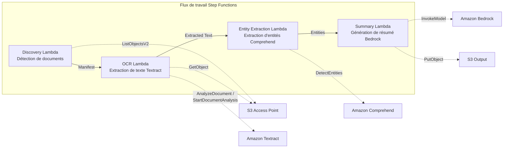

# UC2 : Finance et assurance — Traitement automatisé des contrats et factures (IDP)

🌐 **Language / 言語**: [日本語](README.md) | [English](README.en.md) | [한국어](README.ko.md) | [简体中文](README.zh-CN.md) | [繁體中文](README.zh-TW.md) | Français | [Deutsch](README.de.md) | [Español](README.es.md)

📚 **Documentation** : [Schéma d'architecture](docs/architecture.fr.md) | [Guide de démonstration](docs/demo-guide.fr.md)

## Aperçu

Un flux de travail serverless qui exploite les S3 Access Points de FSx for ONTAP pour effectuer automatiquement le traitement OCR, l'extraction d'entités et la génération de résumés sur des documents tels que les contrats et les factures.

### Cas où ce modèle convient

- Vous souhaitez traiter par lots, périodiquement, des documents PDF/TIFF/JPEG stockés sur un serveur de fichiers via OCR
- Vous souhaitez ajouter un traitement IA à un flux de travail NAS existant (scanner → stockage sur serveur de fichiers) sans le modifier
- Vous souhaitez extraire automatiquement dates, montants et noms d'organisations des contrats et factures, et les exploiter comme données structurées
- Vous souhaitez essayer un pipeline IDP Textract + Comprehend + Bedrock à moindre coût

### Cas où ce modèle ne convient pas

- Un traitement en temps réel est requis immédiatement après le chargement d'un document
- Traitement d'un grand volume de documents (des dizaines de milliers par jour ou plus) (attention aux limites de débit de l'API Textract)
- La latence des appels interrégionaux est inacceptable dans les régions où Textract n'est pas pris en charge
- Les documents existent déjà dans un compartiment S3 standard et peuvent être traités via les notifications d'événements S3

### Fonctionnalités principales

- Détection automatique des documents PDF, TIFF et JPEG via le S3 AP
- Extraction de texte OCR avec Amazon Textract (sélection automatique de l'API synchrone/asynchrone)
- Extraction d'entités nommées avec Amazon Comprehend (dates, montants, noms d'organisations, noms de personnes)
- Génération de résumés structurés avec Amazon Bedrock

## Success Metrics

### Outcome
Réduire l'effort de saisie manuelle des données grâce au traitement automatisé des contrats et factures.

### Metrics
| Métrique | Valeur cible (exemple) |
|-----------|------------|
| Documents traités par exécution | > 500 documents |
| Précision de l'OCR (taux de reconnaissance des caractères) | > 95% |
| Taux de réussite de l'extraction de données | > 90% |
| Temps de traitement par document | < 30 secondes |
| Coût par document | < $0.10 |
| Taux de documents en Human Review | < 20% (scores de faible confiance) |

### Measurement Method
Historique d'exécution Step Functions, Textract confidence score, CloudWatch Metrics, nombre de fichiers de sortie S3.

## Architecture



### Étapes du flux de travail

1. **Discovery** : Détecte les documents PDF, TIFF et JPEG depuis le S3 AP et génère un Manifest
2. **OCR** : Sélectionne automatiquement l'API Textract synchrone/asynchrone selon le nombre de pages du document et exécute l'OCR
3. **Entity Extraction** : Extrait les entités nommées (dates, montants, noms d'organisations, noms de personnes) avec Comprehend
4. **Summary** : Génère un résumé structuré avec Bedrock et l'exporte vers S3 au format JSON

## Prérequis

- Un compte AWS et des autorisations IAM appropriées
- Un système de fichiers FSx for ONTAP (ONTAP 9.17.1P4D3 ou ultérieur)
- Un volume avec S3 Access Point activé
- Les identifiants de l'API REST ONTAP enregistrés dans Secrets Manager
- Un VPC et des sous-réseaux privés
- L'accès aux modèles Amazon Bedrock activé (Claude / Nova)
- Une région où Amazon Textract et Amazon Comprehend sont disponibles

## Procédure de déploiement

### 1. Préparation des paramètres

Vérifiez les valeurs suivantes avant le déploiement :

- FSx for ONTAP S3 Access Point Alias
- Adresse IP de gestion ONTAP
- Nom du secret Secrets Manager
- ID du VPC, ID des sous-réseaux privés

### 2. Déploiement SAM

```bash
# Prérequis : l'AWS SAM CLI est requise. sam build package automatiquement le code et la couche partagée.
sam build

sam deploy \
  --stack-name fsxn-financial-idp \
  --parameter-overrides \
    S3AccessPointAlias=<your-volume-ext-s3alias> \
    S3AccessPointName=<your-s3ap-name> \
    S3AccessPointOutputAlias=<your-output-volume-ext-s3alias> \
    OntapSecretName=<your-ontap-secret-name> \
    OntapManagementIp=<your-ontap-management-ip> \
    ScheduleExpression="rate(1 hour)" \
    VpcId=<your-vpc-id> \
    PrivateSubnetIds=<subnet-1>,<subnet-2> \
    NotificationEmail=<your-email@example.com> \
    EnableVpcEndpoints=false \
    EnableCloudWatchAlarms=false \
  --capabilities CAPABILITY_NAMED_IAM \
  --resolve-s3 \
  --region ap-northeast-1
```

> **Remarque** : `template.yaml` s'utilise avec la SAM CLI (`sam build` + `sam deploy`).
> Pour déployer directement avec la commande `aws cloudformation deploy`, utilisez plutôt `template-deploy.yaml` (le pré-packaging des fichiers zip Lambda et leur chargement sur S3 sont requis).

> **Remarque** : Remplacez les espaces réservés `<...>` par les valeurs réelles de votre environnement.

### 3. Confirmation de l'abonnement SNS

Après le déploiement, un e-mail de confirmation d'abonnement SNS est envoyé à l'adresse e-mail que vous avez indiquée.

> **Remarque** : Si vous omettez `S3AccessPointName`, la politique IAM devient uniquement basée sur l'Alias, ce qui peut provoquer une erreur `AccessDenied`. Il est recommandé de le spécifier en environnement de production. Pour plus de détails, consultez le [Guide de dépannage](../docs/guides/troubleshooting-guide.md#1-accessdenied-エラー).

## Liste des paramètres de configuration

| Paramètre | Description | Par défaut | Requis |
|-----------|------|----------|------|
| `S3AccessPointAlias` | FSx for ONTAP S3 AP Alias (pour l'entrée) | — | ✅ |
| `S3AccessPointName` | Nom du S3 AP (pour l'octroi d'autorisations IAM basées sur l'ARN ; basé uniquement sur l'Alias si omis) | `""` | ⚠️ Recommandé |
| `S3AccessPointOutputAlias` | FSx for ONTAP S3 AP Alias (pour la sortie) | — | ✅ |
| `OntapSecretName` | Nom du secret Secrets Manager pour les identifiants ONTAP | — | ✅ |
| `OntapManagementIp` | Adresse IP de gestion du cluster ONTAP | — | ✅ |
| `ScheduleExpression` | Expression de planification EventBridge Scheduler | `rate(1 hour)` | |
| `VpcId` | ID du VPC | — | ✅ |
| `PrivateSubnetIds` | Liste des ID de sous-réseaux privés | — | ✅ |
| `NotificationEmail` | Adresse e-mail de destination des notifications SNS | — | ✅ |
| `EnableVpcEndpoints` | Activation des Interface VPC Endpoints | `false` | |
| `EnableCloudWatchAlarms` | Activation des CloudWatch Alarms | `false` | |

## Structure des coûts

### À la demande (paiement à l'usage)

| Service | Unité de facturation | Estimation (100 documents/mois) |
|---------|---------|--------------------------|
| Lambda | Nombre de requêtes + temps d'exécution | ~$0.01 |
| Step Functions | Nombre de transitions d'état | Dans l'offre gratuite |
| S3 API | Nombre de requêtes | ~$0.01 |
| Textract | Nombre de pages | ~$0.15 |
| Comprehend | Nombre d'unités (par tranche de 100 caractères) | ~$0.03 |
| Bedrock | Nombre de jetons | ~$0.10 |

### Fonctionnement permanent (optionnel)

| Service | Paramètre | Mensuel |
|---------|-----------|------|
| Interface VPC Endpoints | `EnableVpcEndpoints=true` | ~$28.80 |
| CloudWatch Alarms | `EnableCloudWatchAlarms=true` | ~$0.30 |

> En environnement de démonstration/PoC, vous pouvez commencer à partir de **~$0.30/mois** avec les seuls coûts variables.

## Format des données de sortie

Le JSON de sortie du Summary Lambda :

```json
{
  "extracted_text": "Texte intégral du contrat...",
  "entities": [
    {"type": "DATE", "text": "15 janvier 2026"},
    {"type": "ORGANIZATION", "text": "Société Exemple"},
    {"type": "QUANTITY", "text": "1 000 000 JPY"}
  ],
  "summary": "Ce contrat...",
  "document_key": "contracts/2026/sample-contract.pdf",
  "processed_at": "2026-01-15T10:00:00Z"
}
```

## Nettoyage

```bash
# Suppression de la pile CloudFormation
aws cloudformation delete-stack \
  --stack-name fsxn-financial-idp \
  --region ap-northeast-1

# Attente de la fin de la suppression
aws cloudformation wait stack-delete-complete \
  --stack-name fsxn-financial-idp \
  --region ap-northeast-1
```

> **Remarque** : Si des objets subsistent dans le compartiment S3, la suppression de la pile peut échouer. Videz le compartiment au préalable.

## Supported Regions

UC2 utilise les services suivants :

| Service | Contrainte de région |
|---------|-------------|
| Amazon Textract | Non pris en charge dans ap-northeast-1. Spécifiez une région prise en charge (p. ex. us-east-1) avec le paramètre `TEXTRACT_REGION` |
| Amazon Comprehend | Disponible dans presque toutes les régions |
| Amazon Bedrock | Vérifiez les régions prises en charge ([Régions prises en charge par Bedrock](https://docs.aws.amazon.com/general/latest/gr/bedrock.html)) |
| AWS X-Ray | Disponible dans presque toutes les régions |
| CloudWatch EMF | Disponible dans presque toutes les régions |

> L'API Textract est appelée via un Cross-Region Client. Vérifiez vos exigences de résidence des données. Pour plus de détails, consultez la [Matrice de compatibilité des régions](../docs/region-compatibility.md).

## Liens de référence

### Documentation officielle AWS

- [Présentation de FSx for ONTAP S3 Access Points](https://docs.aws.amazon.com/fsx/latest/ONTAPGuide/accessing-data-via-s3-access-points.html)
- [Traitement serverless avec Lambda (tutoriel officiel)](https://docs.aws.amazon.com/fsx/latest/ONTAPGuide/tutorial-process-files-with-lambda.html)
- [Référence de l'API Textract](https://docs.aws.amazon.com/textract/latest/dg/API_Reference.html)
- [API Comprehend DetectEntities](https://docs.aws.amazon.com/comprehend/latest/dg/API_DetectEntities.html)
- [Référence de l'API Bedrock InvokeModel](https://docs.aws.amazon.com/bedrock/latest/APIReference/API_runtime_InvokeModel.html)

### Articles de blog et guides AWS

- [Blog d'annonce du S3 AP](https://aws.amazon.com/blogs/aws/amazon-fsx-for-netapp-ontap-now-integrates-with-amazon-s3-for-seamless-data-access/)
- [Traitement de documents Step Functions + Bedrock](https://aws.amazon.com/blogs/compute/orchestrating-large-scale-document-processing-with-aws-step-functions-and-amazon-bedrock-batch-inference/)
- [Guide IDP (Intelligent Document Processing on AWS)](https://aws.amazon.com/solutions/guidance/intelligent-document-processing-on-aws3/)

### Exemples GitHub

- [aws-samples/amazon-textract-serverless-large-scale-document-processing](https://github.com/aws-samples/amazon-textract-serverless-large-scale-document-processing) — Traitement Textract à grande échelle
- [aws-samples/serverless-patterns](https://github.com/aws-samples/serverless-patterns) — Collection de modèles serverless
- [aws-samples/aws-stepfunctions-examples](https://github.com/aws-samples/aws-stepfunctions-examples) — Exemples Step Functions

## Environnement validé

| Élément | Valeur |
|------|-----|
| Région AWS | ap-northeast-1 (Tokyo) |
| Version FSx for ONTAP | ONTAP 9.17.1P4D3 |
| Configuration FSx | SINGLE_AZ_1 |
| Python | 3.12 |
| Méthode de déploiement | CloudFormation (standard) |

## Architecture de placement VPC Lambda

D'après les enseignements tirés de la validation, les fonctions Lambda sont placées séparément à l'intérieur et à l'extérieur du VPC.

**Lambda dans le VPC** (uniquement les fonctions nécessitant l'accès à l'API REST ONTAP) :
- Discovery Lambda — S3 AP + ONTAP API

**Lambda hors VPC** (utilise uniquement les API des services gérés AWS) :
- Toutes les autres fonctions Lambda

> **Raison** : Pour accéder aux API des services gérés AWS (Athena, Bedrock, Textract, etc.) depuis une Lambda dans le VPC, un Interface VPC Endpoint est requis (7,20 $/mois chacun). Une Lambda hors VPC peut accéder directement aux API AWS via Internet et fonctionne sans coût supplémentaire.

> **Remarque** : Pour les UC qui utilisent l'API REST ONTAP (UC1 Juridique et conformité), `EnableVpcEndpoints=true` est obligatoire. En effet, les identifiants ONTAP sont récupérés via le Secrets Manager VPC Endpoint.

---

## Liens vers la documentation AWS

| Service | Documentation |
|---------|------------|
| FSx for ONTAP | [FSx for ONTAP](https://docs.aws.amazon.com/fsx/latest/ONTAPGuide/what-is-fsx-ontap.html) |
| S3 Access Points | [S3 Access Points](https://docs.aws.amazon.com/fsx/latest/ONTAPGuide/s3-access-points.html) |
| Step Functions | [Step Functions](https://docs.aws.amazon.com/step-functions/latest/dg/welcome.html) |
| Amazon Textract | [Amazon Textract](https://docs.aws.amazon.com/textract/latest/dg/what-is.html) |
| Amazon Comprehend | [Amazon Comprehend](https://docs.aws.amazon.com/comprehend/latest/dg/what-is.html) |
| Amazon Bedrock | [Amazon Bedrock](https://docs.aws.amazon.com/bedrock/latest/userguide/what-is-bedrock.html) |

### Conformité au Well-Architected Framework

| Pilier | Correspondance |
|----|------|
| Excellence opérationnelle | Traçage X-Ray, métriques EMF, journalisation structurée |
| Sécurité | IAM au moindre privilège, chiffrement KMS, détection de PII |
| Fiabilité | Step Functions Retry/Catch, repli interrégional |
| Efficacité des performances | Optimisation de la mémoire Lambda, traitement OCR parallèle |
| Optimisation des coûts | Serverless (facturé à l'usage uniquement), facturation Textract à la page |
| Durabilité | Exécution à la demande, arrêt automatique des ressources inutilisées |

---

## Test local

### Vérification des prérequis

```bash
# Vérification des prérequis
aws --version          # AWS CLI v2
sam --version          # SAM CLI
python3 --version      # Python 3.9+
docker --version       # Docker (pour sam local)
aws sts get-caller-identity  # Identifiants AWS
```

### sam local invoke

```bash
# Build
# Prérequis : l'AWS SAM CLI est requise. sam build package automatiquement le code et la couche partagée.
sam build

# Exécution locale du Discovery Lambda
sam local invoke DiscoveryFunction --event events/discovery-event.json

# Avec remplacement des variables d'environnement
sam local invoke DiscoveryFunction \
  --event events/discovery-event.json \
  --env-vars env.json
```

### Tests unitaires

```bash
python3 -m pytest tests/ -v
```

Pour plus de détails, consultez le [Démarrage rapide des tests locaux](../docs/local-testing-quick-start.md).

---

## Exemple de sortie (Output Sample)

Exemple de sortie pour OCR de formulaires → extraction d'entités :

```json
{
  "discovery": {
    "status": "completed",
    "object_count": 25,
    "prefix": "invoices/"
  },
  "processing": [
    {
      "key": "invoices/INV-2026-001.pdf",
      "ocr_result": {
        "document_type": "invoice",
        "confidence": 0.97
      },
      "entities": {
        "vendor_name": "Société Exemple",
        "invoice_number": "INV-2026-001",
        "amount": "1,234,567",
        "currency": "JPY",
        "due_date": "2026-06-30"
      },
      "summary": "Facture de la société Exemple. Montant 1 234 567 JPY, date d'échéance 2026/6/30."
    }
  ],
  "report": {
    "total_processed": 25,
    "succeeded": 24,
    "failed": 1,
    "output_prefix": "s3://output-bucket/extracted/"
  }
}
```

> **Note** : Ce qui précède est un exemple de sortie ; les valeurs réelles varient selon l'environnement et les données d'entrée. Les chiffres de référence sont un sizing reference, et non un service limit.

---

## Governance Note

> Ce modèle fournit des conseils d'architecture technique. Il ne constitue pas un avis juridique, de conformité ou réglementaire. Les organisations doivent consulter des professionnels qualifiés.

### Conformité aux normes de sécurité FISC

Pour les institutions financières au Japon, cette section met en correspondance les éléments de conception de ce modèle avec les normes de sécurité FISC (The Center for Financial Industry Information Systems).

> **Important** : Cette section ne garantit pas la conformité FISC. La décision finale relative à la conformité FISC doit être prise par le service de sécurité de l'information de l'institution financière et son cabinet d'audit.

| Catégorie des normes FISC | Élément de conception correspondant de ce modèle |
|---------------------|----------------------|
| Gestion des accès | IAM au moindre privilège, politique de ressource S3 AP, autorisation ONTAP à double couche |
| Chiffrement | SSE-FSX (au repos), TLS 1.2+ (en transit), KMS (compartiment de sortie) |
| Piste d'audit | CloudTrail (tous les appels d'API), CloudWatch Logs (journaux d'exécution Lambda), traçage X-Ray |
| Protection des données | Exécution dans le VPC (optionnel), Secrets Manager (gestion des identifiants), étiquettes de classification des données |
| Disponibilité | Step Functions Retry/Catch, mise à l'échelle automatique Lambda, Multi-AZ FSx for ONTAP (optionnel) |
| Gestion des changements | CloudFormation (IaC), gestion Git, pipeline CI/CD |
| Réponse aux incidents | CloudWatch Alarms, notifications SNS, playbook de réponse aux incidents |

**Points supplémentaires à considérer** :
- Exigences de conservation domestique des données financières (traitées en utilisant la région ap-northeast-1)
- Acceptabilité du chemin des données lors des appels interrégionaux Textract (via us-east-1)
- Clarification des obligations de supervision envers le sous-traitant (AWS)
- Un plan d'évaluations régulières des vulnérabilités et de tests d'intrusion

---

## S3AP Compatibility

Pour les contraintes de compatibilité, le dépannage et les modèles de déclenchement des S3 Access Points for FSx for ONTAP, consultez les [S3AP Compatibility Notes](../docs/s3ap-compatibility-notes.md).
