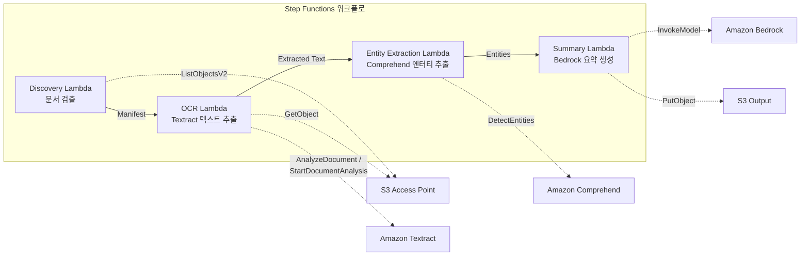

# UC2: 금융·보험 — 계약서·청구서 자동 처리 (IDP)

🌐 **Language / 言語**: [日本語](README.md) | [English](README.en.md) | 한국어 | [简体中文](README.zh-CN.md) | [繁體中文](README.zh-TW.md) | [Français](README.fr.md) | [Deutsch](README.de.md) | [Español](README.es.md)

📚 **문서**: [아키텍처 다이어그램](docs/architecture.ko.md) | [데모 가이드](docs/demo-guide.ko.md)

## 개요

FSx for ONTAP의 S3 Access Points를 활용하여 계약서·청구서 등의 문서를 자동으로 OCR 처리, 엔터티 추출, 요약 생성하는 서버리스 워크플로입니다.

### 이 패턴이 적합한 경우

- 파일 서버의 PDF/TIFF/JPEG 문서를 정기적으로 배치 OCR 처리하고 싶다
- 기존 NAS 워크플로(스캐너 → 파일 서버 저장)를 변경하지 않고 AI 처리를 추가하고 싶다
- 계약서·청구서에서 날짜, 금액, 조직명을 자동 추출하여 구조화된 데이터로 활용하고 싶다
- Textract + Comprehend + Bedrock IDP 파이프라인을 최소 비용으로 시험해 보고 싶다

### 이 패턴이 적합하지 않은 경우

- 문서 업로드 직후의 실시간 처리가 필요하다
- 하루 수만 건 이상의 대량 문서 처리(Textract의 API 속도 제한에 주의)
- Textract 미지원 리전에서 크로스 리전 호출의 지연 시간을 허용할 수 없다
- 문서가 S3 표준 버킷에 이미 존재하며 S3 이벤트 알림으로 처리 가능하다

### 주요 기능

- S3 AP를 통해 PDF, TIFF, JPEG 문서를 자동 검출
- Amazon Textract에 의한 OCR 텍스트 추출(동기/비동기 API 자동 선택)
- Amazon Comprehend에 의한 Named Entity 추출(날짜, 금액, 조직명, 인명)
- Amazon Bedrock에 의한 구조화된 요약 생성

## Success Metrics

### Outcome
계약서·청구서의 자동 처리를 통해 수동 데이터 입력 공수를 절감합니다.

### Metrics
| 메트릭 | 목표값(예시) |
|-----------|------------|
| 처리 완료 문서 수 / 실행당 | > 500 documents |
| OCR 정확도(문자 인식률) | > 95% |
| 데이터 추출 성공률 | > 90% |
| 처리 시간 / 문서 | < 30초 |
| 비용 / 문서 | < $0.10 |
| Human Review 대상 비율 | < 20%(낮은 신뢰도 점수) |

### Measurement Method
Step Functions 실행 이력, Textract confidence score, CloudWatch Metrics, S3 출력 파일 수.

## 아키텍처



### 워크플로 단계

1. **Discovery**: S3 AP에서 PDF, TIFF, JPEG 문서를 검출하여 Manifest를 생성
2. **OCR**: 문서 페이지 수에 따라 Textract 동기/비동기 API를 자동 선택하여 OCR 실행
3. **Entity Extraction**: Comprehend로 Named Entity(날짜, 금액, 조직명, 인명)를 추출
4. **Summary**: Bedrock으로 구조화된 요약을 생성하여 JSON 형식으로 S3에 출력

## 전제 조건

- AWS 계정과 적절한 IAM 권한
- FSx for ONTAP 파일 시스템(ONTAP 9.17.1P4D3 이상)
- S3 Access Point가 활성화된 볼륨
- ONTAP REST API 자격 증명이 Secrets Manager에 등록됨
- VPC, 프라이빗 서브넷
- Amazon Bedrock 모델 액세스 활성화(Claude / Nova)
- Amazon Textract, Amazon Comprehend를 사용할 수 있는 리전

## 배포 절차

### 1. 파라미터 준비

배포 전에 다음 값을 확인하세요:

- FSx for ONTAP S3 Access Point Alias
- ONTAP 관리 IP 주소
- Secrets Manager 시크릿 이름
- VPC ID, 프라이빗 서브넷 ID

### 2. SAM 배포

```bash
# 전제: AWS SAM CLI가 필요합니다. sam build가 코드와 공유 레이어를 자동으로 패키징합니다.
sam build

sam deploy \
  --stack-name fsxn-financial-idp \
  --parameter-overrides \
    S3AccessPointAlias=<your-volume-ext-s3alias> \
    S3AccessPointName=<your-s3ap-name> \
    S3AccessPointOutputAlias=<your-output-volume-ext-s3alias> \
    OntapSecretName=<your-ontap-secret-name> \
    OntapManagementIp=<your-ontap-management-ip> \
    ScheduleExpression="rate(1 hour)" \
    VpcId=<your-vpc-id> \
    PrivateSubnetIds=<subnet-1>,<subnet-2> \
    NotificationEmail=<your-email@example.com> \
    EnableVpcEndpoints=false \
    EnableCloudWatchAlarms=false \
  --capabilities CAPABILITY_NAMED_IAM \
  --resolve-s3 \
  --region ap-northeast-1
```

> **참고**: `template.yaml`은 SAM CLI(`sam build` + `sam deploy`)로 사용합니다.
> `aws cloudformation deploy` 명령으로 직접 배포하는 경우에는 `template-deploy.yaml`을 사용하세요(Lambda zip 파일의 사전 패키징과 S3 업로드가 필요합니다).

> **참고**: `<...>` 플레이스홀더를 실제 환경 값으로 교체하세요.

### 3. SNS 구독 확인

배포 후 지정한 이메일 주소로 SNS 구독 확인 메일이 전송됩니다.

> **참고**: `S3AccessPointName`을 생략하면 IAM 정책이 Alias 기반만 되어 `AccessDenied` 오류가 발생할 수 있습니다. 프로덕션 환경에서는 지정을 권장합니다. 자세한 내용은 [문제 해결 가이드](../docs/guides/troubleshooting-guide.md#1-accessdenied-エラー)를 참조하세요.

## 설정 파라미터 목록

| 파라미터 | 설명 | 기본값 | 필수 |
|-----------|------|----------|------|
| `S3AccessPointAlias` | FSx for ONTAP S3 AP Alias(입력용) | — | ✅ |
| `S3AccessPointName` | S3 AP 이름(ARN 기반 IAM 권한 부여용. 생략 시 Alias 기반만) | `""` | ⚠️ 권장 |
| `S3AccessPointOutputAlias` | FSx for ONTAP S3 AP Alias(출력용) | — | ✅ |
| `OntapSecretName` | ONTAP 자격 증명의 Secrets Manager 시크릿 이름 | — | ✅ |
| `OntapManagementIp` | ONTAP 클러스터 관리 IP 주소 | — | ✅ |
| `ScheduleExpression` | EventBridge Scheduler의 스케줄 식 | `rate(1 hour)` | |
| `VpcId` | VPC ID | — | ✅ |
| `PrivateSubnetIds` | 프라이빗 서브넷 ID 목록 | — | ✅ |
| `NotificationEmail` | SNS 알림 대상 이메일 주소 | — | ✅ |
| `EnableVpcEndpoints` | Interface VPC Endpoints 활성화 | `false` | |
| `EnableCloudWatchAlarms` | CloudWatch Alarms 활성화 | `false` | |

## 비용 구조

### 요청 기반(종량 과금)

| 서비스 | 과금 단위 | 개산(100 문서/월) |
|---------|---------|--------------------------|
| Lambda | 요청 수 + 실행 시간 | ~$0.01 |
| Step Functions | 상태 전이 수 | 무료 범위 내 |
| S3 API | 요청 수 | ~$0.01 |
| Textract | 페이지 수 | ~$0.15 |
| Comprehend | 유닛 수(100자 단위) | ~$0.03 |
| Bedrock | 토큰 수 | ~$0.10 |

### 상시 가동(선택 사항)

| 서비스 | 파라미터 | 월액 |
|---------|-----------|------|
| Interface VPC Endpoints | `EnableVpcEndpoints=true` | ~$28.80 |
| CloudWatch Alarms | `EnableCloudWatchAlarms=true` | ~$0.30 |

> 데모/PoC 환경에서는 변동비만으로 **~$0.30/월**부터 이용할 수 있습니다.

## 출력 데이터 형식

Summary Lambda의 출력 JSON:

```json
{
  "extracted_text": "계약서 전문 텍스트...",
  "entities": [
    {"type": "DATE", "text": "2026년 1월 15일"},
    {"type": "ORGANIZATION", "text": "샘플 주식회사"},
    {"type": "QUANTITY", "text": "1,000,000엔"}
  ],
  "summary": "본 계약서는...",
  "document_key": "contracts/2026/sample-contract.pdf",
  "processed_at": "2026-01-15T10:00:00Z"
}
```

## 정리

```bash
# CloudFormation 스택 삭제
aws cloudformation delete-stack \
  --stack-name fsxn-financial-idp \
  --region ap-northeast-1

# 삭제 완료 대기
aws cloudformation wait stack-delete-complete \
  --stack-name fsxn-financial-idp \
  --region ap-northeast-1
```

> **참고**: S3 버킷에 오브젝트가 남아 있으면 스택 삭제가 실패할 수 있습니다. 사전에 버킷을 비우세요.

## Supported Regions

UC2는 다음 서비스를 사용합니다:

| 서비스 | 리전 제약 |
|---------|-------------|
| Amazon Textract | ap-northeast-1 미지원. `TEXTRACT_REGION` 파라미터로 지원 리전(us-east-1 등)을 지정 |
| Amazon Comprehend | 거의 모든 리전에서 사용 가능 |
| Amazon Bedrock | 지원 리전 확인([Bedrock 지원 리전](https://docs.aws.amazon.com/general/latest/gr/bedrock.html)) |
| AWS X-Ray | 거의 모든 리전에서 사용 가능 |
| CloudWatch EMF | 거의 모든 리전에서 사용 가능 |

> Cross-Region Client를 통해 Textract API를 호출합니다. 데이터 레지던시 요구 사항을 확인하세요. 자세한 내용은 [리전 호환성 매트릭스](../docs/region-compatibility.md)를 참조.

## 참고 링크

### AWS 공식 문서

- [FSx for ONTAP S3 Access Points 개요](https://docs.aws.amazon.com/fsx/latest/ONTAPGuide/accessing-data-via-s3-access-points.html)
- [Lambda로 서버리스 처리(공식 튜토리얼)](https://docs.aws.amazon.com/fsx/latest/ONTAPGuide/tutorial-process-files-with-lambda.html)
- [Textract API 레퍼런스](https://docs.aws.amazon.com/textract/latest/dg/API_Reference.html)
- [Comprehend DetectEntities API](https://docs.aws.amazon.com/comprehend/latest/dg/API_DetectEntities.html)
- [Bedrock InvokeModel API 레퍼런스](https://docs.aws.amazon.com/bedrock/latest/APIReference/API_runtime_InvokeModel.html)

### AWS 블로그 기사·가이던스

- [S3 AP 발표 블로그](https://aws.amazon.com/blogs/aws/amazon-fsx-for-netapp-ontap-now-integrates-with-amazon-s3-for-seamless-data-access/)
- [Step Functions + Bedrock 문서 처리](https://aws.amazon.com/blogs/compute/orchestrating-large-scale-document-processing-with-aws-step-functions-and-amazon-bedrock-batch-inference/)
- [IDP 가이던스(Intelligent Document Processing on AWS)](https://aws.amazon.com/solutions/guidance/intelligent-document-processing-on-aws3/)

### GitHub 샘플

- [aws-samples/amazon-textract-serverless-large-scale-document-processing](https://github.com/aws-samples/amazon-textract-serverless-large-scale-document-processing) — Textract 대규모 처리
- [aws-samples/serverless-patterns](https://github.com/aws-samples/serverless-patterns) — 서버리스 패턴 모음
- [aws-samples/aws-stepfunctions-examples](https://github.com/aws-samples/aws-stepfunctions-examples) — Step Functions 샘플

## 검증 완료 환경

| 항목 | 값 |
|------|-----|
| AWS 리전 | ap-northeast-1 (도쿄) |
| FSx for ONTAP 버전 | ONTAP 9.17.1P4D3 |
| FSx 구성 | SINGLE_AZ_1 |
| Python | 3.12 |
| 배포 방식 | CloudFormation (표준) |

## Lambda VPC 배치 아키텍처

검증에서 얻은 지견에 기반하여 Lambda 함수는 VPC 내/외에 분리 배치되어 있습니다.

**VPC 내 Lambda**(ONTAP REST API 액세스가 필요한 함수만):
- Discovery Lambda — S3 AP + ONTAP API

**VPC 외 Lambda**(AWS 관리형 서비스 API만 사용):
- 그 외 모든 Lambda 함수

> **이유**: VPC 내 Lambda에서 AWS 관리형 서비스 API(Athena, Bedrock, Textract 등)에 액세스하려면 Interface VPC Endpoint가 필요합니다(각 $7.20/월). VPC 외 Lambda는 인터넷을 통해 AWS API에 직접 액세스할 수 있으며, 추가 비용 없이 동작합니다.

> **참고**: ONTAP REST API를 사용하는 UC(UC1 법무·컴플라이언스)에서는 `EnableVpcEndpoints=true`가 필수입니다. Secrets Manager VPC Endpoint를 통해 ONTAP 자격 증명을 취득하기 때문입니다.

---

## AWS 문서 링크

| 서비스 | 문서 |
|---------|------------|
| FSx for ONTAP | [FSx for ONTAP](https://docs.aws.amazon.com/fsx/latest/ONTAPGuide/what-is-fsx-ontap.html) |
| S3 Access Points | [S3 Access Points](https://docs.aws.amazon.com/fsx/latest/ONTAPGuide/s3-access-points.html) |
| Step Functions | [Step Functions](https://docs.aws.amazon.com/step-functions/latest/dg/welcome.html) |
| Amazon Textract | [Amazon Textract](https://docs.aws.amazon.com/textract/latest/dg/what-is.html) |
| Amazon Comprehend | [Amazon Comprehend](https://docs.aws.amazon.com/comprehend/latest/dg/what-is.html) |
| Amazon Bedrock | [Amazon Bedrock](https://docs.aws.amazon.com/bedrock/latest/userguide/what-is-bedrock.html) |

### Well-Architected Framework 대응

| 기둥 | 대응 |
|----|------|
| 운영 우수성 | X-Ray 트레이싱, EMF 메트릭, 구조화된 로그 |
| 보안 | 최소 권한 IAM, KMS 암호화, PII 검출 |
| 신뢰성 | Step Functions Retry/Catch, 크로스 리전 폴백 |
| 성능 효율성 | Lambda 메모리 최적화, 병렬 OCR 처리 |
| 비용 최적화 | 서버리스(사용 시에만 과금), Textract 페이지 단위 과금 |
| 지속 가능성 | 온디맨드 실행, 불필요한 리소스의 자동 정지 |

---

## 로컬 테스트

### Prerequisites 확인

```bash
# 전제 조건 확인
aws --version          # AWS CLI v2
sam --version          # SAM CLI
python3 --version      # Python 3.9+
docker --version       # Docker (sam local 용)
aws sts get-caller-identity  # AWS 자격 증명
```

### sam local invoke

```bash
# 빌드
# 전제: AWS SAM CLI가 필요합니다. sam build가 코드와 공유 레이어를 자동으로 패키징합니다.
sam build

# Discovery Lambda의 로컬 실행
sam local invoke DiscoveryFunction --event events/discovery-event.json

# 환경 변수 오버라이드 포함
sam local invoke DiscoveryFunction \
  --event events/discovery-event.json \
  --env-vars env.json
```

### 유닛 테스트

```bash
python3 -m pytest tests/ -v
```

자세한 내용은 [로컬 테스트 퀵 스타트](../docs/local-testing-quick-start.md)를 참조하세요.

---

## 출력 샘플 (Output Sample)

장표 OCR → 엔터티 추출의 출력 예:

```json
{
  "discovery": {
    "status": "completed",
    "object_count": 25,
    "prefix": "invoices/"
  },
  "processing": [
    {
      "key": "invoices/INV-2026-001.pdf",
      "ocr_result": {
        "document_type": "invoice",
        "confidence": 0.97
      },
      "entities": {
        "vendor_name": "샘플 주식회사",
        "invoice_number": "INV-2026-001",
        "amount": "1,234,567",
        "currency": "JPY",
        "due_date": "2026-06-30"
      },
      "summary": "샘플사로부터의 청구서. 금액 1,234,567엔, 지불 기한 2026/6/30."
    }
  ],
  "report": {
    "total_processed": 25,
    "succeeded": 24,
    "failed": 1,
    "output_prefix": "s3://output-bucket/extracted/"
  }
}
```

> **비고**: 위는 샘플 출력이며 실제 값은 환경·입력 데이터에 따라 다릅니다. 벤치마크 수치는 sizing reference이며 service limit이 아닙니다.

---

## Governance Note

> 본 패턴은 기술 아키텍처 가이던스를 제공합니다. 법적·컴플라이언스·규제상의 조언이 아닙니다. 조직은 자격을 갖춘 전문가와 상담하세요.

### FISC 안전 대책 기준 대응

일본의 금융 기관을 위해, 본 패턴의 설계 요소와 FISC(금융정보시스템센터) 안전 대책 기준의 대응을 제시합니다.

> **중요**: 본 섹션은 FISC 준거를 보장하는 것이 아닙니다. FISC 준거의 최종 판단은 금융 기관의 정보 보안 부문 및 감사 법인이 수행하세요.

| FISC 대책 기준 카테고리 | 본 패턴의 대응 설계 요소 |
|---------------------|----------------------|
| 액세스 관리 | IAM 최소 권한, S3 AP 리소스 정책, ONTAP 듀얼 레이어 인가 |
| 암호화 | SSE-FSX(저장 시), TLS 1.2+(전송 시), KMS(출력 버킷) |
| 감사 증적 | CloudTrail(모든 API 콜), CloudWatch Logs(Lambda 실행 로그), X-Ray 트레이싱 |
| 데이터 보호 | VPC 내 실행(선택), Secrets Manager(자격 증명 관리), 데이터 분류 라벨 |
| 가용성 | Step Functions Retry/Catch, Lambda 자동 스케일링, Multi-AZ FSx for ONTAP(선택) |
| 변경 관리 | CloudFormation(IaC), Git 관리, CI/CD 파이프라인 |
| 장애 대응 | CloudWatch Alarms, SNS 알림, 인시던트 대응 Playbook |

**추가로 검토해야 할 사항**:
- 금융 데이터의 국내 보관 요건(ap-northeast-1 리전 사용으로 대응)
- Textract 크로스 리전 호출 시 데이터 경로(us-east-1 경유)의 허용 가부
- 외부 위탁처(AWS)에 대한 감독 의무의 정리
- 정기적인 취약성 진단·침투 테스트의 실시 계획

---

## S3AP Compatibility

S3 Access Points for FSx for ONTAP의 호환성 제약, 문제 해결, 트리거 패턴에 대해서는 [S3AP Compatibility Notes](../docs/s3ap-compatibility-notes.md)를 참조하세요.
