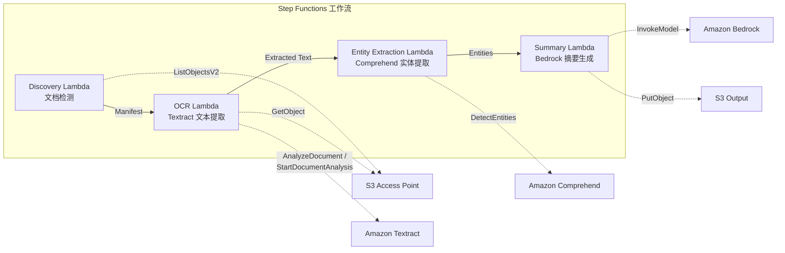

# UC2: 金融·保险 — 合同·发票自动处理 (IDP)

🌐 **Language / 言語**: [日本語](README.md) | [English](README.en.md) | [한국어](README.ko.md) | 简体中文 | [繁體中文](README.zh-TW.md) | [Français](README.fr.md) | [Deutsch](README.de.md) | [Español](README.es.md)

📚 **文档**: [架构图](docs/architecture.zh-CN.md) | [演示指南](docs/demo-guide.zh-CN.md)

## 概述

这是一个利用 FSx for ONTAP 的 S3 Access Points，对合同、发票等文档自动执行 OCR 处理、实体提取和摘要生成的无服务器工作流。

### 适合此模式的场景

- 希望对文件服务器上的 PDF/TIFF/JPEG 文档定期进行批量 OCR 处理
- 希望在不更改现有 NAS 工作流（扫描仪 → 文件服务器保存）的情况下添加 AI 处理
- 希望从合同、发票中自动提取日期、金额、组织名称，并作为结构化数据加以利用
- 希望以最低成本试用 Textract + Comprehend + Bedrock 的 IDP 流水线

### 不适合此模式的场景

- 需要在文档上传后立即进行实时处理
- 每天处理数万件以上的大量文档（注意 Textract 的 API 速率限制）
- 在 Textract 不支持的区域中无法接受跨区域调用的延迟
- 文档已存在于 S3 标准存储桶中，可通过 S3 事件通知进行处理

### 主要功能

- 通过 S3 AP 自动检测 PDF、TIFF、JPEG 文档
- 使用 Amazon Textract 进行 OCR 文本提取（自动选择同步/异步 API）
- 使用 Amazon Comprehend 进行命名实体（日期、金额、组织名称、人名）提取
- 使用 Amazon Bedrock 生成结构化摘要

## Success Metrics

### Outcome
通过自动处理合同、发票，减少手动数据录入工时。

### Metrics
| 指标 | 目标值（示例） |
|-----------|------------|
| 每次执行处理的文档数 | > 500 documents |
| OCR 准确率（字符识别率） | > 95% |
| 数据提取成功率 | > 90% |
| 每文档处理时间 | < 30 秒 |
| 每文档成本 | < $0.10 |
| Human Review 对象比例 | < 20%（低置信度分数） |

### Measurement Method
Step Functions 执行历史、Textract confidence score、CloudWatch Metrics、S3 输出文件数。

## 架构



### 工作流步骤

1. **Discovery**：从 S3 AP 检测 PDF、TIFF、JPEG 文档，并生成 Manifest
2. **OCR**：根据文档页数自动选择 Textract 同步/异步 API 并执行 OCR
3. **Entity Extraction**：使用 Comprehend 提取命名实体（日期、金额、组织名称、人名）
4. **Summary**：使用 Bedrock 生成结构化摘要，并以 JSON 格式输出到 S3

## 前提条件

- AWS 账户和适当的 IAM 权限
- FSx for ONTAP 文件系统（ONTAP 9.17.1P4D3 及以上）
- 已启用 S3 Access Point 的卷
- ONTAP REST API 凭证已注册到 Secrets Manager
- VPC、私有子网
- 已启用 Amazon Bedrock 模型访问（Claude / Nova）
- 可使用 Amazon Textract、Amazon Comprehend 的区域

## 部署步骤

### 1. 准备参数

部署前请确认以下值：

- FSx for ONTAP S3 Access Point Alias
- ONTAP 管理 IP 地址
- Secrets Manager 密钥名称
- VPC ID、私有子网 ID

### 2. SAM 部署

```bash
# 前提：需要 AWS SAM CLI。sam build 会自动打包代码和共享层。
sam build

sam deploy \
  --stack-name fsxn-financial-idp \
  --parameter-overrides \
    S3AccessPointAlias=<your-volume-ext-s3alias> \
    S3AccessPointName=<your-s3ap-name> \
    S3AccessPointOutputAlias=<your-output-volume-ext-s3alias> \
    OntapSecretName=<your-ontap-secret-name> \
    OntapManagementIp=<your-ontap-management-ip> \
    ScheduleExpression="rate(1 hour)" \
    VpcId=<your-vpc-id> \
    PrivateSubnetIds=<subnet-1>,<subnet-2> \
    NotificationEmail=<your-email@example.com> \
    EnableVpcEndpoints=false \
    EnableCloudWatchAlarms=false \
  --capabilities CAPABILITY_NAMED_IAM \
  --resolve-s3 \
  --region ap-northeast-1
```

> **注意**：`template.yaml` 用于 SAM CLI（`sam build` + `sam deploy`）。
> 如果使用 `aws cloudformation deploy` 命令直接部署，请使用 `template-deploy.yaml`（需要预先打包 Lambda zip 文件并上传到 S3）。

> **注意**：请将 `<...>` 占位符替换为实际的环境值。

### 3. 确认 SNS 订阅

部署后，指定的电子邮件地址会收到 SNS 订阅确认邮件。

> **注意**：如果省略 `S3AccessPointName`，IAM 策略将仅基于 Alias，可能会发生 `AccessDenied` 错误。在生产环境中建议指定。详情请参阅[故障排除指南](../docs/guides/troubleshooting-guide.md#1-accessdenied-エラー)。

## 配置参数一览

| 参数 | 说明 | 默认值 | 必填 |
|-----------|------|----------|------|
| `S3AccessPointAlias` | FSx for ONTAP S3 AP Alias（输入用） | — | ✅ |
| `S3AccessPointName` | S3 AP 名称（用于基于 ARN 的 IAM 权限授予。省略时仅基于 Alias） | `""` | ⚠️ 推荐 |
| `S3AccessPointOutputAlias` | FSx for ONTAP S3 AP Alias（输出用） | — | ✅ |
| `OntapSecretName` | ONTAP 凭证的 Secrets Manager 密钥名称 | — | ✅ |
| `OntapManagementIp` | ONTAP 集群管理 IP 地址 | — | ✅ |
| `ScheduleExpression` | EventBridge Scheduler 的调度表达式 | `rate(1 hour)` | |
| `VpcId` | VPC ID | — | ✅ |
| `PrivateSubnetIds` | 私有子网 ID 列表 | — | ✅ |
| `NotificationEmail` | SNS 通知目标电子邮件地址 | — | ✅ |
| `EnableVpcEndpoints` | 启用 Interface VPC Endpoints | `false` | |
| `EnableCloudWatchAlarms` | 启用 CloudWatch Alarms | `false` | |

## 成本结构

### 按请求计费（按量付费）

| 服务 | 计费单位 | 概算（100 文档/月） |
|---------|---------|--------------------------|
| Lambda | 请求数 + 执行时间 | ~$0.01 |
| Step Functions | 状态转换数 | 免费额度内 |
| S3 API | 请求数 | ~$0.01 |
| Textract | 页数 | ~$0.15 |
| Comprehend | 单元数（每 100 字符） | ~$0.03 |
| Bedrock | 令牌数 | ~$0.10 |

### 常时运行（可选）

| 服务 | 参数 | 月费 |
|---------|-----------|------|
| Interface VPC Endpoints | `EnableVpcEndpoints=true` | ~$28.80 |
| CloudWatch Alarms | `EnableCloudWatchAlarms=true` | ~$0.30 |

> 在演示/PoC 环境中，仅凭变动费用即可从 **~$0.30/月** 开始使用。

## 输出数据格式

Summary Lambda 的输出 JSON：

```json
{
  "extracted_text": "合同全文文本...",
  "entities": [
    {"type": "DATE", "text": "2026年1月15日"},
    {"type": "ORGANIZATION", "text": "示例株式会社"},
    {"type": "QUANTITY", "text": "1,000,000日元"}
  ],
  "summary": "本合同...",
  "document_key": "contracts/2026/sample-contract.pdf",
  "processed_at": "2026-01-15T10:00:00Z"
}
```

## 清理

```bash
# 删除 CloudFormation 堆栈
aws cloudformation delete-stack \
  --stack-name fsxn-financial-idp \
  --region ap-northeast-1

# 等待删除完成
aws cloudformation wait stack-delete-complete \
  --stack-name fsxn-financial-idp \
  --region ap-northeast-1
```

> **注意**：如果 S3 存储桶中仍有对象，堆栈删除可能会失败。请事先清空存储桶。

## Supported Regions

UC2 使用以下服务：

| 服务 | 区域约束 |
|---------|-------------|
| Amazon Textract | 不支持 ap-northeast-1。使用 `TEXTRACT_REGION` 参数指定支持的区域（如 us-east-1） |
| Amazon Comprehend | 几乎所有区域均可使用 |
| Amazon Bedrock | 确认支持的区域（[Bedrock 支持的区域](https://docs.aws.amazon.com/general/latest/gr/bedrock.html)） |
| AWS X-Ray | 几乎所有区域均可使用 |
| CloudWatch EMF | 几乎所有区域均可使用 |

> 通过 Cross-Region Client 调用 Textract API。请确认数据驻留要求。详情请参阅[区域兼容性矩阵](../docs/region-compatibility.md)。

## 参考链接

### AWS 官方文档

- [FSx for ONTAP S3 Access Points 概述](https://docs.aws.amazon.com/fsx/latest/ONTAPGuide/accessing-data-via-s3-access-points.html)
- [使用 Lambda 进行无服务器处理（官方教程）](https://docs.aws.amazon.com/fsx/latest/ONTAPGuide/tutorial-process-files-with-lambda.html)
- [Textract API 参考](https://docs.aws.amazon.com/textract/latest/dg/API_Reference.html)
- [Comprehend DetectEntities API](https://docs.aws.amazon.com/comprehend/latest/dg/API_DetectEntities.html)
- [Bedrock InvokeModel API 参考](https://docs.aws.amazon.com/bedrock/latest/APIReference/API_runtime_InvokeModel.html)

### AWS 博客文章·指南

- [S3 AP 发布博客](https://aws.amazon.com/blogs/aws/amazon-fsx-for-netapp-ontap-now-integrates-with-amazon-s3-for-seamless-data-access/)
- [Step Functions + Bedrock 文档处理](https://aws.amazon.com/blogs/compute/orchestrating-large-scale-document-processing-with-aws-step-functions-and-amazon-bedrock-batch-inference/)
- [IDP 指南（Intelligent Document Processing on AWS）](https://aws.amazon.com/solutions/guidance/intelligent-document-processing-on-aws3/)

### GitHub 示例

- [aws-samples/amazon-textract-serverless-large-scale-document-processing](https://github.com/aws-samples/amazon-textract-serverless-large-scale-document-processing) — Textract 大规模处理
- [aws-samples/serverless-patterns](https://github.com/aws-samples/serverless-patterns) — 无服务器模式集合
- [aws-samples/aws-stepfunctions-examples](https://github.com/aws-samples/aws-stepfunctions-examples) — Step Functions 示例

## 已验证环境

| 项目 | 值 |
|------|-----|
| AWS 区域 | ap-northeast-1 (东京) |
| FSx for ONTAP 版本 | ONTAP 9.17.1P4D3 |
| FSx 配置 | SINGLE_AZ_1 |
| Python | 3.12 |
| 部署方式 | CloudFormation (标准) |

## Lambda VPC 部署架构

基于验证中获得的经验，Lambda 函数被分别部署在 VPC 内/外。

**VPC 内 Lambda**（仅需要 ONTAP REST API 访问的函数）：
- Discovery Lambda — S3 AP + ONTAP API

**VPC 外 Lambda**（仅使用 AWS 托管服务 API）：
- 其他所有 Lambda 函数

> **原因**：要从 VPC 内 Lambda 访问 AWS 托管服务 API（Athena、Bedrock、Textract 等），需要 Interface VPC Endpoint（每个 $7.20/月）。VPC 外 Lambda 可通过互联网直接访问 AWS API，无需额外成本即可运行。

> **注意**：对于使用 ONTAP REST API 的 UC（UC1 法务·合规），`EnableVpcEndpoints=true` 是必需的。因为需要通过 Secrets Manager VPC Endpoint 获取 ONTAP 凭证。

---

## AWS 文档链接

| 服务 | 文档 |
|---------|------------|
| FSx for ONTAP | [FSx for ONTAP](https://docs.aws.amazon.com/fsx/latest/ONTAPGuide/what-is-fsx-ontap.html) |
| S3 Access Points | [S3 Access Points](https://docs.aws.amazon.com/fsx/latest/ONTAPGuide/s3-access-points.html) |
| Step Functions | [Step Functions](https://docs.aws.amazon.com/step-functions/latest/dg/welcome.html) |
| Amazon Textract | [Amazon Textract](https://docs.aws.amazon.com/textract/latest/dg/what-is.html) |
| Amazon Comprehend | [Amazon Comprehend](https://docs.aws.amazon.com/comprehend/latest/dg/what-is.html) |
| Amazon Bedrock | [Amazon Bedrock](https://docs.aws.amazon.com/bedrock/latest/userguide/what-is-bedrock.html) |

### Well-Architected Framework 对应

| 支柱 | 对应 |
|----|------|
| 卓越运营 | X-Ray 跟踪、EMF 指标、结构化日志 |
| 安全性 | 最小权限 IAM、KMS 加密、PII 检测 |
| 可靠性 | Step Functions Retry/Catch、跨区域回退 |
| 性能效率 | Lambda 内存优化、并行 OCR 处理 |
| 成本优化 | 无服务器（仅使用时计费）、Textract 按页计费 |
| 可持续性 | 按需执行、自动停止不需要的资源 |

---

## 本地测试

### Prerequisites 检查

```bash
# 确认前提条件
aws --version          # AWS CLI v2
sam --version          # SAM CLI
python3 --version      # Python 3.9+
docker --version       # Docker (sam local 用)
aws sts get-caller-identity  # AWS 凭证
```

### sam local invoke

```bash
# 构建
# 前提：需要 AWS SAM CLI。sam build 会自动打包代码和共享层。
sam build

# 本地运行 Discovery Lambda
sam local invoke DiscoveryFunction --event events/discovery-event.json

# 带环境变量覆盖
sam local invoke DiscoveryFunction \
  --event events/discovery-event.json \
  --env-vars env.json
```

### 单元测试

```bash
python3 -m pytest tests/ -v
```

详情请参阅[本地测试快速入门](../docs/local-testing-quick-start.md)。

---

## 输出示例 (Output Sample)

票据 OCR → 实体提取的输出示例：

```json
{
  "discovery": {
    "status": "completed",
    "object_count": 25,
    "prefix": "invoices/"
  },
  "processing": [
    {
      "key": "invoices/INV-2026-001.pdf",
      "ocr_result": {
        "document_type": "invoice",
        "confidence": 0.97
      },
      "entities": {
        "vendor_name": "示例株式会社",
        "invoice_number": "INV-2026-001",
        "amount": "1,234,567",
        "currency": "JPY",
        "due_date": "2026-06-30"
      },
      "summary": "来自示例公司的发票。金额 1,234,567 日元，付款期限 2026/6/30。"
    }
  ],
  "report": {
    "total_processed": 25,
    "succeeded": 24,
    "failed": 1,
    "output_prefix": "s3://output-bucket/extracted/"
  }
}
```

> **注记**：以上为示例输出，实际值因环境·输入数据而异。基准数值为 sizing reference，而非 service limit。

---

## Governance Note

> 本模式提供技术架构指南。它不是法律、合规或监管方面的建议。组织应咨询合格的专业人士。

### FISC 安全对策基准对应

面向日本的金融机构，本节展示本模式的设计要素与 FISC（金融信息系统中心）安全对策基准的对应关系。

> **重要**：本节不保证符合 FISC 要求。FISC 合规的最终判断应由金融机构的信息安全部门及审计法人作出。

| FISC 对策基准类别 | 本模式的对应设计要素 |
|---------------------|----------------------|
| 访问管理 | IAM 最小权限、S3 AP 资源策略、ONTAP 双层授权 |
| 加密 | SSE-FSX（静态时）、TLS 1.2+（传输时）、KMS（输出存储桶） |
| 审计追踪 | CloudTrail（所有 API 调用）、CloudWatch Logs（Lambda 执行日志）、X-Ray 跟踪 |
| 数据保护 | VPC 内执行（可选）、Secrets Manager（凭证管理）、数据分类标签 |
| 可用性 | Step Functions Retry/Catch、Lambda 自动扩展、Multi-AZ FSx for ONTAP（可选） |
| 变更管理 | CloudFormation（IaC）、Git 管理、CI/CD 流水线 |
| 故障应对 | CloudWatch Alarms、SNS 通知、事件响应 Playbook |

**需要额外考虑的事项**：
- 金融数据的境内保管要求（通过使用 ap-northeast-1 区域来应对）
- Textract 跨区域调用时数据路径（经由 us-east-1）是否可接受
- 对外部委托方（AWS）的监督义务的梳理
- 定期漏洞诊断·渗透测试的实施计划

---

## S3AP Compatibility

关于 S3 Access Points for FSx for ONTAP 的兼容性约束、故障排除和触发器模式，请参阅 [S3AP Compatibility Notes](../docs/s3ap-compatibility-notes.md)。
