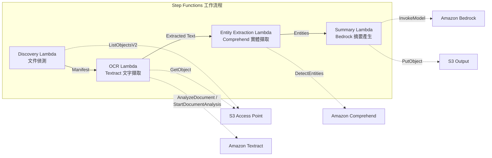

# UC2: 金融·保險 — 合約·發票自動處理 (IDP)

🌐 **Language / 言語**: [日本語](README.md) | [English](README.en.md) | [한국어](README.ko.md) | [简体中文](README.zh-CN.md) | 繁體中文 | [Français](README.fr.md) | [Deutsch](README.de.md) | [Español](README.es.md)

📚 **文件**: [架構圖](docs/architecture.zh-TW.md) | [示範指南](docs/demo-guide.zh-TW.md)

## 概述

這是一個利用 FSx for ONTAP 的 S3 Access Points，對合約、發票等文件自動執行 OCR 處理、實體擷取與摘要產生的無伺服器工作流程。

### 適合此模式的情境

- 希望對檔案伺服器上的 PDF/TIFF/JPEG 文件定期進行批次 OCR 處理
- 希望在不變更現有 NAS 工作流程（掃描器 → 檔案伺服器儲存）的情況下加入 AI 處理
- 希望從合約、發票中自動擷取日期、金額、組織名稱，並作為結構化資料加以運用
- 希望以最低成本試用 Textract + Comprehend + Bedrock 的 IDP 流程

### 不適合此模式的情境

- 需要在文件上傳後立即進行即時處理
- 每天處理數萬件以上的大量文件（請注意 Textract 的 API 速率限制）
- 在 Textract 不支援的區域中無法接受跨區域呼叫的延遲
- 文件已存在於 S3 標準儲存貯體中，可透過 S3 事件通知進行處理

### 主要功能

- 透過 S3 AP 自動偵測 PDF、TIFF、JPEG 文件
- 使用 Amazon Textract 進行 OCR 文字擷取（自動選擇同步/非同步 API）
- 使用 Amazon Comprehend 進行命名實體（日期、金額、組織名稱、人名）擷取
- 使用 Amazon Bedrock 產生結構化摘要

## Success Metrics

### Outcome
透過自動處理合約、發票，減少手動資料輸入工時。

### Metrics
| 指標 | 目標值（範例） |
|-----------|------------|
| 每次執行處理的文件數 | > 500 documents |
| OCR 準確率（字元辨識率） | > 95% |
| 資料擷取成功率 | > 90% |
| 每份文件處理時間 | < 30 秒 |
| 每份文件成本 | < $0.10 |
| Human Review 對象比例 | < 20%（低信賴度分數） |

### Measurement Method
Step Functions 執行歷史、Textract confidence score、CloudWatch Metrics、S3 輸出檔案數。

## 架構



### 工作流程步驟

1. **Discovery**：從 S3 AP 偵測 PDF、TIFF、JPEG 文件，並產生 Manifest
2. **OCR**：依文件頁數自動選擇 Textract 同步/非同步 API 並執行 OCR
3. **Entity Extraction**：使用 Comprehend 擷取命名實體（日期、金額、組織名稱、人名）
4. **Summary**：使用 Bedrock 產生結構化摘要，並以 JSON 格式輸出至 S3

## 前提條件

- AWS 帳戶與適當的 IAM 權限
- FSx for ONTAP 檔案系統（ONTAP 9.17.1P4D3 以上）
- 已啟用 S3 Access Point 的磁碟區
- ONTAP REST API 憑證已註冊至 Secrets Manager
- VPC、私有子網路
- 已啟用 Amazon Bedrock 模型存取（Claude / Nova）
- 可使用 Amazon Textract、Amazon Comprehend 的區域

## 部署步驟

### 1. 準備參數

部署前請確認以下值：

- FSx for ONTAP S3 Access Point Alias
- ONTAP 管理 IP 位址
- Secrets Manager 密鑰名稱
- VPC ID、私有子網路 ID

### 2. SAM 部署

```bash
# 前提：需要 AWS SAM CLI。sam build 會自動封裝程式碼與共用層。
sam build

sam deploy \
  --stack-name fsxn-financial-idp \
  --parameter-overrides \
    S3AccessPointAlias=<your-volume-ext-s3alias> \
    S3AccessPointName=<your-s3ap-name> \
    S3AccessPointOutputAlias=<your-output-volume-ext-s3alias> \
    OntapSecretName=<your-ontap-secret-name> \
    OntapManagementIp=<your-ontap-management-ip> \
    ScheduleExpression="rate(1 hour)" \
    VpcId=<your-vpc-id> \
    PrivateSubnetIds=<subnet-1>,<subnet-2> \
    NotificationEmail=<your-email@example.com> \
    EnableVpcEndpoints=false \
    EnableCloudWatchAlarms=false \
  --capabilities CAPABILITY_NAMED_IAM \
  --resolve-s3 \
  --region ap-northeast-1
```

> **注意**：`template.yaml` 用於 SAM CLI（`sam build` + `sam deploy`）。
> 若要使用 `aws cloudformation deploy` 命令直接部署，請改用 `template-deploy.yaml`（需要事先封裝 Lambda zip 檔案並上傳至 S3）。

> **注意**：請將 `<...>` 佔位符替換為實際的環境值。

### 3. 確認 SNS 訂閱

部署後，指定的電子郵件地址會收到 SNS 訂閱確認郵件。

> **注意**：若省略 `S3AccessPointName`，IAM 政策將僅以 Alias 為基礎，可能會發生 `AccessDenied` 錯誤。在生產環境中建議指定。詳情請參閱[疑難排解指南](../docs/guides/troubleshooting-guide.md#1-accessdenied-エラー)。

## 設定參數一覽

| 參數 | 說明 | 預設值 | 必填 |
|-----------|------|----------|------|
| `S3AccessPointAlias` | FSx for ONTAP S3 AP Alias（輸入用） | — | ✅ |
| `S3AccessPointName` | S3 AP 名稱（用於以 ARN 為基礎的 IAM 權限授予。省略時僅以 Alias 為基礎） | `""` | ⚠️ 建議 |
| `S3AccessPointOutputAlias` | FSx for ONTAP S3 AP Alias（輸出用） | — | ✅ |
| `OntapSecretName` | ONTAP 憑證的 Secrets Manager 密鑰名稱 | — | ✅ |
| `OntapManagementIp` | ONTAP 叢集管理 IP 位址 | — | ✅ |
| `ScheduleExpression` | EventBridge Scheduler 的排程運算式 | `rate(1 hour)` | |
| `VpcId` | VPC ID | — | ✅ |
| `PrivateSubnetIds` | 私有子網路 ID 清單 | — | ✅ |
| `NotificationEmail` | SNS 通知目標電子郵件地址 | — | ✅ |
| `EnableVpcEndpoints` | 啟用 Interface VPC Endpoints | `false` | |
| `EnableCloudWatchAlarms` | 啟用 CloudWatch Alarms | `false` | |

## 成本結構

### 依請求計費（用量計費）

| 服務 | 計費單位 | 概算（100 份文件/月） |
|---------|---------|--------------------------|
| Lambda | 請求數 + 執行時間 | ~$0.01 |
| Step Functions | 狀態轉換數 | 免費額度內 |
| S3 API | 請求數 | ~$0.01 |
| Textract | 頁數 | ~$0.15 |
| Comprehend | 單元數（每 100 字元） | ~$0.03 |
| Bedrock | 權杖數 | ~$0.10 |

### 持續運行（選用）

| 服務 | 參數 | 月費 |
|---------|-----------|------|
| Interface VPC Endpoints | `EnableVpcEndpoints=true` | ~$28.80 |
| CloudWatch Alarms | `EnableCloudWatchAlarms=true` | ~$0.30 |

> 在示範/PoC 環境中，僅憑變動費用即可從 **~$0.30/月** 開始使用。

## 輸出資料格式

Summary Lambda 的輸出 JSON：

```json
{
  "extracted_text": "合約全文文字...",
  "entities": [
    {"type": "DATE", "text": "2026年1月15日"},
    {"type": "ORGANIZATION", "text": "範例股份有限公司"},
    {"type": "QUANTITY", "text": "1,000,000日圓"}
  ],
  "summary": "本合約...",
  "document_key": "contracts/2026/sample-contract.pdf",
  "processed_at": "2026-01-15T10:00:00Z"
}
```

## 清理

```bash
# 刪除 CloudFormation 堆疊
aws cloudformation delete-stack \
  --stack-name fsxn-financial-idp \
  --region ap-northeast-1

# 等待刪除完成
aws cloudformation wait stack-delete-complete \
  --stack-name fsxn-financial-idp \
  --region ap-northeast-1
```

> **注意**：若 S3 儲存貯體中仍有物件，堆疊刪除可能會失敗。請事先清空儲存貯體。

## Supported Regions

UC2 使用以下服務：

| 服務 | 區域限制 |
|---------|-------------|
| Amazon Textract | 不支援 ap-northeast-1。使用 `TEXTRACT_REGION` 參數指定支援的區域（如 us-east-1） |
| Amazon Comprehend | 幾乎所有區域均可使用 |
| Amazon Bedrock | 確認支援的區域（[Bedrock 支援的區域](https://docs.aws.amazon.com/general/latest/gr/bedrock.html)） |
| AWS X-Ray | 幾乎所有區域均可使用 |
| CloudWatch EMF | 幾乎所有區域均可使用 |

> 透過 Cross-Region Client 呼叫 Textract API。請確認資料落地要求。詳情請參閱[區域相容性矩陣](../docs/region-compatibility.md)。

## 參考連結

### AWS 官方文件

- [FSx for ONTAP S3 Access Points 概述](https://docs.aws.amazon.com/fsx/latest/ONTAPGuide/accessing-data-via-s3-access-points.html)
- [使用 Lambda 進行無伺服器處理（官方教學）](https://docs.aws.amazon.com/fsx/latest/ONTAPGuide/tutorial-process-files-with-lambda.html)
- [Textract API 參考](https://docs.aws.amazon.com/textract/latest/dg/API_Reference.html)
- [Comprehend DetectEntities API](https://docs.aws.amazon.com/comprehend/latest/dg/API_DetectEntities.html)
- [Bedrock InvokeModel API 參考](https://docs.aws.amazon.com/bedrock/latest/APIReference/API_runtime_InvokeModel.html)

### AWS 部落格文章·指引

- [S3 AP 發表部落格](https://aws.amazon.com/blogs/aws/amazon-fsx-for-netapp-ontap-now-integrates-with-amazon-s3-for-seamless-data-access/)
- [Step Functions + Bedrock 文件處理](https://aws.amazon.com/blogs/compute/orchestrating-large-scale-document-processing-with-aws-step-functions-and-amazon-bedrock-batch-inference/)
- [IDP 指引（Intelligent Document Processing on AWS）](https://aws.amazon.com/solutions/guidance/intelligent-document-processing-on-aws3/)

### GitHub 範例

- [aws-samples/amazon-textract-serverless-large-scale-document-processing](https://github.com/aws-samples/amazon-textract-serverless-large-scale-document-processing) — Textract 大規模處理
- [aws-samples/serverless-patterns](https://github.com/aws-samples/serverless-patterns) — 無伺服器模式集合
- [aws-samples/aws-stepfunctions-examples](https://github.com/aws-samples/aws-stepfunctions-examples) — Step Functions 範例

## 已驗證環境

| 項目 | 值 |
|------|-----|
| AWS 區域 | ap-northeast-1 (東京) |
| FSx for ONTAP 版本 | ONTAP 9.17.1P4D3 |
| FSx 組態 | SINGLE_AZ_1 |
| Python | 3.12 |
| 部署方式 | CloudFormation (標準) |

## Lambda VPC 佈署架構

根據驗證中獲得的經驗，Lambda 函數被分別佈署於 VPC 內/外。

**VPC 內 Lambda**（僅需要 ONTAP REST API 存取的函數）：
- Discovery Lambda — S3 AP + ONTAP API

**VPC 外 Lambda**（僅使用 AWS 受管服務 API）：
- 其他所有 Lambda 函數

> **理由**：要從 VPC 內 Lambda 存取 AWS 受管服務 API（Athena、Bedrock、Textract 等），需要 Interface VPC Endpoint（每個 $7.20/月）。VPC 外 Lambda 可透過網際網路直接存取 AWS API，無需額外成本即可運作。

> **注意**：對於使用 ONTAP REST API 的 UC（UC1 法務·合規），`EnableVpcEndpoints=true` 為必要。因為需要透過 Secrets Manager VPC Endpoint 取得 ONTAP 憑證。

---

## AWS 文件連結

| 服務 | 文件 |
|---------|------------|
| FSx for ONTAP | [FSx for ONTAP](https://docs.aws.amazon.com/fsx/latest/ONTAPGuide/what-is-fsx-ontap.html) |
| S3 Access Points | [S3 Access Points](https://docs.aws.amazon.com/fsx/latest/ONTAPGuide/s3-access-points.html) |
| Step Functions | [Step Functions](https://docs.aws.amazon.com/step-functions/latest/dg/welcome.html) |
| Amazon Textract | [Amazon Textract](https://docs.aws.amazon.com/textract/latest/dg/what-is.html) |
| Amazon Comprehend | [Amazon Comprehend](https://docs.aws.amazon.com/comprehend/latest/dg/what-is.html) |
| Amazon Bedrock | [Amazon Bedrock](https://docs.aws.amazon.com/bedrock/latest/userguide/what-is-bedrock.html) |

### Well-Architected Framework 對應

| 支柱 | 對應 |
|----|------|
| 卓越營運 | X-Ray 追蹤、EMF 指標、結構化日誌 |
| 安全性 | 最小權限 IAM、KMS 加密、PII 偵測 |
| 可靠性 | Step Functions Retry/Catch、跨區域回退 |
| 效能效率 | Lambda 記憶體最佳化、平行 OCR 處理 |
| 成本最佳化 | 無伺服器（僅使用時計費）、Textract 依頁計費 |
| 永續性 | 隨需執行、自動停止不需要的資源 |

---

## 本機測試

### Prerequisites 檢查

```bash
# 確認前提條件
aws --version          # AWS CLI v2
sam --version          # SAM CLI
python3 --version      # Python 3.9+
docker --version       # Docker (sam local 用)
aws sts get-caller-identity  # AWS 憑證
```

### sam local invoke

```bash
# 建置
# 前提：需要 AWS SAM CLI。sam build 會自動封裝程式碼與共用層。
sam build

# 本機執行 Discovery Lambda
sam local invoke DiscoveryFunction --event events/discovery-event.json

# 附帶環境變數覆寫
sam local invoke DiscoveryFunction \
  --event events/discovery-event.json \
  --env-vars env.json
```

### 單元測試

```bash
python3 -m pytest tests/ -v
```

詳情請參閱[本機測試快速入門](../docs/local-testing-quick-start.md)。

---

## 輸出範例 (Output Sample)

單據 OCR → 實體擷取的輸出範例：

```json
{
  "discovery": {
    "status": "completed",
    "object_count": 25,
    "prefix": "invoices/"
  },
  "processing": [
    {
      "key": "invoices/INV-2026-001.pdf",
      "ocr_result": {
        "document_type": "invoice",
        "confidence": 0.97
      },
      "entities": {
        "vendor_name": "範例股份有限公司",
        "invoice_number": "INV-2026-001",
        "amount": "1,234,567",
        "currency": "JPY",
        "due_date": "2026-06-30"
      },
      "summary": "來自範例公司的發票。金額 1,234,567 日圓，付款期限 2026/6/30。"
    }
  ],
  "report": {
    "total_processed": 25,
    "succeeded": 24,
    "failed": 1,
    "output_prefix": "s3://output-bucket/extracted/"
  }
}
```

> **附註**：以上為範例輸出，實際值因環境·輸入資料而異。基準數值為 sizing reference，而非 service limit。

---

## Governance Note

> 本模式提供技術架構指引。它並非法律、合規或法規方面的建議。組織應諮詢合格的專業人士。

### FISC 安全對策基準對應

面向日本的金融機構，本節展示本模式的設計要素與 FISC（金融資訊系統中心）安全對策基準的對應關係。

> **重要**：本節不保證符合 FISC 要求。FISC 合規的最終判斷應由金融機構的資訊安全部門及審計法人作出。

| FISC 對策基準類別 | 本模式的對應設計要素 |
|---------------------|----------------------|
| 存取管理 | IAM 最小權限、S3 AP 資源政策、ONTAP 雙層授權 |
| 加密 | SSE-FSX（靜態時）、TLS 1.2+（傳輸時）、KMS（輸出儲存貯體） |
| 稽核軌跡 | CloudTrail（所有 API 呼叫）、CloudWatch Logs（Lambda 執行日誌）、X-Ray 追蹤 |
| 資料保護 | VPC 內執行（選用）、Secrets Manager（憑證管理）、資料分類標籤 |
| 可用性 | Step Functions Retry/Catch、Lambda 自動擴展、Multi-AZ FSx for ONTAP（選用） |
| 變更管理 | CloudFormation（IaC）、Git 管理、CI/CD 管線 |
| 故障應對 | CloudWatch Alarms、SNS 通知、事件回應 Playbook |

**需額外考量的事項**：
- 金融資料的境內保管要求（透過使用 ap-northeast-1 區域來因應）
- Textract 跨區域呼叫時資料路徑（經由 us-east-1）是否可接受
- 對外部委託方（AWS）的監督義務的梳理
- 定期弱點診斷·滲透測試的實施計畫

---

## S3AP Compatibility

關於 S3 Access Points for FSx for ONTAP 的相容性限制、疑難排解與觸發器模式，請參閱 [S3AP Compatibility Notes](../docs/s3ap-compatibility-notes.md)。
