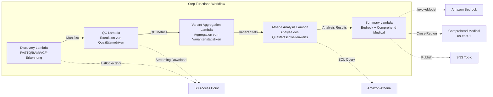

# UC7: Genomik / Bioinformatik — Qualitätskontrolle und Variantenaufruf-Aggregation

🌐 **Language / 言語**: [日本語](README.md) | [English](README.en.md) | [한국어](README.ko.md) | [简体中文](README.zh-CN.md) | [繁體中文](README.zh-TW.md) | [Français](README.fr.md) | Deutsch | [Español](README.es.md)

📚 **Dokumentation**: [Architekturdiagramm](docs/architecture.de.md) | [Demo-Leitfaden](docs/demo-guide.de.md)

## Übersicht

Ein serverloser Workflow, der die S3 Access Points von FSx for ONTAP nutzt, um die Qualitätskontrolle von FASTQ/BAM/VCF-Genomdaten, die Aggregation von Variantenaufruf-Statistiken und die Erstellung von Forschungszusammenfassungen zu automatisieren.

### Fälle, in denen dieses Muster geeignet ist

- Die Ausgabedaten von Sequenzern der nächsten Generation (FASTQ/BAM/VCF) sammeln sich auf FSx for ONTAP an
- Sie möchten die Qualitätsmetriken der Sequenzdaten (Anzahl der Reads, Qualitätsscores, GC-Gehalt) regelmäßig überwachen
- Sie möchten die statistische Aggregation der Variantenaufrufergebnisse (SNP/InDel-Verhältnis, Ti/Tv-Verhältnis) automatisieren
- Eine automatische Extraktion biomedizinischer Entitäten (Gennamen, Krankheiten, Medikamente) mittels Comprehend Medical ist erforderlich
- Sie möchten Forschungszusammenfassungsberichte automatisch generieren

### Fälle, für die dieses Muster nicht geeignet ist

- Die Ausführung einer Echtzeit-Variant-Calling-Pipeline (BWA/GATK usw.) ist erforderlich
- Großflächige Genom-Alignment-Verarbeitung (EC2/HPC-Cluster sind geeignet)
- Eine unter GxP-Vorschriften vollständig validierte Pipeline ist erforderlich
- Eine Umgebung, in der keine Netzwerkerreichbarkeit für die ONTAP REST API gewährleistet werden kann

### Hauptfunktionen

- Automatische Erkennung von FASTQ/BAM/VCF-Dateien über S3 AP
- Extraktion von FASTQ-Qualitätsmetriken durch Streaming-Download
- Aggregation von VCF-Variantenstatistiken (total_variants, snp_count, indel_count, ti_tv_ratio)
- Identifizierung von Proben unter Qualitätsschwellenwerten mittels Athena SQL
- Extraktion biomedizinischer Entitäten mit Comprehend Medical (Cross-Region)
- Generierung von Forschungszusammenfassungen mit Amazon Bedrock

## Success Metrics

### Outcome
Die Automatisierung der FASTQ/VCF-Qualitätskontrolle und der Variantenaufruf-Aggregation beschleunigt die Analyse von Forschungsdaten.

### Metrics
| Metrik | Zielwert (Beispiel) |
|-----------|------------|
| Verarbeitete Proben / Ausführung | > 50 samples |
| Bestehensquote der Qualitätskontrolle | > 95% |
| Genauigkeit der Variantenerkennung | Übereinstimmungsrate mit bekannter Varianten-DB > 90% |
| Verarbeitungszeit / Probe | < 2 Minuten |
| Kosten / Ausführung | < $10 |
| Anteil erforderlicher Human Reviews | 100% (klinisch signifikante Varianten) |

> **Grund für 100 % Human Review**: Da die Klassifizierung klinisch signifikanter Varianten medizinische Entscheidungen beeinflusst, ist eine vollständige Überprüfung durch Forscher und Kliniker verpflichtend.

### Measurement Method
Step Functions-Ausführungsverlauf, Comprehend Medical entity count, Athena-Aggregationsergebnisse, CloudWatch Metrics.

## Architektur



### Workflow-Schritte

1. **Discovery**: Erkennen von .fastq-, .fastq.gz-, .bam-, .vcf- und .vcf.gz-Dateien von S3 AP
2. **QC**: FASTQ-Header per Streaming-Download abrufen und Qualitätsmetriken extrahieren
3. **Variant Aggregation**: Aggregieren der Variantenstatistiken der VCF-Dateien
4. **Athena Analysis**: Identifizierung von Proben unter dem Qualitätsschwellenwert per SQL
5. **Summary**: Generierung der Forschungszusammenfassung mit Bedrock, Extraktion von Entitäten mit Comprehend Medical

## Voraussetzungen

- AWS-Konto und geeignete IAM-Berechtigungen
- FSx for ONTAP-Dateisystem (ONTAP 9.17.1P4D3 oder höher)
- Volume mit aktiviertem S3 Access Point (zur Speicherung von Genomdaten)
- VPC, private Subnetze
- Amazon Bedrock-Modellzugriff aktiviert (Claude / Nova)
- **Cross-Region**: Da Comprehend Medical in ap-northeast-1 nicht unterstützt wird, ist ein Cross-Region-Aufruf nach us-east-1 erforderlich

## Bereitstellungsschritte

### 1. Überprüfung der Cross-Region-Parameter

Da Comprehend Medical in der Tokyo-Region nicht unterstützt wird, konfigurieren Sie Cross-Region-Aufrufe mit dem Parameter `CrossRegionServices`.

### 2. SAM-Bereitstellung

```bash
# Voraussetzung: AWS SAM CLI erforderlich. „sam build“ verpackt Code und Shared Layer automatisch.
sam build

sam deploy \
  --stack-name fsxn-genomics-pipeline \
  --parameter-overrides \
    S3AccessPointAlias=<your-volume-ext-s3alias> \
    S3AccessPointName=<your-s3ap-name> \
    VpcId=<your-vpc-id> \
    PrivateSubnetIds=<subnet-1>,<subnet-2> \
    ScheduleExpression="rate(1 hour)" \
    NotificationEmail=<your-email@example.com> \
    CrossRegion=us-east-1 \
    EnableVpcEndpoints=false \
    EnableCloudWatchAlarms=false \
  --capabilities CAPABILITY_NAMED_IAM \
  --resolve-s3 \
  --region ap-northeast-1
```

> **Hinweis**: `template.yaml` ist für die Verwendung mit der AWS SAM CLI (`sam build` + `sam deploy`) vorgesehen.
> Für eine direkte Bereitstellung mit `aws cloudformation deploy` verwenden Sie stattdessen `template-deploy.yaml` (erfordert das vorherige Packen der Lambda-Zip-Dateien und das Hochladen in einen S3-Bucket).

### 3. Überprüfung der Cross-Region-Konfiguration

Stellen Sie nach der Bereitstellung sicher, dass die Lambda-Umgebungsvariable `CROSS_REGION_TARGET` auf `us-east-1` gesetzt ist.

## Liste der Konfigurationsparameter

| Parameter | Beschreibung | Standard | Erforderlich |
|-----------|------|----------|------|
| `S3AccessPointAlias` | FSx for ONTAP S3 AP Alias (für die Eingabe) | — | ✅ |
| `S3AccessPointName` | S3-AP-Name (für die Vergabe ARN-basierter IAM-Berechtigungen; bei Auslassung nur Alias-basiert) | `""` | ⚠️ Empfohlen |
| `ScheduleExpression` | Zeitplanausdruck des EventBridge Scheduler | `rate(1 hour)` | |
| `VpcId` | VPC ID | — | ✅ |
| `PrivateSubnetIds` | Liste der privaten Subnetz-IDs | — | ✅ |
| `NotificationEmail` | SNS-Benachrichtigungs-E-Mail-Adresse | — | ✅ |
| `CrossRegionTarget` | Zielregion für Comprehend Medical | `us-east-1` | |
| `MapConcurrency` | Parallelität des Map-Status | `10` | |
| `LambdaMemorySize` | Lambda-Speichergröße (MB) | `1024` | |
| `LambdaTimeout` | Lambda-Timeout (Sekunden) | `300` | |
| `EnableVpcEndpoints` | Interface VPC Endpoints aktivieren | `false` | |
| `EnableCloudWatchAlarms` | CloudWatch Alarms aktivieren | `false` | |

## Bereinigung

```bash
# S3-Bucket leeren
aws s3 rm s3://fsxn-genomics-pipeline-output-${AWS_ACCOUNT_ID} --recursive

# CloudFormation-Stack löschen
aws cloudformation delete-stack \
  --stack-name fsxn-genomics-pipeline \
  --region ap-northeast-1

aws cloudformation wait stack-delete-complete \
  --stack-name fsxn-genomics-pipeline \
  --region ap-northeast-1
```

## Supported Regions

UC7 verwendet die folgenden Dienste:

| Dienst | Regionsbeschränkung |
|---------|-------------|
| Amazon Athena | In fast allen Regionen verfügbar |
| Amazon Bedrock | Unterstützte Regionen prüfen ([Von Bedrock unterstützte Regionen](https://docs.aws.amazon.com/general/latest/gr/bedrock.html)) |
| Amazon Comprehend Medical | Nur in begrenzten Regionen unterstützt. Geben Sie eine unterstützte Region (z. B. us-east-1) mit dem Parameter `COMPREHEND_MEDICAL_REGION` an |
| AWS X-Ray | In fast allen Regionen verfügbar |
| CloudWatch EMF | In fast allen Regionen verfügbar |

> Die Comprehend Medical API wird über den Cross-Region Client aufgerufen. Überprüfen Sie Ihre Anforderungen an die Datenresidenz. Weitere Informationen finden Sie in der [Regionskompatibilitätsmatrix](../docs/region-compatibility.md).

## Referenzlinks

- [Übersicht über FSx for ONTAP S3 Access Points](https://docs.aws.amazon.com/fsx/latest/ONTAPGuide/accessing-data-via-s3-access-points.html)
- [Amazon Comprehend Medical](https://docs.aws.amazon.com/comprehend-medical/latest/dev/what-is.html)
- [FASTQ-Formatspezifikation](https://en.wikipedia.org/wiki/FASTQ_format)
- [VCF-Formatspezifikation](https://samtools.github.io/hts-specs/VCFv4.3.pdf)

---

## AWS-Dokumentationslinks

| Dienst | Dokumentation |
|---------|------------|
| FSx for ONTAP | [Benutzerhandbuch](https://docs.aws.amazon.com/fsx/latest/ONTAPGuide/what-is-fsx-ontap.html) |
| S3 Access Points | [S3 AP for FSx for ONTAP](https://docs.aws.amazon.com/fsx/latest/ONTAPGuide/s3-access-points.html) |
| Step Functions | [Entwicklerhandbuch](https://docs.aws.amazon.com/step-functions/latest/dg/welcome.html) |
| Amazon Athena | [Benutzerhandbuch](https://docs.aws.amazon.com/athena/latest/ug/what-is.html) |
| Amazon Bedrock | [Benutzerhandbuch](https://docs.aws.amazon.com/bedrock/latest/userguide/what-is-bedrock.html) |
| AWS HealthOmics | [Benutzerhandbuch](https://docs.aws.amazon.com/omics/latest/dev/what-is-service.html) |

### Ausrichtung am Well-Architected Framework

| Säule | Ausrichtung |
|----|------|
| Operative Exzellenz | X-Ray-Tracing, EMF-Metriken, Überwachung der QC-Metriken |
| Sicherheit | IAM nach dem Least-Privilege-Prinzip, KMS-Verschlüsselung, Zugriffskontrolle für Genomdaten |
| Zuverlässigkeit | Step Functions Retry/Catch, Wiederholungen der Variantenaggregation |
| Leistungseffizienz | FASTQ-Streaming-Verarbeitung, Athena-Partitionen |
| Kostenoptimierung | Serverlos (Abrechnung nur bei Nutzung), Lambda-Speicheroptimierung |
| Nachhaltigkeit | On-Demand-Ausführung, inkrementelle Verarbeitung |

---

## Kostenschätzung (monatliche Näherung)

> **Hinweis**: Das Folgende ist eine Näherung für die Region ap-northeast-1; die tatsächlichen Kosten variieren je nach Nutzung. Prüfen Sie die aktuellen Preise mit dem [AWS Pricing Calculator](https://calculator.aws/).

### Serverlose Komponenten (nutzungsbasierte Abrechnung)

| Dienst | Stückpreis | Angenommene Nutzung | Monatliche Näherung |
|---------|------|-----------|---------|
| Lambda | $0.0000166667/GB-sec | 5 Funktionen × 50 samples/Tag | ~$1-5 |
| S3 API (GetObject/ListObjects) | $0.0047/10K requests | ~10K requests/Tag | ~$1.5 |
| Step Functions | $0.025/1K state transitions | ~1K transitions/Tag | ~$0.75 |
| Bedrock (Nova Lite) | $0.00006/1K input tokens | ~30K tokens/Ausführung | ~$3-10 |
| Athena | $5/TB scanned | ~50 MB/Abfrage | ~$0.5-2 |
| SNS | $0.50/100K notifications | ~100 notifications/Tag | ~$0.15 |
| CloudWatch Logs | $0.76/GB ingested | ~1 GB/Monat | ~$0.76 |

### Fixkosten (FSx for ONTAP — setzt eine bestehende Umgebung voraus)

| Komponente | Monatlich |
|--------------|------|
| FSx for ONTAP (128 MBps, 1 TB) | ~$230 (gemeinsam mit bestehender Umgebung) |
| S3 Access Point | Keine zusätzlichen Gebühren (nur S3-API-Gebühren) |

### Gesamtnäherung

| Konfiguration | Monatliche Näherung |
|------|---------|
| Minimal (einmal täglich) | ~$5-15 |
| Standard (stündlich) | ~$15-50 |
| Großangelegt (hohe Frequenz + Alarme) | ~$50-150 |

> **Governance Caveat**: Kostenschätzungen sind Näherungswerte, keine garantierten Werte. Die tatsächlichen Gebühren variieren je nach Nutzungsmuster, Datenvolumen und Region.

---

## Lokales Testen

### Prüfung der Voraussetzungen

```bash
# Voraussetzungen prüfen
aws --version          # AWS CLI v2
sam --version          # SAM CLI
python3 --version      # Python 3.9+
docker --version       # Docker (für sam local)
aws sts get-caller-identity  # AWS-Anmeldeinformationen
```

### sam local invoke

```bash
# Build
# Voraussetzung: AWS SAM CLI erforderlich. „sam build“ verpackt Code und Shared Layer automatisch.
sam build

# Discovery Lambda lokal ausführen
sam local invoke DiscoveryFunction --event events/discovery-event.json

# Mit Überschreibung von Umgebungsvariablen
sam local invoke DiscoveryFunction \
  --event events/discovery-event.json \
  --env-vars env.json
```

### Unit-Tests

```bash
python3 -m pytest tests/ -v
```

Weitere Informationen finden Sie im [Schnellstart für lokales Testen](../docs/local-testing-quick-start.md).

---

## Ausgabebeispiel (Output Sample)

Beispielausgabe der Genomik-Variantenanalyse-Pipeline:

```json
{
  "discovery": {
    "status": "completed",
    "object_count": 8,
    "prefix": "genomics/samples/"
  },
  "qc_results": [
    {
      "key": "genomics/samples/sample-001.fastq.gz",
      "total_reads": 25000000,
      "q30_pct": 92.5,
      "gc_content_pct": 48.2,
      "pass_qc": true
    }
  ],
  "variant_aggregation": {
    "total_variants": 4523,
    "snps": 3891,
    "indels": 632,
    "novel_variants": 127
  },
  "athena_analysis": {
    "clinvar_matches": 15,
    "high_impact_variants": 3,
    "query_execution_id": "qe-xyz789..."
  }
}
```

> **Hinweis**: Das Obige ist eine Beispielausgabe; die tatsächlichen Werte variieren je nach Umgebung und Eingabedaten. Benchmark-Zahlen sind ein sizing reference, kein service limit.

---

## Governance Note

> Dieses Muster bietet technische Architekturleitlinien. Es stellt keine rechtliche, Compliance- oder aufsichtsrechtliche Beratung dar. Organisationen sollten qualifizierte Fachleute konsultieren.

---

## S3AP Compatibility

Informationen zu Kompatibilitätsbeschränkungen, Fehlerbehebung und Trigger-Mustern von S3 Access Points for FSx for ONTAP finden Sie in den [S3AP Compatibility Notes](../docs/s3ap-compatibility-notes.md).
