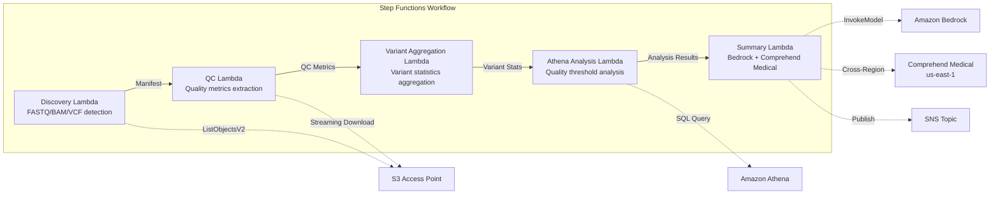

# UC7: Genomics / Bioinformatics — Quality Check and Variant Calling Aggregation

🌐 **Language / 言語**: [日本語](README.md) | English | [한국어](README.ko.md) | [简体中文](README.zh-CN.md) | [繁體中文](README.zh-TW.md) | [Français](README.fr.md) | [Deutsch](README.de.md) | [Español](README.es.md)

📚 **Documentation**: [Architecture Diagram](docs/architecture.en.md) | [Demo Guide](docs/demo-guide.en.md)

## Overview

A serverless workflow that leverages FSx for ONTAP S3 Access Points to automate quality checks of FASTQ/BAM/VCF genomic data, variant-calling statistics aggregation, and research summary generation.

### Cases where this pattern is suitable

- Next-generation sequencer output data (FASTQ/BAM/VCF) is accumulating on FSx for ONTAP
- You want to periodically monitor quality metrics of sequence data (read count, quality score, GC content)
- You want to automate the statistical aggregation of variant-calling results (SNP/InDel ratio, Ti/Tv ratio)
- Automatic extraction of biomedical entities (gene names, diseases, drugs) using Comprehend Medical is required
- You want to automatically generate research summary reports

### Cases where this pattern is not suitable

- Real-time variant-calling pipeline execution (BWA/GATK, etc.) is required
- Large-scale genome alignment processing (EC2/HPC clusters are appropriate)
- A fully validated pipeline under GxP regulation is required
- An environment where network reachability to the ONTAP REST API cannot be ensured

### Main Features

- Automatic detection of FASTQ/BAM/VCF files via S3 AP
- FASTQ quality metrics extraction through streaming download
- VCF variant statistics aggregation (total_variants, snp_count, indel_count, ti_tv_ratio)
- Identification of samples below quality thresholds using Athena SQL
- Biomedical entity extraction using Comprehend Medical (cross-region)
- Research summary generation with Amazon Bedrock

## Success Metrics

### Outcome
Automating FASTQ/VCF quality checks and variant-calling aggregation accelerates research data analysis.

### Metrics
| Metric | Target (example) |
|-----------|------------|
| Processed samples / run | > 50 samples |
| Quality-check pass rate | > 95% |
| Variant detection accuracy | Match rate against known variant DB > 90% |
| Processing time / sample | < 2 minutes |
| Cost / run | < $10 |
| Human Review required rate | 100% (clinically significant variants) |

> **Why 100% Human Review**: Because classifying clinically significant variants affects medical decisions, full review by researchers and clinicians is mandatory.

### Measurement Method
Step Functions execution history, Comprehend Medical entity count, Athena aggregation results, CloudWatch Metrics.

## Architecture



### Workflow Steps

1. **Discovery**: Detect .fastq, .fastq.gz, .bam, .vcf, .vcf.gz files from S3 AP
2. **QC**: Obtain FASTQ headers via streaming download and extract quality metrics
3. **Variant Aggregation**: Aggregate variant statistics from VCF files
4. **Athena Analysis**: Identify samples below the quality threshold with SQL
5. **Summary**: Generate research summaries with Bedrock, extract entities with Comprehend Medical

## Prerequisites

- AWS account and appropriate IAM permissions
- FSx for ONTAP file system (ONTAP 9.17.1P4D3 or later)
- Volume with S3 Access Point enabled (to store genomic data)
- VPC, private subnets
- Amazon Bedrock model access enabled (Claude / Nova)
- **Cross-region**: Because Comprehend Medical is not supported in ap-northeast-1, a cross-region call to us-east-1 is required

## Deployment Steps

### 1. Verifying Cross-Region Parameters

Because Comprehend Medical is not supported in the Tokyo region, configure cross-region calls with the `CrossRegionServices` parameter.

### 2. SAM Deployment

```bash
# Prerequisite: AWS SAM CLI required. 'sam build' packages the code and shared layer automatically.
sam build

sam deploy \
  --stack-name fsxn-genomics-pipeline \
  --parameter-overrides \
    S3AccessPointAlias=<your-volume-ext-s3alias> \
    S3AccessPointName=<your-s3ap-name> \
    VpcId=<your-vpc-id> \
    PrivateSubnetIds=<subnet-1>,<subnet-2> \
    ScheduleExpression="rate(1 hour)" \
    NotificationEmail=<your-email@example.com> \
    CrossRegion=us-east-1 \
    EnableVpcEndpoints=false \
    EnableCloudWatchAlarms=false \
  --capabilities CAPABILITY_NAMED_IAM \
  --resolve-s3 \
  --region ap-northeast-1
```

> **Note**: `template.yaml` is used with the SAM CLI (`sam build` + `sam deploy`).
> To deploy directly with the `aws cloudformation deploy` command, use `template-deploy.yaml` (which requires pre-packaging the Lambda zip files and uploading them to S3).

### 3. Verifying Cross-Region Configuration

After deployment, verify that the Lambda environment variable `CROSS_REGION_TARGET` is set to `us-east-1`.

## List of Configuration Parameters

| Parameter | Description | Default | Required |
|-----------|------|----------|------|
| `S3AccessPointAlias` | FSx for ONTAP S3 AP Alias (for input) | — | ✅ |
| `S3AccessPointName` | S3 AP name (for ARN-based IAM permission grants; when omitted, only alias-based is used) | `""` | ⚠️ Recommended |
| `ScheduleExpression` | EventBridge Scheduler schedule expression | `rate(1 hour)` | |
| `VpcId` | VPC ID | — | ✅ |
| `PrivateSubnetIds` | List of private subnet IDs | — | ✅ |
| `NotificationEmail` | SNS notification email address | — | ✅ |
| `CrossRegionTarget` | Target region for Comprehend Medical | `us-east-1` | |
| `MapConcurrency` | Concurrency of the Map state | `10` | |
| `LambdaMemorySize` | Lambda memory size (MB) | `1024` | |
| `LambdaTimeout` | Lambda timeout (seconds) | `300` | |
| `EnableVpcEndpoints` | Enable Interface VPC Endpoints | `false` | |
| `EnableCloudWatchAlarms` | Enable CloudWatch Alarms | `false` | |

## Cleanup

```bash
# Empty the S3 bucket
aws s3 rm s3://fsxn-genomics-pipeline-output-${AWS_ACCOUNT_ID} --recursive

# Delete the CloudFormation stack
aws cloudformation delete-stack \
  --stack-name fsxn-genomics-pipeline \
  --region ap-northeast-1

aws cloudformation wait stack-delete-complete \
  --stack-name fsxn-genomics-pipeline \
  --region ap-northeast-1
```

## Supported Regions

UC7 uses the following services:

| Service | Region constraint |
|---------|-------------|
| Amazon Athena | Available in almost all regions |
| Amazon Bedrock | Check supported regions ([Bedrock supported regions](https://docs.aws.amazon.com/general/latest/gr/bedrock.html)) |
| Amazon Comprehend Medical | Supported only in limited regions. Specify a supported region (e.g., us-east-1) with the `COMPREHEND_MEDICAL_REGION` parameter |
| AWS X-Ray | Available in almost all regions |
| CloudWatch EMF | Available in almost all regions |

> The Comprehend Medical API is called via the Cross-Region Client. Verify your data residency requirements. For details, see the [Region Compatibility Matrix](../docs/region-compatibility.md).

## References

- [FSx for ONTAP S3 Access Points Overview](https://docs.aws.amazon.com/fsx/latest/ONTAPGuide/accessing-data-via-s3-access-points.html)
- [Amazon Comprehend Medical](https://docs.aws.amazon.com/comprehend-medical/latest/dev/what-is.html)
- [FASTQ Format Specification](https://en.wikipedia.org/wiki/FASTQ_format)
- [VCF Format Specification](https://samtools.github.io/hts-specs/VCFv4.3.pdf)

---

## AWS Documentation Links

| Service | Documentation |
|---------|------------|
| FSx for ONTAP | [User Guide](https://docs.aws.amazon.com/fsx/latest/ONTAPGuide/what-is-fsx-ontap.html) |
| S3 Access Points | [S3 AP for FSx for ONTAP](https://docs.aws.amazon.com/fsx/latest/ONTAPGuide/s3-access-points.html) |
| Step Functions | [Developer Guide](https://docs.aws.amazon.com/step-functions/latest/dg/welcome.html) |
| Amazon Athena | [User Guide](https://docs.aws.amazon.com/athena/latest/ug/what-is.html) |
| Amazon Bedrock | [User Guide](https://docs.aws.amazon.com/bedrock/latest/userguide/what-is-bedrock.html) |
| AWS HealthOmics | [User Guide](https://docs.aws.amazon.com/omics/latest/dev/what-is-service.html) |

### Well-Architected Framework Alignment

| Pillar | Alignment |
|----|------|
| Operational Excellence | X-Ray tracing, EMF metrics, QC metrics monitoring |
| Security | Least-privilege IAM, KMS encryption, genomic data access control |
| Reliability | Step Functions Retry/Catch, variant aggregation retries |
| Performance Efficiency | FASTQ streaming processing, Athena partitions |
| Cost Optimization | Serverless (billed only when used), Lambda memory optimization |
| Sustainability | On-demand execution, incremental processing |

---

## Cost Estimate (Monthly Approximate)

> **Note**: The following is an approximation for the ap-northeast-1 region; actual costs vary with usage. Check the latest pricing with the [AWS Pricing Calculator](https://calculator.aws/).

### Serverless Components (pay-as-you-go)

| Service | Unit price | Assumed usage | Monthly estimate |
|---------|------|-----------|---------|
| Lambda | $0.0000166667/GB-sec | 5 functions × 50 samples/day | ~$1-5 |
| S3 API (GetObject/ListObjects) | $0.0047/10K requests | ~10K requests/day | ~$1.5 |
| Step Functions | $0.025/1K state transitions | ~1K transitions/day | ~$0.75 |
| Bedrock (Nova Lite) | $0.00006/1K input tokens | ~30K tokens/run | ~$3-10 |
| Athena | $5/TB scanned | ~50 MB/query | ~$0.5-2 |
| SNS | $0.50/100K notifications | ~100 notifications/day | ~$0.15 |
| CloudWatch Logs | $0.76/GB ingested | ~1 GB/month | ~$0.76 |

### Fixed Costs (FSx for ONTAP — assumes an existing environment)

| Component | Monthly |
|--------------|------|
| FSx for ONTAP (128 MBps, 1 TB) | ~$230 (shared with existing environment) |
| S3 Access Point | No additional charge (S3 API charges only) |

### Total Estimate

| Configuration | Monthly estimate |
|------|---------|
| Minimal (once daily) | ~$5-15 |
| Standard (hourly) | ~$15-50 |
| Large-scale (high frequency + alarms) | ~$50-150 |

> **Governance Caveat**: Cost estimates are approximations, not guaranteed values. Actual charges vary with usage patterns, data volume, and region.

---

## Local Testing

### Prerequisites Check

```bash
# Check prerequisites
aws --version          # AWS CLI v2
sam --version          # SAM CLI
python3 --version      # Python 3.9+
docker --version       # Docker (for sam local)
aws sts get-caller-identity  # AWS credentials
```

### sam local invoke

```bash
# Build
# Prerequisite: AWS SAM CLI required. 'sam build' packages the code and shared layer automatically.
sam build

# Run the Discovery Lambda locally
sam local invoke DiscoveryFunction --event events/discovery-event.json

# With environment variable overrides
sam local invoke DiscoveryFunction \
  --event events/discovery-event.json \
  --env-vars env.json
```

### Unit Tests

```bash
python3 -m pytest tests/ -v
```

For details, see the [Local Testing Quick Start](../docs/local-testing-quick-start.md).

---

## Output Sample

Example output of the genomics variant analysis pipeline:

```json
{
  "discovery": {
    "status": "completed",
    "object_count": 8,
    "prefix": "genomics/samples/"
  },
  "qc_results": [
    {
      "key": "genomics/samples/sample-001.fastq.gz",
      "total_reads": 25000000,
      "q30_pct": 92.5,
      "gc_content_pct": 48.2,
      "pass_qc": true
    }
  ],
  "variant_aggregation": {
    "total_variants": 4523,
    "snps": 3891,
    "indels": 632,
    "novel_variants": 127
  },
  "athena_analysis": {
    "clinvar_matches": 15,
    "high_impact_variants": 3,
    "query_execution_id": "qe-xyz789..."
  }
}
```

> **Note**: The above is sample output; actual values vary with the environment and input data. Benchmark figures are a sizing reference, not a service limit.

---

## Governance Note

> This pattern provides technical architecture guidance. It is not legal, compliance, or regulatory advice. Organizations should consult qualified professionals.

---

## S3AP Compatibility

For compatibility constraints, troubleshooting, and trigger patterns of S3 Access Points for FSx for ONTAP, see the [S3AP Compatibility Notes](../docs/s3ap-compatibility-notes.md).
