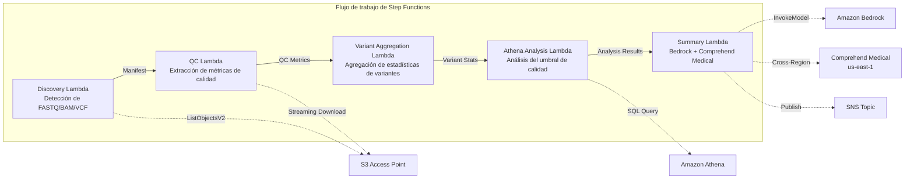

# UC7: Genómica / Bioinformática — Control de calidad y agregación de llamadas de variantes

🌐 **Language / 言語**: [日本語](README.md) | [English](README.en.md) | [한국어](README.ko.md) | [简体中文](README.zh-CN.md) | [繁體中文](README.zh-TW.md) | [Français](README.fr.md) | [Deutsch](README.de.md) | Español

📚 **Documentación**: [Diagrama de arquitectura](docs/architecture.es.md) | [Guía de demostración](docs/demo-guide.es.md)

## Resumen

Un flujo de trabajo sin servidor que aprovecha los S3 Access Points de FSx for ONTAP para automatizar el control de calidad de datos genómicos FASTQ/BAM/VCF, la agregación de estadísticas de llamada de variantes y la generación de resúmenes de investigación.

### Casos en los que este patrón es apropiado

- Los datos de salida del secuenciador de próxima generación (FASTQ/BAM/VCF) se acumulan en FSx for ONTAP
- Desea monitorear periódicamente las métricas de calidad de los datos de secuenciación (número de lecturas, puntuación de calidad, contenido de GC)
- Desea automatizar la agregación estadística de los resultados de llamada de variantes (proporción SNP/InDel, relación Ti/Tv)
- Se requiere la extracción automática de entidades biomédicas (nombres de genes, enfermedades, medicamentos) mediante Comprehend Medical
- Desea generar automáticamente informes de resumen de investigación

### Casos en los que este patrón no es adecuado

- Se requiere la ejecución de un pipeline de llamada de variantes en tiempo real (BWA/GATK, etc.)
- Procesamiento de alineación genómica a gran escala (se recomienda un clúster EC2/HPC)
- Se necesita un pipeline completamente validado bajo la regulación GxP
- Un entorno en el que no se puede garantizar la conectividad de red a la API REST de ONTAP

### Principales características

- Detección automática de archivos FASTQ/BAM/VCF a través de S3 AP
- Extracción de métricas de calidad de FASTQ mediante descargas en streaming
- Agregación de estadísticas de variantes VCF (total_variants, snp_count, indel_count, ti_tv_ratio)
- Identificación de muestras por debajo del umbral de calidad mediante Athena SQL
- Extracción de entidades biomédicas mediante Comprehend Medical (cross-region)
- Generación de resúmenes de investigación mediante Amazon Bedrock

## Success Metrics

### Outcome
La automatización del control de calidad FASTQ/VCF y de la agregación de llamadas de variantes acelera el análisis de datos de investigación.

### Metrics
| Métrica | Valor objetivo (ejemplo) |
|-----------|------------|
| Muestras procesadas / ejecución | > 50 samples |
| Tasa de aprobación del control de calidad | > 95% |
| Precisión de detección de variantes | Tasa de coincidencia con una BD de variantes conocidas > 90% |
| Tiempo de procesamiento / muestra | < 2 minutos |
| Costo / ejecución | < $10 |
| Tasa de Human Review obligatoria | 100% (variantes con significación clínica) |

> **Motivo del 100 % de Human Review**: dado que la clasificación de variantes con significación clínica afecta a las decisiones médicas, es obligatoria una revisión completa por parte de investigadores y clínicos.

### Measurement Method
Historial de ejecución de Step Functions, Comprehend Medical entity count, resultados de agregación de Athena, CloudWatch Metrics.

## Arquitectura



### Pasos del flujo de trabajo

1. **Discovery**: Detectar archivos .fastq, .fastq.gz, .bam, .vcf, .vcf.gz desde S3 AP
2. **QC**: Obtener encabezados FASTQ mediante descarga en streaming y extraer métricas de calidad
3. **Variant Aggregation**: Agregar estadísticas de variantes de archivos VCF
4. **Athena Analysis**: Identificar muestras por debajo del umbral de calidad con SQL
5. **Summary**: Generar resumen de investigación con Bedrock, extraer entidades con Comprehend Medical

## Requisitos previos

- Cuenta de AWS y permisos de IAM adecuados
- Sistema de archivos FSx for ONTAP (ONTAP 9.17.1P4D3 o superior)
- Volumen con S3 Access Point habilitado (para almacenar datos genómicos)
- VPC, subredes privadas
- Acceso a modelos de Amazon Bedrock habilitado (Claude / Nova)
- **Cross-region**: Dado que Comprehend Medical no es compatible con ap-northeast-1, se necesita una llamada cross-region a us-east-1

## Pasos de implementación

### 1. Verificación de parámetros entre regiones

Dado que Comprehend Medical no es compatible con la región de Tokio, configure las llamadas entre regiones con el parámetro `CrossRegionServices`.

### 2. Despliegue de SAM

```bash
# Requisito: se necesita AWS SAM CLI. «sam build» empaqueta automáticamente el código y la capa compartida.
sam build

sam deploy \
  --stack-name fsxn-genomics-pipeline \
  --parameter-overrides \
    S3AccessPointAlias=<your-volume-ext-s3alias> \
    S3AccessPointName=<your-s3ap-name> \
    VpcId=<your-vpc-id> \
    PrivateSubnetIds=<subnet-1>,<subnet-2> \
    ScheduleExpression="rate(1 hour)" \
    NotificationEmail=<your-email@example.com> \
    CrossRegion=us-east-1 \
    EnableVpcEndpoints=false \
    EnableCloudWatchAlarms=false \
  --capabilities CAPABILITY_NAMED_IAM \
  --resolve-s3 \
  --region ap-northeast-1
```

> **Nota**: `template.yaml` está diseñado para usarse con AWS SAM CLI (`sam build` + `sam deploy`).
> Para desplegar directamente con `aws cloudformation deploy`, use `template-deploy.yaml` en su lugar (requiere empaquetar previamente los archivos zip de Lambda y subirlos a un bucket de S3).

### 3. Verificación de la configuración entre regiones

Después del despliegue, asegúrese de que la variable de entorno de Lambda `CROSS_REGION_TARGET` esté establecida en `us-east-1`.

## Lista de parámetros de configuración

| Parámetro | Descripción | Predeterminado | Obligatorio |
|-----------|------|----------|------|
| `S3AccessPointAlias` | FSx for ONTAP S3 AP Alias (para la entrada) | — | ✅ |
| `S3AccessPointName` | Nombre del S3 AP (para la concesión de permisos IAM basados en ARN; si se omite, solo basado en el alias) | `""` | ⚠️ Recomendado |
| `ScheduleExpression` | Expresión de programación de EventBridge Scheduler | `rate(1 hour)` | |
| `VpcId` | VPC ID | — | ✅ |
| `PrivateSubnetIds` | Lista de ID de subredes privadas | — | ✅ |
| `NotificationEmail` | Dirección de correo electrónico de notificación de SNS | — | ✅ |
| `CrossRegionTarget` | Región de destino de Comprehend Medical | `us-east-1` | |
| `MapConcurrency` | Concurrencia del estado Map | `10` | |
| `LambdaMemorySize` | Tamaño de memoria de Lambda (MB) | `1024` | |
| `LambdaTimeout` | Tiempo de espera de Lambda (segundos) | `300` | |
| `EnableVpcEndpoints` | Habilitar Interface VPC Endpoints | `false` | |
| `EnableCloudWatchAlarms` | Habilitar CloudWatch Alarms | `false` | |

## Limpieza

```bash
# Vaciar el bucket de S3
aws s3 rm s3://fsxn-genomics-pipeline-output-${AWS_ACCOUNT_ID} --recursive

# Eliminar la pila de CloudFormation
aws cloudformation delete-stack \
  --stack-name fsxn-genomics-pipeline \
  --region ap-northeast-1

aws cloudformation wait stack-delete-complete \
  --stack-name fsxn-genomics-pipeline \
  --region ap-northeast-1
```

## Supported Regions

UC7 utiliza los siguientes servicios:

| Servicio | Restricción de región |
|---------|-------------|
| Amazon Athena | Disponible en casi todas las regiones |
| Amazon Bedrock | Verifique las regiones compatibles ([Regiones compatibles con Bedrock](https://docs.aws.amazon.com/general/latest/gr/bedrock.html)) |
| Amazon Comprehend Medical | Compatible solo en regiones limitadas. Especifique una región compatible (p. ej., us-east-1) con el parámetro `COMPREHEND_MEDICAL_REGION` |
| AWS X-Ray | Disponible en casi todas las regiones |
| CloudWatch EMF | Disponible en casi todas las regiones |

> La API de Comprehend Medical se invoca a través del Cross-Region Client. Verifique sus requisitos de residencia de datos. Para más detalles, consulte la [Matriz de compatibilidad de regiones](../docs/region-compatibility.md).

## Enlaces de referencia

- [Descripción general de FSx for ONTAP S3 Access Points](https://docs.aws.amazon.com/fsx/latest/ONTAPGuide/accessing-data-via-s3-access-points.html)
- [Amazon Comprehend Medical](https://docs.aws.amazon.com/comprehend-medical/latest/dev/what-is.html)
- [Especificación del formato FASTQ](https://en.wikipedia.org/wiki/FASTQ_format)
- [Especificación del formato VCF](https://samtools.github.io/hts-specs/VCFv4.3.pdf)

---

## Enlaces a la documentación de AWS

| Servicio | Documentación |
|---------|------------|
| FSx for ONTAP | [Guía del usuario](https://docs.aws.amazon.com/fsx/latest/ONTAPGuide/what-is-fsx-ontap.html) |
| S3 Access Points | [S3 AP for FSx for ONTAP](https://docs.aws.amazon.com/fsx/latest/ONTAPGuide/s3-access-points.html) |
| Step Functions | [Guía del desarrollador](https://docs.aws.amazon.com/step-functions/latest/dg/welcome.html) |
| Amazon Athena | [Guía del usuario](https://docs.aws.amazon.com/athena/latest/ug/what-is.html) |
| Amazon Bedrock | [Guía del usuario](https://docs.aws.amazon.com/bedrock/latest/userguide/what-is-bedrock.html) |
| AWS HealthOmics | [Guía del usuario](https://docs.aws.amazon.com/omics/latest/dev/what-is-service.html) |

### Alineación con el Well-Architected Framework

| Pilar | Alineación |
|----|------|
| Excelencia operativa | Rastreo X-Ray, métricas EMF, monitoreo de métricas de QC |
| Seguridad | IAM de privilegio mínimo, cifrado KMS, control de acceso a datos genómicos |
| Fiabilidad | Step Functions Retry/Catch, reintentos de agregación de variantes |
| Eficiencia del rendimiento | Procesamiento en streaming de FASTQ, particiones de Athena |
| Optimización de costos | Sin servidor (facturación solo por uso), optimización de memoria de Lambda |
| Sostenibilidad | Ejecución bajo demanda, procesamiento incremental |

---

## Estimación de costos (aproximación mensual)

> **Nota**: Lo siguiente es una aproximación para la región ap-northeast-1; los costos reales varían según el uso. Consulte los precios más recientes con la [AWS Pricing Calculator](https://calculator.aws/).

### Componentes sin servidor (pago por uso)

| Servicio | Precio unitario | Uso estimado | Estimación mensual |
|---------|------|-----------|---------|
| Lambda | $0.0000166667/GB-sec | 5 funciones × 50 samples/día | ~$1-5 |
| S3 API (GetObject/ListObjects) | $0.0047/10K requests | ~10K requests/día | ~$1.5 |
| Step Functions | $0.025/1K state transitions | ~1K transitions/día | ~$0.75 |
| Bedrock (Nova Lite) | $0.00006/1K input tokens | ~30K tokens/ejecución | ~$3-10 |
| Athena | $5/TB scanned | ~50 MB/consulta | ~$0.5-2 |
| SNS | $0.50/100K notifications | ~100 notifications/día | ~$0.15 |
| CloudWatch Logs | $0.76/GB ingested | ~1 GB/mes | ~$0.76 |

### Costos fijos (FSx for ONTAP — supone un entorno existente)

| Componente | Mensual |
|--------------|------|
| FSx for ONTAP (128 MBps, 1 TB) | ~$230 (compartido con el entorno existente) |
| S3 Access Point | Sin cargo adicional (solo cargos de S3 API) |

### Estimación total

| Configuración | Estimación mensual |
|------|---------|
| Mínima (una vez al día) | ~$5-15 |
| Estándar (cada hora) | ~$15-50 |
| Gran escala (alta frecuencia + alarmas) | ~$50-150 |

> **Governance Caveat**: Las estimaciones de costos son aproximaciones, no valores garantizados. Los cargos reales varían según los patrones de uso, el volumen de datos y la región.

---

## Pruebas locales

### Verificación de requisitos previos

```bash
# Verificar los requisitos previos
aws --version          # AWS CLI v2
sam --version          # SAM CLI
python3 --version      # Python 3.9+
docker --version       # Docker (para sam local)
aws sts get-caller-identity  # Credenciales de AWS
```

### sam local invoke

```bash
# Compilar
# Requisito: se necesita AWS SAM CLI. «sam build» empaqueta automáticamente el código y la capa compartida.
sam build

# Ejecutar la Discovery Lambda localmente
sam local invoke DiscoveryFunction --event events/discovery-event.json

# Con anulación de variables de entorno
sam local invoke DiscoveryFunction \
  --event events/discovery-event.json \
  --env-vars env.json
```

### Pruebas unitarias

```bash
python3 -m pytest tests/ -v
```

Para más detalles, consulte el [Inicio rápido de pruebas locales](../docs/local-testing-quick-start.md).

---

## Ejemplo de salida (Output Sample)

Ejemplo de salida del pipeline de análisis de variantes genómicas:

```json
{
  "discovery": {
    "status": "completed",
    "object_count": 8,
    "prefix": "genomics/samples/"
  },
  "qc_results": [
    {
      "key": "genomics/samples/sample-001.fastq.gz",
      "total_reads": 25000000,
      "q30_pct": 92.5,
      "gc_content_pct": 48.2,
      "pass_qc": true
    }
  ],
  "variant_aggregation": {
    "total_variants": 4523,
    "snps": 3891,
    "indels": 632,
    "novel_variants": 127
  },
  "athena_analysis": {
    "clinvar_matches": 15,
    "high_impact_variants": 3,
    "query_execution_id": "qe-xyz789..."
  }
}
```

> **Nota**: Lo anterior es una salida de muestra; los valores reales varían según el entorno y los datos de entrada. Las cifras de referencia son un sizing reference, no un service limit.

---

## Governance Note

> Este patrón proporciona orientación de arquitectura técnica. No constituye asesoramiento legal, de cumplimiento ni regulatorio. Las organizaciones deben consultar a profesionales cualificados.

---

## S3AP Compatibility

Para conocer las restricciones de compatibilidad, la solución de problemas y los patrones de activación de S3 Access Points for FSx for ONTAP, consulte las [S3AP Compatibility Notes](../docs/s3ap-compatibility-notes.md).
