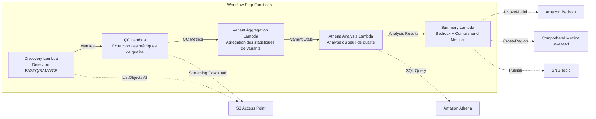

# UC7 : Génomique / Bioinformatique — Contrôle qualité, appel de variants, agrégation

🌐 **Language / 言語**: [日本語](README.md) | [English](README.en.md) | [한국어](README.ko.md) | [简体中文](README.zh-CN.md) | [繁體中文](README.zh-TW.md) | Français | [Deutsch](README.de.md) | [Español](README.es.md)

📚 **Documentation** : [Schéma d'architecture](docs/architecture.fr.md) | [Guide de démonstration](docs/demo-guide.fr.md)

## Aperçu

Un workflow sans serveur qui exploite les S3 Access Points de FSx for ONTAP pour automatiser le contrôle qualité des données génomiques FASTQ/BAM/VCF, l'agrégation des statistiques d'appel de variants et la génération de résumés de recherche.

### Cas où ce schéma est approprié

- Les données de sortie des séquenceurs de nouvelle génération (FASTQ/BAM/VCF) s'accumulent sur FSx for ONTAP
- Vous souhaitez surveiller périodiquement les métriques de qualité des données de séquençage (nombre de lectures, scores de qualité, teneur en GC)
- Vous souhaitez automatiser l'agrégation statistique des résultats des appels de variants (ratio SNP/InDel, ratio Ti/Tv)
- Une extraction automatique des entités biomédicales (noms de gènes, maladies, médicaments) via Comprehend Medical est nécessaire
- Vous souhaitez générer automatiquement des rapports de synthèse de recherche

### Cas où ce modèle ne convient pas

- L'exécution d'un pipeline d'appel de variants en temps réel (BWA/GATK, etc.) est requise
- Traitement d'alignement génomique à grande échelle (un cluster EC2/HPC est approprié)
- Un pipeline entièrement validé dans un cadre réglementé GxP est requis
- Un environnement où la connectivité réseau à l'API REST ONTAP ne peut pas être garantie

### Principales fonctionnalités

- Détection automatique des fichiers FASTQ/BAM/VCF via S3 AP
- Extraction des métriques de qualité FASTQ par téléchargement en streaming
- Agrégation de statistiques de variants VCF (total_variants, snp_count, indel_count, ti_tv_ratio)
- Identification des échantillons sous le seuil de qualité avec Athena SQL
- Extraction d'entités biomédicales avec Comprehend Medical (inter-régions)
- Génération de résumés de recherche avec Amazon Bedrock

## Success Metrics

### Outcome
L'automatisation du contrôle qualité FASTQ/VCF et de l'agrégation des appels de variants accélère l'analyse des données de recherche.

### Metrics
| Métrique | Valeur cible (exemple) |
|-----------|------------|
| Échantillons traités / exécution | > 50 samples |
| Taux de réussite du contrôle qualité | > 95% |
| Précision de détection des variants | Taux de correspondance avec une base de variants connue > 90% |
| Temps de traitement / échantillon | < 2 minutes |
| Coût / exécution | < $10 |
| Taux de Human Review obligatoire | 100% (variants ayant une signification clinique) |

> **Raison du Human Review à 100 %** : la classification des variants ayant une signification clinique influençant les décisions médicales, une vérification exhaustive par les chercheurs et les cliniciens est obligatoire.

### Measurement Method
Historique d'exécution Step Functions, Comprehend Medical entity count, résultats d'agrégation Athena, CloudWatch Metrics.

## Architecture



### Étapes du flux de travail

1. **Découverte** : Détection des fichiers .fastq, .fastq.gz, .bam, .vcf, .vcf.gz depuis S3 AP
2. **CQ** : Récupération des en-têtes FASTQ en streaming et extraction des métriques de qualité
3. **Agrégation de variants** : Agrégation des statistiques de variants des fichiers VCF
4. **Analyse Athena** : Identification des échantillons sous le seuil de qualité en SQL
5. **Résumé** : Génération du résumé de recherche avec Bedrock, extraction des entités avec Comprehend Medical

## Conditions préalables

- Compte AWS et permissions IAM appropriées
- Système de fichiers FSx for ONTAP (ONTAP 9.17.1P4D3 ou supérieur)
- Volume avec S3 Access Point activé (pour stocker les données génomiques)
- VPC, sous-réseaux privés
- Accès au modèle Amazon Bedrock activé (Claude / Nova)
- **Inter-régions** : Comprehend Medical n'étant pas pris en charge dans ap-northeast-1, un appel inter-régional vers us-east-1 est nécessaire

## Étapes de déploiement

### 1. Vérification des paramètres inter-régions

Comprehend Medical n'étant pas pris en charge dans la région Tokyo, configurez les appels inter-régions avec le paramètre `CrossRegionServices`.

### 2. Déploiement SAM

```bash
# Prérequis : AWS SAM CLI requis. « sam build » empaquette automatiquement le code et la couche partagée.
sam build

sam deploy \
  --stack-name fsxn-genomics-pipeline \
  --parameter-overrides \
    S3AccessPointAlias=<your-volume-ext-s3alias> \
    S3AccessPointName=<your-s3ap-name> \
    VpcId=<your-vpc-id> \
    PrivateSubnetIds=<subnet-1>,<subnet-2> \
    ScheduleExpression="rate(1 hour)" \
    NotificationEmail=<your-email@example.com> \
    CrossRegion=us-east-1 \
    EnableVpcEndpoints=false \
    EnableCloudWatchAlarms=false \
  --capabilities CAPABILITY_NAMED_IAM \
  --resolve-s3 \
  --region ap-northeast-1
```

> **Remarque** : `template.yaml` est conçu pour être utilisé avec AWS SAM CLI (`sam build` + `sam deploy`).
> Pour un déploiement direct avec `aws cloudformation deploy`, utilisez plutôt `template-deploy.yaml` (nécessite de packager au préalable les fichiers zip Lambda et de les téléverser dans un bucket S3).

### 3. Vérification de la configuration inter-régions

Après le déploiement, assurez-vous que la variable d'environnement Lambda `CROSS_REGION_TARGET` est définie sur `us-east-1`.

## Liste des paramètres de configuration

| Paramètre | Description | Par défaut | Requis |
|-----------|------|----------|------|
| `S3AccessPointAlias` | FSx for ONTAP S3 AP Alias (pour l'entrée) | — | ✅ |
| `S3AccessPointName` | Nom du S3 AP (pour l'octroi de permissions IAM basées sur l'ARN ; si omis, uniquement basé sur l'alias) | `""` | ⚠️ Recommandé |
| `ScheduleExpression` | Expression de planification EventBridge Scheduler | `rate(1 hour)` | |
| `VpcId` | VPC ID | — | ✅ |
| `PrivateSubnetIds` | Liste des ID de sous-réseaux privés | — | ✅ |
| `NotificationEmail` | Adresse e-mail de notification SNS | — | ✅ |
| `CrossRegionTarget` | Région cible de Comprehend Medical | `us-east-1` | |
| `MapConcurrency` | Concurrence de l'état Map | `10` | |
| `LambdaMemorySize` | Taille de mémoire Lambda (MB) | `1024` | |
| `LambdaTimeout` | Délai d'expiration Lambda (secondes) | `300` | |
| `EnableVpcEndpoints` | Activer les Interface VPC Endpoints | `false` | |
| `EnableCloudWatchAlarms` | Activer les CloudWatch Alarms | `false` | |

## Nettoyage

```bash
# Vider le bucket S3
aws s3 rm s3://fsxn-genomics-pipeline-output-${AWS_ACCOUNT_ID} --recursive

# Supprimer la stack CloudFormation
aws cloudformation delete-stack \
  --stack-name fsxn-genomics-pipeline \
  --region ap-northeast-1

aws cloudformation wait stack-delete-complete \
  --stack-name fsxn-genomics-pipeline \
  --region ap-northeast-1
```

## Supported Regions

UC7 utilise les services suivants :

| Service | Contrainte de région |
|---------|-------------|
| Amazon Athena | Disponible dans presque toutes les régions |
| Amazon Bedrock | Vérifiez les régions prises en charge ([Régions prises en charge par Bedrock](https://docs.aws.amazon.com/general/latest/gr/bedrock.html)) |
| Amazon Comprehend Medical | Pris en charge dans des régions limitées uniquement. Spécifiez une région prise en charge (par ex. us-east-1) avec le paramètre `COMPREHEND_MEDICAL_REGION` |
| AWS X-Ray | Disponible dans presque toutes les régions |
| CloudWatch EMF | Disponible dans presque toutes les régions |

> L'API Comprehend Medical est appelée via le Cross-Region Client. Vérifiez vos exigences de résidence des données. Pour plus de détails, consultez la [Matrice de compatibilité des régions](../docs/region-compatibility.md).

## Liens de référence

- [Présentation des FSx for ONTAP S3 Access Points](https://docs.aws.amazon.com/fsx/latest/ONTAPGuide/accessing-data-via-s3-access-points.html)
- [Amazon Comprehend Medical](https://docs.aws.amazon.com/comprehend-medical/latest/dev/what-is.html)
- [Spécification du format FASTQ](https://en.wikipedia.org/wiki/FASTQ_format)
- [Spécification du format VCF](https://samtools.github.io/hts-specs/VCFv4.3.pdf)

---

## Liens vers la documentation AWS

| Service | Documentation |
|---------|------------|
| FSx for ONTAP | [Guide de l'utilisateur](https://docs.aws.amazon.com/fsx/latest/ONTAPGuide/what-is-fsx-ontap.html) |
| S3 Access Points | [S3 AP for FSx for ONTAP](https://docs.aws.amazon.com/fsx/latest/ONTAPGuide/s3-access-points.html) |
| Step Functions | [Guide du développeur](https://docs.aws.amazon.com/step-functions/latest/dg/welcome.html) |
| Amazon Athena | [Guide de l'utilisateur](https://docs.aws.amazon.com/athena/latest/ug/what-is.html) |
| Amazon Bedrock | [Guide de l'utilisateur](https://docs.aws.amazon.com/bedrock/latest/userguide/what-is-bedrock.html) |
| AWS HealthOmics | [Guide de l'utilisateur](https://docs.aws.amazon.com/omics/latest/dev/what-is-service.html) |

### Alignement sur le Well-Architected Framework

| Pilier | Alignement |
|----|------|
| Excellence opérationnelle | Traçage X-Ray, métriques EMF, surveillance des métriques QC |
| Sécurité | IAM au moindre privilège, chiffrement KMS, contrôle d'accès aux données génomiques |
| Fiabilité | Step Functions Retry/Catch, nouvelles tentatives d'agrégation de variants |
| Efficacité des performances | Traitement FASTQ en streaming, partitions Athena |
| Optimisation des coûts | Sans serveur (facturé uniquement à l'utilisation), optimisation de la mémoire Lambda |
| Durabilité | Exécution à la demande, traitement incrémentiel |

---

## Estimation des coûts (approximation mensuelle)

> **Note** : Ce qui suit est une approximation pour la région ap-northeast-1 ; les coûts réels varient selon l'utilisation. Vérifiez les tarifs les plus récents avec l'[AWS Pricing Calculator](https://calculator.aws/).

### Composants sans serveur (paiement à l'usage)

| Service | Prix unitaire | Utilisation supposée | Estimation mensuelle |
|---------|------|-----------|---------|
| Lambda | $0.0000166667/GB-sec | 5 fonctions × 50 samples/jour | ~$1-5 |
| S3 API (GetObject/ListObjects) | $0.0047/10K requests | ~10K requests/jour | ~$1.5 |
| Step Functions | $0.025/1K state transitions | ~1K transitions/jour | ~$0.75 |
| Bedrock (Nova Lite) | $0.00006/1K input tokens | ~30K tokens/exécution | ~$3-10 |
| Athena | $5/TB scanned | ~50 MB/requête | ~$0.5-2 |
| SNS | $0.50/100K notifications | ~100 notifications/jour | ~$0.15 |
| CloudWatch Logs | $0.76/GB ingested | ~1 GB/mois | ~$0.76 |

### Coûts fixes (FSx for ONTAP — suppose un environnement existant)

| Composant | Mensuel |
|--------------|------|
| FSx for ONTAP (128 MBps, 1 TB) | ~$230 (partagé avec l'environnement existant) |
| S3 Access Point | Aucun frais supplémentaire (uniquement les frais S3 API) |

### Estimation totale

| Configuration | Estimation mensuelle |
|------|---------|
| Minimale (une fois par jour) | ~$5-15 |
| Standard (toutes les heures) | ~$15-50 |
| Grande échelle (haute fréquence + alarmes) | ~$50-150 |

> **Governance Caveat** : Les estimations de coûts sont des approximations, pas des valeurs garanties. Les frais réels varient selon les modèles d'utilisation, le volume de données et la région.

---

## Tests locaux

### Vérification des prérequis

```bash
# Vérifier les prérequis
aws --version          # AWS CLI v2
sam --version          # SAM CLI
python3 --version      # Python 3.9+
docker --version       # Docker (pour sam local)
aws sts get-caller-identity  # Informations d'identification AWS
```

### sam local invoke

```bash
# Build
# Prérequis : AWS SAM CLI requis. « sam build » empaquette automatiquement le code et la couche partagée.
sam build

# Exécuter la Discovery Lambda localement
sam local invoke DiscoveryFunction --event events/discovery-event.json

# Avec remplacement de variables d'environnement
sam local invoke DiscoveryFunction \
  --event events/discovery-event.json \
  --env-vars env.json
```

### Tests unitaires

```bash
python3 -m pytest tests/ -v
```

Pour plus de détails, consultez le [Démarrage rapide des tests locaux](../docs/local-testing-quick-start.md).

---

## Exemple de sortie (Output Sample)

Exemple de sortie du pipeline d'analyse de variants génomiques :

```json
{
  "discovery": {
    "status": "completed",
    "object_count": 8,
    "prefix": "genomics/samples/"
  },
  "qc_results": [
    {
      "key": "genomics/samples/sample-001.fastq.gz",
      "total_reads": 25000000,
      "q30_pct": 92.5,
      "gc_content_pct": 48.2,
      "pass_qc": true
    }
  ],
  "variant_aggregation": {
    "total_variants": 4523,
    "snps": 3891,
    "indels": 632,
    "novel_variants": 127
  },
  "athena_analysis": {
    "clinvar_matches": 15,
    "high_impact_variants": 3,
    "query_execution_id": "qe-xyz789..."
  }
}
```

> **Note** : Ce qui précède est un exemple de sortie ; les valeurs réelles varient selon l'environnement et les données d'entrée. Les chiffres de référence sont un sizing reference, pas un service limit.

---

## Governance Note

> Ce modèle fournit des conseils d'architecture technique. Il ne constitue pas un avis juridique, de conformité ou réglementaire. Les organisations doivent consulter des professionnels qualifiés.

---

## S3AP Compatibility

Pour les contraintes de compatibilité, le dépannage et les modèles de déclenchement des S3 Access Points for FSx for ONTAP, consultez les [S3AP Compatibility Notes](../docs/s3ap-compatibility-notes.md).
