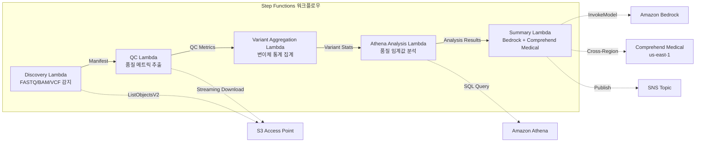

# UC7: 게놈학 / 생물정보학 — 품질 검사 및 변이체 호출 집계

🌐 **Language / 言語**: [日本語](README.md) | [English](README.en.md) | 한국어 | [简体中文](README.zh-CN.md) | [繁體中文](README.zh-TW.md) | [Français](README.fr.md) | [Deutsch](README.de.md) | [Español](README.es.md)

📚 **문서**: [아키텍처 다이어그램](docs/architecture.ko.md) | [데모 가이드](docs/demo-guide.ko.md)

## 개요

FSx for ONTAP의 S3 Access Points를 활용하여 FASTQ/BAM/VCF 게놈 데이터의 품질 검사, 변이체 호출 통계 집계, 연구 요약 생성을 자동화하는 서버리스 워크플로우입니다.

### 이 패턴이 적합한 경우

- 차세대 시퀀서의 출력 데이터(FASTQ/BAM/VCF)가 FSx for ONTAP에 축적되어 있다
- 시퀀싱 데이터의 품질 메트릭(리드 수, 품질 점수, GC 함량)을 정기적으로 모니터링하고 싶다
- 변이체 호출 결과의 통계 집계(SNP/InDel 비율, Ti/Tv 비율)를 자동화하고 싶다
- Comprehend Medical을 통한 생물의학 엔터티(유전자 이름, 질병, 약물)의 자동 추출이 필요하다
- 연구 요약 보고서를 자동 생성하고 싶다

### 이 패턴이 적합하지 않은 경우

- 실시간 변이체 호출 파이프라인(BWA/GATK 등)의 실행이 필요하다
- 대규모 게놈 정렬 처리(EC2/HPC 클러스터가 적합)
- GxP 규제 하에서 완전히 검증된 파이프라인이 필요하다
- ONTAP REST API에 대한 네트워크 도달성을 확보할 수 없는 환경

### 주요 기능

- S3 AP를 통한 FASTQ/BAM/VCF 파일의 자동 감지
- 스트리밍 다운로드를 통한 FASTQ 품질 메트릭 추출
- VCF 변이체 통계 집계(total_variants, snp_count, indel_count, ti_tv_ratio)
- Athena SQL을 사용한 품질 임계값 미만 샘플 식별
- Comprehend Medical(크로스 리전)을 통한 생물의학 엔터티 추출
- Amazon Bedrock을 사용한 연구 요약 생성

## Success Metrics

### Outcome
FASTQ/VCF 품질 검사 및 변이체 호출 집계의 자동화를 통해 연구 데이터 분석의 신속화를 실현합니다.

### Metrics
| 메트릭 | 목표값(예) |
|-----------|------------|
| 처리된 샘플 수 / 실행 | > 50 samples |
| 품질 검사 통과율 | > 95% |
| 변이체 검출 정확도 | 알려진 변이체 DB와의 일치율 > 90% |
| 처리 시간 / 샘플 | < 2분 |
| 비용 / 실행 | < $10 |
| Human Review 필수 비율 | 100%(임상적 의의가 있는 변이체) |

> **100% Human Review의 이유**: 임상적 의의가 있는 변이체 분류는 의료 판단에 영향을 미치므로, 연구자·임상의에 의한 전건 확인을 필수로 합니다.

### Measurement Method
Step Functions 실행 이력, Comprehend Medical entity count, Athena 집계 결과, CloudWatch Metrics.

## 아키텍처



### 워크플로우 단계

1. **Discovery**: S3 AP에서 .fastq, .fastq.gz, .bam, .vcf, .vcf.gz 파일 감지
2. **QC**: 스트리밍 다운로드로 FASTQ 헤더를 가져와 품질 메트릭 추출
3. **Variant Aggregation**: VCF 파일의 변이체 통계 집계
4. **Athena Analysis**: 품질 임계값 미만 샘플을 SQL로 식별
5. **Summary**: Bedrock으로 연구 요약 생성, Comprehend Medical로 엔터티 추출

## 사전 요구 사항

- AWS 계정 및 적절한 IAM 권한
- FSx for ONTAP 파일 시스템(ONTAP 9.17.1P4D3 이상)
- S3 Access Point가 활성화된 볼륨(게놈 데이터 저장)
- VPC, 프라이빗 서브넷
- Amazon Bedrock 모델 액세스 활성화(Claude / Nova)
- **크로스 리전**: Comprehend Medical은 ap-northeast-1을 지원하지 않으므로 us-east-1로의 크로스 리전 호출이 필요

## 배포 절차

### 1. 크로스 리전 파라미터 확인

Comprehend Medical은 도쿄 리전을 지원하지 않으므로, `CrossRegionServices` 파라미터로 크로스 리전 호출을 설정합니다.

### 2. SAM 배포

```bash
# 사전 요구사항: AWS SAM CLI가 필요합니다. 'sam build'가 코드와 공유 레이어를 자동으로 패키징합니다.
sam build

sam deploy \
  --stack-name fsxn-genomics-pipeline \
  --parameter-overrides \
    S3AccessPointAlias=<your-volume-ext-s3alias> \
    S3AccessPointName=<your-s3ap-name> \
    VpcId=<your-vpc-id> \
    PrivateSubnetIds=<subnet-1>,<subnet-2> \
    ScheduleExpression="rate(1 hour)" \
    NotificationEmail=<your-email@example.com> \
    CrossRegion=us-east-1 \
    EnableVpcEndpoints=false \
    EnableCloudWatchAlarms=false \
  --capabilities CAPABILITY_NAMED_IAM \
  --resolve-s3 \
  --region ap-northeast-1
```

> **참고**: `template.yaml`은 SAM CLI(`sam build` + `sam deploy`)로 사용합니다.
> `aws cloudformation deploy` 명령으로 직접 배포하려면 `template-deploy.yaml`을 사용하세요(Lambda zip 파일의 사전 패키징 및 S3 업로드가 필요합니다).

### 3. 크로스 리전 설정 확인

배포 후, Lambda 환경 변수 `CROSS_REGION_TARGET`이 `us-east-1`로 설정되어 있는지 확인하세요.

## 설정 파라미터 목록

| 파라미터 | 설명 | 기본값 | 필수 |
|-----------|------|----------|------|
| `S3AccessPointAlias` | FSx for ONTAP S3 AP Alias(입력용) | — | ✅ |
| `S3AccessPointName` | S3 AP 이름(ARN 기반 IAM 권한 부여용. 생략 시 Alias 기반만) | `""` | ⚠️ 권장 |
| `ScheduleExpression` | EventBridge Scheduler의 스케줄 식 | `rate(1 hour)` | |
| `VpcId` | VPC ID | — | ✅ |
| `PrivateSubnetIds` | 프라이빗 서브넷 ID 목록 | — | ✅ |
| `NotificationEmail` | SNS 알림 대상 이메일 주소 | — | ✅ |
| `CrossRegionTarget` | Comprehend Medical의 대상 리전 | `us-east-1` | |
| `MapConcurrency` | Map 상태의 병렬 실행 수 | `10` | |
| `LambdaMemorySize` | Lambda 메모리 크기(MB) | `1024` | |
| `LambdaTimeout` | Lambda 타임아웃(초) | `300` | |
| `EnableVpcEndpoints` | Interface VPC Endpoints 활성화 | `false` | |
| `EnableCloudWatchAlarms` | CloudWatch Alarms 활성화 | `false` | |

## 정리

```bash
# S3 버킷 비우기
aws s3 rm s3://fsxn-genomics-pipeline-output-${AWS_ACCOUNT_ID} --recursive

# CloudFormation 스택 삭제
aws cloudformation delete-stack \
  --stack-name fsxn-genomics-pipeline \
  --region ap-northeast-1

aws cloudformation wait stack-delete-complete \
  --stack-name fsxn-genomics-pipeline \
  --region ap-northeast-1
```

## Supported Regions

UC7은 다음 서비스를 사용합니다:

| 서비스 | 리전 제약 |
|---------|-------------|
| Amazon Athena | 거의 모든 리전에서 사용 가능 |
| Amazon Bedrock | 지원 리전 확인([Bedrock 지원 리전](https://docs.aws.amazon.com/general/latest/gr/bedrock.html)) |
| Amazon Comprehend Medical | 제한된 리전에서만 지원. `COMPREHEND_MEDICAL_REGION` 파라미터로 지원 리전(us-east-1 등) 지정 |
| AWS X-Ray | 거의 모든 리전에서 사용 가능 |
| CloudWatch EMF | 거의 모든 리전에서 사용 가능 |

> Cross-Region Client를 통해 Comprehend Medical API를 호출합니다. 데이터 거주지 요구 사항을 확인하세요. 자세한 내용은 [리전 호환성 매트릭스](../docs/region-compatibility.md)를 참조하세요.

## 참고 링크

- [FSx for ONTAP S3 Access Points 개요](https://docs.aws.amazon.com/fsx/latest/ONTAPGuide/accessing-data-via-s3-access-points.html)
- [Amazon Comprehend Medical](https://docs.aws.amazon.com/comprehend-medical/latest/dev/what-is.html)
- [FASTQ 형식 사양](https://en.wikipedia.org/wiki/FASTQ_format)
- [VCF 형식 사양](https://samtools.github.io/hts-specs/VCFv4.3.pdf)

---

## AWS 문서 링크

| 서비스 | 문서 |
|---------|------------|
| FSx for ONTAP | [사용자 가이드](https://docs.aws.amazon.com/fsx/latest/ONTAPGuide/what-is-fsx-ontap.html) |
| S3 Access Points | [S3 AP for FSx for ONTAP](https://docs.aws.amazon.com/fsx/latest/ONTAPGuide/s3-access-points.html) |
| Step Functions | [개발자 가이드](https://docs.aws.amazon.com/step-functions/latest/dg/welcome.html) |
| Amazon Athena | [사용자 가이드](https://docs.aws.amazon.com/athena/latest/ug/what-is.html) |
| Amazon Bedrock | [사용자 가이드](https://docs.aws.amazon.com/bedrock/latest/userguide/what-is-bedrock.html) |
| AWS HealthOmics | [사용자 가이드](https://docs.aws.amazon.com/omics/latest/dev/what-is-service.html) |

### Well-Architected Framework 대응

| 기둥 | 대응 |
|----|------|
| 운영 우수성 | X-Ray 트레이싱, EMF 메트릭, QC 메트릭 모니터링 |
| 보안 | 최소 권한 IAM, KMS 암호화, 게놈 데이터 액세스 제어 |
| 신뢰성 | Step Functions Retry/Catch, 변이체 집계 재시도 |
| 성능 효율성 | FASTQ 스트리밍 처리, Athena 파티션 |
| 비용 최적화 | 서버리스(사용 시에만 과금), Lambda 메모리 최적화 |
| 지속 가능성 | 온디맨드 실행, 차분 처리 |

---

## 비용 견적(월간 개산)

> **참고**: 아래는 ap-northeast-1 리전의 개산이며, 실제 비용은 사용량에 따라 다릅니다. 최신 요금은 [AWS Pricing Calculator](https://calculator.aws/)에서 확인하세요.

### 서버리스 컴포넌트(종량 과금)

| 서비스 | 단가 | 예상 사용량 | 월간 개산 |
|---------|------|-----------|---------|
| Lambda | $0.0000166667/GB-sec | 5 함수 × 50 samples/일 | ~$1-5 |
| S3 API (GetObject/ListObjects) | $0.0047/10K requests | ~10K requests/일 | ~$1.5 |
| Step Functions | $0.025/1K state transitions | ~1K transitions/일 | ~$0.75 |
| Bedrock (Nova Lite) | $0.00006/1K input tokens | ~30K tokens/실행 | ~$3-10 |
| Athena | $5/TB scanned | ~50 MB/쿼리 | ~$0.5-2 |
| SNS | $0.50/100K notifications | ~100 notifications/일 | ~$0.15 |
| CloudWatch Logs | $0.76/GB ingested | ~1 GB/월 | ~$0.76 |

### 고정 비용(FSx for ONTAP — 기존 환경 전제)

| 컴포넌트 | 월간 |
|--------------|------|
| FSx for ONTAP (128 MBps, 1 TB) | ~$230 (기존 환경 공유) |
| S3 Access Point | 추가 요금 없음(S3 API 요금만) |

### 합계 개산

| 구성 | 월간 개산 |
|------|---------|
| 최소 구성(일 1회 실행) | ~$5-15 |
| 표준 구성(시간별 실행) | ~$15-50 |
| 대규모 구성(고빈도 + 알람) | ~$50-150 |

> **Governance Caveat**: 비용 견적은 개산이며 보증값이 아닙니다. 실제 청구액은 사용 패턴, 데이터 양, 리전에 따라 다릅니다.

---

## 로컬 테스트

### Prerequisites 확인

```bash
# 사전 조건 확인
aws --version          # AWS CLI v2
sam --version          # SAM CLI
python3 --version      # Python 3.9+
docker --version       # Docker (sam local 용)
aws sts get-caller-identity  # AWS 자격 증명
```

### sam local invoke

```bash
# 빌드
# 사전 요구사항: AWS SAM CLI가 필요합니다. 'sam build'가 코드와 공유 레이어를 자동으로 패키징합니다.
sam build

# Discovery Lambda의 로컬 실행
sam local invoke DiscoveryFunction --event events/discovery-event.json

# 환경 변수 오버라이드 포함
sam local invoke DiscoveryFunction \
  --event events/discovery-event.json \
  --env-vars env.json
```

### 유닛 테스트

```bash
python3 -m pytest tests/ -v
```

자세한 내용은 [로컬 테스트 퀵 스타트](../docs/local-testing-quick-start.md)를 참조하세요.

---

## 출력 샘플 (Output Sample)

게놈학 변이체 분석 파이프라인의 출력 예:

```json
{
  "discovery": {
    "status": "completed",
    "object_count": 8,
    "prefix": "genomics/samples/"
  },
  "qc_results": [
    {
      "key": "genomics/samples/sample-001.fastq.gz",
      "total_reads": 25000000,
      "q30_pct": 92.5,
      "gc_content_pct": 48.2,
      "pass_qc": true
    }
  ],
  "variant_aggregation": {
    "total_variants": 4523,
    "snps": 3891,
    "indels": 632,
    "novel_variants": 127
  },
  "athena_analysis": {
    "clinvar_matches": 15,
    "high_impact_variants": 3,
    "query_execution_id": "qe-xyz789..."
  }
}
```

> **참고**: 위는 샘플 출력이며, 실제 값은 환경·입력 데이터에 따라 다릅니다. 벤치마크 수치는 sizing reference이며 service limit이 아닙니다.

---

## Governance Note

> 본 패턴은 기술 아키텍처 가이던스를 제공합니다. 법적·컴플라이언스·규제상의 조언이 아닙니다. 조직은 적격한 전문가와 상담하세요.

---

## S3AP Compatibility

S3 Access Points for FSx for ONTAP의 호환성 제약, 트러블슈팅, 트리거 패턴에 대해서는 [S3AP Compatibility Notes](../docs/s3ap-compatibility-notes.md)를 참조하세요.
