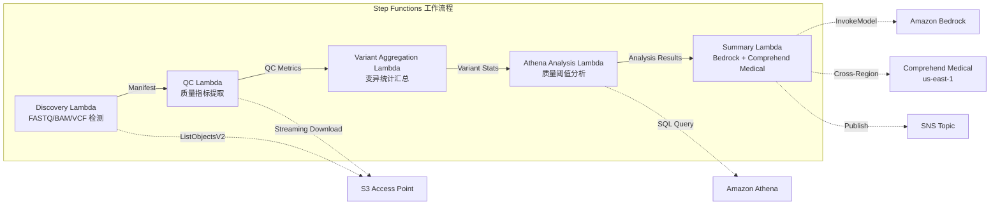

# UC7: 基因组学 / 生物信息学 — 质量检查与变异调用汇总

🌐 **Language / 言語**: [日本語](README.md) | [English](README.en.md) | [한국어](README.ko.md) | 简体中文 | [繁體中文](README.zh-TW.md) | [Français](README.fr.md) | [Deutsch](README.de.md) | [Español](README.es.md)

📚 **文档**: [架构图](docs/architecture.zh-CN.md) | [演示指南](docs/demo-guide.zh-CN.md)

## 概述

利用 FSx for ONTAP 的 S3 Access Points，自动化对 FASTQ/BAM/VCF 基因组数据进行质量检查、变异调用统计汇总和研究摘要生成的无服务器工作流程。

### 适用场景

- 次世代测序仪输出的数据（FASTQ/BAM/VCF）存储在 FSx for ONTAP 上
- 希望定期监控测序数据的质量指标（读数、质量评分、GC 含量）
- 希望自动化变异调用结果的统计汇总（SNP/InDel 比率、Ti/Tv 比）
- 需要通过 Comprehend Medical 自动提取生物医学实体（基因名、疾病、药物）
- 希望自动生成研究总结报告

### 不适用的情况

- 需要运行实时变异调用管道（如 BWA/GATK 等）
- 需要大规模基因组比对处理（适合 EC2/HPC 集群）
- 在 GxP 法规下需要完全验证的管道
- 环境中无法确保对 ONTAP REST API 的网络访问

### 主要功能

- 通过 S3 AP 自动检测 FASTQ/BAM/VCF 文件
- 使用流式下载提取 FASTQ 质量指标
- VCF 变异统计汇总（total_variants, snp_count, indel_count, ti_tv_ratio）
- 使用 Athena SQL 确定质量阈值未达到的样本
- 使用 Comprehend Medical（跨区域）提取生物医学实体
- 使用 Amazon Bedrock 生成研究摘要

## Success Metrics

### Outcome
通过自动化 FASTQ/VCF 质量检查和变异调用汇总，实现研究数据分析的加速。

### Metrics
| 指标 | 目标值（示例） |
|-----------|------------|
| 已处理样本数 / 执行 | > 50 samples |
| 质量检查通过率 | > 95% |
| 变异检测精度 | 与已知变异数据库的匹配率 > 90% |
| 处理时间 / 样本 | < 2 分钟 |
| 成本 / 执行 | < $10 |
| Human Review 必需率 | 100%（具有临床意义的变异） |

> **100% Human Review 的理由**：由于对具有临床意义的变异进行分类会影响医疗判断，因此必须由研究人员和临床医生进行全部审查。

### Measurement Method
Step Functions 执行历史、Comprehend Medical entity count、Athena 汇总结果、CloudWatch Metrics。

## 架构



### 工作流程步骤

1. **发现**：从 S3 AP 检测 .fastq, .fastq.gz, .bam, .vcf, .vcf.gz 文件
2. **质量控制**：通过流式下载获取 FASTQ 头部，提取质量指标
3. **变异聚合**：汇总 VCF 文件的变异统计
4. **Athena 分析**：使用 SQL 确定低于质量阈值的样本
5. **摘要**：在 Bedrock 中生成研究摘要，使用 Comprehend Medical 提取实体

## 前提条件

- AWS 账户和适当的 IAM 权限
- FSx for ONTAP 文件系统（ONTAP 9.17.1P4D3 及以上版本）
- 启用了 S3 Access Point 的卷（存储基因组数据）
- VPC、私有子网
- Amazon Bedrock 模型访问已启用（Claude / Nova）
- **跨区域**：由于 Comprehend Medical 不支持 ap-northeast-1，需要跨区域调用 us-east-1

## 部署步骤

### 1. 确认跨区域参数

由于 Comprehend Medical 不支持东京区域，请使用 `CrossRegionServices` 参数来配置跨区域调用。

### 2. SAM 部署

```bash
# 前提条件：需要 AWS SAM CLI。'sam build' 会自动打包代码和共享层。
sam build

sam deploy \
  --stack-name fsxn-genomics-pipeline \
  --parameter-overrides \
    S3AccessPointAlias=<your-volume-ext-s3alias> \
    S3AccessPointName=<your-s3ap-name> \
    VpcId=<your-vpc-id> \
    PrivateSubnetIds=<subnet-1>,<subnet-2> \
    ScheduleExpression="rate(1 hour)" \
    NotificationEmail=<your-email@example.com> \
    CrossRegion=us-east-1 \
    EnableVpcEndpoints=false \
    EnableCloudWatchAlarms=false \
  --capabilities CAPABILITY_NAMED_IAM \
  --resolve-s3 \
  --region ap-northeast-1
```

> **注意**: `template.yaml` 用于 SAM CLI（`sam build` + `sam deploy`）。
> 如需使用原生 `aws cloudformation deploy` 部署，请改用 `template-deploy.yaml`（需要预先打包 Lambda zip 文件并上传到 S3 存储桶）。

### 3. 跨区域配置的确认

部署之后，请确保 Lambda 环境变量 `CROSS_REGION_TARGET` 设置为 `us-east-1`。

## 配置参数列表

| 参数 | 说明 | 默认值 | 必需 |
|-----------|------|----------|------|
| `S3AccessPointAlias` | FSx for ONTAP S3 AP Alias（输入用） | — | ✅ |
| `S3AccessPointName` | S3 AP 名称（用于基于 ARN 的 IAM 权限授予。省略时仅基于 Alias） | `""` | ⚠️ 推荐 |
| `ScheduleExpression` | EventBridge Scheduler 的调度表达式 | `rate(1 hour)` | |
| `VpcId` | VPC ID | — | ✅ |
| `PrivateSubnetIds` | 私有子网 ID 列表 | — | ✅ |
| `NotificationEmail` | SNS 通知目标电子邮件地址 | — | ✅ |
| `CrossRegionTarget` | Comprehend Medical 的目标区域 | `us-east-1` | |
| `MapConcurrency` | Map 状态的并行执行数 | `10` | |
| `LambdaMemorySize` | Lambda 内存大小 (MB) | `1024` | |
| `LambdaTimeout` | Lambda 超时时间（秒） | `300` | |
| `EnableVpcEndpoints` | 启用 Interface VPC Endpoints | `false` | |
| `EnableCloudWatchAlarms` | 启用 CloudWatch Alarms | `false` | |

## 清理

```bash
# 清空 S3 存储桶
aws s3 rm s3://fsxn-genomics-pipeline-output-${AWS_ACCOUNT_ID} --recursive

# 删除 CloudFormation 堆栈
aws cloudformation delete-stack \
  --stack-name fsxn-genomics-pipeline \
  --region ap-northeast-1

aws cloudformation wait stack-delete-complete \
  --stack-name fsxn-genomics-pipeline \
  --region ap-northeast-1
```

## Supported Regions

UC7 使用以下服务：

| 服务 | 区域约束 |
|---------|-------------|
| Amazon Athena | 几乎所有区域均可用 |
| Amazon Bedrock | 确认支持的区域（[Bedrock 支持的区域](https://docs.aws.amazon.com/general/latest/gr/bedrock.html)） |
| Amazon Comprehend Medical | 仅限特定区域支持。通过 `COMPREHEND_MEDICAL_REGION` 参数指定支持的区域（如 us-east-1） |
| AWS X-Ray | 几乎所有区域均可用 |
| CloudWatch EMF | 几乎所有区域均可用 |

> 通过跨区域客户端调用 Comprehend Medical API。请确认数据驻留要求。详情请参阅 [区域兼容性矩阵](../docs/region-compatibility.md)。

## 参考链接

- [FSx for ONTAP S3 访问点概览](https://docs.aws.amazon.com/fsx/latest/ONTAPGuide/accessing-data-via-s3-access-points.html)
- [Amazon Comprehend Medical](https://docs.aws.amazon.com/comprehend-medical/latest/dev/what-is.html)
- [FASTQ 格式规范](https://en.wikipedia.org/wiki/FASTQ_format)
- [VCF 格式规范](https://samtools.github.io/hts-specs/VCFv4.3.pdf)

---

## AWS 文档链接

| 服务 | 文档 |
|---------|------------|
| FSx for ONTAP | [用户指南](https://docs.aws.amazon.com/fsx/latest/ONTAPGuide/what-is-fsx-ontap.html) |
| S3 Access Points | [S3 AP for FSx for ONTAP](https://docs.aws.amazon.com/fsx/latest/ONTAPGuide/s3-access-points.html) |
| Step Functions | [开发者指南](https://docs.aws.amazon.com/step-functions/latest/dg/welcome.html) |
| Amazon Athena | [用户指南](https://docs.aws.amazon.com/athena/latest/ug/what-is.html) |
| Amazon Bedrock | [用户指南](https://docs.aws.amazon.com/bedrock/latest/userguide/what-is-bedrock.html) |
| AWS HealthOmics | [用户指南](https://docs.aws.amazon.com/omics/latest/dev/what-is-service.html) |

### Well-Architected Framework 对应

| 支柱 | 对应 |
|----|------|
| 卓越运营 | X-Ray 跟踪、EMF 指标、QC 指标监控 |
| 安全性 | 最小权限 IAM、KMS 加密、基因组数据访问控制 |
| 可靠性 | Step Functions Retry/Catch、变异汇总重试 |
| 性能效率 | FASTQ 流式处理、Athena 分区 |
| 成本优化 | 无服务器（仅使用时计费）、Lambda 内存优化 |
| 可持续性 | 按需执行、增量处理 |

---

## 成本估算（每月概算）

> **注**：以下为 ap-northeast-1 区域的概算，实际成本因使用量而异。最新价格请通过 [AWS Pricing Calculator](https://calculator.aws/) 确认。

### 无服务器组件（按量计费）

| 服务 | 单价 | 预计使用量 | 每月概算 |
|---------|------|-----------|---------|
| Lambda | $0.0000166667/GB-sec | 5 个函数 × 50 samples/天 | ~$1-5 |
| S3 API (GetObject/ListObjects) | $0.0047/10K requests | ~10K requests/天 | ~$1.5 |
| Step Functions | $0.025/1K state transitions | ~1K transitions/天 | ~$0.75 |
| Bedrock (Nova Lite) | $0.00006/1K input tokens | ~30K tokens/执行 | ~$3-10 |
| Athena | $5/TB scanned | ~50 MB/查询 | ~$0.5-2 |
| SNS | $0.50/100K notifications | ~100 notifications/天 | ~$0.15 |
| CloudWatch Logs | $0.76/GB ingested | ~1 GB/月 | ~$0.76 |

### 固定成本（FSx for ONTAP — 以现有环境为前提）

| 组件 | 每月 |
|--------------|------|
| FSx for ONTAP (128 MBps, 1 TB) | ~$230（共享现有环境） |
| S3 Access Point | 无额外费用（仅 S3 API 费用） |

### 合计概算

| 配置 | 每月概算 |
|------|---------|
| 最小配置（每日执行 1 次） | ~$5-15 |
| 标准配置（每小时执行） | ~$15-50 |
| 大规模配置（高频 + 告警） | ~$50-150 |

> **Governance Caveat**：成本估算为概算，并非保证值。实际账单金额因使用模式、数据量和区域而异。

---

## 本地测试

### Prerequisites 检查

```bash
# 检查前提条件
aws --version          # AWS CLI v2
sam --version          # SAM CLI
python3 --version      # Python 3.9+
docker --version       # Docker (用于 sam local)
aws sts get-caller-identity  # AWS 凭证
```

### sam local invoke

```bash
# 构建
# 前提条件：需要 AWS SAM CLI。'sam build' 会自动打包代码和共享层。
sam build

# 本地运行 Discovery Lambda
sam local invoke DiscoveryFunction --event events/discovery-event.json

# 带环境变量覆盖
sam local invoke DiscoveryFunction \
  --event events/discovery-event.json \
  --env-vars env.json
```

### 单元测试

```bash
python3 -m pytest tests/ -v
```

详情请参阅 [本地测试快速入门](../docs/local-testing-quick-start.md)。

---

## 输出示例 (Output Sample)

基因组学变异分析管道的输出示例：

```json
{
  "discovery": {
    "status": "completed",
    "object_count": 8,
    "prefix": "genomics/samples/"
  },
  "qc_results": [
    {
      "key": "genomics/samples/sample-001.fastq.gz",
      "total_reads": 25000000,
      "q30_pct": 92.5,
      "gc_content_pct": 48.2,
      "pass_qc": true
    }
  ],
  "variant_aggregation": {
    "total_variants": 4523,
    "snps": 3891,
    "indels": 632,
    "novel_variants": 127
  },
  "athena_analysis": {
    "clinvar_matches": 15,
    "high_impact_variants": 3,
    "query_execution_id": "qe-xyz789..."
  }
}
```

> **注**：以上为示例输出，实际值因环境和输入数据而异。基准数值为 sizing reference，并非 service limit。

---

## Governance Note

> 本模式提供技术架构指导。它不构成法律、合规或监管方面的建议。组织应咨询合格的专业人士。

---

## S3AP Compatibility

有关 S3 Access Points for FSx for ONTAP 的兼容性约束、故障排除和触发器模式，请参阅 [S3AP Compatibility Notes](../docs/s3ap-compatibility-notes.md)。
