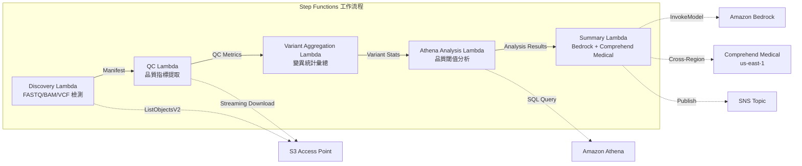

# UC7: 基因組學 / 生物資訊學 — 品質檢查與變異呼叫彙總

🌐 **Language / 言語**: [日本語](README.md) | [English](README.en.md) | [한국어](README.ko.md) | [简体中文](README.zh-CN.md) | 繁體中文 | [Français](README.fr.md) | [Deutsch](README.de.md) | [Español](README.es.md)

📚 **文件**: [架構圖](docs/architecture.zh-TW.md) | [示範指南](docs/demo-guide.zh-TW.md)

## 概述

利用 FSx for ONTAP 的 S3 Access Points，建立無伺服器工作流程，自動化 FASTQ/BAM/VCF 基因組數據的品質檢查、變異呼叫統計彙總及研究摘要生成。

### 適合此模式的情況

- 次世代測序儀的輸出數據（FASTQ/BAM/VCF）已儲存於 FSx for ONTAP 上
- 希望定期監控測序數據的品質指標（讀數、品質分數、GC 含量）
- 希望自動化變異呼叫結果的統計彙總（SNP/InDel 比例、Ti/Tv 比）
- 需要 Comprehend Medical 自動提取生物醫學實體（基因名稱、疾病、藥物）
- 希望自動生成研究摘要報告

### 不適合的情況

- 需要執行實時變異呼叫管道（如 BWA/GATK 等）
- 需要大規模基因組比對處理（EC2/HPC 集群適合）
- 在 GxP 規範下需要完全驗證的管道
- 環境中無法確保對 ONTAP REST API 的網路訪問

### 主要功能

- 透過 S3 AP 自動檢測 FASTQ/BAM/VCF 檔案
- 透過串流下載提取 FASTQ 品質指標
- VCF 變異統計彙總（total_variants, snp_count, indel_count, ti_tv_ratio）
- 使用 Athena SQL 確定不符合品質閾值的樣本
- 使用 Comprehend Medical（跨區域）提取生物醫學實體
- 使用 Amazon Bedrock 生成研究摘要

## Success Metrics

### Outcome
透過自動化 FASTQ/VCF 品質檢查與變異呼叫彙總，實現研究數據分析的加速。

### Metrics
| 指標 | 目標值（範例） |
|-----------|------------|
| 已處理樣本數 / 執行 | > 50 samples |
| 品質檢查通過率 | > 95% |
| 變異檢測精度 | 與已知變異資料庫的匹配率 > 90% |
| 處理時間 / 樣本 | < 2 分鐘 |
| 成本 / 執行 | < $10 |
| Human Review 必需率 | 100%（具臨床意義的變異） |

> **100% Human Review 的理由**：由於對具臨床意義的變異進行分類會影響醫療判斷，因此必須由研究人員與臨床醫師進行全部審查。

### Measurement Method
Step Functions 執行歷史、Comprehend Medical entity count、Athena 彙總結果、CloudWatch Metrics。

## 架構



### 工作流程步驟

1. **探尋**：從 S3 AP 中探尋 .fastq, .fastq.gz, .bam, .vcf, .vcf.gz 檔案
2. **品質控制**：透過串流下載取得 FASTQ 標頭並提取品質指標
3. **變異彙總**：彙總 VCF 檔案的變異統計
4. **Athena 分析**：透過 SQL 確定低於品質閾值的樣本
5. **摘要**：使用 Bedrock 生成研究摘要，使用 Comprehend Medical 提取實體

## 先決條件

- AWS 帳戶和適當的 IAM 權限
- FSx for ONTAP 檔案系統（ONTAP 9.17.1P4D3 以上）
- 已啟用 S3 Access Point 的卷（儲存基因組數據）
- VPC、私有子網
- Amazon Bedrock 模型存取已啟用（Claude / Nova）
- **跨區域**：由於 Comprehend Medical 不支援 ap-northeast-1，需要進行 us-east-1 的跨區域調用

## 部署步驟

### 1. 確認跨區域參數

由於 Comprehend Medical 不支援東京區域，請使用 `CrossRegionServices` 參數設定跨區域呼叫。

### 2. SAM 部署

```bash
# 前提條件：需要 AWS SAM CLI。'sam build' 會自動打包程式碼與共用層。
sam build

sam deploy \
  --stack-name fsxn-genomics-pipeline \
  --parameter-overrides \
    S3AccessPointAlias=<your-volume-ext-s3alias> \
    S3AccessPointName=<your-s3ap-name> \
    VpcId=<your-vpc-id> \
    PrivateSubnetIds=<subnet-1>,<subnet-2> \
    ScheduleExpression="rate(1 hour)" \
    NotificationEmail=<your-email@example.com> \
    CrossRegion=us-east-1 \
    EnableVpcEndpoints=false \
    EnableCloudWatchAlarms=false \
  --capabilities CAPABILITY_NAMED_IAM \
  --resolve-s3 \
  --region ap-northeast-1
```

> **注意**: `template.yaml` 用於 SAM CLI（`sam build` + `sam deploy`）。
> 如需使用原生 `aws cloudformation deploy` 部署，請改用 `template-deploy.yaml`（需要預先封裝 Lambda zip 檔案並上傳至 S3 儲存貯體）。

### 3. 確認跨區域設定

部署後，請確認 Lambda 環境變數 `CROSS_REGION_TARGET` 已設定為 `us-east-1`。

## 設定參數列表

| 參數 | 說明 | 預設值 | 必填 |
|-----------|------|----------|------|
| `S3AccessPointAlias` | FSx for ONTAP S3 AP Alias（輸入用） | — | ✅ |
| `S3AccessPointName` | S3 AP 名稱（用於基於 ARN 的 IAM 權限授予。省略時僅基於 Alias） | `""` | ⚠️ 建議 |
| `ScheduleExpression` | EventBridge Scheduler 的排程運算式 | `rate(1 hour)` | |
| `VpcId` | VPC ID | — | ✅ |
| `PrivateSubnetIds` | 私有子網 ID 列表 | — | ✅ |
| `NotificationEmail` | SNS 通知目標電子郵件地址 | — | ✅ |
| `CrossRegionTarget` | Comprehend Medical 的目標區域 | `us-east-1` | |
| `MapConcurrency` | Map 狀態的並行執行數 | `10` | |
| `LambdaMemorySize` | Lambda 記憶體大小 (MB) | `1024` | |
| `LambdaTimeout` | Lambda 逾時時間（秒） | `300` | |
| `EnableVpcEndpoints` | 啟用 Interface VPC Endpoints | `false` | |
| `EnableCloudWatchAlarms` | 啟用 CloudWatch Alarms | `false` | |

## 清理

```bash
# 清空 S3 儲存貯體
aws s3 rm s3://fsxn-genomics-pipeline-output-${AWS_ACCOUNT_ID} --recursive

# 刪除 CloudFormation 堆疊
aws cloudformation delete-stack \
  --stack-name fsxn-genomics-pipeline \
  --region ap-northeast-1

aws cloudformation wait stack-delete-complete \
  --stack-name fsxn-genomics-pipeline \
  --region ap-northeast-1
```

## Supported Regions

UC7 使用以下服務：

| 服務 | 區域約束 |
|---------|-------------|
| Amazon Athena | 幾乎所有區域皆可用 |
| Amazon Bedrock | 確認支援的區域（[Bedrock 支援的區域](https://docs.aws.amazon.com/general/latest/gr/bedrock.html)） |
| Amazon Comprehend Medical | 僅限特定區域支援。透過 `COMPREHEND_MEDICAL_REGION` 參數指定支援的區域（如 us-east-1） |
| AWS X-Ray | 幾乎所有區域皆可用 |
| CloudWatch EMF | 幾乎所有區域皆可用 |

> 透過跨區域用戶端呼叫 Comprehend Medical API。請確認資料駐留要求。詳細資訊請參閱 [區域相容性矩陣](../docs/region-compatibility.md)。

## 參考連結

- [FSx for ONTAP S3 存取點概覽](https://docs.aws.amazon.com/fsx/latest/ONTAPGuide/accessing-data-via-s3-access-points.html)
- [Amazon Comprehend Medical](https://docs.aws.amazon.com/comprehend-medical/latest/dev/what-is.html)
- [FASTQ 格式規範](https://en.wikipedia.org/wiki/FASTQ_format)
- [VCF 格式規範](https://samtools.github.io/hts-specs/VCFv4.3.pdf)

---

## AWS 文件連結

| 服務 | 文件 |
|---------|------------|
| FSx for ONTAP | [使用者指南](https://docs.aws.amazon.com/fsx/latest/ONTAPGuide/what-is-fsx-ontap.html) |
| S3 Access Points | [S3 AP for FSx for ONTAP](https://docs.aws.amazon.com/fsx/latest/ONTAPGuide/s3-access-points.html) |
| Step Functions | [開發者指南](https://docs.aws.amazon.com/step-functions/latest/dg/welcome.html) |
| Amazon Athena | [使用者指南](https://docs.aws.amazon.com/athena/latest/ug/what-is.html) |
| Amazon Bedrock | [使用者指南](https://docs.aws.amazon.com/bedrock/latest/userguide/what-is-bedrock.html) |
| AWS HealthOmics | [使用者指南](https://docs.aws.amazon.com/omics/latest/dev/what-is-service.html) |

### Well-Architected Framework 對應

| 支柱 | 對應 |
|----|------|
| 卓越營運 | X-Ray 追蹤、EMF 指標、QC 指標監控 |
| 安全性 | 最小權限 IAM、KMS 加密、基因組數據存取控制 |
| 可靠性 | Step Functions Retry/Catch、變異彙總重試 |
| 效能效率 | FASTQ 串流處理、Athena 分區 |
| 成本最佳化 | 無伺服器（僅使用時計費）、Lambda 記憶體最佳化 |
| 永續性 | 隨需執行、增量處理 |

---

## 成本估算（每月概算）

> **備註**：以下為 ap-northeast-1 區域的概算，實際成本因使用量而異。最新價格請透過 [AWS Pricing Calculator](https://calculator.aws/) 確認。

### 無伺服器元件（用量計費）

| 服務 | 單價 | 預計使用量 | 每月概算 |
|---------|------|-----------|---------|
| Lambda | $0.0000166667/GB-sec | 5 個函式 × 50 samples/日 | ~$1-5 |
| S3 API (GetObject/ListObjects) | $0.0047/10K requests | ~10K requests/日 | ~$1.5 |
| Step Functions | $0.025/1K state transitions | ~1K transitions/日 | ~$0.75 |
| Bedrock (Nova Lite) | $0.00006/1K input tokens | ~30K tokens/執行 | ~$3-10 |
| Athena | $5/TB scanned | ~50 MB/查詢 | ~$0.5-2 |
| SNS | $0.50/100K notifications | ~100 notifications/日 | ~$0.15 |
| CloudWatch Logs | $0.76/GB ingested | ~1 GB/月 | ~$0.76 |

### 固定成本（FSx for ONTAP — 以現有環境為前提）

| 元件 | 每月 |
|--------------|------|
| FSx for ONTAP (128 MBps, 1 TB) | ~$230（共用現有環境） |
| S3 Access Point | 無額外費用（僅 S3 API 費用） |

### 合計概算

| 配置 | 每月概算 |
|------|---------|
| 最小配置（每日執行 1 次） | ~$5-15 |
| 標準配置（每小時執行） | ~$15-50 |
| 大規模配置（高頻 + 警報） | ~$50-150 |

> **Governance Caveat**：成本估算為概算，並非保證值。實際帳單金額因使用模式、資料量與區域而異。

---

## 本機測試

### Prerequisites 檢查

```bash
# 檢查前提條件
aws --version          # AWS CLI v2
sam --version          # SAM CLI
python3 --version      # Python 3.9+
docker --version       # Docker (用於 sam local)
aws sts get-caller-identity  # AWS 認證資訊
```

### sam local invoke

```bash
# 建置
# 前提條件：需要 AWS SAM CLI。'sam build' 會自動打包程式碼與共用層。
sam build

# 本機執行 Discovery Lambda
sam local invoke DiscoveryFunction --event events/discovery-event.json

# 帶環境變數覆寫
sam local invoke DiscoveryFunction \
  --event events/discovery-event.json \
  --env-vars env.json
```

### 單元測試

```bash
python3 -m pytest tests/ -v
```

詳細資訊請參閱 [本機測試快速入門](../docs/local-testing-quick-start.md)。

---

## 輸出範例 (Output Sample)

基因組學變異分析管道的輸出範例：

```json
{
  "discovery": {
    "status": "completed",
    "object_count": 8,
    "prefix": "genomics/samples/"
  },
  "qc_results": [
    {
      "key": "genomics/samples/sample-001.fastq.gz",
      "total_reads": 25000000,
      "q30_pct": 92.5,
      "gc_content_pct": 48.2,
      "pass_qc": true
    }
  ],
  "variant_aggregation": {
    "total_variants": 4523,
    "snps": 3891,
    "indels": 632,
    "novel_variants": 127
  },
  "athena_analysis": {
    "clinvar_matches": 15,
    "high_impact_variants": 3,
    "query_execution_id": "qe-xyz789..."
  }
}
```

> **備註**：以上為範例輸出，實際值因環境與輸入數據而異。基準數值為 sizing reference，並非 service limit。

---

## Governance Note

> 本模式提供技術架構指導。它不構成法律、合規或監管方面的建議。組織應諮詢合格的專業人士。

---

## S3AP Compatibility

有關 S3 Access Points for FSx for ONTAP 的相容性約束、疑難排解與觸發器模式，請參閱 [S3AP Compatibility Notes](../docs/s3ap-compatibility-notes.md)。
