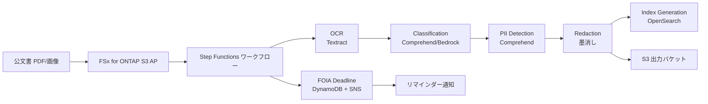

# 政府・公文書 — FOIA 対応・PII 墨消しワークフロー Demo Guide

🌐 **Language / 言語**: 日本語 | [English](demo-guide.en.md) | [한국어](demo-guide.ko.md) | [简体中文](demo-guide.zh-CN.md) | [繁體中文](demo-guide.zh-TW.md) | [Français](demo-guide.fr.md) | [Deutsch](demo-guide.de.md) | [Español](demo-guide.es.md)

## Executive Summary

自治体・行政の公文書管理デジタル化において、FOIA（情報公開）請求の法定期限（20 営業日）内に PII 検出・墨消しを完了する負荷が課題となっている。本デモでは Textract による OCR、Comprehend による PII 検出、Bedrock による文書分類を組み合わせたサーバーレスパイプラインにより、手動で数時間かかっていた墨消し処理を数分で自動化する。FSx for ONTAP S3 AP により既存ファイルストレージから zero-copy でアクセスし、NARA GRS 保存期間の自動管理も実現する。

## Target Audience & Persona

| 項目 | 内容 |
|------|------|
| **ユースケース ID** | UC16 |
| **業界** | 政府・公文書管理 |
| **主要ペルソナ** | 行政機関 情報公開担当 / 公文書管理責任者 |
| **役割** | FOIA 請求への対応、公文書の分類・保存・墨消し管理 |
| **課題** | PII 検出と墨消しが手動で、法定期限内の処理が困難 |
| **期待する成果** | AI による自動 PII 検出・墨消しで、処理時間を数時間から数分に短縮し法定期限を遵守 |
| **技術レベル** | 文書管理システム操作に習熟、クラウド技術は初級〜中級 |

## Demo Scenario



**ワークフロー概要**:

1. 公文書（PDF/画像）を FSx for ONTAP ボリュームに配置（S3 AP 経由でアクセス）
2. Textract で OCR テキスト抽出
3. Comprehend / Bedrock で文書分類（機密レベル判定）
4. Comprehend で PII（個人情報）エンティティ検出
5. 検出された PII を自動墨消し（ハッシュ + オフセットのみ保存）
6. OpenSearch にインデックス生成（オプション）
7. FOIA 期限管理 + SNS リマインダー通知

## ステップバイステップ デプロイ・検証手順

### Step 1: 前提条件の確認

以下の環境が整っていることを確認してください:

- AWS アカウント、ap-northeast-1 リージョン
- FSx for ONTAP + S3 Access Point が構成済み
- `government-archives/template-deploy.yaml` をデプロイ（`OpenSearchMode=none` でコスト抑制）
- AWS CLI v2 がインストール済み
- 適切な IAM 権限（CloudFormation, Step Functions, S3, Lambda, Textract, Comprehend, Bedrock）

```bash
# AWS CLI の確認
aws --version
aws sts get-caller-identity

# S3 Access Point の疎通確認
aws s3 ls s3://<your-ap-ext-s3alias>/ --max-items 5
```

### Step 2: リポジトリのクローンとディレクトリ移動

```bash
git clone https://github.com/Yoshiki0705/fsxn-s3ap-serverless-patterns.git
cd fsxn-s3ap-serverless-patterns/solutions/industry/government-archives
```

### Step 3: テスト用サンプルデータの配置

```bash
# サンプル PDF（機密情報含む）アップロード
aws s3 cp sample-foia-request.pdf \
  s3://<s3-ap-arn>/archives/2026/05/req-001.pdf
```

### Step 4: SAM ビルドとデプロイ

```bash
aws cloudformation deploy \
  --template-file government-archives/template-deploy.yaml \
  --stack-name fsxn-uc16-demo \
  --parameter-overrides \
    DeployBucket=<your-deploy-bucket> \
    S3AccessPointAlias=<your-ap-ext-s3alias> \
    VpcId=<vpc-id> \
    PrivateSubnetIds=<subnet-ids> \
    NotificationEmail=ops@example.com \
    OpenSearchMode=none \
  --capabilities CAPABILITY_NAMED_IAM \
  --region ap-northeast-1
```

デプロイ完了まで約 5 分。CloudFormation コンソールでスタックステータスが `CREATE_COMPLETE` になることを確認。

### Step 5: ワークフローの手動実行

```bash
# Step Functions 実行
aws stepfunctions start-execution \
  --state-machine-arn <uc16-StateMachineArn> \
  --input '{"opensearch_enabled": "none"}'
```

FOIA 期限トラッキングのテスト:

```bash
# FOIA 請求登録
aws dynamodb put-item \
  --table-name <fsxn-uc16-demo>-foia-requests \
  --item '{
    "request_id": {"S": "REQ-001"},
    "status": {"S": "PENDING"},
    "deadline": {"S": "2026-05-25"},
    "requester": {"S": "jane@example.com"}
  }'

# FOIA Deadline Lambda 手動実行
aws lambda invoke \
  --function-name <fsxn-uc16-demo>-foia-deadline \
  --payload '{}' \
  response.json && cat response.json
```

SNS 通知メールを確認。

### Step 6: 出力結果の確認

```bash
# OCR テキスト結果
aws s3 ls s3://<output-bucket>/ocr-results/

# 文書分類結果
aws s3 ls s3://<output-bucket>/classifications/

# PII 検出結果
aws s3 ls s3://<output-bucket>/pii-entities/

# 墨消し済みテキスト
aws s3 ls s3://<output-bucket>/redacted/

# 墨消しメタデータ（sidecar）
aws s3 ls s3://<output-bucket>/redaction-metadata/
```

出力構造:
- `ocr-results/archives/2026/05/req-001.pdf.txt`（生テキスト）
- `classifications/archives/2026/05/req-001.pdf.json`（分類結果）
- `pii-entities/archives/2026/05/req-001.pdf.json`（PII 検出）
- `redacted/archives/2026/05/req-001.pdf.txt`（墨消し版）
- `redaction-metadata/archives/2026/05/req-001.pdf.json`（sidecar）

## 検証チェックリスト

| # | 検証項目 | 期待結果 | 確認方法 |
|---|----------|----------|----------|
| 1 | CloudFormation スタック作成 | `CREATE_COMPLETE` | AWS コンソール |
| 2 | Step Functions 実行 | `SUCCEEDED` | 実行履歴 |
| 3 | OCR テキスト抽出 | `ocr-results/` 配下に .txt | S3 バケット |
| 4 | 文書分類 | `classifications/` 配下に JSON | S3 バケット |
| 5 | PII 検出 | `pii-entities/` 配下に JSON | S3 バケット |
| 6 | 墨消し処理 | `redacted/` 配下に墨消し済みテキスト | S3 バケット |
| 7 | FOIA 期限管理 | DynamoDB にレコード登録 | DynamoDB コンソール |
| 8 | リマインダー通知 | SNS メール受信 | メール確認 |

## よくある質問と回答

**Q. 日本の情報公開法（30 日）に対応可能？**  
A. `REMINDER_DAYS_BEFORE` と 20 営業日のハードコードを修正すれば対応可（US 連邦祝日→日本の祝日へ）。

**Q. 原文 PII はどこに保存される？**  
A. どこにも保存しません。`pii-entities/*.json` は SHA-256 hash のみ、`redaction-metadata/*.json` も hash + offset のみ。復元は原文から再実行が必要。

**Q. OpenSearch Serverless のコスト削減方法？**  
A. 最低 2 OCU = 月 $350 ほど。本番以外は停止推奨。
A. `OpenSearchMode=none` で skip、または `OpenSearchMode=managed` + `t3.small.search × 1` で ~$25/月に抑制。

**Q. OpenSearch 有効化のパスは？**  
A. `OpenSearchMode=serverless` で本格検索が可能。FedRAMP High 要件には GovCloud 移行を推奨。

**Q. Bedrock エージェントとの連携は？**  
A. 次ステップとして、Bedrock エージェントで対話型 FOIA 回答生成を計画中。

## トラブルシューティング

| 症状 | 原因 | 解決策 |
|------|------|--------|
| Textract が `UnsupportedDocumentException` | 非対応ファイル形式 | PDF, PNG, JPEG, TIFF のみ対応。ファイル形式を確認 |
| Comprehend が `TextSizeLimitExceededException` | テキストが 100KB 超 | テキストを分割して処理するか、Comprehend のバッチ API を使用 |
| S3 AP から `AccessDenied` | IAM ポリシーの ARN 形式不正 | `arn:aws:s3:{region}:{account}:accesspoint/{name}/object/*` 形式を使用 |
| FOIA Deadline Lambda がエラー | DynamoDB テーブル名の不一致 | スタック出力の正確なテーブル名を使用 |
| OpenSearch 接続エラー | `OpenSearchMode=none` で実行中 | OpenSearch 関連ステップは skip される仕様。`serverless` に変更してデプロイ |
| SNS 通知が届かない | メールサブスクリプション未確認 | SNS サブスクリプションの確認メールを承認する |
| Textract Cross-Region エラー | ap-northeast-1 で Textract 未対応のAPI | Textract の一部 API は us-east-1 にルーティングされる（仕様通り） |

---

## 出力先について: OutputDestination で選択可能 (Pattern B)

UC16 government-archives は 2026-05-11 のアップデートで `OutputDestination` パラメータをサポートしました
（`docs/output-destination-patterns.md` 参照）。

**対象ワークロード**: OCR テキスト / 文書分類 / PII 検出 / 墨消し / OpenSearch 前段ドキュメント

**2 つのモード**:

### STANDARD_S3（デフォルト、従来どおり）
新しい S3 バケット（`${AWS::StackName}-output-${AWS::AccountId}`）を作成し、
AI 成果物をそこに書き込みます。Discovery Lambda の manifest のみ S3 Access Point
に書き込まれます（従来通り）。

```bash
aws cloudformation deploy \
  --template-file government-archives/template-deploy.yaml \
  --stack-name fsxn-government-archives-demo \
  --parameter-overrides \
    OutputDestination=STANDARD_S3 \
    ... (他の必須パラメータ)
```

### FSXN_S3AP（"no data movement" パターン）
OCR テキスト、分類結果、PII 検出結果、墨消し済み文書、墨消しメタデータを、FSx for ONTAP S3 Access Point
経由でオリジナル文書と**同一の FSx for ONTAP ボリューム**に書き戻します。
公文書担当者が SMB/NFS の既存ディレクトリ構造内で AI 成果物を直接参照できます。
標準 S3 バケットは作成されません。

```bash
aws cloudformation deploy \
  --template-file government-archives/template-deploy.yaml \
  --stack-name fsxn-government-archives-demo \
  --parameter-overrides \
    OutputDestination=FSXN_S3AP \
    OutputS3APPrefix=ai-outputs/ \
    S3AccessPointName=eda-demo-s3ap \
    ... (他の必須パラメータ)
```

**チェーン構造の読み戻し**:

UC16 は前段の成果物を後段 Lambda が読み戻すチェーン構造（OCR → Classification →
EntityExtraction → Redaction → IndexGeneration）のため、`shared/output_writer.py` の
`get_bytes/get_text/get_json` で書き込み先と同じ destination から読み戻します。
これにより `OutputDestination=FSXN_S3AP` 時も FSx for ONTAP S3 Access Point からの
読み戻しが成立し、チェーン全体が一貫した destination で動作します。

**注意事項**:

- `S3AccessPointName` の指定を強く推奨（Alias 形式と ARN 形式の両方で IAM 許可する）
- 5GB 超のオブジェクトは FSx for ONTAP S3 AP では不可（AWS 仕様）、マルチパートアップロード必須
- ComplianceCheck Lambda は DynamoDB のみを使用するため `OutputDestination` の影響を受けません
- FoiaDeadlineReminder Lambda は DynamoDB + SNS のみを使用するため影響を受けません
- OpenSearch インデックスは `OpenSearchMode` パラメータで別途管理されます（`OutputDestination` とは独立）
- AWS 仕様上の制約は
  [プロジェクト README の "AWS 仕様上の制約と回避策" セクション](../../README.md#aws-仕様上の制約と回避策)
  および [`docs/output-destination-patterns.md`](../../docs/output-destination-patterns.md) を参照

---

## クリーンアップ

デモ終了後は以下の手順でリソースを削除してください:

```bash
# CloudFormation スタック削除
aws cloudformation delete-stack \
  --stack-name fsxn-uc16-demo \
  --region ap-northeast-1

# 削除完了を待機
aws cloudformation wait stack-delete-complete \
  --stack-name fsxn-uc16-demo \
  --region ap-northeast-1

# S3 出力バケットの手動削除（バケットが空でない場合）
aws s3 rb s3://fsxn-uc16-demo-output-<account-id> --force
```

> **注意**: VPC Lambda の ENI 解放に 15-30 分かかる場合があります（AWS の仕様）。`DELETE_FAILED` になった場合は数分後に再試行してください。

---

## 検証済みの UI/UX スクリーンショット

Phase 7 UC15/16/17 と UC6/11/14 のデモと同じ方針で、**エンドユーザーが日常業務で実際に
見る UI/UX 画面**を対象とする。技術者向けビュー（Step Functions グラフ、CloudFormation
スタックイベント等）は `docs/verification-results-*.md` に集約。

### このユースケースの検証ステータス

- ✅ **E2E 検証**: SUCCEEDED（Phase 7 Extended Round, commit b77fc3b）
- 📸 **UI/UX 撮影**: ✅ 完了（Phase 8 Theme D, commit d7ebabd）

### 既存スクリーンショット（Phase 7 検証時）


### 再検証時の UI/UX 対象画面（推奨撮影リスト）

- S3 出力バケット（ocr-results/、classified/、redacted/、compliance/）
- Textract OCR 結果 JSON プレビュー（Cross-Region us-east-1）
- 墨消し（Redaction）済みドキュメントプレビュー
- DynamoDB retention テーブル（FOIA 期限管理）
- FOIA リマインダー SNS メール通知
- OpenSearch インデックス（IndexGeneration 結果、OpenSearchMode 有効時）
- FSx for ONTAP ボリューム上の AI 成果物（FSXN_S3AP モード時）

### 撮影ガイド

1. **事前準備**:
   - `bash scripts/verify_phase7_prerequisites.sh` で前提確認（共通 VPC/S3 AP 有無）
   - `UC=government-archives bash scripts/package_generic_uc.sh` で Lambda パッケージ
   - `bash scripts/deploy_generic_ucs.sh UC16` でデプロイ

2. **サンプルデータ配置**:
   - S3 AP Alias 経由で `archives/` プレフィックスにサンプル PDF/画像をアップロード
   - Step Functions `fsxn-government-archives-demo-workflow` を起動（入力 `{}`）

3. **撮影**（CloudShell・ターミナルは閉じる、ブラウザ右上のユーザー名は黒塗り）:
   - S3 出力バケット `fsxn-government-archives-demo-output-<account>` の俯瞰
   - OCR / Classification / Redaction 各段階の出力 JSON プレビュー
   - DynamoDB retention テーブルのアイテム一覧
   - SNS FOIA リマインダーメール

4. **マスク処理**:
   - `python3 scripts/mask_uc_demos.py government-archives-demo` で自動マスク
   - `docs/screenshots/MASK_GUIDE.md` に従って追加マスク（必要に応じて）

5. **クリーンアップ**:
   - `bash scripts/cleanup_generic_ucs.sh UC16` で削除
   - VPC Lambda ENI 解放に 15-30 分（AWS の仕様）
