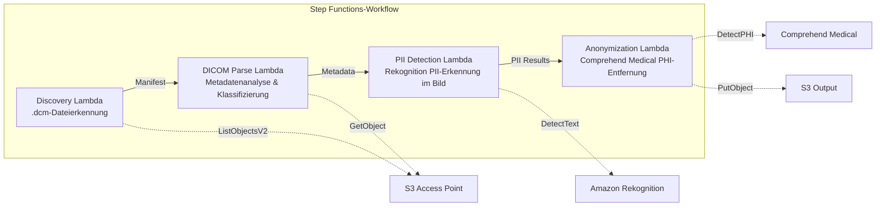

# UC5: Gesundheitswesen – Automatische Klassifizierung und Anonymisierung von DICOM-Bildern

🌐 **Language / 言語**: [日本語](README.md) | [English](README.en.md) | [한국어](README.ko.md) | [简体中文](README.zh-CN.md) | [繁體中文](README.zh-TW.md) | [Français](README.fr.md) | Deutsch | [Español](README.es.md)

📚 **Dokumentation**: [Architekturdiagramm](docs/architecture.md) | [Demo-Leitfaden](docs/demo-guide.md)

## Übersicht

Mithilfe der S3 Access Points von FSx for ONTAP klassifiziert und anonymisiert dieser serverlose Workflow DICOM-Medizinbilder automatisch. Er gewährleistet den Schutz der Privatsphäre der Patienten und eine effiziente Bildverwaltung.

### Fälle, für die dieses Muster geeignet ist

- Sie möchten DICOM-Dateien, die aus einem PACS / VNA in FSx for ONTAP gespeichert wurden, regelmäßig anonymisieren
- Sie möchten PHI (Protected Health Information) zur Erstellung von Forschungsdatensätzen automatisch entfernen
- Sie möchten in Bilder eingebrannte Patientendaten (Burned-in Annotation) erkennen
- Sie möchten die Bildverwaltung durch automatische Klassifizierung nach Modalität und Körperregion effizienter gestalten
- Sie möchten eine Anonymisierungs-Pipeline aufbauen, die HIPAA / Datenschutzgesetzen entspricht

### Fälle, für die dieses Muster nicht geeignet ist

- DICOM-Routing in Echtzeit (erfordert eine DICOM-MWL-/MPPS-Integration)
- Diagnoseunterstützende KI für Bilder (CAD) — dieses Muster ist auf Klassifizierung und Anonymisierung spezialisiert
- Regionsübergreifende Datenübertragung ist aus regulatorischen Gründen in Regionen, in denen Comprehend Medical nicht verfügbar ist, nicht zulässig
- Die DICOM-Dateigröße überschreitet 5 GB (z. B. Multi-Frame-MR/CT)

### Hauptfunktionen

- Automatische Erkennung von .dcm-Dateien über S3 AP
- Analyse der DICOM-Metadaten (Patientenname, Untersuchungsdatum, Modalität, Körperregion) und Klassifizierung
- Erkennung eingebrannter personenbezogener Informationen (PII) in Bildern mit Amazon Rekognition
- Identifizierung und Entfernung von PHI (Protected Health Information) mit Amazon Comprehend Medical
- S3-Ausgabe der anonymisierten DICOM-Dateien mit Klassifizierungsmetadaten

## Success Metrics

### Outcome
Durch die automatische Klassifizierung und Anonymisierung von DICOM-Bildern die Sucheffizienz für die Radiologie verbessern und die Privatsphäre der Patienten schützen.

### Metrics
| Metrik | Zielwert (Beispiel) |
|-----------|------------|
| Verarbeitete DICOM-Dateien / Ausführung | > 500 files |
| Klassifizierungsgenauigkeit | > 90% |
| Erfolgsquote der Anonymisierung | 100% (kein PHI-Leck) |
| Verarbeitungszeit / Datei | < 30 Sekunden |
| Kosten / Ausführung | < $15 |
| Pflichtquote Human Review | 100% (Überprüfung aller Anonymisierungsergebnisse empfohlen) |

> **Grund für 100% Human Review**: Da eine versäumte Anonymisierung sich direkt auf die Privatsphäre der Patienten auswirkt, wird eine menschliche Überprüfung aller Dateien empfohlen.

### Measurement Method
Step Functions-Ausführungsverlauf, Comprehend Medical entity count, Diff-Überprüfung vor und nach der Anonymisierung sowie CloudWatch Metrics. Die Überprüfungsergebnisse werden in DynamoDB aufgezeichnet, sodass bei Audits nachvollziehbar ist, „wer wann was überprüft hat".

## Architektur



### Workflow-Schritte

1. **Discovery**: .dcm-Dateien aus dem S3 AP erkennen und ein Manifest erzeugen
2. **DICOM Parse**: DICOM-Metadaten (patient name, study date, modality, body part) analysieren und nach Modalität und Körperregion klassifizieren
3. **PII Detection**: eingebrannte personenbezogene Informationen in den Bildpixeln mit Rekognition erkennen
4. **Anonymization**: PHI mit Comprehend Medical identifizieren und entfernen und das anonymisierte DICOM mit Klassifizierungsmetadaten nach S3 ausgeben

## Voraussetzungen

- Ein AWS-Konto und angemessene IAM-Berechtigungen
- Ein FSx for ONTAP-Dateisystem (ONTAP 9.17.1P4D3 oder höher)
- Ein Volume mit aktivierten S3 Access Points
- In Secrets Manager registrierte Anmeldeinformationen für die ONTAP REST API
- Ein VPC und private Subnetze
- Eine Region, in der Amazon Rekognition und Amazon Comprehend Medical verfügbar sind

## Bereitstellungsschritte

### 1. Vorbereitung der Parameter

Überprüfen Sie vor der Bereitstellung die folgenden Werte:

- FSx for ONTAP S3 Access Point Alias
- ONTAP-Management-IP-Adresse
- Secrets Manager-Secret-Name
- VPC-ID, private Subnetz-IDs

### 2. SAM-Bereitstellung

```bash
# Prerequisite: AWS SAM CLI required. 'sam build' packages the code and shared layer automatically.
sam build

sam deploy \
  --stack-name fsxn-healthcare-dicom \
  --parameter-overrides \
    S3AccessPointAlias=<your-volume-ext-s3alias> \
    S3AccessPointName=<your-s3ap-name> \
    S3AccessPointOutputAlias=<your-output-volume-ext-s3alias> \
    OntapSecretName=<your-ontap-secret-name> \
    OntapManagementIp=<your-ontap-management-ip> \
    ScheduleExpression="rate(1 hour)" \
    VpcId=<your-vpc-id> \
    PrivateSubnetIds=<subnet-1>,<subnet-2> \
    NotificationEmail=<your-email@example.com> \
    EnableVpcEndpoints=false \
    EnableCloudWatchAlarms=false \
  --capabilities CAPABILITY_NAMED_IAM \
  --resolve-s3 \
  --region ap-northeast-1
```

> **Hinweis**: `template.yaml` wird mit dem SAM CLI (`sam build` + `sam deploy`) verwendet.
> Für eine direkte Bereitstellung mit dem Befehl `aws cloudformation deploy` verwenden Sie stattdessen `template-deploy.yaml` (dies erfordert das Vorab-Packen der Lambda-Zip-Dateien und deren Upload nach S3).

> **Hinweis**: Ersetzen Sie die Platzhalter `<...>` durch die tatsächlichen Werte Ihrer Umgebung.

### 3. Bestätigung des SNS-Abonnements

Nach der Bereitstellung wird eine SNS-Abonnement-Bestätigungs-E-Mail an die angegebene E-Mail-Adresse gesendet.

> **Hinweis**: Wenn Sie `S3AccessPointName` weglassen, basiert die IAM-Richtlinie nur auf dem Alias, und es kann ein Fehler `AccessDenied` auftreten. In Produktionsumgebungen wird empfohlen, ihn anzugeben. Weitere Informationen finden Sie im [Leitfaden zur Fehlerbehebung](../docs/guides/troubleshooting-guide.md#1-accessdenied-エラー).

## Liste der Konfigurationsparameter

| Parameter | Beschreibung | Standard | Erforderlich |
|-----------|------|----------|------|
| `S3AccessPointAlias` | FSx for ONTAP S3 AP Alias (für Eingabe) | — | ✅ |
| `S3AccessPointName` | S3-AP-Name (für die ARN-basierte IAM-Berechtigungsvergabe; bei Weglassen nur Alias-basiert) | `""` | ⚠️ Empfohlen |
| `S3AccessPointOutputAlias` | FSx for ONTAP S3 AP Alias (für Ausgabe) | — | ✅ |
| `OntapSecretName` | Secrets Manager-Secret-Name der ONTAP-Anmeldeinformationen | — | ✅ |
| `OntapManagementIp` | ONTAP-Cluster-Management-IP-Adresse | — | ✅ |
| `ScheduleExpression` | Zeitplanausdruck des EventBridge Scheduler | `rate(1 hour)` | |
| `VpcId` | VPC-ID | — | ✅ |
| `PrivateSubnetIds` | Liste der privaten Subnetz-IDs | — | ✅ |
| `NotificationEmail` | SNS-Benachrichtigungs-E-Mail-Adresse | — | ✅ |
| `EnableVpcEndpoints` | Interface VPC Endpoints aktivieren | `false` | |
| `EnableCloudWatchAlarms` | CloudWatch Alarms aktivieren | `false` | |

## Kostenstruktur

### Anfragebasiert (nutzungsabhängige Gebühren)

| Service | Abrechnungseinheit | Schätzung (100 DICOM-Dateien/Monat) |
|---------|---------|---------------------------|
| Lambda | Anzahl der Anfragen + Ausführungszeit | ~$0.01 |
| Step Functions | Anzahl der Zustandsübergänge | Innerhalb des kostenlosen Kontingents |
| S3 API | Anzahl der Anfragen | ~$0.01 |
| Rekognition | Anzahl der Bilder | ~$0.10 |
| Comprehend Medical | Anzahl der Einheiten | ~$0.05 |

### Dauerbetrieb (optional)

| Service | Parameter | Monatlich |
|---------|-----------|------|
| Interface VPC Endpoints | `EnableVpcEndpoints=true` | ~$28.80 |
| CloudWatch Alarms | `EnableCloudWatchAlarms=true` | ~$0.20 |

> In einer Demo-/PoC-Umgebung ist die Nutzung ab **~$0.17/Monat** bei ausschließlich variablen Kosten möglich.

## Sicherheit und Compliance

Da dieser Workflow medizinische Daten verarbeitet, implementiert er die folgenden Sicherheitsmaßnahmen:

- **Verschlüsselung**: Der S3-Ausgabe-Bucket wird mit SSE-KMS verschlüsselt
- **Ausführung innerhalb eines VPC**: Lambda-Funktionen werden innerhalb eines VPC ausgeführt (die Aktivierung von VPC Endpoints wird empfohlen)
- **IAM mit geringsten Rechten**: Jeder Lambda-Funktion werden nur die minimal erforderlichen IAM-Berechtigungen erteilt
- **PHI-Entfernung**: Geschützte Gesundheitsinformationen werden mit Comprehend Medical automatisch erkannt und entfernt
- **Audit-Protokolle**: Alle Verarbeitungsvorgänge werden in CloudWatch Logs protokolliert

> **Hinweis**: Dieses Muster ist eine Beispielimplementierung. Der Einsatz in einer echten medizinischen Umgebung erfordert zusätzliche Sicherheitsmaßnahmen und eine Compliance-Prüfung gemäß regulatorischen Anforderungen wie HIPAA.

## Bereinigung

```bash
# Delete the CloudFormation stack
aws cloudformation delete-stack \
  --stack-name fsxn-healthcare-dicom \
  --region ap-northeast-1

# Wait for deletion to complete
aws cloudformation wait stack-delete-complete \
  --stack-name fsxn-healthcare-dicom \
  --region ap-northeast-1
```

> **Hinweis**: Das Löschen des Stacks kann fehlschlagen, wenn sich noch Objekte im S3-Bucket befinden. Leeren Sie den Bucket zuvor.

## Unterstützte Regionen

UC5 verwendet die folgenden Services:

| Service | Regionsbeschränkung |
|---------|-------------|
| Amazon Rekognition | In nahezu allen Regionen verfügbar |
| Amazon Comprehend Medical | Nur in begrenzten Regionen unterstützt. Geben Sie mit dem Parameter `COMPREHEND_MEDICAL_REGION` eine unterstützte Region (z. B. us-east-1) an |
| AWS X-Ray | In nahezu allen Regionen verfügbar |
| CloudWatch EMF | In nahezu allen Regionen verfügbar |

> Die Comprehend Medical API wird über einen Cross-Region Client aufgerufen. Überprüfen Sie Ihre Anforderungen an die Datenresidenz. Weitere Informationen finden Sie in der [Matrix zur Regionskompatibilität](../docs/region-compatibility.md).

## Referenzen

### Offizielle AWS-Dokumentation

- [Übersicht über FSx for ONTAP S3 Access Points](https://docs.aws.amazon.com/fsx/latest/ONTAPGuide/accessing-data-via-s3-access-points.html)
- [Serverlose Verarbeitung mit Lambda (offizielles Tutorial)](https://docs.aws.amazon.com/fsx/latest/ONTAPGuide/tutorial-process-files-with-lambda.html)
- [Comprehend Medical DetectPHI API](https://docs.aws.amazon.com/comprehend-medical/latest/dev/API_DetectPHI.html)
- [Rekognition DetectText API](https://docs.aws.amazon.com/rekognition/latest/dg/API_DetectText.html)
- [HIPAA on AWS Whitepaper](https://docs.aws.amazon.com/whitepapers/latest/architecting-hipaa-security-and-compliance-on-aws/welcome.html)

### AWS-Blogartikel

- [Blog zur Ankündigung der S3 AP](https://aws.amazon.com/blogs/aws/amazon-fsx-for-netapp-ontap-now-integrates-with-amazon-s3-for-seamless-data-access/)
- [FSx for ONTAP + Bedrock RAG](https://aws.amazon.com/blogs/machine-learning/build-rag-based-generative-ai-applications-in-aws-using-amazon-fsx-for-netapp-ontap-with-amazon-bedrock/)

### GitHub-Beispiele

- [aws-samples/amazon-rekognition-serverless-large-scale-image-and-video-processing](https://github.com/aws-samples/amazon-rekognition-serverless-large-scale-image-and-video-processing) — Rekognition-Verarbeitung im großen Maßstab
- [aws-samples/serverless-patterns](https://github.com/aws-samples/serverless-patterns) — Sammlung serverloser Muster

## Validierte Umgebung

| Element | Wert |
|------|-----|
| AWS-Region | ap-northeast-1 (Tokio) |
| FSx for ONTAP-Version | ONTAP 9.17.1P4D3 |
| FSx for ONTAP-Konfiguration | SINGLE_AZ_1 |
| Python | 3.12 |
| Bereitstellungsmethode | CloudFormation (Standard) |

## Lambda-VPC-Platzierungsarchitektur

Basierend auf den Erkenntnissen aus der Validierung sind die Lambda-Funktionen auf innerhalb und außerhalb des VPC aufgeteilt.

**Lambda innerhalb des VPC** (nur Funktionen, die Zugriff auf die ONTAP REST API benötigen):
- Discovery Lambda — S3 AP + ONTAP API

**Lambda außerhalb des VPC** (nur Funktionen, die AWS-Managed-Service-APIs verwenden):
- Alle übrigen Lambda-Funktionen

> **Grund**: Der Zugriff auf AWS-Managed-Service-APIs (Athena, Bedrock, Textract usw.) aus einer Lambda innerhalb des VPC erfordert Interface VPC Endpoints (je 7,20 $/Monat). Eine Lambda außerhalb des VPC kann direkt über das Internet auf AWS-APIs zugreifen und ohne zusätzliche Kosten arbeiten.

> **Hinweis**: Für einen UC, der die ONTAP REST API verwendet (UC1 Recht & Compliance), ist `EnableVpcEndpoints=true` erforderlich. Dies dient dazu, die ONTAP-Anmeldeinformationen über den Secrets Manager VPC Endpoint abzurufen.

---

## Links zur AWS-Dokumentation

| Service | Dokumentation |
|---------|------------|
| FSx for ONTAP | [FSx for ONTAP](https://docs.aws.amazon.com/fsx/latest/ONTAPGuide/what-is-fsx-ontap.html) |
| S3 Access Points | [S3 Access Points](https://docs.aws.amazon.com/fsx/latest/ONTAPGuide/s3-access-points.html) |
| Step Functions | [Step Functions](https://docs.aws.amazon.com/step-functions/latest/dg/welcome.html) |
| Amazon Comprehend Medical | [Amazon Comprehend Medical](https://docs.aws.amazon.com/comprehend-medical/latest/dev/comprehendmedical-welcome.html) |
| Amazon Bedrock | [Amazon Bedrock](https://docs.aws.amazon.com/bedrock/latest/userguide/what-is-bedrock.html) |
| HIPAA-fähige Services von AWS | [HIPAA-fähige Services von AWS](https://aws.amazon.com/compliance/hipaa-eligible-services-reference/) |

### Ausrichtung am Well-Architected Framework

| Säule | Ausrichtung |
|----|------|
| Operative Exzellenz | X-Ray-Tracing, EMF-Metriken, Anonymisierungs-Audit-Protokolle |
| Sicherheit | IAM mit geringsten Rechten, KMS-Verschlüsselung, PII-Erkennung & Anonymisierung, HIPAA-Überlegungen |
| Zuverlässigkeit | Step Functions Retry/Catch, regionsübergreifendes Fallback |
| Leistungseffizienz | Lambda-Speicheroptimierung, DICOM-Streaming-Verarbeitung |
| Kostenoptimierung | Serverless, seitenbasierte Abrechnung von Comprehend Medical |
| Nachhaltigkeit | Bedarfsgesteuerte Ausführung, Wiederverwendung anonymisierter Daten |

---

## Lokale Tests

### Prüfung der Voraussetzungen

```bash
# Confirm prerequisites
aws --version          # AWS CLI v2
sam --version          # SAM CLI
python3 --version      # Python 3.9+
docker --version       # Docker (for sam local)
aws sts get-caller-identity  # AWS credentials
```

### sam local invoke

```bash
# Build
# Prerequisite: AWS SAM CLI required. 'sam build' packages the code and shared layer automatically.
sam build

# Run the Discovery Lambda locally
sam local invoke DiscoveryFunction --event events/discovery-event.json

# With environment variable overrides
sam local invoke DiscoveryFunction \
  --event events/discovery-event.json \
  --env-vars env.json
```

### Unit-Tests

```bash
python3 -m pytest tests/ -v
```

Weitere Informationen finden Sie im [Schnelleinstieg für lokale Tests](../docs/local-testing-quick-start.md).

---

## Ausgabebeispiel (Output Sample)

Beispielausgabe der DICOM-Anonymisierungs-Pipeline:

```json
{
  "discovery": {
    "status": "completed",
    "object_count": 12,
    "prefix": "dicom-inbox/"
  },
  "anonymization": [
    {
      "key": "dicom-inbox/study-001/series-001.dcm",
      "pii_detected": ["PatientName", "PatientID", "InstitutionName"],
      "pii_removed": 3,
      "anonymized_key": "anonymized/study-001/series-001.dcm",
      "integrity_hash": "sha256:a1b2c3..."
    }
  ],
  "report": {
    "total_files": 12,
    "anonymized": 12,
    "pii_fields_removed": 36,
    "compliance_status": "HIPAA_SAFE_HARBOR_COMPLIANT"
  }
}
```

> **Anmerkung**: Das Obige ist eine Beispielausgabe; die tatsächlichen Werte variieren je nach Umgebung und Eingabedaten. Benchmark-Zahlen sind eine Dimensionierungsreferenz (sizing reference), keine Servicegrenze (service limit).

---

## Governance Note

> Dieses Muster bietet technische Architekturberatung. Es handelt sich nicht um rechtliche, Compliance- oder regulatorische Beratung. Organisationen sollten qualifizierte Fachleute konsultieren.

---

## S3AP Compatibility

Informationen zu Kompatibilitätsbeschränkungen, Fehlerbehebung und Trigger-Mustern der S3 Access Points for FSx for ONTAP finden Sie in den [S3AP Compatibility Notes](../docs/s3ap-compatibility-notes.md).
