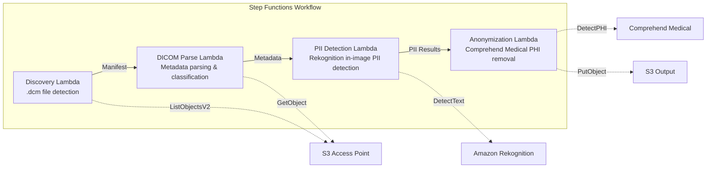

# UC5: Healthcare – Automatic Classification and Anonymization of DICOM Images

🌐 **Language / 言語**: [日本語](README.md) | English | [한국어](README.ko.md) | [简体中文](README.zh-CN.md) | [繁體中文](README.zh-TW.md) | [Français](README.fr.md) | [Deutsch](README.de.md) | [Español](README.es.md)

📚 **Documentation**: [Architecture Diagram](docs/architecture.md) | [Demo Guide](docs/demo-guide.md)

## Overview

Leveraging the S3 Access Points of FSx for ONTAP, this serverless workflow automatically classifies and anonymizes DICOM medical images. It ensures the protection of patient privacy and efficient image management.

### When this pattern is a good fit

- You want to periodically anonymize DICOM files stored in FSx for ONTAP from PACS / VNA
- You want to automatically remove PHI (Protected Health Information) for research dataset creation
- You want to detect patient information burned into images (Burned-in Annotation)
- You want to streamline image management with automatic classification by modality and body part
- You want to build an anonymization pipeline that complies with HIPAA / personal data protection laws

### When this pattern is not a good fit

- Real-time DICOM routing (requires DICOM MWL / MPPS integration)
- Diagnostic assistance AI for imaging (CAD) — this pattern specializes in classification and anonymization
- Cross-region data transfer is not permitted for regulatory reasons in regions where Comprehend Medical is unavailable
- DICOM file size exceeds 5 GB (e.g., multi-frame MR/CT)

### Main Features

- Automatic detection of .dcm files via S3 AP
- DICOM metadata parsing (patient name, study date, modality, body part) and classification
- Detection of burned-in personally identifiable information (PII) in images using Amazon Rekognition
- Identification and removal of PHI (Protected Health Information) using Amazon Comprehend Medical
- S3 output of anonymized DICOM files with classification metadata

## Success Metrics

### Outcome
Through automatic classification and anonymization of DICOM images, improve search efficiency for the radiology department and protect patient privacy.

### Metrics
| Metric | Target (example) |
|-----------|------------|
| Processed DICOM files / run | > 500 files |
| Classification accuracy | > 90% |
| Anonymization success rate | 100% (zero PHI leakage) |
| Processing time / file | < 30 seconds |
| Cost / run | < $15 |
| Human Review mandatory rate | 100% (reviewing all anonymization results is recommended) |

> **Reason for 100% Human Review**: Because a missed anonymization directly affects patient privacy, human review of every file is recommended.

### Measurement Method
Step Functions execution history, Comprehend Medical entity count, diff review before and after anonymization, and CloudWatch Metrics. Review results are recorded in DynamoDB so that "who confirmed what and when" can be traced during audits.

## Architecture



### Workflow Steps

1. **Discovery**: Detect .dcm files from the S3 AP and generate a Manifest
2. **DICOM Parse**: Parse DICOM metadata (patient name, study date, modality, body part) and classify by modality and body part
3. **PII Detection**: Detect burned-in personal information within image pixels using Rekognition
4. **Anonymization**: Identify and remove PHI using Comprehend Medical, and output the anonymized DICOM with classification metadata to S3

## Prerequisites

- An AWS account and appropriate IAM permissions
- An FSx for ONTAP file system (ONTAP 9.17.1P4D3 or later)
- A volume with S3 Access Points enabled
- ONTAP REST API credentials registered in Secrets Manager
- A VPC and private subnets
- A region where Amazon Rekognition and Amazon Comprehend Medical are available

## Deployment Steps

### 1. Prepare the Parameters

Before deploying, confirm the following values:

- FSx for ONTAP S3 Access Point Alias
- ONTAP management IP address
- Secrets Manager secret name
- VPC ID, private subnet IDs

### 2. SAM Deployment

```bash
# Prerequisite: AWS SAM CLI required. 'sam build' packages the code and shared layer automatically.
sam build

sam deploy \
  --stack-name fsxn-healthcare-dicom \
  --parameter-overrides \
    S3AccessPointAlias=<your-volume-ext-s3alias> \
    S3AccessPointName=<your-s3ap-name> \
    S3AccessPointOutputAlias=<your-output-volume-ext-s3alias> \
    OntapSecretName=<your-ontap-secret-name> \
    OntapManagementIp=<your-ontap-management-ip> \
    ScheduleExpression="rate(1 hour)" \
    VpcId=<your-vpc-id> \
    PrivateSubnetIds=<subnet-1>,<subnet-2> \
    NotificationEmail=<your-email@example.com> \
    EnableVpcEndpoints=false \
    EnableCloudWatchAlarms=false \
  --capabilities CAPABILITY_NAMED_IAM \
  --resolve-s3 \
  --region ap-northeast-1
```

> **Note**: `template.yaml` is used with the SAM CLI (`sam build` + `sam deploy`).
> To deploy directly with the `aws cloudformation deploy` command, use `template-deploy.yaml` instead (this requires pre-packaging the Lambda zip files and uploading them to S3).

> **Note**: Replace the `<...>` placeholders with your actual environment values.

### 3. Confirm the SNS Subscription

After deployment, an SNS subscription confirmation email will be sent to the specified email address.

> **Note**: If you omit `S3AccessPointName`, the IAM policy becomes Alias-based only and an `AccessDenied` error may occur. Specifying it is recommended for production environments. For details, see the [Troubleshooting Guide](../docs/guides/troubleshooting-guide.md#1-accessdenied-エラー).

## Configuration Parameters

| Parameter | Description | Default | Required |
|-----------|------|----------|------|
| `S3AccessPointAlias` | FSx for ONTAP S3 AP Alias (for input) | — | ✅ |
| `S3AccessPointName` | S3 AP name (for ARN-based IAM permission grants; Alias-based only when omitted) | `""` | ⚠️ Recommended |
| `S3AccessPointOutputAlias` | FSx for ONTAP S3 AP Alias (for output) | — | ✅ |
| `OntapSecretName` | Secrets Manager secret name for the ONTAP credentials | — | ✅ |
| `OntapManagementIp` | ONTAP cluster management IP address | — | ✅ |
| `ScheduleExpression` | EventBridge Scheduler schedule expression | `rate(1 hour)` | |
| `VpcId` | VPC ID | — | ✅ |
| `PrivateSubnetIds` | List of private subnet IDs | — | ✅ |
| `NotificationEmail` | SNS notification email address | — | ✅ |
| `EnableVpcEndpoints` | Enable Interface VPC Endpoints | `false` | |
| `EnableCloudWatchAlarms` | Enable CloudWatch Alarms | `false` | |

## Cost Structure

### Request-based (pay-per-use)

| Service | Billing Unit | Estimate (100 DICOM files/month) |
|---------|---------|---------------------------|
| Lambda | Number of requests + execution time | ~$0.01 |
| Step Functions | Number of state transitions | Within free tier |
| S3 API | Number of requests | ~$0.01 |
| Rekognition | Number of images | ~$0.10 |
| Comprehend Medical | Number of units | ~$0.05 |

### Always On (Optional)

| Service | Parameter | Monthly |
|---------|-----------|------|
| Interface VPC Endpoints | `EnableVpcEndpoints=true` | ~$28.80 |
| CloudWatch Alarms | `EnableCloudWatchAlarms=true` | ~$0.20 |

> In a demo/PoC environment, it can be used from **~$0.17/month** with variable costs only.

## Security and Compliance

Because this workflow handles medical data, it implements the following security measures:

- **Encryption**: The S3 output bucket is encrypted with SSE-KMS
- **Execution within a VPC**: Lambda functions run inside a VPC (enabling VPC Endpoints is recommended)
- **Least-privilege IAM**: Each Lambda function is granted only the minimum required IAM permissions
- **PHI removal**: Protected health information is automatically detected and removed with Comprehend Medical
- **Audit logs**: All processing is logged in CloudWatch Logs

> **Note**: This pattern is a sample implementation. Using it in a real medical environment requires additional security measures and a compliance review based on regulatory requirements such as HIPAA.

## Cleanup

```bash
# Delete the CloudFormation stack
aws cloudformation delete-stack \
  --stack-name fsxn-healthcare-dicom \
  --region ap-northeast-1

# Wait for deletion to complete
aws cloudformation wait stack-delete-complete \
  --stack-name fsxn-healthcare-dicom \
  --region ap-northeast-1
```

> **Note**: Stack deletion may fail if objects remain in the S3 bucket. Empty the bucket beforehand.

## Supported Regions

UC5 uses the following services:

| Service | Region Constraint |
|---------|-------------|
| Amazon Rekognition | Available in almost all regions |
| Amazon Comprehend Medical | Supported in limited regions only. Specify a supported region (e.g., us-east-1) with the `COMPREHEND_MEDICAL_REGION` parameter |
| AWS X-Ray | Available in almost all regions |
| CloudWatch EMF | Available in almost all regions |

> The Comprehend Medical API is called via a Cross-Region Client. Confirm your data residency requirements. For details, see the [Region Compatibility Matrix](../docs/region-compatibility.md).

## References

### AWS Official Documentation

- [FSx for ONTAP S3 Access Points Overview](https://docs.aws.amazon.com/fsx/latest/ONTAPGuide/accessing-data-via-s3-access-points.html)
- [Serverless Processing with Lambda (Official Tutorial)](https://docs.aws.amazon.com/fsx/latest/ONTAPGuide/tutorial-process-files-with-lambda.html)
- [Comprehend Medical DetectPHI API](https://docs.aws.amazon.com/comprehend-medical/latest/dev/API_DetectPHI.html)
- [Rekognition DetectText API](https://docs.aws.amazon.com/rekognition/latest/dg/API_DetectText.html)
- [HIPAA on AWS Whitepaper](https://docs.aws.amazon.com/whitepapers/latest/architecting-hipaa-security-and-compliance-on-aws/welcome.html)

### AWS Blog Articles

- [S3 AP Announcement Blog](https://aws.amazon.com/blogs/aws/amazon-fsx-for-netapp-ontap-now-integrates-with-amazon-s3-for-seamless-data-access/)
- [FSx for ONTAP + Bedrock RAG](https://aws.amazon.com/blogs/machine-learning/build-rag-based-generative-ai-applications-in-aws-using-amazon-fsx-for-netapp-ontap-with-amazon-bedrock/)

### GitHub Samples

- [aws-samples/amazon-rekognition-serverless-large-scale-image-and-video-processing](https://github.com/aws-samples/amazon-rekognition-serverless-large-scale-image-and-video-processing) — Large-scale Rekognition processing
- [aws-samples/serverless-patterns](https://github.com/aws-samples/serverless-patterns) — Collection of serverless patterns

## Validated Environment

| Item | Value |
|------|-----|
| AWS Region | ap-northeast-1 (Tokyo) |
| FSx for ONTAP version | ONTAP 9.17.1P4D3 |
| FSx for ONTAP configuration | SINGLE_AZ_1 |
| Python | 3.12 |
| Deployment method | CloudFormation (standard) |

## Lambda VPC Placement Architecture

Based on insights gained during validation, the Lambda functions are split between inside and outside the VPC.

**Lambda inside the VPC** (only functions that require ONTAP REST API access):
- Discovery Lambda — S3 AP + ONTAP API

**Lambda outside the VPC** (only functions that use AWS managed service APIs):
- All other Lambda functions

> **Reason**: Accessing AWS managed service APIs (Athena, Bedrock, Textract, etc.) from a Lambda inside the VPC requires Interface VPC Endpoints (each $7.20/month). Lambda outside the VPC can access AWS APIs directly over the internet and operate at no additional cost.

> **Note**: For a UC that uses the ONTAP REST API (UC1 Legal & Compliance), `EnableVpcEndpoints=true` is required. This is because ONTAP credentials are retrieved via the Secrets Manager VPC Endpoint.

---

## AWS Documentation Links

| Service | Documentation |
|---------|------------|
| FSx for ONTAP | [FSx for ONTAP](https://docs.aws.amazon.com/fsx/latest/ONTAPGuide/what-is-fsx-ontap.html) |
| S3 Access Points | [S3 Access Points](https://docs.aws.amazon.com/fsx/latest/ONTAPGuide/s3-access-points.html) |
| Step Functions | [Step Functions](https://docs.aws.amazon.com/step-functions/latest/dg/welcome.html) |
| Amazon Comprehend Medical | [Amazon Comprehend Medical](https://docs.aws.amazon.com/comprehend-medical/latest/dev/comprehendmedical-welcome.html) |
| Amazon Bedrock | [Amazon Bedrock](https://docs.aws.amazon.com/bedrock/latest/userguide/what-is-bedrock.html) |
| AWS HIPAA Eligible Services | [AWS HIPAA Eligible Services](https://aws.amazon.com/compliance/hipaa-eligible-services-reference/) |

### Well-Architected Framework Alignment

| Pillar | Alignment |
|----|------|
| Operational Excellence | X-Ray tracing, EMF metrics, anonymization audit logs |
| Security | Least-privilege IAM, KMS encryption, PII detection & anonymization, HIPAA considerations |
| Reliability | Step Functions Retry/Catch, cross-region fallback |
| Performance Efficiency | Lambda memory optimization, DICOM streaming processing |
| Cost Optimization | Serverless, Comprehend Medical per-page billing |
| Sustainability | On-demand execution, reuse of anonymized data |

---

## Local Testing

### Prerequisites Check

```bash
# Confirm prerequisites
aws --version          # AWS CLI v2
sam --version          # SAM CLI
python3 --version      # Python 3.9+
docker --version       # Docker (for sam local)
aws sts get-caller-identity  # AWS credentials
```

### sam local invoke

```bash
# Build
# Prerequisite: AWS SAM CLI required. 'sam build' packages the code and shared layer automatically.
sam build

# Run the Discovery Lambda locally
sam local invoke DiscoveryFunction --event events/discovery-event.json

# With environment variable overrides
sam local invoke DiscoveryFunction \
  --event events/discovery-event.json \
  --env-vars env.json
```

### Unit Tests

```bash
python3 -m pytest tests/ -v
```

For details, see the [Local Testing Quick Start](../docs/local-testing-quick-start.md).

---

## Output Sample

Example output from the DICOM anonymization pipeline:

```json
{
  "discovery": {
    "status": "completed",
    "object_count": 12,
    "prefix": "dicom-inbox/"
  },
  "anonymization": [
    {
      "key": "dicom-inbox/study-001/series-001.dcm",
      "pii_detected": ["PatientName", "PatientID", "InstitutionName"],
      "pii_removed": 3,
      "anonymized_key": "anonymized/study-001/series-001.dcm",
      "integrity_hash": "sha256:a1b2c3..."
    }
  ],
  "report": {
    "total_files": 12,
    "anonymized": 12,
    "pii_fields_removed": 36,
    "compliance_status": "HIPAA_SAFE_HARBOR_COMPLIANT"
  }
}
```

> **Note**: The above is sample output; actual values vary depending on the environment and input data. Benchmark figures are a sizing reference, not a service limit.

---

## Governance Note

> This pattern provides technical architecture guidance. It is not legal, compliance, or regulatory advice. Organizations should consult qualified professionals.

---

## S3AP Compatibility

For compatibility constraints, troubleshooting, and trigger patterns of S3 Access Points for FSx for ONTAP, see the [S3AP Compatibility Notes](../docs/s3ap-compatibility-notes.md).
