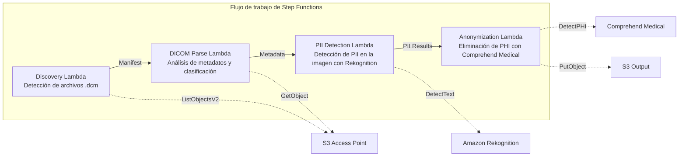

# UC5: Salud — Clasificación y anonimización automáticas de imágenes DICOM

🌐 **Language / 言語**: [日本語](README.md) | [English](README.en.md) | [한국어](README.ko.md) | [简体中文](README.zh-CN.md) | [繁體中文](README.zh-TW.md) | [Français](README.fr.md) | [Deutsch](README.de.md) | Español

📚 **Documentación**: [Diagrama de arquitectura](docs/architecture.md) | [Guía de demostración](docs/demo-guide.md)

## Descripción general

Aprovechando los S3 Access Points de FSx for ONTAP, este flujo de trabajo sin servidor clasifica y anonimiza automáticamente las imágenes médicas DICOM. Garantiza la protección de la privacidad del paciente y una gestión eficiente de las imágenes.

### Casos en los que este patrón es adecuado

- Desea anonimizar periódicamente los archivos DICOM almacenados en FSx for ONTAP desde un PACS / VNA
- Desea eliminar automáticamente la PHI (información médica protegida) para crear conjuntos de datos de investigación
- Desea detectar la información del paciente incrustada en las imágenes (Burned-in Annotation)
- Desea optimizar la gestión de imágenes mediante la clasificación automática por modalidad y región anatómica
- Desea construir una canalización de anonimización que cumpla con HIPAA / las leyes de protección de datos personales

### Casos en los que este patrón no es adecuado

- Enrutamiento DICOM en tiempo real (requiere integración DICOM MWL / MPPS)
- IA de asistencia al diagnóstico en imágenes (CAD) — este patrón se especializa en clasificación y anonimización
- La transferencia de datos entre regiones no está permitida por motivos normativos en regiones donde Comprehend Medical no está disponible
- El tamaño de los archivos DICOM supera los 5 GB (por ejemplo, MR/CT multiframe)

### Funciones principales

- Detección automática de archivos .dcm a través de S3 AP
- Análisis de metadatos DICOM (nombre del paciente, fecha del estudio, modalidad, región anatómica) y clasificación
- Detección de información de identificación personal (PII) incrustada en las imágenes con Amazon Rekognition
- Identificación y eliminación de PHI (información médica protegida) con Amazon Comprehend Medical
- Salida a S3 de los archivos DICOM anonimizados con metadatos de clasificación

## Success Metrics

### Outcome
Mediante la clasificación y anonimización automáticas de imágenes DICOM, mejorar la eficiencia de búsqueda del departamento de radiología y proteger la privacidad del paciente.

### Metrics
| Métrica | Valor objetivo (ejemplo) |
|-----------|------------|
| Archivos DICOM procesados / ejecución | > 500 files |
| Precisión de clasificación | > 90% |
| Tasa de éxito de anonimización | 100% (cero fugas de PHI) |
| Tiempo de procesamiento / archivo | < 30 segundos |
| Costo / ejecución | < $15 |
| Tasa obligatoria de Human Review | 100% (se recomienda revisar todos los resultados de anonimización) |

> **Motivo del 100% de Human Review**: dado que una anonimización omitida afecta directamente a la privacidad del paciente, se recomienda la revisión humana de todos los archivos.

### Measurement Method
Historial de ejecución de Step Functions, Comprehend Medical entity count, revisión de diferencias (diff) antes y después de la anonimización, y CloudWatch Metrics. Los resultados de las revisiones se registran en DynamoDB para poder rastrear «quién verificó qué y cuándo» durante las auditorías.

## Arquitectura



### Pasos del flujo de trabajo

1. **Discovery**: detectar archivos .dcm desde el S3 AP y generar un Manifest
2. **DICOM Parse**: analizar los metadatos DICOM (patient name, study date, modality, body part) y clasificar por modalidad y región anatómica
3. **PII Detection**: detectar la información personal incrustada en los píxeles de la imagen con Rekognition
4. **Anonymization**: identificar y eliminar la PHI con Comprehend Medical, y exportar el DICOM anonimizado con los metadatos de clasificación a S3

## Requisitos previos

- Una cuenta de AWS y permisos IAM apropiados
- Un sistema de archivos FSx for ONTAP (ONTAP 9.17.1P4D3 o posterior)
- Un volumen con los S3 Access Points habilitados
- Las credenciales de la API REST de ONTAP registradas en Secrets Manager
- Una VPC y subredes privadas
- Una región donde estén disponibles Amazon Rekognition y Amazon Comprehend Medical

## Pasos de implementación

### 1. Preparación de los parámetros

Antes de implementar, confirme los siguientes valores:

- FSx for ONTAP S3 Access Point Alias
- Dirección IP de administración de ONTAP
- Nombre del secreto de Secrets Manager
- ID de la VPC, ID de las subredes privadas

### 2. Implementación con SAM

```bash
# Prerequisite: AWS SAM CLI required. 'sam build' packages the code and shared layer automatically.
sam build

sam deploy \
  --stack-name fsxn-healthcare-dicom \
  --parameter-overrides \
    S3AccessPointAlias=<your-volume-ext-s3alias> \
    S3AccessPointName=<your-s3ap-name> \
    S3AccessPointOutputAlias=<your-output-volume-ext-s3alias> \
    OntapSecretName=<your-ontap-secret-name> \
    OntapManagementIp=<your-ontap-management-ip> \
    ScheduleExpression="rate(1 hour)" \
    VpcId=<your-vpc-id> \
    PrivateSubnetIds=<subnet-1>,<subnet-2> \
    NotificationEmail=<your-email@example.com> \
    EnableVpcEndpoints=false \
    EnableCloudWatchAlarms=false \
  --capabilities CAPABILITY_NAMED_IAM \
  --resolve-s3 \
  --region ap-northeast-1
```

> **Nota**: `template.yaml` se utiliza con la SAM CLI (`sam build` + `sam deploy`).
> Para implementar directamente con el comando `aws cloudformation deploy`, utilice `template-deploy.yaml` en su lugar (esto requiere empaquetar previamente los archivos zip de Lambda y subirlos a S3).

> **Nota**: reemplace los marcadores de posición `<...>` por los valores reales de su entorno.

### 3. Confirmación de la suscripción de SNS

Después de la implementación, se enviará un correo electrónico de confirmación de suscripción de SNS a la dirección de correo especificada.

> **Nota**: si omite `S3AccessPointName`, la política IAM se basa únicamente en el Alias y puede producirse un error `AccessDenied`. Se recomienda especificarlo en entornos de producción. Para obtener más detalles, consulte la [Guía de solución de problemas](../docs/guides/troubleshooting-guide.md#1-accessdenied-エラー).

## Lista de parámetros de configuración

| Parámetro | Descripción | Predeterminado | Obligatorio |
|-----------|------|----------|------|
| `S3AccessPointAlias` | FSx for ONTAP S3 AP Alias (para entrada) | — | ✅ |
| `S3AccessPointName` | Nombre del S3 AP (para la concesión de permisos IAM basados en ARN; solo basado en Alias si se omite) | `""` | ⚠️ Recomendado |
| `S3AccessPointOutputAlias` | FSx for ONTAP S3 AP Alias (para salida) | — | ✅ |
| `OntapSecretName` | Nombre del secreto de Secrets Manager de las credenciales de ONTAP | — | ✅ |
| `OntapManagementIp` | Dirección IP de administración del clúster ONTAP | — | ✅ |
| `ScheduleExpression` | Expresión de programación de EventBridge Scheduler | `rate(1 hour)` | |
| `VpcId` | ID de la VPC | — | ✅ |
| `PrivateSubnetIds` | Lista de ID de subredes privadas | — | ✅ |
| `NotificationEmail` | Dirección de correo electrónico de notificación de SNS | — | ✅ |
| `EnableVpcEndpoints` | Habilitar los Interface VPC Endpoints | `false` | |
| `EnableCloudWatchAlarms` | Habilitar las CloudWatch Alarms | `false` | |

## Estructura de costos

### Basado en solicitudes (pago por uso)

| Servicio | Unidad de facturación | Estimación (100 archivos DICOM/mes) |
|---------|---------|---------------------------|
| Lambda | Número de solicitudes + tiempo de ejecución | ~$0.01 |
| Step Functions | Número de transiciones de estado | Dentro del nivel gratuito |
| S3 API | Número de solicitudes | ~$0.01 |
| Rekognition | Número de imágenes | ~$0.10 |
| Comprehend Medical | Número de unidades | ~$0.05 |

### Siempre activo (opcional)

| Servicio | Parámetro | Mensual |
|---------|-----------|------|
| Interface VPC Endpoints | `EnableVpcEndpoints=true` | ~$28.80 |
| CloudWatch Alarms | `EnableCloudWatchAlarms=true` | ~$0.20 |

> En un entorno de demostración/PoC, se puede utilizar desde **~$0.17/mes** solo con costos variables.

## Seguridad y cumplimiento

Dado que este flujo de trabajo maneja datos médicos, implementa las siguientes medidas de seguridad:

- **Cifrado**: el bucket de salida de S3 se cifra con SSE-KMS
- **Ejecución dentro de una VPC**: las funciones Lambda se ejecutan dentro de una VPC (se recomienda habilitar los VPC Endpoints)
- **IAM de privilegios mínimos**: a cada función Lambda se le conceden únicamente los permisos IAM mínimos necesarios
- **Eliminación de PHI**: la información médica protegida se detecta y elimina automáticamente con Comprehend Medical
- **Registros de auditoría**: todo el procesamiento se registra en CloudWatch Logs

> **Nota**: este patrón es una implementación de ejemplo. Su uso en un entorno médico real requiere medidas de seguridad adicionales y una revisión de cumplimiento conforme a requisitos normativos como HIPAA.

## Limpieza

```bash
# Delete the CloudFormation stack
aws cloudformation delete-stack \
  --stack-name fsxn-healthcare-dicom \
  --region ap-northeast-1

# Wait for deletion to complete
aws cloudformation wait stack-delete-complete \
  --stack-name fsxn-healthcare-dicom \
  --region ap-northeast-1
```

> **Nota**: la eliminación de la pila puede fallar si quedan objetos en el bucket de S3. Vacíe el bucket de antemano.

## Regiones compatibles

UC5 utiliza los siguientes servicios:

| Servicio | Restricción de región |
|---------|-------------|
| Amazon Rekognition | Disponible en casi todas las regiones |
| Amazon Comprehend Medical | Compatible solo en regiones limitadas. Especifique una región compatible (por ejemplo, us-east-1) con el parámetro `COMPREHEND_MEDICAL_REGION` |
| AWS X-Ray | Disponible en casi todas las regiones |
| CloudWatch EMF | Disponible en casi todas las regiones |

> La API de Comprehend Medical se invoca a través de un Cross-Region Client. Confirme sus requisitos de residencia de datos. Para obtener más detalles, consulte la [Matriz de compatibilidad de regiones](../docs/region-compatibility.md).

## Referencias

### Documentación oficial de AWS

- [Descripción general de FSx for ONTAP S3 Access Points](https://docs.aws.amazon.com/fsx/latest/ONTAPGuide/accessing-data-via-s3-access-points.html)
- [Procesamiento sin servidor con Lambda (tutorial oficial)](https://docs.aws.amazon.com/fsx/latest/ONTAPGuide/tutorial-process-files-with-lambda.html)
- [Comprehend Medical DetectPHI API](https://docs.aws.amazon.com/comprehend-medical/latest/dev/API_DetectPHI.html)
- [Rekognition DetectText API](https://docs.aws.amazon.com/rekognition/latest/dg/API_DetectText.html)
- [Documento técnico de HIPAA en AWS](https://docs.aws.amazon.com/whitepapers/latest/architecting-hipaa-security-and-compliance-on-aws/welcome.html)

### Artículos del blog de AWS

- [Blog de anuncio de S3 AP](https://aws.amazon.com/blogs/aws/amazon-fsx-for-netapp-ontap-now-integrates-with-amazon-s3-for-seamless-data-access/)
- [FSx for ONTAP + Bedrock RAG](https://aws.amazon.com/blogs/machine-learning/build-rag-based-generative-ai-applications-in-aws-using-amazon-fsx-for-netapp-ontap-with-amazon-bedrock/)

### Ejemplos de GitHub

- [aws-samples/amazon-rekognition-serverless-large-scale-image-and-video-processing](https://github.com/aws-samples/amazon-rekognition-serverless-large-scale-image-and-video-processing) — Procesamiento a gran escala con Rekognition
- [aws-samples/serverless-patterns](https://github.com/aws-samples/serverless-patterns) — Colección de patrones sin servidor

## Entorno validado

| Elemento | Valor |
|------|-----|
| Región de AWS | ap-northeast-1 (Tokio) |
| Versión de FSx for ONTAP | ONTAP 9.17.1P4D3 |
| Configuración de FSx for ONTAP | SINGLE_AZ_1 |
| Python | 3.12 |
| Método de implementación | CloudFormation (estándar) |

## Arquitectura de ubicación de Lambda en la VPC

Con base en los conocimientos obtenidos durante la validación, las funciones Lambda se distribuyen dentro y fuera de la VPC.

**Lambda dentro de la VPC** (solo las funciones que requieren acceso a la API REST de ONTAP):
- Discovery Lambda — S3 AP + ONTAP API

**Lambda fuera de la VPC** (solo las funciones que utilizan las API de servicios gestionados de AWS):
- Todas las demás funciones Lambda

> **Motivo**: acceder a las API de servicios gestionados de AWS (Athena, Bedrock, Textract, etc.) desde una Lambda dentro de la VPC requiere Interface VPC Endpoints (cada uno a 7,20 $/mes). Una Lambda fuera de la VPC puede acceder directamente a las API de AWS a través de Internet y funcionar sin costo adicional.

> **Nota**: para un UC que utiliza la API REST de ONTAP (UC1 Legal y Cumplimiento), `EnableVpcEndpoints=true` es obligatorio. Esto se debe a que las credenciales de ONTAP se obtienen a través del VPC Endpoint de Secrets Manager.

---

## Enlaces a la documentación de AWS

| Servicio | Documentación |
|---------|------------|
| FSx for ONTAP | [FSx for ONTAP](https://docs.aws.amazon.com/fsx/latest/ONTAPGuide/what-is-fsx-ontap.html) |
| S3 Access Points | [S3 Access Points](https://docs.aws.amazon.com/fsx/latest/ONTAPGuide/s3-access-points.html) |
| Step Functions | [Step Functions](https://docs.aws.amazon.com/step-functions/latest/dg/welcome.html) |
| Amazon Comprehend Medical | [Amazon Comprehend Medical](https://docs.aws.amazon.com/comprehend-medical/latest/dev/comprehendmedical-welcome.html) |
| Amazon Bedrock | [Amazon Bedrock](https://docs.aws.amazon.com/bedrock/latest/userguide/what-is-bedrock.html) |
| Servicios aptos para HIPAA de AWS | [Servicios aptos para HIPAA de AWS](https://aws.amazon.com/compliance/hipaa-eligible-services-reference/) |

### Alineación con el Well-Architected Framework

| Pilar | Alineación |
|----|------|
| Excelencia operativa | Rastreo con X-Ray, métricas EMF, registros de auditoría de anonimización |
| Seguridad | IAM de privilegios mínimos, cifrado KMS, detección y anonimización de PII, consideraciones de HIPAA |
| Fiabilidad | Step Functions Retry/Catch, conmutación por error entre regiones |
| Eficiencia del rendimiento | Optimización de memoria de Lambda, procesamiento de DICOM en streaming |
| Optimización de costos | Sin servidor, facturación por página de Comprehend Medical |
| Sostenibilidad | Ejecución bajo demanda, reutilización de datos anonimizados |

---

## Pruebas locales

### Comprobación de requisitos previos

```bash
# Confirm prerequisites
aws --version          # AWS CLI v2
sam --version          # SAM CLI
python3 --version      # Python 3.9+
docker --version       # Docker (for sam local)
aws sts get-caller-identity  # AWS credentials
```

### sam local invoke

```bash
# Build
# Prerequisite: AWS SAM CLI required. 'sam build' packages the code and shared layer automatically.
sam build

# Run the Discovery Lambda locally
sam local invoke DiscoveryFunction --event events/discovery-event.json

# With environment variable overrides
sam local invoke DiscoveryFunction \
  --event events/discovery-event.json \
  --env-vars env.json
```

### Pruebas unitarias

```bash
python3 -m pytest tests/ -v
```

Para obtener más detalles, consulte el [Inicio rápido de pruebas locales](../docs/local-testing-quick-start.md).

---

## Ejemplo de salida (Output Sample)

Ejemplo de salida de la canalización de anonimización DICOM:

```json
{
  "discovery": {
    "status": "completed",
    "object_count": 12,
    "prefix": "dicom-inbox/"
  },
  "anonymization": [
    {
      "key": "dicom-inbox/study-001/series-001.dcm",
      "pii_detected": ["PatientName", "PatientID", "InstitutionName"],
      "pii_removed": 3,
      "anonymized_key": "anonymized/study-001/series-001.dcm",
      "integrity_hash": "sha256:a1b2c3..."
    }
  ],
  "report": {
    "total_files": 12,
    "anonymized": 12,
    "pii_fields_removed": 36,
    "compliance_status": "HIPAA_SAFE_HARBOR_COMPLIANT"
  }
}
```

> **Nota**: lo anterior es una salida de ejemplo; los valores reales varían según el entorno y los datos de entrada. Las cifras de referencia (benchmark) son una referencia de dimensionamiento (sizing reference), no un límite de servicio (service limit).

---

## Governance Note

> Este patrón proporciona orientación de arquitectura técnica. No constituye asesoramiento legal, de cumplimiento ni normativo. Las organizaciones deben consultar a profesionales cualificados.

---

## S3AP Compatibility

Para conocer las restricciones de compatibilidad, la solución de problemas y los patrones de activación de los S3 Access Points for FSx for ONTAP, consulte las [S3AP Compatibility Notes](../docs/s3ap-compatibility-notes.md).
