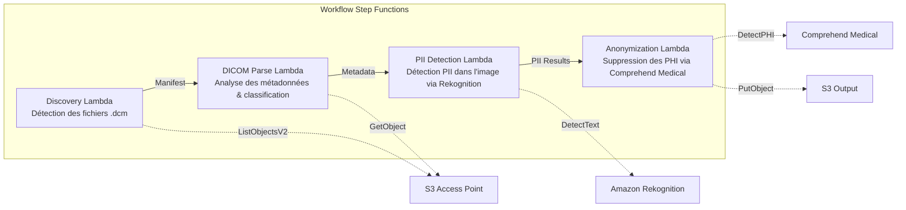

# UC5 : Santé — Classification et anonymisation automatiques des images DICOM

🌐 **Language / 言語**: [日本語](README.md) | [English](README.en.md) | [한국어](README.ko.md) | [简体中文](README.zh-CN.md) | [繁體中文](README.zh-TW.md) | Français | [Deutsch](README.de.md) | [Español](README.es.md)

📚 **Documentation** : [Schéma d'architecture](docs/architecture.md) | [Guide de démonstration](docs/demo-guide.md)

## Aperçu

En s'appuyant sur les S3 Access Points de FSx for ONTAP, ce workflow serverless classe et anonymise automatiquement les images médicales DICOM. Il assure la protection de la vie privée des patients et une gestion efficace des images.

### Cas où ce modèle est adapté

- Vous souhaitez anonymiser régulièrement les fichiers DICOM stockés dans FSx for ONTAP depuis un PACS / VNA
- Vous souhaitez supprimer automatiquement les PHI (Protected Health Information) pour créer des jeux de données de recherche
- Vous souhaitez détecter les informations patient incrustées dans les images (Burned-in Annotation)
- Vous souhaitez optimiser la gestion des images grâce à une classification automatique par modalité et par région anatomique
- Vous souhaitez construire un pipeline d'anonymisation conforme à HIPAA / aux lois sur la protection des données personnelles

### Cas où ce modèle n'est pas adapté

- Routage DICOM en temps réel (nécessite une intégration DICOM MWL / MPPS)
- IA d'aide au diagnostic sur les images (CAD) — ce modèle se spécialise dans la classification et l'anonymisation
- Le transfert de données inter-régions n'est pas autorisé pour des raisons réglementaires dans les régions où Comprehend Medical n'est pas disponible
- La taille des fichiers DICOM dépasse 5 Go (par exemple, MR/CT multi-frames)

### Fonctionnalités principales

- Détection automatique des fichiers .dcm via S3 AP
- Analyse des métadonnées DICOM (nom du patient, date d'examen, modalité, région anatomique) et classification
- Détection des informations personnelles identifiables (PII) incrustées dans les images à l'aide d'Amazon Rekognition
- Identification et suppression des PHI (Protected Health Information) à l'aide d'Amazon Comprehend Medical
- Sortie S3 des fichiers DICOM anonymisés avec les métadonnées de classification

## Success Metrics

### Outcome
Grâce à la classification et à l'anonymisation automatiques des images DICOM, améliorer l'efficacité de la recherche pour le service de radiologie et protéger la vie privée des patients.

### Metrics
| Métrique | Valeur cible (exemple) |
|-----------|------------|
| Fichiers DICOM traités / exécution | > 500 files |
| Précision de classification | > 90% |
| Taux de réussite de l'anonymisation | 100% (zéro fuite de PHI) |
| Temps de traitement / fichier | < 30 secondes |
| Coût / exécution | < $15 |
| Taux obligatoire de Human Review | 100% (vérification de tous les résultats d'anonymisation recommandée) |

> **Raison des 100% de Human Review** : comme une anonymisation manquée affecte directement la vie privée des patients, une vérification humaine de tous les fichiers est recommandée.

### Measurement Method
Historique d'exécution Step Functions, Comprehend Medical entity count, revue des diff avant/après anonymisation et CloudWatch Metrics. Les résultats des revues sont enregistrés dans DynamoDB afin de pouvoir retracer « qui a vérifié quoi et quand » lors des audits.

## Architecture



### Étapes du workflow

1. **Discovery** : détecter les fichiers .dcm depuis le S3 AP et générer un Manifest
2. **DICOM Parse** : analyser les métadonnées DICOM (patient name, study date, modality, body part) et classer par modalité et région anatomique
3. **PII Detection** : détecter les informations personnelles incrustées dans les pixels de l'image à l'aide de Rekognition
4. **Anonymization** : identifier et supprimer les PHI à l'aide de Comprehend Medical, puis exporter le DICOM anonymisé avec les métadonnées de classification vers S3

## Prérequis

- Un compte AWS et des autorisations IAM appropriées
- Un système de fichiers FSx for ONTAP (ONTAP 9.17.1P4D3 ou version ultérieure)
- Un volume avec les S3 Access Points activés
- Les informations d'identification de l'API REST ONTAP enregistrées dans Secrets Manager
- Un VPC et des sous-réseaux privés
- Une région où Amazon Rekognition et Amazon Comprehend Medical sont disponibles

## Étapes de déploiement

### 1. Préparation des paramètres

Avant le déploiement, vérifiez les valeurs suivantes :

- FSx for ONTAP S3 Access Point Alias
- Adresse IP de gestion ONTAP
- Nom du secret Secrets Manager
- ID du VPC, ID des sous-réseaux privés

### 2. Déploiement SAM

```bash
# Prerequisite: AWS SAM CLI required. 'sam build' packages the code and shared layer automatically.
sam build

sam deploy \
  --stack-name fsxn-healthcare-dicom \
  --parameter-overrides \
    S3AccessPointAlias=<your-volume-ext-s3alias> \
    S3AccessPointName=<your-s3ap-name> \
    S3AccessPointOutputAlias=<your-output-volume-ext-s3alias> \
    OntapSecretName=<your-ontap-secret-name> \
    OntapManagementIp=<your-ontap-management-ip> \
    ScheduleExpression="rate(1 hour)" \
    VpcId=<your-vpc-id> \
    PrivateSubnetIds=<subnet-1>,<subnet-2> \
    NotificationEmail=<your-email@example.com> \
    EnableVpcEndpoints=false \
    EnableCloudWatchAlarms=false \
  --capabilities CAPABILITY_NAMED_IAM \
  --resolve-s3 \
  --region ap-northeast-1
```

> **Remarque** : `template.yaml` s'utilise avec le SAM CLI (`sam build` + `sam deploy`).
> Pour un déploiement direct avec la commande `aws cloudformation deploy`, utilisez `template-deploy.yaml` (cela nécessite un pré-packaging des fichiers zip Lambda et leur téléversement sur S3).

> **Remarque** : remplacez les espaces réservés `<...>` par les valeurs réelles de votre environnement.

### 3. Confirmation de l'abonnement SNS

Après le déploiement, un e-mail de confirmation d'abonnement SNS est envoyé à l'adresse e-mail spécifiée.

> **Remarque** : si vous omettez `S3AccessPointName`, la politique IAM ne repose que sur l'Alias et une erreur `AccessDenied` peut se produire. Il est recommandé de le spécifier dans les environnements de production. Pour plus de détails, consultez le [Guide de dépannage](../docs/guides/troubleshooting-guide.md#1-accessdenied-エラー).

## Liste des paramètres de configuration

| Paramètre | Description | Par défaut | Requis |
|-----------|------|----------|------|
| `S3AccessPointAlias` | FSx for ONTAP S3 AP Alias (pour l'entrée) | — | ✅ |
| `S3AccessPointName` | Nom du S3 AP (pour l'octroi d'autorisations IAM basées sur l'ARN ; basé uniquement sur l'Alias si omis) | `""` | ⚠️ Recommandé |
| `S3AccessPointOutputAlias` | FSx for ONTAP S3 AP Alias (pour la sortie) | — | ✅ |
| `OntapSecretName` | Nom du secret Secrets Manager des informations d'identification ONTAP | — | ✅ |
| `OntapManagementIp` | Adresse IP de gestion du cluster ONTAP | — | ✅ |
| `ScheduleExpression` | Expression de planification d'EventBridge Scheduler | `rate(1 hour)` | |
| `VpcId` | ID du VPC | — | ✅ |
| `PrivateSubnetIds` | Liste des ID de sous-réseaux privés | — | ✅ |
| `NotificationEmail` | Adresse e-mail de notification SNS | — | ✅ |
| `EnableVpcEndpoints` | Activer les Interface VPC Endpoints | `false` | |
| `EnableCloudWatchAlarms` | Activer les CloudWatch Alarms | `false` | |

## Structure des coûts

### À la demande (facturation à l'usage)

| Service | Unité de facturation | Estimation (100 fichiers DICOM/mois) |
|---------|---------|---------------------------|
| Lambda | Nombre de requêtes + temps d'exécution | ~$0.01 |
| Step Functions | Nombre de transitions d'état | Dans l'offre gratuite |
| S3 API | Nombre de requêtes | ~$0.01 |
| Rekognition | Nombre d'images | ~$0.10 |
| Comprehend Medical | Nombre d'unités | ~$0.05 |

### En continu (facultatif)

| Service | Paramètre | Mensuel |
|---------|-----------|------|
| Interface VPC Endpoints | `EnableVpcEndpoints=true` | ~$28.80 |
| CloudWatch Alarms | `EnableCloudWatchAlarms=true` | ~$0.20 |

> Dans un environnement de démonstration/PoC, l'utilisation est possible à partir de **~$0.17/mois** avec les seuls coûts variables.

## Sécurité et conformité

Comme ce workflow traite des données médicales, il met en œuvre les mesures de sécurité suivantes :

- **Chiffrement** : le bucket de sortie S3 est chiffré avec SSE-KMS
- **Exécution dans un VPC** : les fonctions Lambda s'exécutent au sein d'un VPC (l'activation des VPC Endpoints est recommandée)
- **IAM au moindre privilège** : chaque fonction Lambda reçoit uniquement les autorisations IAM minimales nécessaires
- **Suppression des PHI** : les informations de santé protégées sont automatiquement détectées et supprimées avec Comprehend Medical
- **Journaux d'audit** : tous les traitements sont journalisés dans CloudWatch Logs

> **Remarque** : ce modèle est une implémentation d'exemple. Son utilisation dans un environnement médical réel nécessite des mesures de sécurité supplémentaires et un examen de conformité conformément aux exigences réglementaires telles que HIPAA.

## Nettoyage

```bash
# Delete the CloudFormation stack
aws cloudformation delete-stack \
  --stack-name fsxn-healthcare-dicom \
  --region ap-northeast-1

# Wait for deletion to complete
aws cloudformation wait stack-delete-complete \
  --stack-name fsxn-healthcare-dicom \
  --region ap-northeast-1
```

> **Remarque** : la suppression de la pile peut échouer s'il reste des objets dans le bucket S3. Videz le bucket au préalable.

## Régions prises en charge

UC5 utilise les services suivants :

| Service | Contrainte de région |
|---------|-------------|
| Amazon Rekognition | Disponible dans presque toutes les régions |
| Amazon Comprehend Medical | Pris en charge uniquement dans des régions limitées. Spécifiez une région prise en charge (par exemple, us-east-1) avec le paramètre `COMPREHEND_MEDICAL_REGION` |
| AWS X-Ray | Disponible dans presque toutes les régions |
| CloudWatch EMF | Disponible dans presque toutes les régions |

> L'API Comprehend Medical est appelée via un Cross-Region Client. Vérifiez vos exigences de résidence des données. Pour plus de détails, consultez la [Matrice de compatibilité des régions](../docs/region-compatibility.md).

## Références

### Documentation officielle AWS

- [Aperçu des FSx for ONTAP S3 Access Points](https://docs.aws.amazon.com/fsx/latest/ONTAPGuide/accessing-data-via-s3-access-points.html)
- [Traitement serverless avec Lambda (tutoriel officiel)](https://docs.aws.amazon.com/fsx/latest/ONTAPGuide/tutorial-process-files-with-lambda.html)
- [Comprehend Medical DetectPHI API](https://docs.aws.amazon.com/comprehend-medical/latest/dev/API_DetectPHI.html)
- [Rekognition DetectText API](https://docs.aws.amazon.com/rekognition/latest/dg/API_DetectText.html)
- [Livre blanc HIPAA on AWS](https://docs.aws.amazon.com/whitepapers/latest/architecting-hipaa-security-and-compliance-on-aws/welcome.html)

### Articles de blog AWS

- [Blog d'annonce des S3 AP](https://aws.amazon.com/blogs/aws/amazon-fsx-for-netapp-ontap-now-integrates-with-amazon-s3-for-seamless-data-access/)
- [FSx for ONTAP + Bedrock RAG](https://aws.amazon.com/blogs/machine-learning/build-rag-based-generative-ai-applications-in-aws-using-amazon-fsx-for-netapp-ontap-with-amazon-bedrock/)

### Exemples GitHub

- [aws-samples/amazon-rekognition-serverless-large-scale-image-and-video-processing](https://github.com/aws-samples/amazon-rekognition-serverless-large-scale-image-and-video-processing) — Traitement Rekognition à grande échelle
- [aws-samples/serverless-patterns](https://github.com/aws-samples/serverless-patterns) — Collection de modèles serverless

## Environnement validé

| Élément | Valeur |
|------|-----|
| Région AWS | ap-northeast-1 (Tokyo) |
| Version de FSx for ONTAP | ONTAP 9.17.1P4D3 |
| Configuration FSx for ONTAP | SINGLE_AZ_1 |
| Python | 3.12 |
| Méthode de déploiement | CloudFormation (standard) |

## Architecture de placement Lambda dans le VPC

Sur la base des enseignements tirés de la validation, les fonctions Lambda sont réparties à l'intérieur et à l'extérieur du VPC.

**Lambda à l'intérieur du VPC** (uniquement les fonctions nécessitant un accès à l'API REST ONTAP) :
- Discovery Lambda — S3 AP + ONTAP API

**Lambda à l'extérieur du VPC** (uniquement les fonctions utilisant les API de services gérés AWS) :
- Toutes les autres fonctions Lambda

> **Raison** : accéder aux API de services gérés AWS (Athena, Bedrock, Textract, etc.) depuis une Lambda à l'intérieur du VPC nécessite des Interface VPC Endpoints (chacun à 7,20 $/mois). Une Lambda à l'extérieur du VPC peut accéder directement aux API AWS via Internet et fonctionner sans coût supplémentaire.

> **Remarque** : pour un UC qui utilise l'API REST ONTAP (UC1 Juridique & Conformité), `EnableVpcEndpoints=true` est requis. Cela permet de récupérer les informations d'identification ONTAP via le VPC Endpoint de Secrets Manager.

---

## Liens vers la documentation AWS

| Service | Documentation |
|---------|------------|
| FSx for ONTAP | [FSx for ONTAP](https://docs.aws.amazon.com/fsx/latest/ONTAPGuide/what-is-fsx-ontap.html) |
| S3 Access Points | [S3 Access Points](https://docs.aws.amazon.com/fsx/latest/ONTAPGuide/s3-access-points.html) |
| Step Functions | [Step Functions](https://docs.aws.amazon.com/step-functions/latest/dg/welcome.html) |
| Amazon Comprehend Medical | [Amazon Comprehend Medical](https://docs.aws.amazon.com/comprehend-medical/latest/dev/comprehendmedical-welcome.html) |
| Amazon Bedrock | [Amazon Bedrock](https://docs.aws.amazon.com/bedrock/latest/userguide/what-is-bedrock.html) |
| Services éligibles HIPAA d'AWS | [Services éligibles HIPAA d'AWS](https://aws.amazon.com/compliance/hipaa-eligible-services-reference/) |

### Alignement avec le Well-Architected Framework

| Pilier | Alignement |
|----|------|
| Excellence opérationnelle | Traçage X-Ray, métriques EMF, journaux d'audit d'anonymisation |
| Sécurité | IAM au moindre privilège, chiffrement KMS, détection & anonymisation des PII, considérations HIPAA |
| Fiabilité | Step Functions Retry/Catch, basculement inter-régions |
| Efficacité des performances | Optimisation de la mémoire Lambda, traitement DICOM en streaming |
| Optimisation des coûts | Serverless, facturation à la page de Comprehend Medical |
| Durabilité | Exécution à la demande, réutilisation des données anonymisées |

---

## Tests locaux

### Vérification des prérequis

```bash
# Confirm prerequisites
aws --version          # AWS CLI v2
sam --version          # SAM CLI
python3 --version      # Python 3.9+
docker --version       # Docker (for sam local)
aws sts get-caller-identity  # AWS credentials
```

### sam local invoke

```bash
# Build
# Prerequisite: AWS SAM CLI required. 'sam build' packages the code and shared layer automatically.
sam build

# Run the Discovery Lambda locally
sam local invoke DiscoveryFunction --event events/discovery-event.json

# With environment variable overrides
sam local invoke DiscoveryFunction \
  --event events/discovery-event.json \
  --env-vars env.json
```

### Tests unitaires

```bash
python3 -m pytest tests/ -v
```

Pour plus de détails, consultez le [Démarrage rapide des tests locaux](../docs/local-testing-quick-start.md).

---

## Exemple de sortie (Output Sample)

Exemple de sortie du pipeline d'anonymisation DICOM :

```json
{
  "discovery": {
    "status": "completed",
    "object_count": 12,
    "prefix": "dicom-inbox/"
  },
  "anonymization": [
    {
      "key": "dicom-inbox/study-001/series-001.dcm",
      "pii_detected": ["PatientName", "PatientID", "InstitutionName"],
      "pii_removed": 3,
      "anonymized_key": "anonymized/study-001/series-001.dcm",
      "integrity_hash": "sha256:a1b2c3..."
    }
  ],
  "report": {
    "total_files": 12,
    "anonymized": 12,
    "pii_fields_removed": 36,
    "compliance_status": "HIPAA_SAFE_HARBOR_COMPLIANT"
  }
}
```

> **Note** : ce qui précède est une sortie d'exemple ; les valeurs réelles varient selon l'environnement et les données d'entrée. Les chiffres de benchmark constituent une référence de dimensionnement (sizing reference), et non une limite de service (service limit).

---

## Governance Note

> Ce modèle fournit des conseils d'architecture technique. Il ne s'agit pas de conseils juridiques, de conformité ou réglementaires. Les organisations doivent consulter des professionnels qualifiés.

---

## S3AP Compatibility

Pour les contraintes de compatibilité, le dépannage et les modèles de déclenchement des S3 Access Points for FSx for ONTAP, consultez les [S3AP Compatibility Notes](../docs/s3ap-compatibility-notes.md).
