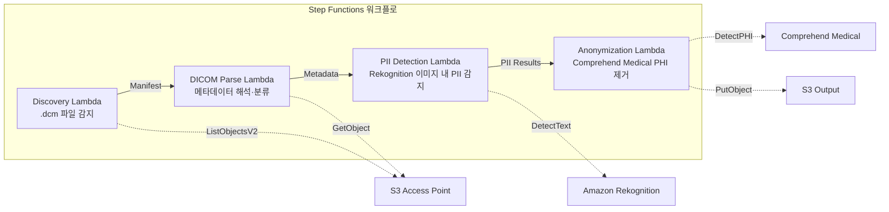

# UC5: 의료 — DICOM 이미지의 자동 분류 및 익명화

🌐 **Language / 言語**: [日本語](README.md) | [English](README.en.md) | 한국어 | [简体中文](README.zh-CN.md) | [繁體中文](README.zh-TW.md) | [Français](README.fr.md) | [Deutsch](README.de.md) | [Español](README.es.md)

📚 **문서**: [아키텍처 다이어그램](docs/architecture.md) | [데모 가이드](docs/demo-guide.md)

## 개요

FSx for ONTAP의 S3 Access Points를 활용하여 DICOM 의료 이미지의 자동 분류 및 익명화를 수행하는 서버리스 워크플로입니다. 환자 프라이버시 보호와 효율적인 이미지 관리를 실현합니다.

### 이 패턴이 적합한 경우

- PACS / VNA에서 FSx for ONTAP에 저장된 DICOM 파일을 정기적으로 익명화하고 싶은 경우
- 연구용 데이터셋 작성을 위해 PHI(보호 대상 의료 정보)를 자동으로 제거하고 싶은 경우
- 이미지에 새겨진 환자 정보(Burned-in Annotation)를 감지하고 싶은 경우
- 모달리티·부위에 따른 자동 분류로 이미지 관리를 효율화하고 싶은 경우
- HIPAA / 개인정보보호법을 준수하는 익명화 파이프라인을 구축하고 싶은 경우

### 이 패턴이 적합하지 않은 경우

- 실시간 DICOM 라우팅(DICOM MWL / MPPS 연동이 필요)
- 이미지 진단 지원 AI(CAD) — 본 패턴은 분류·익명화에 특화
- Comprehend Medical 미지원 리전에서 규제상 크로스 리전 데이터 전송이 허용되지 않는 경우
- DICOM 파일 크기가 5 GB를 초과하는 경우(MR/CT의 멀티 프레임 등)

### 주요 기능

- S3 AP를 통한 .dcm 파일 자동 감지
- DICOM 메타데이터 해석(환자명, 검사일, 모달리티, 부위) 및 분류
- Amazon Rekognition을 사용한 이미지 내 새겨진 개인 정보(PII) 감지
- Amazon Comprehend Medical을 사용한 PHI(보호 대상 의료 정보) 식별 및 제거
- 익명화된 DICOM 파일의 분류 메타데이터 포함 S3 출력

## Success Metrics

### Outcome
DICOM 이미지의 자동 분류·익명화를 통해 방사선과의 검색 효율 향상과 환자 프라이버시 보호를 실현합니다.

### Metrics
| 메트릭 | 목표값(예) |
|-----------|------------|
| 처리 완료 DICOM 파일 수 / 실행 | > 500 files |
| 분류 정확도 | > 90% |
| 익명화 성공률 | 100%(PHI 유출 제로) |
| 처리 시간 / 파일 | < 30초 |
| 비용 / 실행 | < $15 |
| Human Review 필수율 | 100%(익명화 결과는 전건 확인 권장) |

> **100% Human Review의 이유**: 익명화 누락이 환자 프라이버시에 직접 영향을 미치므로 전건에 대한 사람의 확인을 권장합니다.

### Measurement Method
Step Functions 실행 이력, Comprehend Medical entity count, 익명화 전후의 diff 리뷰, CloudWatch Metrics. 리뷰 결과는 DynamoDB에 기록하여 감사 시 "누가·언제·무엇을 확인했는지"를 추적할 수 있도록 합니다.

## 아키텍처



### 워크플로 단계

1. **Discovery**: S3 AP에서 .dcm 파일을 감지하고 Manifest를 생성
2. **DICOM Parse**: DICOM 메타데이터(patient name, study date, modality, body part)를 해석하고 모달리티·부위로 분류
3. **PII Detection**: Rekognition으로 이미지 픽셀 내에 새겨진 개인 정보를 감지
4. **Anonymization**: Comprehend Medical로 PHI를 식별·제거하고, 익명화된 DICOM을 분류 메타데이터와 함께 S3에 출력

## 전제 조건

- AWS 계정과 적절한 IAM 권한
- FSx for ONTAP 파일 시스템(ONTAP 9.17.1P4D3 이상)
- S3 Access Points가 활성화된 볼륨
- ONTAP REST API 자격 증명이 Secrets Manager에 등록되어 있음
- VPC, 프라이빗 서브넷
- Amazon Rekognition, Amazon Comprehend Medical을 사용할 수 있는 리전

## 배포 절차

### 1. 매개변수 준비

배포 전에 다음 값을 확인하세요:

- FSx for ONTAP S3 Access Point Alias
- ONTAP 관리 IP 주소
- Secrets Manager 시크릿 이름
- VPC ID, 프라이빗 서브넷 ID

### 2. SAM 배포

```bash
# Prerequisite: AWS SAM CLI required. 'sam build' packages the code and shared layer automatically.
sam build

sam deploy \
  --stack-name fsxn-healthcare-dicom \
  --parameter-overrides \
    S3AccessPointAlias=<your-volume-ext-s3alias> \
    S3AccessPointName=<your-s3ap-name> \
    S3AccessPointOutputAlias=<your-output-volume-ext-s3alias> \
    OntapSecretName=<your-ontap-secret-name> \
    OntapManagementIp=<your-ontap-management-ip> \
    ScheduleExpression="rate(1 hour)" \
    VpcId=<your-vpc-id> \
    PrivateSubnetIds=<subnet-1>,<subnet-2> \
    NotificationEmail=<your-email@example.com> \
    EnableVpcEndpoints=false \
    EnableCloudWatchAlarms=false \
  --capabilities CAPABILITY_NAMED_IAM \
  --resolve-s3 \
  --region ap-northeast-1
```

> **주의**: `template.yaml`은 SAM CLI(`sam build` + `sam deploy`)로 사용합니다.
> `aws cloudformation deploy` 명령으로 직접 배포하는 경우에는 `template-deploy.yaml`을 사용하세요(Lambda zip 파일의 사전 패키징과 S3 업로드가 필요합니다).

> **주의**: `<...>` 플레이스홀더를 실제 환경 값으로 교체하세요.

### 3. SNS 구독 확인

배포 후 지정한 이메일 주소로 SNS 구독 확인 이메일이 전송됩니다.

> **주의**: `S3AccessPointName`을 생략하면 IAM 정책이 Alias 기반으로만 되어 `AccessDenied` 오류가 발생할 수 있습니다. 운영 환경에서는 지정을 권장합니다. 자세한 내용은 [문제 해결 가이드](../docs/guides/troubleshooting-guide.md#1-accessdenied-エラー)를 참조하세요.

## 설정 매개변수 목록

| 매개변수 | 설명 | 기본값 | 필수 |
|-----------|------|----------|------|
| `S3AccessPointAlias` | FSx for ONTAP S3 AP Alias(입력용) | — | ✅ |
| `S3AccessPointName` | S3 AP 이름(ARN 기반 IAM 권한 부여용. 생략 시 Alias 기반만) | `""` | ⚠️ 권장 |
| `S3AccessPointOutputAlias` | FSx for ONTAP S3 AP Alias(출력용) | — | ✅ |
| `OntapSecretName` | ONTAP 자격 증명의 Secrets Manager 시크릿 이름 | — | ✅ |
| `OntapManagementIp` | ONTAP 클러스터 관리 IP 주소 | — | ✅ |
| `ScheduleExpression` | EventBridge Scheduler의 스케줄 식 | `rate(1 hour)` | |
| `VpcId` | VPC ID | — | ✅ |
| `PrivateSubnetIds` | 프라이빗 서브넷 ID 목록 | — | ✅ |
| `NotificationEmail` | SNS 통지 대상 이메일 주소 | — | ✅ |
| `EnableVpcEndpoints` | Interface VPC Endpoints 활성화 | `false` | |
| `EnableCloudWatchAlarms` | CloudWatch Alarms 활성화 | `false` | |

## 비용 구조

### 요청 기반(사용량 기반)

| 서비스 | 과금 단위 | 개산(100 DICOM 파일/월) |
|---------|---------|---------------------------|
| Lambda | 요청 수 + 실행 시간 | ~$0.01 |
| Step Functions | 상태 전이 수 | 무료 한도 내 |
| S3 API | 요청 수 | ~$0.01 |
| Rekognition | 이미지 수 | ~$0.10 |
| Comprehend Medical | 유닛 수 | ~$0.05 |

### 상시 가동(선택 사항)

| 서비스 | 매개변수 | 월액 |
|---------|-----------|------|
| Interface VPC Endpoints | `EnableVpcEndpoints=true` | ~$28.80 |
| CloudWatch Alarms | `EnableCloudWatchAlarms=true` | ~$0.20 |

> 데모/PoC 환경에서는 변동비만으로 **월 ~$0.17**부터 이용할 수 있습니다.

## 보안 및 규정 준수

본 워크플로는 의료 데이터를 다루므로 다음과 같은 보안 조치를 구현하고 있습니다:

- **암호화**: S3 출력 버킷은 SSE-KMS로 암호화
- **VPC 내 실행**: Lambda 함수는 VPC 내에서 실행(VPC Endpoints 활성화 권장)
- **최소 권한 IAM**: 각 Lambda 함수에 필요한 최소한의 IAM 권한 부여
- **PHI 제거**: Comprehend Medical로 보호 대상 의료 정보를 자동 감지·제거
- **감사 로그**: CloudWatch Logs로 모든 처리 로그를 기록

> **주의**: 본 패턴은 샘플 구현입니다. 실제 의료 환경에서 사용하려면 HIPAA 등의 규제 요건에 따른 추가 보안 조치와 규정 준수 검토가 필요합니다.

## 정리

```bash
# Delete the CloudFormation stack
aws cloudformation delete-stack \
  --stack-name fsxn-healthcare-dicom \
  --region ap-northeast-1

# Wait for deletion to complete
aws cloudformation wait stack-delete-complete \
  --stack-name fsxn-healthcare-dicom \
  --region ap-northeast-1
```

> **주의**: S3 버킷에 객체가 남아 있으면 스택 삭제가 실패할 수 있습니다. 사전에 버킷을 비워 두세요.

## 지원되는 리전

UC5는 다음 서비스를 사용합니다:

| 서비스 | 리전 제약 |
|---------|-------------|
| Amazon Rekognition | 거의 모든 리전에서 이용 가능 |
| Amazon Comprehend Medical | 한정된 리전만 지원. `COMPREHEND_MEDICAL_REGION` 매개변수로 지원 리전(us-east-1 등)을 지정 |
| AWS X-Ray | 거의 모든 리전에서 이용 가능 |
| CloudWatch EMF | 거의 모든 리전에서 이용 가능 |

> Cross-Region Client를 통해 Comprehend Medical API를 호출합니다. 데이터 레지던시 요구 사항을 확인하세요. 자세한 내용은 [리전 호환성 매트릭스](../docs/region-compatibility.md)를 참조하세요.

## 참고 링크

### AWS 공식 문서

- [FSx for ONTAP S3 Access Points 개요](https://docs.aws.amazon.com/fsx/latest/ONTAPGuide/accessing-data-via-s3-access-points.html)
- [Lambda로 서버리스 처리(공식 튜토리얼)](https://docs.aws.amazon.com/fsx/latest/ONTAPGuide/tutorial-process-files-with-lambda.html)
- [Comprehend Medical DetectPHI API](https://docs.aws.amazon.com/comprehend-medical/latest/dev/API_DetectPHI.html)
- [Rekognition DetectText API](https://docs.aws.amazon.com/rekognition/latest/dg/API_DetectText.html)
- [HIPAA on AWS 백서](https://docs.aws.amazon.com/whitepapers/latest/architecting-hipaa-security-and-compliance-on-aws/welcome.html)

### AWS 블로그 기사

- [S3 AP 발표 블로그](https://aws.amazon.com/blogs/aws/amazon-fsx-for-netapp-ontap-now-integrates-with-amazon-s3-for-seamless-data-access/)
- [FSx for ONTAP + Bedrock RAG](https://aws.amazon.com/blogs/machine-learning/build-rag-based-generative-ai-applications-in-aws-using-amazon-fsx-for-netapp-ontap-with-amazon-bedrock/)

### GitHub 샘플

- [aws-samples/amazon-rekognition-serverless-large-scale-image-and-video-processing](https://github.com/aws-samples/amazon-rekognition-serverless-large-scale-image-and-video-processing) — Rekognition 대규모 처리
- [aws-samples/serverless-patterns](https://github.com/aws-samples/serverless-patterns) — 서버리스 패턴 모음

## 검증된 환경

| 항목 | 값 |
|------|-----|
| AWS 리전 | ap-northeast-1 (도쿄) |
| FSx for ONTAP 버전 | ONTAP 9.17.1P4D3 |
| FSx for ONTAP 구성 | SINGLE_AZ_1 |
| Python | 3.12 |
| 배포 방식 | CloudFormation (표준) |

## Lambda VPC 배치 아키텍처

검증에서 얻은 지견을 바탕으로 Lambda 함수는 VPC 내부/외부에 분리하여 배치되어 있습니다.

**VPC 내부 Lambda**(ONTAP REST API 액세스가 필요한 함수만):
- Discovery Lambda — S3 AP + ONTAP API

**VPC 외부 Lambda**(AWS 관리형 서비스 API만 사용):
- 그 외 모든 Lambda 함수

> **이유**: VPC 내부 Lambda에서 AWS 관리형 서비스 API(Athena, Bedrock, Textract 등)에 액세스하려면 Interface VPC Endpoint가 필요합니다(각 $7.20/월). VPC 외부 Lambda는 인터넷을 경유하여 AWS API에 직접 액세스할 수 있으며 추가 비용 없이 작동합니다.

> **주의**: ONTAP REST API를 사용하는 UC(UC1 법무·컴플라이언스)에서는 `EnableVpcEndpoints=true`가 필수입니다. Secrets Manager VPC Endpoint를 통해 ONTAP 자격 증명을 취득하기 때문입니다.

---

## AWS 문서 링크

| 서비스 | 문서 |
|---------|------------|
| FSx for ONTAP | [FSx for ONTAP](https://docs.aws.amazon.com/fsx/latest/ONTAPGuide/what-is-fsx-ontap.html) |
| S3 Access Points | [S3 Access Points](https://docs.aws.amazon.com/fsx/latest/ONTAPGuide/s3-access-points.html) |
| Step Functions | [Step Functions](https://docs.aws.amazon.com/step-functions/latest/dg/welcome.html) |
| Amazon Comprehend Medical | [Amazon Comprehend Medical](https://docs.aws.amazon.com/comprehend-medical/latest/dev/comprehendmedical-welcome.html) |
| Amazon Bedrock | [Amazon Bedrock](https://docs.aws.amazon.com/bedrock/latest/userguide/what-is-bedrock.html) |
| AWS HIPAA 대응 서비스 | [AWS HIPAA 대응 서비스](https://aws.amazon.com/compliance/hipaa-eligible-services-reference/) |

### Well-Architected Framework 대응

| 기둥 | 대응 |
|----|------|
| 운영 우수성 | X-Ray 트레이싱, EMF 메트릭, 익명화 감사 로그 |
| 보안 | 최소 권한 IAM, KMS 암호화, PII 감지·익명화, HIPAA 고려 |
| 신뢰성 | Step Functions Retry/Catch, 크로스 리전 폴백 |
| 성능 효율 | Lambda 메모리 최적화, DICOM 스트리밍 처리 |
| 비용 최적화 | 서버리스, Comprehend Medical 페이지 단위 과금 |
| 지속 가능성 | 온디맨드 실행, 익명화된 데이터의 재사용 |

---

## 로컬 테스트

### Prerequisites 체크

```bash
# Confirm prerequisites
aws --version          # AWS CLI v2
sam --version          # SAM CLI
python3 --version      # Python 3.9+
docker --version       # Docker (for sam local)
aws sts get-caller-identity  # AWS credentials
```

### sam local invoke

```bash
# Build
# Prerequisite: AWS SAM CLI required. 'sam build' packages the code and shared layer automatically.
sam build

# Run the Discovery Lambda locally
sam local invoke DiscoveryFunction --event events/discovery-event.json

# With environment variable overrides
sam local invoke DiscoveryFunction \
  --event events/discovery-event.json \
  --env-vars env.json
```

### 유닛 테스트

```bash
python3 -m pytest tests/ -v
```

자세한 내용은 [로컬 테스트 퀵 스타트](../docs/local-testing-quick-start.md)를 참조하세요.

---

## 출력 샘플 (Output Sample)

DICOM 익명화 파이프라인의 출력 예:

```json
{
  "discovery": {
    "status": "completed",
    "object_count": 12,
    "prefix": "dicom-inbox/"
  },
  "anonymization": [
    {
      "key": "dicom-inbox/study-001/series-001.dcm",
      "pii_detected": ["PatientName", "PatientID", "InstitutionName"],
      "pii_removed": 3,
      "anonymized_key": "anonymized/study-001/series-001.dcm",
      "integrity_hash": "sha256:a1b2c3..."
    }
  ],
  "report": {
    "total_files": 12,
    "anonymized": 12,
    "pii_fields_removed": 36,
    "compliance_status": "HIPAA_SAFE_HARBOR_COMPLIANT"
  }
}
```

> **참고**: 위는 샘플 출력이며 실제 값은 환경·입력 데이터에 따라 다릅니다. 벤치마크 수치는 sizing reference이며 service limit이 아닙니다.

---

## Governance Note

> 본 패턴은 기술 아키텍처 가이던스를 제공합니다. 법적·컴플라이언스·규제상의 조언이 아닙니다. 조직은 적격한 전문가에게 상담하세요.

---

## S3AP Compatibility

S3 Access Points for FSx for ONTAP의 호환성 제약, 문제 해결, 트리거 패턴에 대해서는 [S3AP Compatibility Notes](../docs/s3ap-compatibility-notes.md)를 참조하세요.
