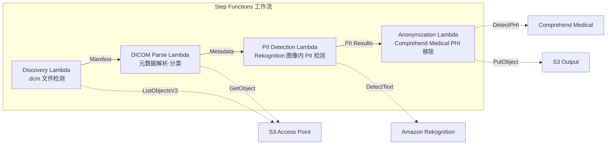

# UC5：医疗 — DICOM 图像的自动分类与匿名化

🌐 **Language / 言語**: [日本語](README.md) | [English](README.en.md) | [한국어](README.ko.md) | 简体中文 | [繁體中文](README.zh-TW.md) | [Français](README.fr.md) | [Deutsch](README.de.md) | [Español](README.es.md)

📚 **文档**: [架构图](docs/architecture.md) | [演示指南](docs/demo-guide.md)

## 概述

利用 FSx for ONTAP 的 S3 Access Points，实现 DICOM 医用图像的自动分类与匿名化的无服务器工作流。保护患者隐私并实现高效的图像管理。

### 适合此模式的情况

- 希望定期对从 PACS / VNA 保存到 FSx for ONTAP 的 DICOM 文件进行匿名化
- 希望为创建研究用数据集自动移除 PHI（受保护健康信息）
- 希望检测图像中烧录的患者信息（Burned-in Annotation）
- 希望通过按模态·部位的自动分类来提升图像管理效率
- 希望构建符合 HIPAA / 个人信息保护法的匿名化流水线

### 不适合此模式的情况

- 实时 DICOM 路由（需要 DICOM MWL / MPPS 集成）
- 图像诊断辅助 AI（CAD）— 本模式专注于分类·匿名化
- 在 Comprehend Medical 不支持的区域，法规上不允许跨区域数据传输
- DICOM 文件大小超过 5 GB（MR/CT 的多帧等）

### 主要功能

- 通过 S3 AP 自动检测 .dcm 文件
- DICOM 元数据解析（患者姓名、检查日期、模态、部位）与分类
- 使用 Amazon Rekognition 检测图像中烧录的个人身份信息（PII）
- 使用 Amazon Comprehend Medical 识别并移除 PHI（受保护健康信息）
- 匿名化后的 DICOM 文件附带分类元数据输出到 S3

## Success Metrics

### Outcome
通过 DICOM 图像的自动分类·匿名化，实现放射科检索效率的提升与患者隐私保护。

### Metrics
| 指标 | 目标值（示例） |
|-----------|------------|
| 已处理 DICOM 文件数 / 执行 | > 500 files |
| 分类精度 | > 90% |
| 匿名化成功率 | 100%（PHI 泄露为零） |
| 处理时间 / 文件 | < 30 秒 |
| 成本 / 执行 | < $15 |
| Human Review 必需率 | 100%（建议对匿名化结果全部确认） |

> **100% Human Review 的理由**：由于匿名化遗漏会直接影响患者隐私，因此建议对全部文件进行人工确认。

### Measurement Method
Step Functions 执行历史、Comprehend Medical entity count、匿名化前后的 diff 审查、CloudWatch Metrics。审查结果记录在 DynamoDB 中，以便在审计时追踪"谁·何时·确认了什么"。

## 架构



### 工作流步骤

1. **Discovery**：从 S3 AP 检测 .dcm 文件并生成 Manifest
2. **DICOM Parse**：解析 DICOM 元数据（patient name, study date, modality, body part），并按模态·部位进行分类
3. **PII Detection**：使用 Rekognition 检测图像像素内烧录的个人信息
4. **Anonymization**：使用 Comprehend Medical 识别并移除 PHI，将匿名化的 DICOM 附带分类元数据输出到 S3

## 先决条件

- AWS 账户和适当的 IAM 权限
- FSx for ONTAP 文件系统（ONTAP 9.17.1P4D3 及以上）
- 已启用 S3 Access Points 的卷
- 已在 Secrets Manager 中注册 ONTAP REST API 凭证
- VPC、私有子网
- 支持 Amazon Rekognition 和 Amazon Comprehend Medical 的区域

## 部署步骤

### 1. 准备参数

部署前请确认以下值：

- FSx for ONTAP S3 Access Point Alias
- ONTAP 管理 IP 地址
- Secrets Manager 密钥名称
- VPC ID、私有子网 ID

### 2. SAM 部署

```bash
# Prerequisite: AWS SAM CLI required. 'sam build' packages the code and shared layer automatically.
sam build

sam deploy \
  --stack-name fsxn-healthcare-dicom \
  --parameter-overrides \
    S3AccessPointAlias=<your-volume-ext-s3alias> \
    S3AccessPointName=<your-s3ap-name> \
    S3AccessPointOutputAlias=<your-output-volume-ext-s3alias> \
    OntapSecretName=<your-ontap-secret-name> \
    OntapManagementIp=<your-ontap-management-ip> \
    ScheduleExpression="rate(1 hour)" \
    VpcId=<your-vpc-id> \
    PrivateSubnetIds=<subnet-1>,<subnet-2> \
    NotificationEmail=<your-email@example.com> \
    EnableVpcEndpoints=false \
    EnableCloudWatchAlarms=false \
  --capabilities CAPABILITY_NAMED_IAM \
  --resolve-s3 \
  --region ap-northeast-1
```

> **注意**：`template.yaml` 用于 SAM CLI（`sam build` + `sam deploy`）。
> 如需使用 `aws cloudformation deploy` 命令直接部署，请使用 `template-deploy.yaml`（需要预先打包 Lambda zip 文件并上传到 S3）。

> **注意**：请将 `<...>` 占位符替换为实际的环境值。

### 3. 确认 SNS 订阅

部署后，指定的电子邮件地址将收到 SNS 订阅确认邮件。

> **注意**：如果省略 `S3AccessPointName`，IAM 策略将仅基于 Alias，可能导致 `AccessDenied` 错误。建议在生产环境中指定。有关详细信息，请参阅 [故障排除指南](../docs/guides/troubleshooting-guide.md#1-accessdenied-エラー)。

## 配置参数列表

| 参数 | 说明 | 默认值 | 必需 |
|-----------|------|----------|------|
| `S3AccessPointAlias` | FSx for ONTAP S3 AP Alias（输入用） | — | ✅ |
| `S3AccessPointName` | S3 AP 名称（用于基于 ARN 的 IAM 权限授予。省略时仅基于 Alias） | `""` | ⚠️ 推荐 |
| `S3AccessPointOutputAlias` | FSx for ONTAP S3 AP Alias（输出用） | — | ✅ |
| `OntapSecretName` | ONTAP 凭证的 Secrets Manager 密钥名称 | — | ✅ |
| `OntapManagementIp` | ONTAP 集群管理 IP 地址 | — | ✅ |
| `ScheduleExpression` | EventBridge Scheduler 的计划表达式 | `rate(1 hour)` | |
| `VpcId` | VPC ID | — | ✅ |
| `PrivateSubnetIds` | 私有子网 ID 列表 | — | ✅ |
| `NotificationEmail` | SNS 通知目标电子邮件地址 | — | ✅ |
| `EnableVpcEndpoints` | 启用 Interface VPC Endpoints | `false` | |
| `EnableCloudWatchAlarms` | 启用 CloudWatch Alarms | `false` | |

## 成本结构

### 基于请求（按量付费）

| 服务 | 计费单位 | 概算（100 DICOM 文件/月） |
|---------|---------|---------------------------|
| Lambda | 请求数 + 执行时间 | ~$0.01 |
| Step Functions | 状态转换数 | 免费额度内 |
| S3 API | 请求数 | ~$0.01 |
| Rekognition | 图像数 | ~$0.10 |
| Comprehend Medical | 单元数 | ~$0.05 |

### 常时运行（可选）

| 服务 | 参数 | 月额 |
|---------|-----------|------|
| Interface VPC Endpoints | `EnableVpcEndpoints=true` | ~$28.80 |
| CloudWatch Alarms | `EnableCloudWatchAlarms=true` | ~$0.20 |

> 在演示/PoC 环境中，仅按变动费用即可从 **每月 ~$0.17** 起使用。

## 安全性与合规性

由于本工作流处理医疗数据，因此实施了以下安全措施：

- **加密**：S3 输出存储桶使用 SSE-KMS 加密
- **VPC 内执行**：Lambda 函数在 VPC 内执行（建议启用 VPC Endpoints）
- **最小权限 IAM**：为每个 Lambda 函数授予必要的最小 IAM 权限
- **PHI 移除**：使用 Comprehend Medical 自动检测并移除受保护健康信息
- **审计日志**：使用 CloudWatch Logs 记录所有处理日志

> **注意**：本模式为示例实现。在实际医疗环境中使用时，需要根据 HIPAA 等法规要求实施额外的安全措施和合规性审查。

## 清理

```bash
# Delete the CloudFormation stack
aws cloudformation delete-stack \
  --stack-name fsxn-healthcare-dicom \
  --region ap-northeast-1

# Wait for deletion to complete
aws cloudformation wait stack-delete-complete \
  --stack-name fsxn-healthcare-dicom \
  --region ap-northeast-1
```

> **注意**：如果 S3 存储桶中仍有对象，删除堆栈可能会失败。请提前清空存储桶。

## 支持的区域

UC5 使用以下服务：

| 服务 | 区域约束 |
|---------|-------------|
| Amazon Rekognition | 几乎所有区域均可用 |
| Amazon Comprehend Medical | 仅支持有限区域。使用 `COMPREHEND_MEDICAL_REGION` 参数指定支持的区域（如 us-east-1） |
| AWS X-Ray | 几乎所有区域均可用 |
| CloudWatch EMF | 几乎所有区域均可用 |

> 通过 Cross-Region Client 调用 Comprehend Medical API。请确认数据驻留要求。有关详细信息，请参阅 [区域兼容性矩阵](../docs/region-compatibility.md)。

## 参考链接

### AWS 官方文档

- [FSx for ONTAP S3 Access Points 概述](https://docs.aws.amazon.com/fsx/latest/ONTAPGuide/accessing-data-via-s3-access-points.html)
- [使用 Lambda 进行无服务器处理（官方教程）](https://docs.aws.amazon.com/fsx/latest/ONTAPGuide/tutorial-process-files-with-lambda.html)
- [Comprehend Medical DetectPHI API](https://docs.aws.amazon.com/comprehend-medical/latest/dev/API_DetectPHI.html)
- [Rekognition DetectText API](https://docs.aws.amazon.com/rekognition/latest/dg/API_DetectText.html)
- [HIPAA on AWS 白皮书](https://docs.aws.amazon.com/whitepapers/latest/architecting-hipaa-security-and-compliance-on-aws/welcome.html)

### AWS 博客文章

- [S3 AP 发布博客](https://aws.amazon.com/blogs/aws/amazon-fsx-for-netapp-ontap-now-integrates-with-amazon-s3-for-seamless-data-access/)
- [FSx for ONTAP + Bedrock RAG](https://aws.amazon.com/blogs/machine-learning/build-rag-based-generative-ai-applications-in-aws-using-amazon-fsx-for-netapp-ontap-with-amazon-bedrock/)

### GitHub 示例

- [aws-samples/amazon-rekognition-serverless-large-scale-image-and-video-processing](https://github.com/aws-samples/amazon-rekognition-serverless-large-scale-image-and-video-processing) — Rekognition 大规模处理
- [aws-samples/serverless-patterns](https://github.com/aws-samples/serverless-patterns) — 无服务器模式集合

## 已验证环境

| 项目 | 值 |
|------|-----|
| AWS 区域 | ap-northeast-1 (东京) |
| FSx for ONTAP 版本 | ONTAP 9.17.1P4D3 |
| FSx for ONTAP 配置 | SINGLE_AZ_1 |
| Python | 3.12 |
| 部署方式 | CloudFormation (标准) |

## Lambda VPC 配置架构

根据验证中获得的见解，Lambda 函数被分离部署在 VPC 内部/外部。

**VPC 内部 Lambda**（仅限需要 ONTAP REST API 访问的函数）：
- Discovery Lambda — S3 AP + ONTAP API

**VPC 外部 Lambda**（仅使用 AWS 托管服务 API）：
- 其他所有 Lambda 函数

> **理由**：从 VPC 内部 Lambda 访问 AWS 托管服务 API（Athena、Bedrock、Textract 等）需要 Interface VPC Endpoint（每个 $7.20/月）。VPC 外部 Lambda 可通过互联网直接访问 AWS API，无需额外成本即可运行。

> **注意**：对于使用 ONTAP REST API 的 UC（UC1 法务·合规），`EnableVpcEndpoints=true` 是必需的。这是为了通过 Secrets Manager VPC Endpoint 获取 ONTAP 凭证。

---

## AWS 文档链接

| 服务 | 文档 |
|---------|------------|
| FSx for ONTAP | [FSx for ONTAP](https://docs.aws.amazon.com/fsx/latest/ONTAPGuide/what-is-fsx-ontap.html) |
| S3 Access Points | [S3 Access Points](https://docs.aws.amazon.com/fsx/latest/ONTAPGuide/s3-access-points.html) |
| Step Functions | [Step Functions](https://docs.aws.amazon.com/step-functions/latest/dg/welcome.html) |
| Amazon Comprehend Medical | [Amazon Comprehend Medical](https://docs.aws.amazon.com/comprehend-medical/latest/dev/comprehendmedical-welcome.html) |
| Amazon Bedrock | [Amazon Bedrock](https://docs.aws.amazon.com/bedrock/latest/userguide/what-is-bedrock.html) |
| AWS HIPAA 合规服务 | [AWS HIPAA 合规服务](https://aws.amazon.com/compliance/hipaa-eligible-services-reference/) |

### Well-Architected Framework 对应

| 支柱 | 对应 |
|----|------|
| 卓越运营 | X-Ray 跟踪、EMF 指标、匿名化审计日志 |
| 安全性 | 最小权限 IAM、KMS 加密、PII 检测·匿名化、HIPAA 考虑 |
| 可靠性 | Step Functions Retry/Catch、跨区域回退 |
| 性能效率 | Lambda 内存优化、DICOM 流式处理 |
| 成本优化 | 无服务器、Comprehend Medical 按页计费 |
| 可持续性 | 按需执行、匿名化数据的重复利用 |

---

## 本地测试

### Prerequisites 检查

```bash
# Confirm prerequisites
aws --version          # AWS CLI v2
sam --version          # SAM CLI
python3 --version      # Python 3.9+
docker --version       # Docker (for sam local)
aws sts get-caller-identity  # AWS credentials
```

### sam local invoke

```bash
# Build
# Prerequisite: AWS SAM CLI required. 'sam build' packages the code and shared layer automatically.
sam build

# Run the Discovery Lambda locally
sam local invoke DiscoveryFunction --event events/discovery-event.json

# With environment variable overrides
sam local invoke DiscoveryFunction \
  --event events/discovery-event.json \
  --env-vars env.json
```

### 单元测试

```bash
python3 -m pytest tests/ -v
```

有关详细信息，请参阅 [本地测试快速入门](../docs/local-testing-quick-start.md)。

---

## 输出示例 (Output Sample)

DICOM 匿名化流水线的输出示例：

```json
{
  "discovery": {
    "status": "completed",
    "object_count": 12,
    "prefix": "dicom-inbox/"
  },
  "anonymization": [
    {
      "key": "dicom-inbox/study-001/series-001.dcm",
      "pii_detected": ["PatientName", "PatientID", "InstitutionName"],
      "pii_removed": 3,
      "anonymized_key": "anonymized/study-001/series-001.dcm",
      "integrity_hash": "sha256:a1b2c3..."
    }
  ],
  "report": {
    "total_files": 12,
    "anonymized": 12,
    "pii_fields_removed": 36,
    "compliance_status": "HIPAA_SAFE_HARBOR_COMPLIANT"
  }
}
```

> **备注**：以上为示例输出，实际值因环境·输入数据而异。基准数值为 sizing reference，而非 service limit。

---

## Governance Note

> 本模式提供技术架构指导，而非法律·合规·监管方面的建议。组织应咨询合格的专业人士。

---

## S3AP Compatibility

有关 S3 Access Points for FSx for ONTAP 的兼容性约束、故障排除和触发模式，请参阅 [S3AP Compatibility Notes](../docs/s3ap-compatibility-notes.md)。
